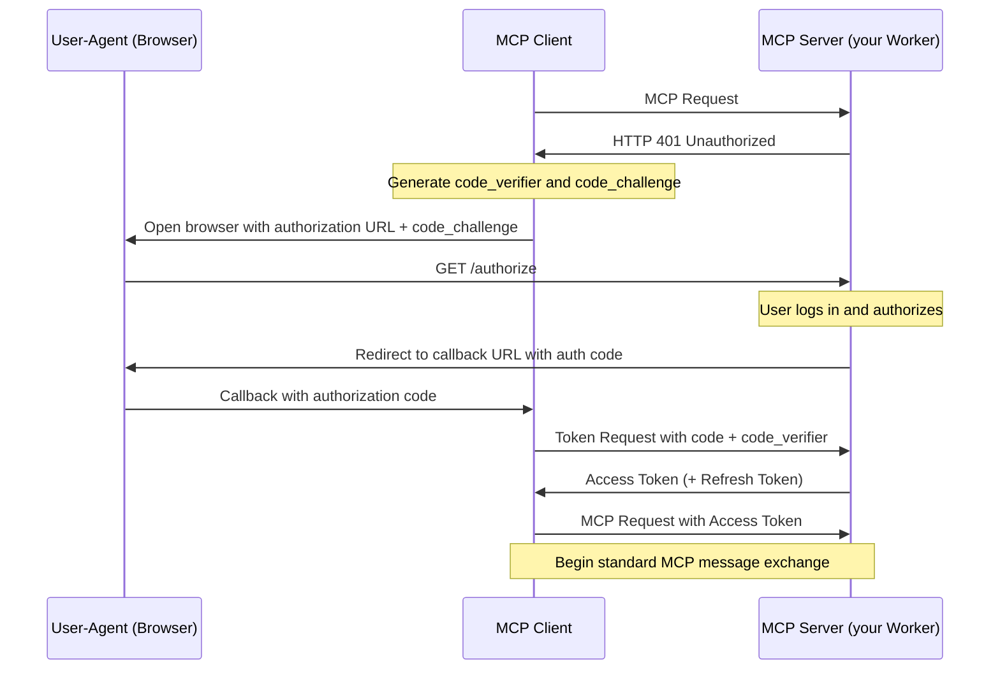

# Build Agents on Cloudflare

URL: https://developers.cloudflare.com/agents/

import { CardGrid, Description, Feature, LinkButton, LinkTitleCard,
PackageManagers, Plan, RelatedProduct, Render, TabItem, Tabs,
TypeScriptExample, } from "\~/components";

The Agents SDK enables you to build and deploy AI-powered agents that
can autonomously perform tasks, communicate with clients in real time,
call AI models, persist state, schedule tasks, run asynchronous
workflows, browse the web, query data from your database, support
human-in-the-loop interactions, and [a lot
more](/agents/api-reference/).

### Ship your first Agent

To use the Agent starter template and create your first Agent with the
Agents SDK:

``` sh
# install it
npm create cloudflare@latest agents-starter -- --template=cloudflare/agents-starter
# and deploy it
npx wrangler@latest deploy
```

Head to the guide on [building a chat
agent](/agents/getting-started/build-a-chat-agent) to learn how the
starter project is built and how to use it as a foundation for your own
agents.

If you're already building on [Workers](/workers/), you can install the
`agents` package directly into an existing project:

``` sh
npm i agents
```

And then define your first Agent by creating a class that extends the
`Agent` class:

`<TypeScriptExample>`{=html}

``` ts
import { Agent, AgentNamespace } from 'agents';

export class MyAgent extends Agent {
    // Define methods on the Agent:
    // https://developers.cloudflare.com/agents/api-reference/agents-api/
    //
    // Every Agent has built in state via this.setState and this.sql
    // Built-in scheduling via this.schedule
    // Agents support WebSockets, HTTP requests, state synchronization and
    // can run for seconds, minutes or hours: as long as the tasks need.
}
```

`</TypeScriptExample>`{=html}

Dive into the [Agent SDK reference](/agents/api-reference/agents-api/)
to learn more about how to use the Agents SDK package and defining an
`Agent`.

### Why build agents on Cloudflare?

We built the Agents SDK with a few things in mind:

- **Batteries (state) included**: Agents come with [built-in state
  management](/agents/api-reference/store-and-sync-state/), with the
  ability to automatically sync state between an Agent and clients,
  trigger events on state changes, and read+write to each Agent's SQL
  database.
- **Communicative**: You can connect to an Agent via
  [WebSockets](/agents/api-reference/websockets/) and stream updates
  back to client in real-time. Handle a long-running response from a
  reasoning model, the results of an [asynchronous
  workflow](/agents/api-reference/run-workflows/), or build a chat app
  that builds on the `useAgent` hook included in the Agents SDK.
- **Extensible**: Agents are code. Use the [AI
  models](/agents/api-reference/using-ai-models/) you want,
  bring-your-own headless browser service, pull data from your database
  hosted in another cloud, add your own methods to your Agent and call
  them.

Agents built with Agents SDK can be deployed directly to Cloudflare and
run on top of [Durable Objects](/durable-objects/) â€" which you can
think of as stateful micro-servers that can scale to tens of millions
â€" and are able to run wherever they need to. Run your Agents close to
a user for low-latency interactivity, close to your data for throughput,
and/or anywhere in between.

------------------------------------------------------------------------

### Build on the Cloudflare Platform

`<RelatedProduct header="Workers" href="/workers/" product="workers">`{=html}

Build serverless applications and deploy instantly across the globe for
exceptional performance, reliability, and scale.

`</RelatedProduct>`{=html}

`<RelatedProduct header="AI Gateway" href="/ai-gateway/" product="ai-gateway">`{=html}

Observe and control your AI applications with caching, rate limiting,
request retries, model fallback, and more.

`</RelatedProduct>`{=html}

`<RelatedProduct header="Vectorize" href="/vectorize/" product="vectorize">`{=html}

Build full-stack AI applications with Vectorize, Cloudflare’s vector
database. Adding Vectorize enables you to perform tasks such as semantic
search, recommendations, anomaly detection or can be used to provide
context and memory to an LLM.

`</RelatedProduct>`{=html}

`<RelatedProduct header="Workers AI" href="/workers-ai/" product="workers-ai">`{=html}

Run machine learning models, powered by serverless GPUs, on Cloudflare's
global network.

`</RelatedProduct>`{=html}

`<RelatedProduct header="Workflows" href="/workflows/" product="workflows">`{=html}

Build stateful agents that guarantee executions, including automatic
retries, persistent state that runs for minutes, hours, days, or weeks.

`</RelatedProduct>`{=html}

------------------------------------------------------------------------

# Browse the web

URL:
https://developers.cloudflare.com/agents/api-reference/browse-the-web/

import { MetaInfo, Render, Type, TypeScriptExample, WranglerConfig,
PackageManagers, } from "\~/components";

Agents can browse the web using the [Browser
Rendering](/browser-rendering/) API or your preferred headless browser
service.

### Browser Rendering API

The [Browser Rendering](/browser-rendering/) allows you to spin up
headless browser instances, render web pages, and interact with websites
through your Agent.

You can define a method that uses Puppeteer to pull the content of a web
page, parse the DOM, and extract relevant information by calling the
OpenAI model:

`<TypeScriptExample>`{=html}

``` ts
interface Env {
    BROWSER: Fetcher;
}

export class MyAgent extends Agent<Env> {
    async browse(browserInstance: Fetcher, urls: string[]) {
        let responses = [];
        for (const url of urls) {
            const browser = await puppeteer.launch(browserInstance);
            const page = await browser.newPage();
            await page.goto(url);

            await page.waitForSelector("body");
            const bodyContent = await page.$eval(
                "body",
                (element) => element.innerHTML,
            );
            const client = new OpenAI({
                apiKey: this.env.OPENAI_API_KEY,
            });

            let resp = await client.chat.completions.create({
                model: this.env.MODEL,
                messages: [
                    {
                        role: "user",
                        content: `Return a JSON object with the product names, prices and URLs with the following format: { "name": "Product Name", "price": "Price", "url": "URL" } from the website content below. <content>${bodyContent}</content>`,
                    },
                ],
                response_format: {
                    type: "json_object",
                },
            });

            responses.push(resp);
            await browser.close();
        }

        return responses;
    }
}
```

`</TypeScriptExample>`{=html}

You'll also need to add install the `@cloudflare/puppeteer` package and
add the following to the wrangler configuration of your Agent:

`<PackageManagers pkg="@cloudflare/puppeteer" dev />`{=html}

`<WranglerConfig>`{=html}

``` jsonc
{
    // ...
    "browser": {
        "binding": "MYBROWSER",
    },
    // ...
}
```

`</WranglerConfig>`{=html}

### Browserbase

You can also use
[Browserbase](https://docs.browserbase.com/integrations/cloudflare/typescript)
by using the Browserbase API directly from within your Agent.

Once you have your [Browserbase API
key](https://docs.browserbase.com/integrations/cloudflare/typescript),
you can add it to your Agent by creating a
[secret](/workers/configuration/secrets/):

``` sh
cd your-agent-project-folder
npx wrangler@latest secret put BROWSERBASE_API_KEY
```

`sh output Enter a secret value: ****** Creating the secret for the Worker "agents-example" Success! Uploaded secret BROWSERBASE_API_KEY`

Install the `@cloudflare/puppeteer` package and use it from within your
Agent to call the Browserbase API:

`<PackageManagers pkg="@cloudflare/puppeteer" />`{=html}

`<TypeScriptExample>`{=html}

``` ts
interface Env {
    BROWSERBASE_API_KEY: string;
}

export class MyAgent extends Agent<Env> {
    constructor(env: Env) {
        super(env);
    }
}
```

`</TypeScriptExample>`{=html}

------------------------------------------------------------------------

# Agents API

URL: https://developers.cloudflare.com/agents/api-reference/agents-api/

import { MetaInfo, Render, Type, TypeScriptExample, WranglerConfig }
from "\~/components";

This page provides an overview of the Agent SDK API, including the
`Agent` class, methods and properties built-in to the Agents SDK.

The Agents SDK exposes two main APIs:

- The server-side `Agent` class. An Agent encapsulates all of the logic
  for an Agent, including how clients can connect to it, how it stores
  state, the methods it exposes, how to call AI models, and any error
  handling.
- The client-side `AgentClient` class, which allows you to connect to an
  Agent instance from a client-side application. The client APIs also
  include React hooks, including `useAgent` and `useAgentChat`, and
  allow you to automatically synchronize state between each unique Agent
  (running server-side) and your client applications.

::: note
Agents require [Cloudflare Durable Objects](/durable-objects/), see
[Configuration](/agents/getting-started/testing-your-agent/#add-the-agent-configuration)
to learn how to add the required bindings to your project.
:::

You can also find more specific usage examples for each API in the
[Agents API Reference](/agents/api-reference/).

`<TypeScriptExample>`{=html}

``` ts
import { Agent } from "agents";

class MyAgent extends Agent {
    // Define methods on the Agent
}

export default MyAgent;
```

`</TypeScriptExample>`{=html}

An Agent can have many (millions of) instances: each instance is a
separate micro-server that runs independently of the others. This allows
Agents to scale horizontally: an Agent can be associated with a single
user, or many thousands of users, depending on the agent you're
building.

Instances of an Agent are addressed by a unique identifier: that
identifier (ID) can be the user ID, an email address, GitHub username, a
flight ticket number, an invoice ID, or any other identifier that helps
to uniquely identify the instance and for whom it is acting on behalf
of.

`<Render file="unique-agents" />`{=html}

### Agent class API

Writing an Agent requires you to define a class that extends the `Agent`
class from the Agents SDK package. An Agent encapsulates all of the
logic for an Agent, including how clients can connect to it, how it
stores state, the methods it exposes, and any error handling.

You can also define your own methods on an Agent: it's technically valid
to publish an Agent only has your own methods exposed, and create/get
Agents directly from a Worker.

Your own methods can access the Agent's environment variables and
bindings on `this.env`, state on `this.setState`, and call other methods
on the Agent via `this.yourMethodName`.

`<TypeScriptExample>`{=html}

``` ts
import { Agent } from "agents";

interface Env {
    // Define environment variables & bindings here
}

// Pass the Env as a TypeScript type argument
// Any services connected to your Agent or Worker as Bindings
// are then available on this.env.<BINDING_NAME>

// The core class for creating Agents that can maintain state, orchestrate
// complex AI workflows, schedule tasks, and interact with users and other
// Agents.
class MyAgent extends Agent<Env, State> {
  // Optional initial state definition
  initialState = {
    counter: 0,
    messages: [],
    lastUpdated: null
  };

  // Called when a new Agent instance starts or wakes from hibernation
  async onStart() {
    console.log('Agent started with state:', this.state);
  }

  // Handle HTTP requests coming to this Agent instance
  // Returns a Response object
  async onRequest(request: Request): Promise<Response> {
    return new Response("Hello from Agent!");
  }

  // Called when a WebSocket connection is established
  // Access the original request via ctx.request for auth etc.
  async onConnect(connection: Connection, ctx: ConnectionContext) {
    // Connections are automatically accepted by the SDK.
    // You can also explicitly close a connection here with connection.close()
    // Access the Request on ctx.request to inspect headers, cookies and the URL
  }

  // Called for each message received on a WebSocket connection
  // Message can be string, ArrayBuffer, or ArrayBufferView
  async onMessage(connection: Connection, message: WSMessage) {
    // Handle incoming messages
    connection.send("Received your message");
  }

  // Handle WebSocket connection errors
  async onError(connection: Connection, error: unknown): Promise<void> {
    console.error(`Connection error:`, error);
  }

  // Handle WebSocket connection close events
  async onClose(connection: Connection, code: number, reason: string, wasClean: boolean): Promise<void> {
    console.log(`Connection closed: ${code} - ${reason}`);
  }

  // Called when the Agent's state is updated from any source
  // source can be "server" or a client Connection
  onStateUpdate(state: State, source: "server" | Connection) {
    console.log("State updated:", state, "Source:", source);
  }

  // You can define your own custom methods to be called by requests,
  // WebSocket messages, or scheduled tasks
  async customProcessingMethod(data: any) {
    // Process data, update state, schedule tasks, etc.
    this.setState({ ...this.state, lastUpdated: new Date() });
  }
}
```

`</TypeScriptExample>`{=html}

`<TypeScriptExample>`{=html}

``` ts
// Basic Agent implementation with custom methods
import { Agent } from "agents";

interface MyState {
  counter: number;
  lastUpdated: Date | null;
}

class MyAgent extends Agent<Env, MyState> {
  initialState = {
    counter: 0,
    lastUpdated: null
  };

  async onRequest(request: Request) {
    if (request.method === "POST") {
      await this.incrementCounter();
      return new Response(JSON.stringify(this.state), {
        headers: { "Content-Type": "application/json" }
      });
    }
    return new Response(JSON.stringify(this.state), {
      headers: { "Content-Type": "application/json" }
    });
  }

  async incrementCounter() {
    this.setState({
      counter: this.state.counter + 1,
      lastUpdated: new Date()
    });
  }
}
```

`</TypeScriptExample>`{=html}

### WebSocket API

The WebSocket API allows you to accept and manage WebSocket connections
made to an Agent.

#### Connection

Represents a WebSocket connection to an Agent.

``` ts
// WebSocket connection interface
interface Connection<State = unknown> {
  // Unique ID for this connection
  id: string;

  // Client-specific state attached to this connection
  state: State;

  // Update the connection's state
  setState(state: State): void;

  // Accept an incoming WebSocket connection
  accept(): void;

  // Close the WebSocket connection with optional code and reason
  close(code?: number, reason?: string): void;

  // Send a message to the client
  // Can be string, ArrayBuffer, or ArrayBufferView
  send(message: string | ArrayBuffer | ArrayBufferView): void;
}
```

`<TypeScriptExample>`{=html}

``` ts
// Example of handling WebSocket messages
export class YourAgent extends Agent {
  async onMessage(connection: Connection, message: WSMessage) {
    if (typeof message === 'string') {
      try {
        // Parse JSON message
        const data = JSON.parse(message);

        if (data.type === 'update') {
          // Update connection-specific state
          connection.setState({ ...connection.state, lastActive: Date.now() });

          // Update global Agent state
          this.setState({
            ...this.state,
            connections: this.state.connections + 1
          });

          // Send response back to this client only
          connection.send(JSON.stringify({
            type: 'updated',
            status: 'success'
          }));
        }
      } catch (e) {
        connection.send(JSON.stringify({ error: 'Invalid message format' }));
      }
    }
  }
}
```

`</TypeScriptExample>`{=html}

#### WSMessage

Types of messages that can be received from a WebSocket.

``` ts
// Types of messages that can be received from WebSockets
type WSMessage = string | ArrayBuffer | ArrayBufferView;
```

#### ConnectionContext

Context information for a WebSocket connection.

``` ts
// Context available during WebSocket connection
interface ConnectionContext {
  // The original HTTP request that initiated the WebSocket connection
  request: Request;
}
```

### State synchronization API

::: note
To learn more about how to manage state within an Agent, refer to the
documentation on [managing and syncing
state](/agents/api-reference/store-and-sync-state/).
:::

#### State

Methods and types for managing Agent state.

``` ts
// State management in the Agent class
class Agent<Env, State = unknown> {
  // Initial state that will be set if no state exists yet
  initialState: State = {} as unknown as State;

  // Current state of the Agent, persisted across restarts
  get state(): State;

  // Update the Agent's state
  // Persists to storage and notifies all connected clients
  setState(state: State): void;

  // Called when state is updated from any source
  // Override to react to state changes
  onStateUpdate(state: State, source: "server" | Connection): void;
}
```

`<TypeScriptExample>`{=html}

``` ts
// Example of state management in an Agent
interface ChatState {
  messages: Array<{ sender: string; text: string; timestamp: number }>;
  participants: string[];
  settings: {
    allowAnonymous: boolean;
    maxHistoryLength: number;
  };
}

interface Env {
    // Your bindings and environment variables
}

// Inside your Agent class
export class YourAgent extends Agent<Env, ChatState> {
  async addMessage(sender: string, text: string) {
    // Update state with new message
    this.setState({
      ...this.state,
      messages: [
        ...this.state.messages,
        { sender, text, timestamp: Date.now() }
      ].slice(-this.state.settings.maxHistoryLength) // Maintain max history
    });

    // The onStateUpdate method will automatically be called
    // and all connected clients will receive the update
  }

  // Override onStateUpdate to add custom behavior when state changes
  onStateUpdate(state: ChatState, source: "server" | Connection) {
    console.log(`State updated by ${source === "server" ? "server" : "client"}`);

    // You could trigger additional actions based on state changes
    if (state.messages.length > 0) {
      const lastMessage = state.messages[state.messages.length - 1];
      if (lastMessage.text.includes('@everyone')) {
        this.notifyAllParticipants(lastMessage);
      }
    }
  }
}
```

`</TypeScriptExample>`{=html}

### Scheduling API

#### Scheduling tasks

Schedule tasks to run at a specified time in the future.

``` ts
// Scheduling API for running tasks in the future
class Agent<Env, State = unknown> {
  // Schedule a task to run in the future
  // when: seconds from now, specific Date, or cron expression
  // callback: method name on the Agent to call
  // payload: data to pass to the callback
  // Returns a Schedule object with the task ID
  async schedule<T = any>(
    when: Date | string | number,
    callback: keyof this,
    payload?: T
  ): Promise<Schedule<T>>;

  // Get a scheduled task by ID
  // Returns undefined if the task doesn't exist
  async getSchedule<T = any>(id: string): Promise<Schedule<T> | undefined>;

  // Get all scheduled tasks matching the criteria
  // Returns an array of Schedule objects
  getSchedules<T = any>(criteria?: {
    description?: string;
    id?: string;
    type?: "scheduled" | "delayed" | "cron";
    timeRange?: { start?: Date; end?: Date };
  }): Schedule<T>[];

  // Cancel a scheduled task by ID
  // Returns true if the task was cancelled, false otherwise
  async cancelSchedule(id: string): Promise<boolean>;
}
```

`<TypeScriptExample>`{=html}

``` ts
// Example of scheduling in an Agent
interface ReminderData {
  userId: string;
  message: string;
  channel: string;
}

export class YourAgent extends Agent {
  // Schedule a one-time reminder in 2 hours
  async scheduleReminder(userId: string, message: string) {
    const twoHoursFromNow = new Date(Date.now() + 2 * 60 * 60 * 1000);

    const schedule = await this.schedule<ReminderData>(
      twoHoursFromNow,
      'sendReminder',
      { userId, message, channel: 'email' }
    );

    console.log(`Scheduled reminder with ID: ${schedule.id}`);
    return schedule.id;
  }

  // Schedule a recurring daily task using cron
  async scheduleDailyReport() {
    // Run at 08:00 AM every day
    const schedule = await this.schedule(
      '0 8 * * *',  // Cron expression: minute hour day month weekday
      'generateDailyReport',
      { reportType: 'daily-summary' }
    );

    console.log(`Scheduled daily report with ID: ${schedule.id}`);
    return schedule.id;
  }

  // Method that will be called when the scheduled task runs
  async sendReminder(data: ReminderData) {
    console.log(`Sending reminder to ${data.userId}: ${data.message}`);
    // Add code to send the actual notification
  }
}
```

`</TypeScriptExample>`{=html}

#### Schedule object

Represents a scheduled task.

``` ts
// Represents a scheduled task
type Schedule<T = any> = {
  // Unique identifier for the schedule
  id: string;
  // Name of the method to be called
  callback: string;
  // Data to be passed to the callback
  payload: T;
} & (
  | {
      // One-time execution at a specific time
      type: "scheduled";
      // Timestamp when the task should execute
      time: number;
    }
  | {
      // Delayed execution after a certain time
      type: "delayed";
      // Timestamp when the task should execute
      time: number;
      // Number of seconds to delay execution
      delayInSeconds: number;
    }
  | {
      // Recurring execution based on cron expression
      type: "cron";
      // Timestamp for the next execution
      time: number;
      // Cron expression defining the schedule
      cron: string;
    }
);
```

`<TypeScriptExample>`{=html}

``` ts
export class YourAgent extends Agent {
  // Example of managing scheduled tasks
  async viewAndManageSchedules() {
    // Get all scheduled tasks
    const allSchedules = this.getSchedules();
    console.log(`Total scheduled tasks: ${allSchedules.length}`);

    // Get tasks scheduled for a specific time range
    const upcomingSchedules = this.getSchedules({
      timeRange: {
        start: new Date(),
        end: new Date(Date.now() + 24 * 60 * 60 * 1000) // Next 24 hours
      }
    });

    // Get a specific task by ID
    const taskId = "task-123";
    const specificTask = await this.getSchedule(taskId);

    if (specificTask) {
      console.log(`Found task: ${specificTask.callback} at ${new Date(specificTask.time)}`);

      // Cancel a scheduled task
      const cancelled = await this.cancelSchedule(taskId);
      console.log(`Task cancelled: ${cancelled}`);
    }
  }
}
```

`</TypeScriptExample>`{=html}

### SQL API

Each Agent instance has an embedded SQLite database that can be accessed
using the `this.sql` method within any method on your `Agent` class.

#### SQL queries

Execute SQL queries against the Agent's built-in SQLite database using
the `this.sql` method within any method on your `Agent` class.

``` ts
// SQL query API for the Agent's embedded database
class Agent<Env, State = unknown> {
  // Execute a SQL query with tagged template literals
  // Returns an array of rows matching the query
  sql<T = Record<string, string | number | boolean | null>>(
    strings: TemplateStringsArray,
    ...values: (string | number | boolean | null)[]
  ): T[];
}
```

`<TypeScriptExample>`{=html}

``` ts
// Example of using SQL in an Agent
interface User {
  id: string;
  name: string;
  email: string;
  created_at: number;
}

export class YourAgent extends Agent {
  async setupDatabase() {
    // Create a table if it doesn't exist
    this.sql`
      CREATE TABLE IF NOT EXISTS users (
        id TEXT PRIMARY KEY,
        name TEXT NOT NULL,
        email TEXT UNIQUE,
        created_at INTEGER
      )
    `;
  }

  async createUser(id: string, name: string, email: string) {
    // Insert a new user
    this.sql`
      INSERT INTO users (id, name, email, created_at)
      VALUES (${id}, ${name}, ${email}, ${Date.now()})
    `;
  }

  async getUserById(id: string): Promise<User | null> {
    // Query a user by ID
    const users = this.sql<User>`
      SELECT * FROM users WHERE id = ${id}
    `;

    return users.length ? users[0] : null;
  }

  async searchUsers(term: string): Promise<User[]> {
    // Search users with a wildcard
    return this.sql<User>`
      SELECT * FROM users
      WHERE name LIKE ${'%' + term + '%'} OR email LIKE ${'%' + term + '%'}
      ORDER BY created_at DESC
    `;
  }
}
```

`</TypeScriptExample>`{=html}

::: note
Visit the [state management API
documentation](/agents/api-reference/store-and-sync-state/) within the
Agents SDK, including the native `state` APIs and the built-in
`this.sql` API for storing and querying data within your Agents.
:::

### Client API

The Agents SDK provides a set of client APIs for interacting with Agents
from client-side JavaScript code, including:

- React hooks, including `useAgent` and `useAgentChat`, for connecting
  to Agents from client applications.
- Client-side [state
  syncing](/agents/api-reference/store-and-sync-state/) that allows you
  to subscribe to state updates between the Agent and any connected
  client(s) when calling `this.setState` within your Agent's code.
- The ability to call remote methods (Remote Procedure Calls; RPC) on
  the Agent from client-side JavaScript code using the `@callable`
  method decorator.

#### AgentClient

Client for connecting to an Agent from the browser.

``` ts
import { AgentClient } from "agents/client";

// Options for creating an AgentClient
type AgentClientOptions = Omit<PartySocketOptions, "party" | "room"> & {
  // Name of the agent to connect to (class name in kebab-case)
  agent: string;
  // Name of the specific Agent instance (optional, defaults to "default")
  name?: string;
  // Other WebSocket options like host, protocol, etc.
};

// WebSocket client for connecting to an Agent
class AgentClient extends PartySocket {
  static fetch(opts: PartyFetchOptions): Promise<Response>;
  constructor(opts: AgentClientOptions);
}
```

`<TypeScriptExample>`{=html}

``` ts
// Example of using AgentClient in the browser
import { AgentClient } from "agents/client";

// Connect to an Agent instance
const client = new AgentClient({
  agent: "chat-agent", // Name of your Agent class in kebab-case
  name: "support-room-123", // Specific instance name
  host: window.location.host, // Using same host
});

client.onopen = () => {
  console.log("Connected to agent");
  // Send an initial message
  client.send(JSON.stringify({ type: "join", user: "user123" }));
};

client.onmessage = (event) => {
    // Handle incoming messages
    const data = JSON.parse(event.data);
    console.log("Received:", data);

    if (data.type === "state_update") {
        // Update local UI with new state
        updateUI(data.state);
    }
};

client.onclose = () => console.log("Disconnected from agent");

// Send messages to the Agent
function sendMessage(text) {
  client.send(JSON.stringify({
    type: "message",
    text,
    timestamp: Date.now()
  }));
}
```

`</TypeScriptExample>`{=html}

#### agentFetch

Make an HTTP request to an Agent.

``` ts
import { agentFetch } from "agents/client";

// Options for the agentFetch function
type AgentClientFetchOptions = Omit<PartyFetchOptions, "party" | "room"> & {
  // Name of the agent to connect to
  agent: string;
  // Name of the specific Agent instance (optional)
  name?: string;
};

// Make an HTTP request to an Agent
function agentFetch(
  opts: AgentClientFetchOptions,
  init?: RequestInit
): Promise<Response>;
```

`<TypeScriptExample>`{=html}

``` ts
// Example of using agentFetch in the browser
import { agentFetch } from "agents/client";

// Function to get data from an Agent
async function fetchAgentData() {
  try {
    const response = await agentFetch(
      {
        agent: "task-manager",
        name: "user-123-tasks"
      },
      {
        method: "GET",
        headers: {
          "Authorization": `Bearer ${userToken}`
        }
      }
    );

    if (!response.ok) {
      throw new Error(`Error: ${response.status}`);
    }

    const data = await response.json();
    return data;
  } catch (error) {
    console.error("Failed to fetch from agent:", error);
  }
}
```

`</TypeScriptExample>`{=html}

### React API

The Agents SDK provides a React API for simplifying connection and
routing to Agents from front-end frameworks, including React Router
(Remix), Next.js, and Astro.

#### useAgent

React hook for connecting to an Agent.

``` ts
import { useAgent } from "agents/react";

// Options for the useAgent hook
type UseAgentOptions<State = unknown> = Omit<
  Parameters<typeof usePartySocket>[0],
  "party" | "room"
> & {
  // Name of the agent to connect to
  agent: string;
  // Name of the specific Agent instance (optional)
  name?: string;
  // Called when the Agent's state is updated
  onStateUpdate?: (state: State, source: "server" | "client") => void;
};

// React hook for connecting to an Agent
// Returns a WebSocket connection with setState method
function useAgent<State = unknown>(
  options: UseAgentOptions<State>
): PartySocket & {
  // Update the Agent's state
  setState: (state: State) => void
};
```

### Chat Agent

The Agents SDK exposes an `AIChatAgent` class that extends the `Agent`
class and exposes an `onChatMessage` method that simplifies building
interactive chat agents.

You can combine this with the `useAgentChat` React hook from the
`agents/ai-react` package to manage chat state and messages between a
user and your Agent(s).

#### AIChatAgent

Extension of the `Agent` class with built-in chat capabilities.

``` ts
import { AIChatAgent } from "agents/ai-chat-agent";
import { Message, StreamTextOnFinishCallback, ToolSet } from "ai";

// Base class for chat-specific agents
class AIChatAgent<Env = unknown, State = unknown> extends Agent<Env, State> {
  // Array of chat messages for the current conversation
  messages: Message[];

  // Handle incoming chat messages and generate a response
  // onFinish is called when the response is complete
  async onChatMessage(
    onFinish: StreamTextOnFinishCallback<ToolSet>
  ): Promise<Response | undefined>;

  // Persist messages within the Agent's local storage.
  async saveMessages(messages: Message[]): Promise<void>;
}
```

`<TypeScriptExample>`{=html}

``` ts
// Example of extending AIChatAgent
import { AIChatAgent } from "agents/ai-chat-agent";
import { Message } from "ai";

interface Env {
  AI: any; // Your AI binding
}

class CustomerSupportAgent extends AIChatAgent<Env> {
  // Override the onChatMessage method to customize behavior
  async onChatMessage(onFinish) {
    // Access the AI models using environment bindings
    const { openai } = this.env.AI;

    // Get the current conversation history
    const chatHistory = this.messages;

    // Generate a system prompt based on knowledge base
    const systemPrompt = await this.generateSystemPrompt();

    // Generate a response stream
    const stream = await openai.chat({
      model: "gpt-4o",
      messages: [
        { role: "system", content: systemPrompt },
        ...chatHistory
      ],
      stream: true
    });

    // Return the streaming response
    return new Response(stream, {
      headers: { "Content-Type": "text/event-stream" }
    });
  }

  // Helper method to generate a system prompt
  async generateSystemPrompt() {
    // Query knowledge base or use static prompt
    return `You are a helpful customer support agent.
            Respond to customer inquiries based on the following guidelines:
            - Be friendly and professional
            - If you don't know an answer, say so
            - Current company policies: ...`;
  }
}
```

`</TypeScriptExample>`{=html}

### Chat Agent React API

#### useAgentChat

React hook for building AI chat interfaces using an Agent.

``` ts
import { useAgentChat } from "agents/ai-react";
import { useAgent } from "agents/react";
import type { Message } from "ai";

// Options for the useAgentChat hook
type UseAgentChatOptions = Omit<
  Parameters<typeof useChat>[0] & {
    // Agent connection from useAgent
    agent: ReturnType<typeof useAgent>;
  },
  "fetch"
>;

// React hook for building AI chat interfaces using an Agent
function useAgentChat(options: UseAgentChatOptions): {
  // Current chat messages
  messages: Message[];
  // Set messages and synchronize with the Agent
  setMessages: (messages: Message[]) => void;
  // Clear chat history on both client and Agent
  clearHistory: () => void;
  // Append a new message to the conversation
  append: (message: Message, chatRequestOptions?: any) => Promise<string | null | undefined>;
  // Reload the last user message
  reload: (chatRequestOptions?: any) => Promise<string | null | undefined>;
  // Stop the AI response generation
  stop: () => void;
  // Current input text
  input: string;
  // Set the input text
  setInput: React.Dispatch<React.SetStateAction<string>>;
  // Handle input changes
  handleInputChange: (e: React.ChangeEvent<HTMLInputElement | HTMLTextAreaElement>) => void;
  // Submit the current input
  handleSubmit: (event?: { preventDefault?: () => void }, chatRequestOptions?: any) => void;
  // Additional metadata
  metadata?: Object;
  // Whether a response is currently being generated
  isLoading: boolean;
  // Current status of the chat
  status: "submitted" | "streaming" | "ready" | "error";
  // Tool data from the AI response
  data?: any[];
  // Set tool data
  setData: (data: any[] | undefined | ((data: any[] | undefined) => any[] | undefined)) => void;
  // Unique ID for the chat
  id: string;
  // Add a tool result for a specific tool call
  addToolResult: ({ toolCallId, result }: { toolCallId: string; result: any }) => void;
  // Current error if any
  error: Error | undefined;
};
```

`<TypeScriptExample>`{=html}

``` tsx
// Example of using useAgentChat in a React component
import { useAgentChat } from "agents/ai-react";
import { useAgent } from "agents/react";
import { useState } from "react";

function ChatInterface() {
  // Connect to the chat agent
  const agentConnection = useAgent({
    agent: "customer-support",
    name: "session-12345"
  });

  // Use the useAgentChat hook with the agent connection
  const {
    messages,
    input,
    handleInputChange,
    handleSubmit,
    isLoading,
    error,
    clearHistory
  } = useAgentChat({
    agent: agentConnection,
    initialMessages: [
      { role: "system", content: "You're chatting with our AI assistant." },
      { role: "assistant", content: "Hello! How can I help you today?" }
    ]
  });

  return (
    <div className="chat-container">
      <div className="message-history">
        {messages.map((message, i) => (
          <div key={i} className={`message ${message.role}`}>
            {message.role === 'user' ? '👤' : '🤖'} {message.content}
          </div>
        ))}

        {isLoading && <div className="loading">AI is typing...</div>}
        {error && <div className="error">Error: {error.message}</div>}
      </div>

      <form onSubmit={handleSubmit} className="message-input">
        <input
          value={input}
          onChange={handleInputChange}
          placeholder="Type your message..."
          disabled={isLoading}
        />
        <button type="submit" disabled={isLoading || !input.trim()}>
          Send
        </button>
        <button type="button" onClick={clearHistory}>
          Clear Chat
        </button>
      </form>
    </div>
  );
}
```

`</TypeScriptExample>`{=html}

### Next steps

- [Build a chat Agent](/agents/getting-started/build-a-chat-agent/)
  using the Agents SDK and deploy it to Workers.
- Learn more [using WebSockets](/agents/api-reference/websockets/) to
  build interactive Agents and stream data back from your Agent.
- [Orchestrate asynchronous
  workflows](/agents/api-reference/run-workflows) from your Agent by
  combining the Agents SDK and [Workflows](/workflows).

------------------------------------------------------------------------

# Calling Agents

URL:
https://developers.cloudflare.com/agents/api-reference/calling-agents/

import { MetaInfo, Render, Type, TypeScriptExample, WranglerConfig }
from "\~/components";

Learn how to call your Agents from Workers, including how to create
Agents on-the-fly, address them, and route requests to specific
instances of an Agent.

### Calling your Agent

Agents are created on-the-fly and can serve multiple requests
concurrently. Each Agent instance is isolated from other instances, can
maintain its own state, and has a unique address.

`<Render file="unique-agents" />`{=html}

You can create and run an instance of an Agent directly from a Worker
using either:

- The `routeAgentRequest` helper: this will automatically map requests
  to an individual Agent based on the `/agents/:agent/:name` URL
  pattern. The value of `:agent` will be the name of your Agent class
  converted to `kebab-case`, and the value of `:name` will be the name
  of the Agent instance you want to create or retrieve.
- `getAgentByName`, which will create a new Agent instance if none
  exists by that name, or retrieve a handle to an existing instance.

See the usage patterns in the following example:

`<TypeScriptExample>`{=html}

``` ts
import { Agent, AgentNamespace, getAgentByName, routeAgentRequest } from 'agents';

interface Env {
    // Define your Agent on the environment here
    // Passing your Agent class as a TypeScript type parameter allows you to call
    // methods defined on your Agent.
    MyAgent: AgentNamespace<MyAgent>;
}

export default {
    async fetch(request, env, ctx): Promise<Response> {
        // Routed addressing
        // Automatically routes HTTP requests and/or WebSocket connections to /agents/:agent/:name
        // Best for: connecting React apps directly to Agents using useAgent from agents/react
        return (await routeAgentRequest(request, env)) || Response.json({ msg: 'no agent here' }, { status: 404 });

        // Named addressing
        // Best for: convenience method for creating or retrieving an agent by name/ID.
        // Bringing your own routing, middleware and/or plugging into an existing
        // application or framework.
        let namedAgent = getAgentByName<Env, MyAgent>(env.MyAgent, 'my-unique-agent-id');
        // Pass the incoming request straight to your Agent
        let namedResp = (await namedAgent).fetch(request);
        return namedResp
    },
} satisfies ExportedHandler<Env>;

export class MyAgent extends Agent<Env> {
    // Your Agent implementation goes here
}
```

`</TypeScriptExample>`{=html}

:::note\[Calling other Agents\]

You can also call other Agents from within an Agent and build
multi-Agent systems.

Calling other Agents uses the same APIs as calling into an Agent
directly.

:::

### Calling methods on Agents

When using `getAgentByName`, you can pass both requests (including
WebSocket) connections and call methods defined directly on the Agent
itself using the native [JavaScript RPC](/workers/runtime-apis/rpc/)
(JSRPC) API.

For example, once you have a handle (or "stub") to an unique instance of
your Agent, you can call methods on it:

`<TypeScriptExample>`{=html}

``` ts
import { Agent, AgentNamespace, getAgentByName } from 'agents';

interface Env {
    // Define your Agent on the environment here
    // Passing your Agent class as a TypeScript type parameter allows you to call
    // methods defined on your Agent.
    MyAgent: AgentNamespace<MyAgent>;
}

interface UserHistory {
    history: string[];
    lastUpdated: Date;
}

export default {
    async fetch(request, env, ctx): Promise<Response> {
        let namedAgent = getAgentByName<Env, MyAgent>(env.MyAgent, 'my-unique-agent-id');
        // Call methods directly on the Agent, and pass native JavaScript objects
        let chatResponse = namedAgent.chat('Hello!');
        // No need to serialize/deserialize it from a HTTP request or WebSocket
        // message and back again
        let agentState = getState() // agentState is of type UserHistory
        return namedResp
    },
} satisfies ExportedHandler<Env>;

export class MyAgent extends Agent<Env, UserHistory> {
    // Your Agent implementation goes here
    async chat(prompt: string) {
        // call your favorite LLM
        return "result"
    }

    async getState() {
        // Return the Agent's state directly
        return this.state;
    }

    // Other methods as you see fit!
}
```

`</TypeScriptExample>`{=html}

When using TypeScript, ensure you pass your Agent class as a TypeScript
type parameter to the AgentNamespace type so that types are correctly
inferred:

``` ts
interface Env {
    // Passing your Agent class as a TypeScript type parameter allows you to call
    // methods defined on your Agent.
    MyAgent: AgentNamespace<CodeReviewAgent>;
}

export class CodeReviewAgent extends Agent<Env, AgentState> {
    // Agent methods here
}
```

### Naming your Agents

When creating names for your Agents, think about what the Agent
represents. A unique user? A team or company? A room or channel for
collaboration?

A consistent approach to naming allows you to:

- direct incoming requests directly to the right Agent
- deterministically route new requests back to that Agent, no matter
  where the client is in the world.
- avoid having to rely on centralized session storage or external
  services for state management, since each Agent instance can maintain
  its own state.

For a given Agent definition (or 'namespace' in the code below), there
can be millions (or tens of millions) of instances of that Agent, each
handling their own requests, making calls to LLMs, and maintaining their
own state.

For example, you might have an Agent for every user using your new
AI-based code editor. In that case, you'd want to create Agents based on
the user ID from your system, which would then allow that Agent to
handle all requests for that user.

It also ensures that [state within the
Agent](/agents/api-reference/store-and-sync-state/), including chat
history, language preferences, model configuration and other context can
associated specifically with that user, making it easier to manage
state.

The example below shows how to create a unique agent Agent for each
`userId` in a request:

`<TypeScriptExample>`{=html}

``` ts
import { Agent, AgentNamespace, getAgentByName, routeAgentRequest } from 'agents';

interface Env {
    MyAgent: AgentNamespace<MyAgent>;
}

export default {
    async fetch(request, env, ctx): Promise<Response> {
        let userId = new URL(request.url).searchParams.get('userId') || 'anonymous';
        // Use an identifier that allows you to route to requests, WebSockets or call methods on the Agent
        // You can also put authentication logic here - e.g. to only create or retrieve Agents for known users.
        let namedAgent = getAgentByName<Env, MyAgent>(env.MyAgent, 'my-unique-agent-id');
        return (await namedAgent).fetch(request);
    },
} satisfies ExportedHandler<Env>;

export class MyAgent extends Agent<Env> {
    // You can access the name of the agent via this.name in any method within
    // the Agent
    async onStartup() { console.log(`agent ${this.name} ready!`)}
}
```

`</TypeScriptExample>`{=html}

Replace `userId` with `teamName`, `channel`, `companyName` as fits your
Agents goals - and/or configure authentication to ensure Agents are only
created for known, authenticated users.

### Authenticating Agents

When building and deploying Agents using the Agents SDK, you will often
want to authenticate clients before passing requests to an Agent in
order to restrict who the Agent will call, authorize specific users for
specific Agents, and/or to limit who can access administrative or debug
APIs exposed by an Agent.

As best practices:

- Handle authentication in your Workers code, before you invoke your
  Agent.
- Use the built-in hooks when using the `routeAgentRequest` helper -
  `onBeforeConnect` and `onBeforeRequest`
- Use your preferred router (such as Hono) and authentication middleware
  or provider to apply custom authentication schemes before calling an
  Agent using other methods.

The `routeAgentRequest` helper documented earlier in this guide exposes
two useful hooks (`onBeforeConnect`, `onBeforeRequest`) that allow you
to apply custom logic before creating or retrieving an Agent:

`<TypeScriptExample>`{=html}

``` ts
import { Agent, AgentNamespace, routeAgentRequest } from 'agents';

interface Env {
    MyAgent: AgentNamespace<MyAgent>;
}

export default {
    async fetch(request, env, ctx): Promise<Response> {
        // Use the onBeforeConnect and onBeforeRequest hooks to authenticate clients
        // or run logic before handling a HTTP request or WebSocket.
        return (
            (await routeAgentRequest(request, env, {
                // Run logic before a WebSocket client connects
                onBeforeConnect: (request) => {
                    // Your code/auth code here
                    // You can return a Response here - e.g. a HTTP 403 Not Authorized -
                    // which will stop further request processing and will NOT invoke the
                    // Agent.
                    // return Response.json({"error": "not authorized"}, { status: 403 })
                },
                // Run logic before a HTTP client clients
                onBeforeRequest: (request) => {
                    // Your code/auth code here
                    // Returning nothing will result in the call to the Agent continuing
                },
                // Prepend a prefix for how your Agents are named here
                prefix: 'name-prefix-here',
            })) || Response.json({ msg: 'no agent here' }, { status: 404 })
        );

    },
} satisfies ExportedHandler<Env>;
```

`</TypeScriptExample>`{=html}

If you are using `getAgentByName` or the underlying Durable Objects
routing API, you should authenticate incoming requests or WebSocket
connections before calling `getAgentByName`.

For example, if you are using [Hono](https://hono.dev/), you can
authenticate in the middleware before calling an Agent and passing a
request (or a WebSocket connection) to it:

`<TypeScriptExample>`{=html}

``` ts
import { Agent, AgentNamespace, getAgentByName } from 'agents';
import { Hono } from 'hono';

const app = new Hono<{ Bindings: Env }>();

app.use('/code-review/*', async (c, next) => {
    // Perform auth here
    // e.g. validate a Bearer token, a JWT, use your preferred auth library
    // return Response.json({ msg: 'unauthorized' }, { status: 401 });
    await next(); // continue on if valid
});

app.get('/code-review/:id', async (c) => {
    const id = c.req.param('teamId');
    if (!id) return Response.json({ msg: 'missing id' }, { status: 400 });

    // Call the Agent, creating it with the name/identifier from the ":id" segment
    // of our URL
    const agent = await getAgentByName<Env, MyAgent>(c.env.MyAgent, id);

    // Pass the request to our Agent instance
    return await agent.fetch(c.req.raw);
});
```

`</TypeScriptExample>`{=html}

This ensures we only create Agents for authenticated users, and allows
you to validate whether Agent names conform to your preferred naming
scheme before instances are created.

### Next steps

- Review the [API documentation](/agents/api-reference/agents-api/) for
  the Agents class to learn how to define
- [Build a chat Agent](/agents/getting-started/build-a-chat-agent/)
  using the Agents SDK and deploy it to Workers.
- Learn more [using WebSockets](/agents/api-reference/websockets/) to
  build interactive Agents and stream data back from your Agent.
- [Orchestrate asynchronous
  workflows](/agents/api-reference/run-workflows) from your Agent by
  combining the Agents SDK and [Workflows](/workflows).

------------------------------------------------------------------------

# Configuration

URL:
https://developers.cloudflare.com/agents/api-reference/configuration/

import { MetaInfo, Render, Type, WranglerConfig } from "\~/components";

An Agent is configured like any other Cloudflare Workers project, and
uses [a wrangler configuration](/workers/wrangler/configuration/) file
to define where your code is and what services (bindings) it will use.

### Project structure

The typical file structure for an Agent project created from
`npm create cloudflare@latest agents-starter -- --template cloudflare/agents-starter`
follows:

``` sh
.
|-- package-lock.json
|-- package.json
|-- public
|   `-- index.html
|-- src
|   `-- index.ts // your Agent definition
|-- test
|   |-- index.spec.ts // your tests
|   `-- tsconfig.json
|-- tsconfig.json
|-- vitest.config.mts
|-- worker-configuration.d.ts
`-- wrangler.jsonc // your Workers & Agent configuration
```

### Example configuration

Below is a minimal `wrangler.jsonc` file that defines the configuration
for an Agent, including the entry point, `durable_object` namespace, and
code `migrations`:

`<WranglerConfig>`{=html}

``` jsonc
{
    "$schema": "node_modules/wrangler/config-schema.json",
    "name": "agents-example",
    "main": "src/index.ts",
    "compatibility_date": "2025-02-23",
    "compatibility_flags": ["nodejs_compat"],
    "durable_objects": {
        "bindings": [
            {
                // Required:
                "name": "MyAgent", // How your Agent is called from your Worker
                "class_name": "MyAgent", // Must match the class name of the Agent in your code
                // Optional: set this if the Agent is defined in another Worker script
                "script_name": "the-other-worker"
            },
        ],
    },
    "migrations": [
        {
            "tag": "v1",
            // Mandatory for the Agent to store state
            "new_sqlite_classes": ["MyAgent"],
        },
    ],
    "observability": {
        "enabled": true,
    },
}
```

`</WranglerConfig>`{=html}

The configuration includes:

- A `main` field that points to the entry point of your Agent, which is
  typically a TypeScript (or JavaScript) file.
- A `durable_objects` field that defines the [Durable Object
  namespace](/durable-objects/reference/glossary/) that your Agents will
  run within.
- A `migrations` field that defines the code migrations that your Agent
  will use. This field is mandatory and must contain at least one
  migration. The `new_sqlite_classes` field is mandatory for the Agent
  to store state.

Agents must define these fields in their `wrangler.jsonc` (or
`wrangler.toml`) config file.

------------------------------------------------------------------------

# HTTP and Server-Sent Events

URL: https://developers.cloudflare.com/agents/api-reference/http-sse/

import { MetaInfo, Render, Type, TypeScriptExample, WranglerConfig }
from "\~/components";

The Agents SDK allows you to handle HTTP requests and has native support
for [Server-Sent
Events](https://developer.mozilla.org/en-US/docs/Web/API/Server-sent_events)
(SSE). This allows you build applications that can push data to clients
and avoid buffering.

### Handling HTTP requests

Agents can handle HTTP requests using the `onRequest` method, which is
called whenever an HTTP request is received by the Agent instance. The
method takes a `Request` object as a parameter and returns a `Response`
object.

`<TypeScriptExample>`{=html}

``` ts
class MyAgent extends Agent<Env, State> {
  // Handle HTTP requests coming to this Agent instance
  // Returns a Response object
  async onRequest(request: Request) {
    return new Response("Hello from Agent!");
  }

  async callAIModel(prompt: string) {
    // Implement AI model call here
  }
}
```

`</TypeScriptExample>`{=html}

Review the [Agents API reference](/agents/api-reference/agents-api/) to
learn more about the `Agent` class and its methods.

### Implementing Server-Sent Events

The Agents SDK support Server-Sent Events directly: you can use SSE to
stream data back to the client over a long running connection. This
avoids buffering large responses, which can both make your Agent feel
slow, and forces you to buffer the entire response in memory.

When an Agent is deployed to Cloudflare Workers, there is no effective
limit on the total time it takes to stream the response back: large AI
model responses that take several minutes to reason and then respond
will not be prematurely terminated.

Note that this does not mean the client can't potentially disconnect
during the streaming process: you can account for this by either
[writing to the Agent's stateful
storage](/agents/api-reference/store-and-sync-state/) and/or [using
WebSockets](/agents/api-reference/websockets/). Because you can always
[route to the same Agent](/agents/api-reference/calling-agents/), you do
not need to use a centralized session store to pick back up where you
left off when a client disconnects.

The following example uses the AI SDK to generate text and stream it
back to the client. It will automatically stream the response back to
the client as the model generates it:

`<TypeScriptExample>`{=html}

``` ts
import { Agent, AgentNamespace, getAgentByName, routeAgentRequest } from 'agents';
import { streamText } from 'ai';
import { createOpenAI, openai } from '@ai-sdk/openai';

interface Env {
    MyAgent: AgentNamespace<MyAgent>;
    OPENAI_API_KEY: string;
}

export class MyAgent extends Agent<Env> {
    async onRequest(request: Request) {
        // Test it via:
        // curl -d '{"prompt": "Write me a Cloudflare Worker"}' <url>
        let data = await request.json<{ prompt: string }>();
        let stream = await this.callAIModel(data.prompt);
        // This uses Server-Sent Events (SSE)
        return stream.toTextStreamResponse({
            headers: {
                'Content-Type': 'text/x-unknown',
                'content-encoding': 'identity',
                'transfer-encoding': 'chunked',
            },
        });
    }

    async callAIModel(prompt: string) {
        const openai = createOpenAI({
            apiKey: this.env.OPENAI_API_KEY,
        });

        return streamText({
            model: openai('gpt-4o'),
            prompt: prompt,
        });
    }
}

export default {
    async fetch(request: Request, env: Env) {
        let agentId = new URL(request.url).searchParams.get('agent-id') || '';
        const agent = await getAgentByName<Env, MyAgent>(env.MyAgent, agentId);
        return agent.fetch(request);
    },
};
```

`</TypeScriptExample>`{=html}

### WebSockets vs. Server-Sent Events

Both WebSockets and Server-Sent Events (SSE) enable real-time
communication between clients and Agents. Agents built on the Agents SDK
can expose both WebSocket and SSE endpoints directly.

- WebSockets provide full-duplex communication, allowing data to flow in
  both directions simultaneously. SSE only supports server-to-client
  communication, requiring additional HTTP requests if the client needs
  to send data back.
- WebSockets establish a single persistent connection that stays open
  for the duration of the session. SSE, being built on HTTP, may
  experience more overhead due to reconnection attempts and header
  transmission with each reconnection, especially when there is a lot of
  client-server communication.
- While SSE works well for simple streaming scenarios, WebSockets are
  better suited for applications requiring minutes or hours of
  connection time, as they maintain a more stable connection with
  built-in ping/pong mechanisms to keep connections alive.
- WebSockets use their own protocol (ws:// or wss://), separating them
  from HTTP after the initial handshake. This separation allows
  WebSockets to better handle binary data transmission and implement
  custom subprotocols for specialized use cases.

If you're unsure of which is better for your use-case, we recommend
WebSockets. The [WebSockets API
documentation](/agents/api-reference/websockets/) provides detailed
information on how to use WebSockets with the Agents SDK.

### Next steps

- Review the [API documentation](/agents/api-reference/agents-api/) for
  the Agents class to learn how to define them.
- [Build a chat Agent](/agents/getting-started/build-a-chat-agent/)
  using the Agents SDK and deploy it to Workers.
- Learn more [using WebSockets](/agents/api-reference/websockets/) to
  build interactive Agents and stream data back from your Agent.
- [Orchestrate asynchronous
  workflows](/agents/api-reference/run-workflows) from your Agent by
  combining the Agents SDK and [Workflows](/workflows).

------------------------------------------------------------------------

# API Reference

URL: https://developers.cloudflare.com/agents/api-reference/

import { DirectoryListing } from "\~/components"

Learn more about what Agents can do, the `Agent` class, and the APIs
that Agents expose:

`<DirectoryListing />`{=html}

------------------------------------------------------------------------

# Retrieval Augmented Generation

URL: https://developers.cloudflare.com/agents/api-reference/rag/

import { MetaInfo, Render, Type, TypeScriptExample, WranglerConfig }
from "\~/components";

Agents can use Retrieval Augmented Generation (RAG) to retrieve relevant
information and use it augment [calls to AI
models](/agents/api-reference/using-ai-models/). Store a user's chat
history to use as context for future conversations, summarize documents
to bootstrap an Agent's knowledge base, and/or use data from your
Agent's [web browsing](/agents/api-reference/browse-the-web/) tasks to
enhance your Agent's capabilities.

You can use the Agent's own [SQL
database](/agents/api-reference/store-and-sync-state) as the source of
truth for your data and store embeddings in [Vectorize](/vectorize/) (or
any other vector-enabled database) to allow your Agent to retrieve
relevant information.

### Vector search

::: note
If you're brand-new to vector databases and Vectorize, visit the
[Vectorize tutorial](/vectorize/get-started/intro/) to learn the basics,
including how to create an index, insert data, and generate embeddings.
:::

You can query a vector index (or indexes) from any method on your Agent:
any Vectorize index you attach is available on `this.env` within your
Agent. If you've [associated
metadata](/vectorize/best-practices/insert-vectors/#metadata) with your
vectors that maps back to data stored in your Agent, you can then look
up the data directly within your Agent using `this.sql`.

Here's an example of how to give an Agent retrieval capabilities:

`<TypeScriptExample>`{=html}

``` ts
import { Agent } from "agents";

interface Env {
    AI: Ai;
    VECTOR_DB: Vectorize;
}

export class RAGAgent extends Agent<Env> {
    // Other methods on our Agent
    // ...
    //
    async queryKnowledge(userQuery: string) {
        // Turn a query into an embedding
        const queryVector = await this.env.AI.run('@cf/baai/bge-base-en-v1.5', {
            text: [userQuery],
        });

        // Retrieve results from our vector index
        let searchResults = await this.env.VECTOR_DB.query(queryVector.data[0], {
            topK: 10,
            returnMetadata: 'all',
        });

        let knowledge = [];
        for (const match of searchResults.matches) {
            console.log(match.metadata);
            knowledge.push(match.metadata);
        }

        // Use the metadata to re-associate the vector search results
        // with data in our Agent's SQL database
        let results = this.sql`SELECT * FROM knowledge WHERE id IN (${knowledge.map((k) => k.id)})`;

        // Return them
        return results;
    }
}
```

`</TypeScriptExample>`{=html}

You'll also need to connect your Agent to your vector indexes:

`<WranglerConfig>`{=html}

``` jsonc
{
    // ...
  "vectorize": [
    {
      "binding": "VECTOR_DB",
      "index_name": "your-vectorize-index-name"
    }
  ]
  // ...
}
```

`</WranglerConfig>`{=html}

If you have multiple indexes you want to make available, you can provide
an array of `vectorize` bindings.

#### Next steps

- Learn more on how to [combine Vectorize and Workers
  AI](/vectorize/get-started/embeddings/)
- Review the [Vectorize query API](/vectorize/reference/client-api/)
- Use [metadata filtering](/vectorize/reference/metadata-filtering/) to
  add context to your results

------------------------------------------------------------------------

# Run Workflows

URL:
https://developers.cloudflare.com/agents/api-reference/run-workflows/

import { MetaInfo, Render, Type, TypeScriptExample, WranglerConfig }
from "\~/components";

Agents can trigger asynchronous [Workflows](/workflows/), allowing your
Agent to run complex, multi-step tasks in the background. This can
include post-processing files that a user has uploaded, updating the
embeddings in a [vector database](/vectorize/), and/or managing
long-running user-lifecycle email or SMS notification workflows.

Because an Agent is just like a Worker script, it can create Workflows
defined in the same project (script) as the Agent *or* in a different
project.

:::note\[Agents vs. Workflows\]

Agents and Workflows have some similarities: they can both run tasks
asynchronously. For straightforward tasks that are linear or need to run
to completion, a Workflow can be ideal: steps can be retried, they can
be cancelled, and can act on events.

Agents do not have to run to completion: they can loop, branch and run
forever, and they can also interact directly with users (over HTTP or
WebSockets). An Agent can be used to trigger multiple Workflows as it
runs, and can thus be used to co-ordinate and manage Workflows to
achieve its goals.

:::

## Trigger a Workflow

An Agent can trigger one or more Workflows from within any method,
whether from an incoming HTTP request, a WebSocket connection, on a
delay or schedule, and/or from any other action the Agent takes.

Triggering a Workflow from an Agent is no different from [triggering a
Workflow from a Worker script](/workflows/build/trigger-workflows/):

`<TypeScriptExample>`{=html}

``` ts
interface Env {
    MY_WORKFLOW: Workflow;
    MyAgent: AgentNamespace<MyAgent>;
}

export class MyAgent extends Agent<Env> {
    async onRequest(request: Request) {
        let userId = request.headers.get("user-id");
        // Trigger a schedule that runs a Workflow
        // Pass it a payload
        let { taskId } = await this.schedule(300, "runWorkflow", { id: userId, flight: "DL264", date: "2025-02-23" });
    }

    async runWorkflow(data) {
        let instance = await env.MY_WORKFLOW.create({
            id: data.id,
            params: data,
        })

        // Schedule another task that checks the Workflow status every 5 minutes...
        await this.schedule("*/5 * * * *", "checkWorkflowStatus", { id: instance.id });
    }
}

export class MyWorkflow extends WorkflowEntrypoint<Env> {
    async run(event: WorkflowEvent<Params>, step: WorkflowStep) {
        // Your Workflow code here
    }
}
```

`</TypeScriptExample>`{=html}

You'll also need to make sure your Agent [has a binding to your
Workflow](/workflows/build/trigger-workflows/#workers-api-bindings) so
that it can call it:

`<WranglerConfig>`{=html}

``` jsonc
{
    // ...
    // Create a binding between your Agent and your Workflow
    "workflows": [
        {
            // Required:
            "name": "EMAIL_WORKFLOW",
            "class_name": "MyWorkflow",
            // Optional: set the script_name field if your Workflow is defined in a
            // different project from your Agent
            "script_name": "email-workflows"
        }
     ],
    // ...
}
```

`</WranglerConfig>`{=html}

## Trigger a Workflow from another project

You can also call a Workflow that is defined in a different Workers
script from your Agent by setting the `script_name` property in the
`workflows` binding of your Agent:

`<WranglerConfig>`{=html}

``` jsonc
{
        // Required:
        "name": "EMAIL_WORKFLOW",
        "class_name": "MyWorkflow",
        // Optional: set the script_name field if your Workflow is defined in a
        // different project from your Agent
        "script_name": "email-workflows"
}
```

`</WranglerConfig>`{=html}

Refer to the [cross-script
calls](/workflows/build/workers-api/#cross-script-calls) section of the
Workflows documentation for more examples.

------------------------------------------------------------------------

# Schedule tasks

URL:
https://developers.cloudflare.com/agents/api-reference/schedule-tasks/

import { MetaInfo, Render, Type, TypeScriptExample, WranglerConfig }
from "\~/components";

An Agent can schedule tasks to be run in the future by calling
`this.schedule(when, callback, data)`, where `when` can be a delay, a
`Date`, or a cron string; `callback` the function name to call, and
`data` is an object of data to pass to the function.

Scheduled tasks can do anything a request or message from a user can:
make requests, query databases, send emails, read+write state: scheduled
tasks can invoke any regular method on your Agent.

### Scheduling tasks

You can call `this.schedule` within any method on an Agent, and schedule
tens-of-thousands of tasks per individual Agent:

`<TypeScriptExample>`{=html}

``` ts
import { Agent } from "agents"

export class SchedulingAgent extends Agent {
    async onRequest(request) {
        // Handle an incoming request
        // Schedule a task 5 minutes from now
        // Calls the "checkFlights" method
        let { taskId } = await this.schedule(600, "checkFlights", { flight: "DL264", date: "2025-02-23" });
        return Response.json({ taskId });
    }

    async checkFlights(data) {
        // Invoked when our scheduled task runs
        // We can also call this.schedule here to schedule another task
    }
}
```

`</TypeScriptExample>`{=html}

::: caution
Tasks that set a callback for a method that does not exist will throw an
exception: ensure that the method named in the `callback` argument of
`this.schedule` exists on your `Agent` class.
:::

You can schedule tasks in multiple ways:

`<TypeScriptExample>`{=html}

``` ts
// schedule a task to run in 10 seconds
let task = await this.schedule(10, "someTask", { message: "hello" });

// schedule a task to run at a specific date
let task = await this.schedule(new Date("2025-01-01"), "someTask", {});

// schedule a task to run every 10 seconds
let { id } = await this.schedule("*/10 * * * *", "someTask", { message: "hello" });

// schedule a task to run every 10 seconds, but only on Mondays
let task = await this.schedule("0 0 * * 1", "someTask", { message: "hello" });

// cancel a scheduled task
this.cancelSchedule(task.id);
```

`</TypeScriptExample>`{=html}

Calling `await this.schedule` returns a `Schedule`, which includes the
task's randomly generated `id`. You can use this `id` to retrieve or
cancel the task in the future. It also provides a `type` property that
indicates the type of schedule, for example, one of
`"scheduled" | "delayed" | "cron"`.

:::note\[Maximum scheduled tasks\]

Each task is mapped to a row in the Agent's underlying [SQLite
database](/durable-objects/api/storage-api/), which means that each task
can be up to 2 MB in size. The maximum number of tasks must be
`(task_size * tasks) + all_other_state < maximum_database_size`
(currently 1GB per Agent).

:::

### Managing scheduled tasks

You can get, cancel and filter across scheduled tasks within an Agent
using the scheduling API:

`<TypeScriptExample>`{=html}

``` ts
// Get a specific schedule by ID
// Returns undefined if the task does not exist
let task = await this.getSchedule(task.id)

// Get all scheduled tasks
// Returns an array of Schedule objects
let tasks = this.getSchedules();

// Cancel a task by its ID
// Returns true if the task was cancelled, false if it did not exist
await this.cancelSchedule(task.id);

// Filter for specific tasks
// e.g. all tasks starting in the next hour
let tasks = this.getSchedules({
    timeRange: {
        start: new Date(Date.now()),
        end: new Date(Date.now() + 60 * 60 * 1000),
    }
});
```

`</TypeScriptExample>`{=html}

------------------------------------------------------------------------

# Store and sync state

URL:
https://developers.cloudflare.com/agents/api-reference/store-and-sync-state/

import { MetaInfo, Render, Type, TypeScriptExample, WranglerConfig }
from "\~/components";

Every Agent has built-in state management capabilities, including
built-in storage and synchronization between the Agent and frontend
applications.

State within an Agent is:

- Persisted across Agent restarts: data is permanently stored within an
  Agent.
- Automatically serialized/deserialized: you can store any
  JSON-serializable data.
- Immediately consistent within the Agent: read your own writes.
- Thread-safe for concurrent updates
- Fast: state is colocated wherever the Agent is running. Reads and
  writes do not need to traverse the network.

Agent state is stored in a SQL database that is embedded within each
individual Agent instance: you can interact with it using the
higher-level `this.setState` API (recommended), which allows you to sync
state and trigger events on state changes, or by directly querying the
database with `this.sql`.

#### State API

Every Agent has built-in state management capabilities. You can set and
update the Agent's state directly using `this.setState`:

`<TypeScriptExample>`{=html}

``` ts
import { Agent } from "agents";

export class MyAgent extends Agent {
  // Update state in response to events
  async incrementCounter() {
    this.setState({
      ...this.state,
      counter: this.state.counter + 1,
    });
  }

  // Handle incoming messages
  async onMessage(message) {
    if (message.type === "update") {
      this.setState({
        ...this.state,
        ...message.data,
      });
    }
  }

  // Handle state updates
  onStateUpdate(state, source: "server" | Connection) {
    console.log("state updated", state);
  }
}
```

`</TypeScriptExample>`{=html}

If you're using TypeScript, you can also provide a type for your Agent's
state by passing in a type as a [type
parameter](https://www.typescriptlang.org/docs/handbook/2/generics.html#using-type-parameters-in-generic-constraints)
as the *second* type parameter to the `Agent` class definition.

`<TypeScriptExample>`{=html}

``` ts
import { Agent } from "agents";

interface Env {}

// Define a type for your Agent's state
interface FlightRecord {
    id: string;
    departureIata: string;
    arrival: Date;
    arrivalIata: string;
    price: number;
}

// Pass in the type of your Agent's state
export class MyAgent extends Agent<Env, FlightRecord> {
  // This allows this.setState and the onStateUpdate method to
  // be typed:
    async onStateUpdate(state: FlightRecord) {
    console.log("state updated", state);
  }

  async someOtherMethod() {
    this.setState({
        ...this.state,
        price: this.state.price + 10,
    });
  }
}
```

`</TypeScriptExample>`{=html}

### Set the initial state for an Agent

You can also set the initial state for an Agent via the `initialState`
property on the `Agent` class:

`<TypeScriptExample>`{=html}

``` ts
type State = {
  counter: number;
  text: string;
  color: string;
};

class MyAgent extends Agent<Env, State> {
    // Set a default, initial state
  initialState = {
    counter: 0,
    text: "",
    color: "#3B82F6",
  };

  doSomething() {
    console.log(this.state); // {counter: 0, text: "", color: "#3B82F6"}, if you haven't set the state yet
  }
}
```

`</TypeScriptExample>`{=html}

Any initial state is synced to clients connecting via [the `useAgent`
hook](#synchronizing-state).

### Synchronizing state

Clients can connect to an Agent and stay synchronized with its state
using the React hooks provided as part of `agents/react`.

A React application can call `useAgent` to connect to a named Agent over
WebSockets at

`<TypeScriptExample>`{=html}

``` ts
import { useState } from "react";
import { useAgent } from "agents/react";

function StateInterface() {
  const [state, setState] = useState({ counter: 0 });

  const agent = useAgent({
    agent: "thinking-agent",
    name: "my-agent",
    onStateUpdate: (newState) => setState(newState),
  });

  const increment = () => {
    agent.setState({ counter: state.counter + 1 });
  };

  return (
    <div>
      <div>Count: {state.counter}</div>
      <button onClick={increment}>Increment</button>
    </div>
  );
}
```

`</TypeScriptExample>`{=html}

The state synchronization system:

- Automatically syncs the Agent's state to all connected clients
- Handles client disconnections and reconnections gracefully
- Provides immediate local updates
- Supports multiple simultaneous client connections

Common use cases:

- Real-time collaborative features
- Multi-window/tab synchronization
- Live updates across multiple devices
- Maintaining consistent UI state across clients
- When new clients connect, they automatically receive the current state
  from the Agent, ensuring all clients start with the latest data.

### SQL API

Every individual Agent instance has its own SQL (SQLite) database that
runs *within the same context* as the Agent itself. This means that
inserting or querying data within your Agent is effectively
zero-latency: the Agent doesn't have to round-trip across a continent or
the world to access its own data.

You can access the SQL API within any method on an Agent via `this.sql`.
The SQL API accepts template literals, and

`<TypeScriptExample>`{=html}

``` ts
export class MyAgent extends Agent<Env> {
    async onRequest(request: Request) {
        let userId = new URL(request.url).searchParams.get('userId');

        // 'users' is just an example here: you can create arbitrary tables and define your own schemas
        // within each Agent's database using SQL (SQLite syntax).
        let user = await this.sql`SELECT * FROM users WHERE id = ${userId}`
        return Response.json(user)
    }
}
```

`</TypeScriptExample>`{=html}

You can also supply a [TypeScript type
argument](https://www.typescriptlang.org/docs/handbook/2/generics.html#using-type-parameters-in-generic-constraints)
to the query, which will be used to infer the type of the result:

``` ts
type User = {
    id: string;
    name: string;
    email: string;
};

export class MyAgent extends Agent<Env> {
    async onRequest(request: Request) {
        let userId = new URL(request.url).searchParams.get('userId');
        // Supply the type parameter to the query when calling this.sql
        // This assumes the results returns one or more User rows with "id", "name", and "email" columns
        const user = await this.sql<User>`SELECT * FROM users WHERE id = ${userId}`;
        return Response.json(user)
    }
}
```

You do not need to specify an array type (`User[]` or `Array<User>`) as
`this.sql` will always return an array of the specified type.

Providing a type parameter does not validate that the result matches
your type definition. In TypeScript, properties (fields) that do not
exist or conform to the type you provided will be dropped. If you need
to validate incoming events, we recommend a library such as
[zod](https://zod.dev/) or your own validator logic.

::: note
Learn more about the zero-latency SQL storage that powers both Agents
and Durable Objects [on our
blog](https://blog.cloudflare.com/sqlite-in-durable-objects/).
:::

The SQL API exposed to an Agent is similar to the one [within Durable
Objects](/durable-objects/api/storage-api/#sql-api): Durable Object SQL
methods available on `this.ctx.storage.sql`. You can use the same SQL
queries with the Agent's database, create tables, and query data, just
as you would with Durable Objects or [D1](/d1/).

### Use Agent state as model context

You can combine the state and SQL APIs in your Agent with its ability to
[call AI models](/agents/api-reference/using-ai-models/) to include
historical context within your prompts to a model. Modern Large Language
Models (LLMs) often have very large context windows (up to millions of
tokens), which allows you to pull relevant context into your prompt
directly.

For example, you can use an Agent's built-in SQL database to pull
history, query a model with it, and append to that history ahead of the
next call to the model:

`<TypeScriptExample>`{=html}

``` ts
export class ReasoningAgent extends Agent<Env> {
    async callReasoningModel(prompt: Prompt) {
        let result = this.sql<History>`SELECT * FROM history WHERE user = ${prompt.userId} ORDER BY timestamp DESC LIMIT 1000`;
        let context = [];
        for await (const row of result) {
            context.push(row.entry);
        }

        const client = new OpenAI({
            apiKey: this.env.OPENAI_API_KEY,
        });

        // Combine user history with the current prompt
        const systemPrompt = prompt.system || 'You are a helpful assistant.';
        const userPrompt = `${prompt.user}\n\nUser history:\n${context.join('\n')}`;

        try {
            const completion = await client.chat.completions.create({
                model: this.env.MODEL || 'o3-mini',
                messages: [
                    { role: 'system', content: systemPrompt },
                    { role: 'user', content: userPrompt },
                ],
                temperature: 0.7,
                max_tokens: 1000,
            });

            // Store the response in history
            this
                .sql`INSERT INTO history (timestamp, user, entry) VALUES (${new Date()}, ${prompt.userId}, ${completion.choices[0].message.content})`;

            return completion.choices[0].message.content;
        } catch (error) {
            console.error('Error calling reasoning model:', error);
            throw error;
        }
    }
}
```

`</TypeScriptExample>`{=html}

This works because each instance of an Agent has its *own* database, the
state stored in that database is private to that Agent: whether it's
acting on behalf of a single user, a room or channel, or a deep research
tool. By default, you don't have to manage contention or reach out over
the network to a centralized database to retrieve and store state.

### Next steps

- Review the [API documentation](/agents/api-reference/agents-api/) for
  the Agents class to learn how to define them.
- [Build a chat Agent](/agents/getting-started/build-a-chat-agent/)
  using the Agents SDK and deploy it to Workers.
- Learn more [using WebSockets](/agents/api-reference/websockets/) to
  build interactive Agents and stream data back from your Agent.
- [Orchestrate asynchronous
  workflows](/agents/api-reference/run-workflows) from your Agent by
  combining the Agents SDK and [Workflows](/workflows).

------------------------------------------------------------------------

# Using AI Models

URL:
https://developers.cloudflare.com/agents/api-reference/using-ai-models/

import { AnchorHeading, MetaInfo, Render, Type, TypeScriptExample,
WranglerConfig, PackageManagers, } from "\~/components";

Agents can communicate with AI models hosted on any provider, including:

- [Workers AI](/workers-ai/)
- The [AI SDK](https://sdk.vercel.ai/docs/ai-sdk-core/overview)
- [OpenAI](https://platform.openai.com/docs/quickstart?language=javascript)
- [Anthropic](https://docs.anthropic.com/en/api/client-sdks#typescript)
- [Google's Gemini](https://ai.google.dev/gemini-api/docs/openai)

You can also use the model routing features in [AI
Gateway](/ai-gateway/) to route across providers, eval responses, and
manage AI provider rate limits.

Because Agents are built on top of [Durable Objects](/durable-objects/),
each Agent or chat session is associated with a stateful compute
instance. Traditional serverless architectures often present challenges
for persistent connections needed in real-time applications like chat.

A user can disconnect during a long-running response from a modern
reasoning model (such as `o3-mini` or DeepSeek R1), or lose
conversational context when refreshing the browser. Instead of relying
on request-response patterns and managing an external database to track
& store conversation state, state can be stored directly within the
Agent. If a client disconnects, the Agent can write to its own
distributed storage, and catch the client up as soon as it reconnects:
even if it's hours or days later.

## Calling AI Models

You can call models from any method within an Agent, including from HTTP
requests using the [`onRequest`](/agents/api-reference/agents-api/)
handler, when a [scheduled task](/agents/api-reference/schedule-tasks/)
runs, when handling a WebSocket message in the
[`onMessage`](/agents/api-reference/websockets/) handler, or from any of
your own methods.

Importantly, Agents can call AI models on their own â€" autonomously â€"
and can handle long-running responses that can take minutes (or longer)
to respond in full.

### Long-running model requests {/\* long-running-model-requests \*/}

Modern [reasoning
models](https://platform.openai.com/docs/guides/reasoning) or "thinking"
model can take some time to both generate a response *and* stream the
response back to the client.

Instead of buffering the entire response, or risking the client
disconnecting, you can stream the response back to the client by using
the [WebSocket API](/agents/api-reference/websockets/).

`<TypeScriptExample filename="src/index.ts">`{=html}

``` ts
import { Agent } from "agents";
import { OpenAI } from "openai";

export class MyAgent extends Agent<Env> {
    async onConnect(connection: Connection, ctx: ConnectionContext) {
        //
    }

    async onMessage(connection: Connection, message: WSMessage) {
        let msg = JSON.parse(message);
        // This can run as long as it needs to, and return as many messages as it needs to!
        await queryReasoningModel(connection, msg.prompt);
    }

    async queryReasoningModel(connection: Connection, userPrompt: string) {
        const client = new OpenAI({
            apiKey: this.env.OPENAI_API_KEY,
        });

        try {
            const stream = await client.chat.completions.create({
                model: this.env.MODEL || "o3-mini",
                messages: [{ role: "user", content: userPrompt }],
                stream: true,
            });

            // Stream responses back as WebSocket messages
            for await (const chunk of stream) {
                const content = chunk.choices[0]?.delta?.content || "";
                if (content) {
                    connection.send(JSON.stringify({ type: "chunk", content }));
                }
            }

            // Send completion message
            connection.send(JSON.stringify({ type: "done" }));
        } catch (error) {
            connection.send(JSON.stringify({ type: "error", error: error }));
        }
    }
}
```

`</TypeScriptExample>`{=html}

You can also persist AI model responses back to [Agent's internal
state](/agents/api-reference/store-and-sync-state/) by using the
`this.setState` method. For example, if you run a [scheduled
task](/agents/api-reference/schedule-tasks/), you can store the output
of the task and read it later. Or, if a user disconnects, read the
message history back and send it to the user when they reconnect.

### Workers AI

### Hosted models

You can use [any of the models available in Workers
AI](/workers-ai/models/) within your Agent by [configuring a
binding](/workers-ai/configuration/bindings/).

Workers AI supports streaming responses out-of-the-box by setting
`stream: true`, and we strongly recommend using them to avoid buffering
and delaying responses, especially for larger models or reasoning models
that require more time to generate a response.

`<TypeScriptExample filename="src/index.ts">`{=html}

``` ts
import { Agent } from "agents";

interface Env {
    AI: Ai;
}

export class MyAgent extends Agent<Env> {
    async onRequest(request: Request) {
        const response = await env.AI.run(
            "@cf/deepseek-ai/deepseek-r1-distill-qwen-32b",
            {
                prompt: "Build me a Cloudflare Worker that returns JSON.",
                stream: true, // Stream a response and don't block the client!
            },
        );

        // Return the stream
        return new Response(answer, {
            headers: { "content-type": "text/event-stream" },
        });
    }
}
```

`</TypeScriptExample>`{=html}

Your Wrangler configuration will need an `ai` binding added:

`<WranglerConfig>`{=html}

``` toml
[ai]
binding = "AI"
```

`</WranglerConfig>`{=html}

### Model routing

You can also use the model routing features in [AI
Gateway](/ai-gateway/) directly from an Agent by specifying a [`gateway`
configuration](/ai-gateway/providers/workersai/) when calling the AI
binding.

::: note
Model routing allows you to route requests to different AI models based
on whether they are reachable, rate-limiting your client, and/or if
you've exceeded your cost budget for a specific provider.
:::

`<TypeScriptExample filename="src/index.ts">`{=html}

``` ts
import { Agent } from "agents";

interface Env {
    AI: Ai;
}

export class MyAgent extends Agent<Env> {
    async onRequest(request: Request) {
        const response = await env.AI.run(
            "@cf/deepseek-ai/deepseek-r1-distill-qwen-32b",
            {
                prompt: "Build me a Cloudflare Worker that returns JSON.",
            },
            {
                gateway: {
                    id: "{gateway_id}", // Specify your AI Gateway ID here
                    skipCache: false,
                    cacheTtl: 3360,
                },
            },
        );

        return Response.json(response);
    }
}
```

`</TypeScriptExample>`{=html}

Your Wrangler configuration will need an `ai` binding added. This is
shared across both Workers AI and AI Gateway.

`<WranglerConfig>`{=html}

``` toml
[ai]
binding = "AI"
```

`</WranglerConfig>`{=html}

Visit the [AI Gateway documentation](/ai-gateway/) to learn how to
configure a gateway and retrieve a gateway ID.

### AI SDK

The [AI SDK](https://sdk.vercel.ai/docs/introduction) provides a unified
API for using AI models, including for text generation, tool calling,
structured responses, image generation, and more.

To use the AI SDK, install the `ai` package and use it within your
Agent. The example below shows how it use it to generate text on
request, but you can use it from any method within your Agent, including
WebSocket handlers, as part of a scheduled task, or even when the Agent
is initialized.

`<PackageManagers pkg="ai @ai-sdk/openai" />`{=html}

`<TypeScriptExample filename="src/index.ts">`{=html}

``` ts
import { Agent } from "agents";
import { generateText } from "ai";
import { openai } from "@ai-sdk/openai";

export class MyAgent extends Agent<Env> {
    async onRequest(request: Request): Promise<Response> {
        const { text } = await generateText({
            model: openai("o3-mini"),
            prompt: "Build me an AI agent on Cloudflare Workers",
        });

        return Response.json({ modelResponse: text });
    }
}
```

`</TypeScriptExample>`{=html}

### OpenAI compatible endpoints

Agents can call models across any service, including those that support
the OpenAI API. For example, you can use the OpenAI SDK to use one of
[Google's Gemini
models](https://ai.google.dev/gemini-api/docs/openai#node.js) directly
from your Agent.

Agents can stream responses back over HTTP using Server Sent Events
(SSE) from within an `onRequest` handler, or by using the native
[WebSockets](/agents/api-reference/websockets/) API in your Agent to
responses back to a client, which is especially useful for larger models
that can take over 30+ seconds to reply.

`<TypeScriptExample filename="src/index.ts">`{=html}

``` ts
import { Agent } from "agents";
import { OpenAI } from "openai";

export class MyAgent extends Agent<Env> {
    async onRequest(request: Request): Promise<Response> {
        const openai = new OpenAI({
            apiKey: this.env.GEMINI_API_KEY,
            baseURL: "https://generativelanguage.googleapis.com/v1beta/openai/",
        });

        // Create a TransformStream to handle streaming data
        let { readable, writable } = new TransformStream();
        let writer = writable.getWriter();
        const textEncoder = new TextEncoder();

        // Use ctx.waitUntil to run the async function in the background
        // so that it doesn't block the streaming response
        ctx.waitUntil(
            (async () => {
                const stream = await openai.chat.completions.create({
                    model: "4o",
                    messages: [
                        { role: "user", content: "Write me a Cloudflare Worker." },
                    ],
                    stream: true,
                });

                // loop over the data as it is streamed and write to the writeable
                for await (const part of stream) {
                    writer.write(
                        textEncoder.encode(part.choices[0]?.delta?.content || ""),
                    );
                }
                writer.close();
            })(),
        );

        // Return the readable stream back to the client
        return new Response(readable);
    }
}
```

`</TypeScriptExample>`{=html}

------------------------------------------------------------------------

# Using WebSockets

URL: https://developers.cloudflare.com/agents/api-reference/websockets/

import { MetaInfo, Render, Type, TypeScriptExample, WranglerConfig }
from "\~/components";

Users and clients can connect to an Agent directly over WebSockets,
allowing long-running, bi-directional communication with your Agent as
it operates.

To enable an Agent to accept WebSockets, define `onConnect` and
`onMessage` methods on your Agent.

- `onConnect(connection: Connection, ctx: ConnectionContext)` is called
  when a client establishes a new WebSocket connection. The original
  HTTP request, including request headers, cookies, and the URL itself,
  are available on `ctx.request`.
- `onMessage(connection: Connection, message: WSMessage)` is called for
  each incoming WebSocket message. Messages are one of
  `ArrayBuffer | ArrayBufferView | string`, and you can send messages
  back to a client using `connection.send()`. You can distinguish
  between client connections by checking `connection.id`, which is
  unique for each connected client.

Here's an example of an Agent that echoes back any message it receives:

`<TypeScriptExample>`{=html}

``` ts
import { Agent, Connection } from "agents";

export class ChatAgent extends Agent {
    async onConnect(connection: Connection, ctx: ConnectionContext) {
    // Connections are automatically accepted by the SDK.
    // You can also explicitly close a connection here with connection.close()
    // Access the Request on ctx.request to inspect headers, cookies and the URL
  }

  async onMessage(connection: Connection, message: WSMessage) {
    // const response = await longRunningAITask(message)
    await connection.send(message)
  }
}
```

`</TypeScriptExample>`{=html}

### Connecting clients

The Agent framework includes a useful helper package for connecting
directly to your Agent (or other Agents) from a client application.
Import `agents/client`, create an instance of `AgentClient` and use it
to connect to an instance of your Agent:

`<TypeScriptExample>`{=html}

``` ts
import { AgentClient } from "agents/client";

const connection = new AgentClient({
  agent: "dialogue-agent",
  name: "insight-seeker",
});

connection.addEventListener("message", (event) => {
  console.log("Received:", event.data);
});

connection.send(
  JSON.stringify({
    type: "inquiry",
    content: "What patterns do you see?",
  })
);
```

`</TypeScriptExample>`{=html}

### React clients

React-based applications can import `agents/react` and use the
`useAgent` hook to connect to an instance of an Agent directly:

`<TypeScriptExample>`{=html}

``` ts
import { useAgent } from "agents/react";

function AgentInterface() {
  const connection = useAgent({
    agent: "dialogue-agent",
    name: "insight-seeker",
    onMessage: (message) => {
      console.log("Understanding received:", message.data);
    },
    onOpen: () => console.log("Connection established"),
    onClose: () => console.log("Connection closed"),
  });

  const inquire = () => {
    connection.send(
      JSON.stringify({
        type: "inquiry",
        content: "What insights have you gathered?",
      })
    );
  };

  return (
    <div className="agent-interface">
      <button onClick={inquire}>Seek Understanding</button>
    </div>
  );
}
```

`</TypeScriptExample>`{=html}

The `useAgent` hook automatically handles the lifecycle of the
connection, ensuring that it is properly initialized and cleaned up when
the component mounts and unmounts. You can also [combine `useAgent` with
`useState`](/agents/api-reference/store-and-sync-state/) to
automatically synchronize state across all clients connected to your
Agent.

### Handling WebSocket events

Define `onError` and `onClose` methods on your Agent to explicitly
handle WebSocket client errors and close events. Log errors, clean up
state, and/or emit metrics:

`<TypeScriptExample>`{=html}

``` ts
import { Agent, Connection } from "agents";

export class ChatAgent extends Agent {
    // onConnect and onMessage methods
  // ...

  // WebSocket error and disconnection (close) handling.
  async onError(connection: Connection, error: unknown): Promise<void> {
        console.error(`WS error: ${error}`);
    }
    async onClose(connection: Connection, code: number, reason: string, wasClean: boolean): Promise<void> {
        console.log(`WS closed: ${code} - ${reason} - wasClean: ${wasClean}`);
        connection.close();
    }
}
```

`</TypeScriptExample>`{=html}

------------------------------------------------------------------------

# Calling LLMs

URL: https://developers.cloudflare.com/agents/concepts/calling-llms/

import { Render } from "\~/components";

### Understanding LLM providers and model types

Different LLM providers offer models optimized for specific types of
tasks. When building AI systems, choosing the right model is crucial for
both performance and cost efficiency.

#### Reasoning Models

Models like OpenAI's o1, Anthropic's Claude, and DeepSeek's R1 are
particularly well-suited for complex reasoning tasks. These models excel
at:

- Breaking down problems into steps
- Following complex instructions
- Maintaining context across long conversations
- Generating code and technical content

For example, when implementing a travel booking system, you might use a
reasoning model to analyze travel requirements and generate appropriate
booking strategies.

#### Instruction Models

Models like GPT-4 and Claude Instant are optimized for following
straightforward instructions efficiently. They work well for: - Content
generation - Simple classification tasks - Basic question answering -
Text transformation

These models are often more cost-effective for straightforward tasks
that do not require complex reasoning.

------------------------------------------------------------------------

# Human in the Loop

URL:
https://developers.cloudflare.com/agents/concepts/human-in-the-loop/

### What is Human-in-the-Loop?

Human-in-the-Loop (HITL) workflows integrate human judgment and
oversight into automated processes. These workflows pause at critical
points for human review, validation, or decision-making before
proceeding. This approach combines the efficiency of automation with
human expertise and oversight where it matters most.


#### Understanding Human-in-the-Loop workflows

In a Human-in-the-Loop workflow, processes are not fully automated.
Instead, they include designated checkpoints where human intervention is
required. For example, in a travel booking system, a human may want to
confirm the travel before an agent follows through with a transaction.
The workflow manages this interaction, ensuring that:

1.  The process pauses at appropriate review points
2.  Human reviewers receive necessary context
3.  The system maintains state during the review period
4.  Review decisions are properly incorporated
5.  The process continues once approval is received

### Best practices for Human-in-the-Loop workflows

#### Long-Term State Persistence

Human review processes do not operate on predictable timelines. A
reviewer might need days or weeks to make a decision, especially for
complex cases requiring additional investigation or multiple approvals.
Your system needs to maintain perfect state consistency throughout this
period, including:

- The original request and context
- All intermediate decisions and actions
- Any partial progress or temporary states
- Review history and feedback

::: note[Tip]
[Durable Objects](/durable-objects/) provide an ideal solution for
managing state in Human-in-the-Loop workflows, offering persistent
compute instances that maintain state for hours, weeks, or months.
:::

#### Continuous Improvement Through Evals

Human reviewers play a crucial role in evaluating and improving LLM
performance. Implement a systematic evaluation process where human
feedback is collected not just on the final output, but on the LLM's
decision-making process. This can include:

- Decision Quality Assessment: Have reviewers evaluate the LLM's
  reasoning process and decision points, not just the final output.
- Edge Case Identification: Use human expertise to identify scenarios
  where the LLM's performance could be improved.
- Feedback Collection: Gather structured feedback that can be used to
  fine-tune the LLM or adjust the workflow. [AI
  Gateway](/ai-gateway/evaluations/add-human-feedback/) can be a useful
  tool for setting up an LLM feedback loop.

#### Error handling and recovery

Robust error handling is essential for maintaining workflow integrity.
Your system should gracefully handle various failure scenarios,
including reviewer unavailability, system outages, or conflicting
reviews. Implement clear escalation paths for handling exceptional cases
that fall outside normal parameters.

The system should maintain stability during paused states, ensuring that
no work is lost even during extended review periods. Consider
implementing automatic checkpointing that allows workflows to be resumed
from the last stable state after any interruption.

------------------------------------------------------------------------

# Concepts

URL: https://developers.cloudflare.com/agents/concepts/

import { DirectoryListing } from "\~/components";

`<DirectoryListing />`{=html}

------------------------------------------------------------------------

# Tools

URL: https://developers.cloudflare.com/agents/concepts/tools/

### What are tools?

Tools enable AI systems to interact with external services and perform
actions. They provide a structured way for agents and workflows to
invoke APIs, manipulate data, and integrate with external systems. Tools
form the bridge between AI decision-making capabilities and real-world
actions.

### Understanding tools

In an AI system, tools are typically implemented as function calls that
the AI can use to accomplish specific tasks. For example, a travel
booking agent might have tools for:

- Searching flight availability
- Checking hotel rates
- Processing payments
- Sending confirmation emails

Each tool has a defined interface specifying its inputs, outputs, and
expected behavior. This allows the AI system to understand when and how
to use each tool appropriately.

### Common tool patterns

#### API integration tools

The most common type of tools are those that wrap external APIs. These
tools handle the complexity of API authentication, request formatting,
and response parsing, presenting a clean interface to the AI system.

#### Model Context Protocol (MCP)

The [Model Context
Protocol](https://modelcontextprotocol.io/introduction) provides a
standardized way to define and interact with tools. Think of it as an
abstraction on top of APIs designed for LLMs to interact with external
resources. MCP defines a consistent interface for:

- **Tool Discovery**: Systems can dynamically discover available tools
- **Parameter Validation**: Tools specify their input requirements using
  JSON Schema
- **Error Handling**: Standardized error reporting and recovery
- **State Management**: Tools can maintain state across invocations

#### Data processing tools

Tools that handle data transformation and analysis are essential for
many AI workflows. These might include:

- CSV parsing and analysis
- Image processing
- Text extraction
- Data validation

------------------------------------------------------------------------

# Workflows

URL: https://developers.cloudflare.com/agents/concepts/workflows/

import { Render } from "\~/components";

## What are workflows?

A workflow is the orchestration layer that coordinates how an agent's
components work together. It defines the structured paths through which
tasks are processed, tools are called, and results are managed. While
agents make dynamic decisions about what to do, workflows provide the
underlying framework that governs how those decisions are executed.

### Understanding workflows in agent systems

Think of a workflow like the operating procedures of a company. The
company (agent) can make various decisions, but how those decisions get
implemented follows established processes (workflows). For example, when
you book a flight through a travel agent, they might make different
decisions about which flights to recommend, but the process of actually
booking the flight follows a fixed sequence of steps.

Let's examine a basic agent workflow:

### Core components of a workflow

A workflow typically consists of several key elements:

1.  **Input Processing** The workflow defines how inputs are received
    and validated before being processed by the agent. This includes
    standardizing formats, checking permissions, and ensuring all
    required information is present.
2.  **Tool Integration** Workflows manage how external tools and
    services are accessed. They handle authentication, rate limiting,
    error recovery, and ensuring tools are used in the correct sequence.
3.  **State Management** The workflow maintains the state of ongoing
    processes, tracking progress through multiple steps and ensuring
    consistency across operations.
4.  **Output Handling** Results from the agent's actions are processed
    according to defined rules, whether that means storing data,
    triggering notifications, or formatting responses.

------------------------------------------------------------------------

# Agents

URL: https://developers.cloudflare.com/agents/concepts/what-are-agents/

import { Render } from "\~/components";

### What are agents?

An agent is an AI system that can autonomously execute tasks by making
decisions about tool usage and process flow. Unlike traditional
automation that follows predefined paths, agents can dynamically adapt
their approach based on context and intermediate results. Agents are
also distinct from co-pilots (e.g. traditional chat applications) in
that they can fully automate a task, as opposed to simply augmenting and
extending human input.

- **Agents** â†' non-linear, non-deterministic (can change from run to
  run)
- **Workflows** â†' linear, deterministic execution paths
- **Co-pilots** â†' augmentative AI assistance requiring human
  intervention

### Example: Booking vacations

If this is your first time working with, or interacting with agents,
this example will illustrate how an agent works within a context like
booking a vacation. If you are already familiar with the topic, read on.

Imagine you're trying to book a vacation. You need to research flights,
find hotels, check restaurant reviews, and keep track of your budget.

#### Traditional workflow automation

A traditional automation system follows a predetermined sequence:

- Takes specific inputs (dates, location, budget)
- Calls predefined API endpoints in a fixed order
- Returns results based on hardcoded criteria
- Cannot adapt if unexpected situations arise


#### AI Co-pilot

A co-pilot acts as an intelligent assistant that:

- Provides hotel and itinerary recommendations based on your preferences
- Can understand and respond to natural language queries
- Offers guidance and suggestions
- Requires human decision-making and action for execution


#### Agent

An agent combines AI's ability to make judgements and call the relevant
tools to execute the task. An agent's output will be nondeterministic
given:

- Real-time availability and pricing changes
- Dynamic prioritization of constraints
- Ability to recover from failures
- Adaptive decision-making based on intermediate results


An agents can dynamically generate an itinerary and execute on booking
reservations, similarly to what you would expect from a travel agent.

### Three primary components of agent systems:

- **Decision Engine**: Usually an LLM (Large Language Model) that
  determines action steps
- **Tool Integration**: APIs, functions, and services the agent can
  utilize
- **Memory System**: Maintains context and tracks task progress

#### How agents work

Agents operate in a continuous loop of:

1.  **Observing** the current state or task
2.  **Planning** what actions to take, using AI for reasoning
3.  **Executing** those actions using available tools (often APIs or
    [MCPs](https://modelcontextprotocol.io/introduction))
4.  **Learning** from the results (storing results in memory, updating
    task progress, and preparing for next iteration)

------------------------------------------------------------------------

# Getting started

URL: https://developers.cloudflare.com/agents/getting-started/

import { DirectoryListing } from "\~/components"

`<DirectoryListing />`{=html}

------------------------------------------------------------------------

# Testing your Agents

URL:
https://developers.cloudflare.com/agents/getting-started/testing-your-agent/

import { Render, PackageManagers, WranglerConfig } from "\~/components";

Because Agents run on Cloudflare Workers and Durable Objects, they can
be tested using the same tools and techniques as Workers and Durable
Objects.

## Writing and running tests

### Setup

::: note
The `agents-starter` template and new Cloudflare Workers projects
already include the relevant `vitest` and
`@cloudflare/vitest-pool-workers` packages, as well as a valid
`vitest.config.js` file.
:::

Before you write your first test, install the necessary packages:

``` sh
npm install vitest@~3.0.0 --save-dev --save-exact
npm install @cloudflare/vitest-pool-workers --save-dev
```

Ensure that your `vitest.config.js` file is identical to the following:

``` js
import { defineWorkersConfig } from "@cloudflare/vitest-pool-workers/config";

export default defineWorkersConfig({
    test: {
        poolOptions: {
            workers: {
                wrangler: { configPath: "./wrangler.toml" },
            },
        },
    },
});
```

### Add the Agent configuration

Add a `durableObjects` configuration to `vitest.config.js` with the name
of your Agent class:

``` js
import { defineWorkersConfig } from "@cloudflare/vitest-pool-workers/config";

export default defineWorkersConfig({
    test: {
        poolOptions: {
            workers: {
                main: "./src/index.ts",
                miniflare: {
                    durableObjects: {
                        NAME: "MyAgent",
                    },
                },
            },
        },
    },
});
```

### Write a test

::: note
Review the [Vitest documentation](https://vitest.dev/) for more
information on testing, including the test API reference and advanced
testing techniques.
:::

Tests use the `vitest` framework. A basic test suite for your Agent can
validate how your Agent responds to requests, but can also unit test
your Agent's methods and state.

``` ts
import {
    env,
    createExecutionContext,
    waitOnExecutionContext,
    SELF,
} from "cloudflare:test";
import { describe, it, expect } from "vitest";
import worker from "../src";
import { Env } from "../src";

interface ProvidedEnv extends Env {}

describe("make a request to my Agent", () => {
    // Unit testing approach
    it("responds with state", async () => {
        // Provide a valid URL that your Worker can use to route to your Agent
        // If you are using routeAgentRequest, this will be /agent/:agent/:name
        const request = new Request<unknown, IncomingRequestCfProperties>(
            "http://example.com/agent/my-agent/agent-123",
        );
        const ctx = createExecutionContext();
        const response = await worker.fetch(request, env, ctx);
        await waitOnExecutionContext(ctx);
        expect(await response.text()).toMatchObject({ hello: "from your agent" });
    });

    it("also responds with state", async () => {
        const request = new Request("http://example.com/agent/my-agent/agent-123");
        const response = await SELF.fetch(request);
        expect(await response.text()).toMatchObject({ hello: "from your agent" });
    });
});
```

### Run tests

Running tests is done using the `vitest` CLI:

``` sh
$ npm run test
# or run vitest directly
$ npx vitest
```

\`\`\`sh output MyAgent âœ" should return a greeting (1 ms)

Test Files 1 passed (1)


    Review the [documentation on testing](/workers/testing/vitest-integration/write-your-first-test/) for additional examples and test configuration.

    ## Running Agents locally

    You can also run an Agent locally using the `wrangler` CLI:

    ```sh
    $ npx wrangler dev

\`\`\`sh output Your Worker and resources are simulated locally via
Miniflare. For more information, see:
https://developers.cloudflare.com/workers/testing/local-development.

Your worker has access to the following bindings: - Durable Objects: -
MyAgent: MyAgent Starting local server... \[wrangler:inf\] Ready on
http://localhost:53645


    This spins up a local development server that runs the same runtime as Cloudflare Workers, and allows you to iterate on your Agent's code and test it locally without deploying it.

    Visit the [`wrangler dev`](https://developers.cloudflare.com/workers/wrangler/commands/#dev) docs to review the CLI flags and configuration options.

    ---

    # Guides

    URL: https://developers.cloudflare.com/agents/guides/

    import { DirectoryListing } from "~/components"

    <DirectoryListing />

    ---

    # Build a Remote MCP server

    URL: https://developers.cloudflare.com/agents/guides/remote-mcp-server/

    import { Details, Render, PackageManagers } from "~/components";

    ## Deploy your first MCP server

    This guide will show you how to deploy your own remote MCP server on Cloudflare, with two options:

    - **Without authentication** — anyone can connect and use the server (no login required).
    - **With [authentication and authorization](/agents/guides/remote-mcp-server/#add-authentication)** — users sign in before accessing tools, and you can control which tools an agent can call based on the user's permissions.

    You can start by deploying a [public MCP server](https://github.com/cloudflare/ai/tree/main/demos/remote-mcp-authless) without authentication, then add user authentication and scoped authorization later. If you already know your server will require authentication, you can skip ahead to the [next section](/agents/guides/remote-mcp-server/#add-authentication).

    The button below will guide you through everything you need to do to deploy this [example MCP server](https://github.com/cloudflare/ai/tree/main/demos/remote-mcp-authless) to your Cloudflare account:

    [](https://deploy.workers.cloudflare.com/?url=https://github.com/cloudflare/ai/tree/main/demos/remote-mcp-authless)

    Once deployed, this server will be live at your workers.dev subdomain (e.g. remote-mcp-server-authless.your-account.workers.dev/sse). You can connect to it immediately using the [AI Playground](https://playground.ai.cloudflare.com/) (a remote MCP client), [MCP inspector](https://github.com/modelcontextprotocol/inspector) or [other MCP clients](/agents/guides/remote-mcp-server/#connect-your-remote-mcp-server-to-claude-and-other-mcp-clients-via-a-local-proxy). Then, once you're ready, you can customize the MCP server and add your own [tools](/agents/model-context-protocol/tools/). 

    If you're using the "Deploy to Cloudflare" button, a new git repository will be set up on your GitHub or GitLab account for your MCP server, configured to automatically deploy to Cloudflare each time you push a change or merge a pull request to the main branch of the repository. You can then clone this repository, [develop locally](/agents/guides/remote-mcp-server/#local-development), and start writing code and building.

    ### Set up and deploy your MCP server via CLI

    Alternatively, you can use the command line as shown below to create a new MCP Server on your local machine.

    <PackageManagers
        type="create"
        pkg="cloudflare@latest"
        args={"my-mcp-server --template=cloudflare/ai/demos/remote-mcp-authless"}
    />

    Now, you have the MCP server setup, with dependencies installed. Move into that project folder:

    ```sh
    cd my-mcp-server

#### Local development

In the directory of your new project, run the following command to start
the development server:

``` sh
npm start
```

Your MCP server is now running on `http://localhost:8787/sse`.

In a new terminal, run the [MCP
inspector](https://github.com/modelcontextprotocol/inspector). The MCP
inspector is an interactive MCP client that allows you to connect to
your MCP server and invoke tools from a web browser.

``` sh
npx @modelcontextprotocol/inspector@latest
```

Open the MCP inspector in your web browser:

``` sh
open http://localhost:5173
```

In the inspector, enter the URL of your MCP server,
`http://localhost:8787/sse`, and click **Connect**. You should see the
"List Tools" button, which will list the tools that your MCP server
exposes.


#### Deploy your MCP server

You can deploy your MCP server to Cloudflare using the following
[Wrangler CLI command](/workers/wrangler) within the example project:

``` sh
npx wrangler@latest deploy
```

If you have already [connected a git repository](/workers/ci-cd/builds/)
to the Worker with your MCP server, you can deploy your MCP server by
pushing a change or merging a pull request to the main branch of the
repository.

After deploying, take the URL of your deployed MCP server, and enter it
in the MCP inspector running on `http://localhost:5173`. You now have a
remote MCP server, deployed to Cloudflare, that MCP clients can connect
to.

### Connect your Remote MCP server to Claude and other MCP Clients via a local proxy

Now that your MCP server is running, you can use the [`mcp-remote` local
proxy](https://www.npmjs.com/package/mcp-remote) to connect Claude
Desktop or other MCP clients to it â€" even though these tools aren't
yet *remote* MCP clients, and don't support remote transport or
authorization on the client side. This lets you test what an interaction
with your MCP server will be like with a real MCP client.

Update your Claude Desktop configuration to point to the URL of your MCP
server. You can use either the `localhost:8787/sse` URL, or the URL of
your deployed MCP server:

``` json
{
    "mcpServers": {
        "math": {
            "command": "npx",
            "args": [
                "mcp-remote",
                "https://your-worker-name.your-account.workers.dev/sse"
            ]
        }
    }
}
```

Restart Claude Desktop after updating your config file to load the MCP
Server. Once this is done, Claude will be able to make calls to your
remote MCP server. You can test this by asking Claude to use one of your
tools. For example: "Could you use the math tool to add 23 and 19?".
Claude should invoke the tool and show the result generated by the MCP
server.

Learn more about other ways of using remote MCP servers with MCP clients
here in [this section](/agents/guides/test-remote-mcp-server).

## Add Authentication

Now that you’ve deployed a public MCP server, let’s walk through how
to enable user authentication using OAuth.

The public server example you deployed earlier allows any client to
connect and invoke tools without logging in. To add authentication,
you’ll update your MCP server to act as an OAuth provider, handling
secure login flows and issuing access tokens that MCP clients can use to
make authenticated tool calls.

This is especially useful if users already need to log in to use your
service. Once authentication is enabled, users can sign in with their
existing account and grant their AI agent permission to interact with
the tools exposed by your MCP server, using scoped permissions.

In this example, we use GitHub as an OAuth provider, but you can connect
your MCP server with any [OAuth
provider](/agents/model-context-protocol/authorization/#2-third-party-oauth-provider)
that supports the OAuth 2.0 specification, including Google, Slack,
[Stytch](/agents/model-context-protocol/authorization/#stytch),
[Auth0](/agents/model-context-protocol/authorization/#stytch),
[WorkOS](/agents/model-context-protocol/authorization/#stytch), and
more.

### Step 1 â€" Create and deploy a new MCP server

Run the following command to create a new MCP server:

\<PackageManagers type="create" pkg="cloudflare@latest" args={
"my-mcp-server-github-auth
--template=cloudflare/ai/demos/remote-mcp-github-oauth" } /\>

Now, you have the MCP server setup, with dependencies installed. Move
into that project folder:

``` sh
cd my-mcp-server-github-auth
```

Then, run the following command to deploy the MCP server:

``` sh
npx wrangler@latest deploy
```

You'll notice that in the example MCP server, if you open
`src/index.ts`, the primary difference is that the `defaultHandler` is
set to the `GitHubHandler`:

\`\`\`ts ins="OAuthProvider.GitHubHandler" import GitHubHandler from
"./github-handler";

export default new OAuthProvider({ apiRoute: "/sse", apiHandler:
MyMCP.Router, defaultHandler: GitHubHandler, authorizeEndpoint:
"/authorize", tokenEndpoint: "/token", clientRegistrationEndpoint:
"/register", });


    This will ensure that your users are redirected to GitHub to authenticate. To get this working though, you need to create OAuth client apps in the steps below.

    ### Step 2 — Create an OAuth App

    You'll need to create two [GitHub OAuth Apps](https://docs.github.com/en/apps/oauth-apps/building-oauth-apps/creating-an-oauth-app) to use GitHub as an authentication provider for your MCP server — one for local development, and one for production.

    #### First create a new OAuth App for local development

    Navigate to [github.com/settings/developers](https://github.com/settings/developers) to create a new OAuth App with the following settings:

    - **Application name**: `My MCP Server (local)`
    - **Homepage URL**: `http://localhost:8787`
    - **Authorization callback URL**: `http://localhost:8787/callback`

    For the OAuth app you just created, add the client ID of the OAuth app as `GITHUB_CLIENT_ID` and generate a client secret, adding it as `GITHUB_CLIENT_SECRET` to a `.dev.vars` file in the root of your project, which [will be used to set secrets in local development](/workers/configuration/secrets/).

    ```sh
    touch .dev.vars
    echo 'GITHUB_CLIENT_ID="your-client-id"' >> .dev.vars
    echo 'GITHUB_CLIENT_SECRET="your-client-secret"' >> .dev.vars
    cat .dev.vars

#### Next, run your MCP server locally

Run the following command to start the development server:

``` sh
npm start
```

Your MCP server is now running on `http://localhost:8787/sse`.

In a new terminal, run the [MCP
inspector](https://github.com/modelcontextprotocol/inspector). The MCP
inspector is an interactive MCP client that allows you to connect to
your MCP server and invoke tools from a web browser.

``` sh
npx @modelcontextprotocol/inspector@latest
```

Open the MCP inspector in your web browser:

``` sh
open http://localhost:5173
```

In the inspector, enter the URL of your MCP server,
`http://localhost:8787/sse`, and click **Connect**:

You should be redirected to a GitHub login or authorization page. After
authorizing the MCP Client (the inspector) access to your GitHub
account, you will be redirected back to the inspector. You should see
the "List Tools" button, which will list the tools that your MCP server
exposes.

#### Second â€" create a new OAuth App for production

You'll need to repeat these steps to create a new OAuth App for
production.

Navigate to
[github.com/settings/developers](https://github.com/settings/developers)
to create a new OAuth App with the following settings:

- **Application name**: `My MCP Server (production)`
- **Homepage URL**: Enter the workers.dev URL of your deployed MCP
  server (ex: `worker-name.account-name.workers.dev`)
- **Authorization callback URL**: Enter the `/callback` path of the
  workers.dev URL of your deployed MCP server (ex:
  `worker-name.account-name.workers.dev/callback`)

For the OAuth app you just created, add the client ID and client secret,
using Wrangler CLI:

``` sh
wrangler secret put GITHUB_CLIENT_ID
```

``` sh
wrangler secret put GITHUB_CLIENT_SECRET
```

#### Finally, connect to your MCP server

Now that you've added the ID and secret of your production OAuth app,
you should now be able to connect to your MCP server running at
`worker-name.account-name.workers.dev/sse` using the [AI
Playground](https://playground.ai.cloudflare.com/), MCP inspector or
([other MCP
clients](/agents/guides/remote-mcp-server/#connect-your-mcp-server-to-claude-and-other-mcp-clients)),
and authenticate with GitHub.

## Next steps

- Add [tools](/agents/model-context-protocol/tools/) to your MCP server.
- Customize your MCP Server's [authentication and
  authorization](/agents/model-context-protocol/authorization/).

------------------------------------------------------------------------

# Test a Remote MCP Server

URL:
https://developers.cloudflare.com/agents/guides/test-remote-mcp-server/

import { Render } from "\~/components";

Remote, authorized connections are an evolving part of the [Model
Context Protocol (MCP)
specification](https://spec.modelcontextprotocol.io/specification/draft/basic/authorization/).
Not all MCP clients support remote connections yet.

This guide will show you options for how to start using your remote MCP
server with MCP clients that support remote connections. If you haven't
yet created and deployed a remote MCP server, you should follow the
[Build a Remote MCP Server](/agents/guides/remote-mcp-server/) guide
first.

## The Model Context Protocol (MCP) inspector

The [`@modelcontextprotocol/inspector`
package](https://github.com/modelcontextprotocol/inspector) is a visual
testing tool for MCP servers.

You can run it locally by running the following command:

``` bash
npx @modelcontextprotocol/inspector
```

Then, enter the URL of your remote MCP server. You can use an MCP server
running on your local machine on localhost, or you can use a remote MCP
server running on Cloudflare.


Once you have authenticated, you will be redirected back to the
inspector. You should see the "List Tools" button, which will list the
tools that your MCP server exposes.


## Connect your remote MCP server to Claude Desktop via a local proxy

Even though [Claude Desktop](https://claude.ai/download) doesn't yet
support remote MCP clients, you can use the [`mcp-remote` local
proxy](https://www.npmjs.com/package/mcp-remote) to connect it to your
remote MCP server. This lets you to test what an interaction with your
remote MCP server will be like with a real-world MCP client.

1.  Open Claude Desktop and navigate to Settings -\> Developer -\> Edit
    Config. This opens the configuration file that controls which MCP
    servers Claude can access.
2.  Replace the content with a configuration like this:

``` json
{
    "mcpServers": {
        "math": {
            "command": "npx",
            "args": ["mcp-remote", "http://my-mcp-server.my-account.workers.dev/sse"]
        }
    }
}
```

This tells Claude to communicate with your MCP server running at
`http://localhost:8787/sse`.

3.  Save the file and restart Claude Desktop (command/ctrl + R). When
    Claude restarts, a browser window will open showing your OAuth login
    page. Complete the authorization flow to grant Claude access to your
    MCP server.

Once authenticated, you'll be able to see your tools by clicking the
tools icon in the bottom right corner of Claude's interface.

## Connect your remote MCP server to Cursor

To connect [Cursor](https://www.cursor.com/) with your remote MCP
server, choose `Type`: "Command" and in the `Command` field, combine the
command and args fields into one
(e.g.`npx mcp-remote https://your-worker-name.your-account.workers.dev/sse`).

## Connect your remote MCP server to Windsurf

You can connect your remote MCP server to
[Windsurf](https://codeium.com/windsurf) by editing the
[`mcp_config.json` file](https://docs.codeium.com/windsurf/mcp), and
adding the following configuration:

``` json
{
    "mcpServers": {
        "math": {
            "command": "npx",
            "args": ["mcp-remote", "http://my-mcp-server.my-account.workers.dev/sse"]
        }
    }
}
```

------------------------------------------------------------------------

# Platform

URL: https://developers.cloudflare.com/agents/platform/

import { DirectoryListing } from "\~/components";

`<DirectoryListing />`{=html}

------------------------------------------------------------------------

# Limits

URL: https://developers.cloudflare.com/agents/platform/limits/

import { Render } from "\~/components"

Limits that apply to authoring, deploying, and running Agents are
detailed below.

Many limits are inherited from those applied to Workers scripts and/or
Durable Objects, and are detailed in the [Workers
limits](/workers/platform/limits/) documentation.

  -----------------------------------------------------------------------
  Feature                                       Limit
  --------------------------------------------- -------------------------
  Max concurrent (running) Agents per account   Tens of millions+ [^1]

  Max definitions per account                   \~250,000+ [^2]

  Max state stored per unique Agent             1 GB

  Max compute time per Agent                    30 seconds (refreshed per
                                                HTTP request / incoming
                                                WebSocket message) [^3]

  Duration (wall clock) per step [^4]           Unlimited (for example,
                                                waiting on a database
                                                call or an LLM response)
  -----------------------------------------------------------------------

------------------------------------------------------------------------

`<Render file="limits_increase" product="workers" />`{=html}

------------------------------------------------------------------------

# Authorization

URL:
https://developers.cloudflare.com/agents/model-context-protocol/authorization/

import { DirectoryListing } from "\~/components";

When building a [Model Context Protocol
(MCP)](https://modelcontextprotocol.io) server, you need both a way to
allow users to login (authentication) and allow them to grant the MCP
client access to resources on their account (authorization).

`<diagram>`{=html}

`</diagram>`{=html}

The Model Context Protocol uses [a subset of OAuth 2.1 for
authorization](https://spec.modelcontextprotocol.io/specification/draft/basic/authorization/).
OAuth allows your users to grant limited access to resources, without
them having to share API keys or other credentials.

Cloudflare provides an [OAuth Provider
Library](https://github.com/cloudflare/workers-oauth-provider) that
implements the provider side of the OAuth 2.1 protocol, allowing you to
easily add authorization to your MCP server.

You can use the OAuth Provider Library in three ways:

1.  **Your Worker handles authorization itself.** Your MCP server,
    running on Cloudflare, handles the complete OAuth flow.
    ([Example](/agents/guides/remote-mcp-server/))
2.  **Integrate directly with a third-party OAuth provider**, such as
    GitHub or Google.
3.  **Integrate with your own OAuth provider**, including
    authorization-as-a-service providers you might already rely on, such
    as Stytch, Auth0, or WorkOS.

The following sections describe each of these options and link to
runnable code examples for each.

## Authorization options

### (1) Your MCP Server handles authorization and authentication itself

Your MCP Server, using the [OAuth Provider
Library](https://github.com/cloudflare/workers-oauth-provider), can
handle the complete OAuth authorization flow, without any third-party
involvement.

The [Workers OAuth Provider
Library](https://github.com/cloudflare/workers-oauth-provider) is a
Cloudflare Worker that implements a [`fetch()`
handler](/workers/runtime-apis/handlers/fetch/), and handles incoming
requests to your MCP server.

You provide your own handlers for your MCP Server's API, and
authentication and authorization logic, and URI paths for the OAuth
endpoints, as shown below:

``` ts
export default new OAuthProvider({
    apiRoute: "/mcp",
    // Your MCP server:
    apiHandler: MyMCPServer.Router,
    // Your handler for authentication and authorization:
    defaultHandler: MyAuthHandler,
    authorizeEndpoint: "/authorize",
    tokenEndpoint: "/token",
    clientRegistrationEndpoint: "/register",
});
```

Refer to the [getting started
example](/agents/guides/remote-mcp-server/) for a complete example of
the `OAuthProvider` in use, with a mock authentication flow.

The authorization flow in this case works like this:



Remember â€" [authentication is different from
authorization](https://www.cloudflare.com/learning/access-management/authn-vs-authz/).
Your MCP Server can handle authorization itself, while still relying on
an external authentication service to first authenticate users. The
[example](/agents/guides/remote-mcp-server) in getting started provides
a mock authentication flow. You will need to implement your own
authentication handler â€" either handling authentication yourself, or
using an external authentication services.

### (2) Third-party OAuth Provider

The [OAuth Provider
Library](https://github.com/cloudflare/workers-oauth-provider) can be
configured to use a third-party OAuth provider, such as GitHub or
Google. You can see a complete example of this in the [GitHub
example](/agents/guides/remote-mcp-server/#add-authentication).

When you use a third-party OAuth provider, you must provide a handler to
the `OAuthProvider` that implements the OAuth flow for the third-party
provider.

\`\`\`ts ins="defaultHandler: MyAuthHandler," import MyAuthHandler from
"./auth-handler";

export default new OAuthProvider({ apiRoute: "/mcp", // Your MCP server:
apiHandler: MyMCPServer.Router, // Replace this handler with your own
handler for authentication and authorization with the third-party
provider: defaultHandler: MyAuthHandler, authorizeEndpoint:
"/authorize", tokenEndpoint: "/token", clientRegistrationEndpoint:
"/register", });


    Note that as [defined in the Model Context Protocol specification](https://spec.modelcontextprotocol.io/specification/draft/basic/authorization/#292-flow-description) when you use a third-party OAuth provider, the MCP Server (your Worker) generates and issues its own token to the MCP client:

    ```mermaid
    sequenceDiagram
        participant B as User-Agent (Browser)
        participant C as MCP Client
        participant M as MCP Server (your Worker)
        participant T as Third-Party Auth Server

        C->>M: Initial OAuth Request
        M->>B: Redirect to Third-Party /authorize
        B->>T: Authorization Request
        Note over T: User authorizes
        T->>B: Redirect to MCP Server callback
        B->>M: Authorization code
        M->>T: Exchange code for token
        T->>M: Third-party access token
        Note over M: Generate bound MCP token
        M->>B: Redirect to MCP Client callback
        B->>C: MCP authorization code
        C->>M: Exchange code for token
        M->>C: MCP access token

Read the docs for the [Workers oAuth Provider
Library](https://github.com/cloudflare/workers-oauth-provider) for more
details.

### (3) Bring your own OAuth Provider

If your application already implements an OAuth Provider itself, or you
use [Stytch](https://stytch.com/), [Auth0](https://auth0.com/),
[WorkOS](https://workos.com/), or authorization-as-a-service provider,
you can use this in the same way that you would use a third-party OAuth
provider, described above in (2).

You can use the auth provider to: - Allow users to authenticate to your
MCP server through email, social logins, SSO (single sign-on), and MFA
(multi-factor authentication). - Define scopes and permissions that
directly map to your MCP tools. - Present users with a consent page
corresponding with the requested permissions. - Enforce the permissions
so that agents can only invoke permitted tools.

#### Stytch

Get started with a [remote MCP server that uses
Stytch](https://stytch.com/docs/guides/connected-apps/mcp-servers) to
allow users to sign in with email, Google login or enterprise SSO and
authorize their AI agent to view and manage their company's OKRs on
their behalf. Stytch will handle restricting the scopes granted to the
AI agent based on the user's role and permissions within their
organization. When authorizing the MCP Client, each user will see a
consent page that outlines the permissions that the agent is requesting
that they are able to grant based on their role.

[](https://deploy.workers.cloudflare.com/?url=https://github.com/cloudflare/ai/tree/main/demos/mcp-stytch-b2b-okr-manager)

For more consumer use cases, deploy a remote MCP server for a To Do app
that uses Stytch for authentication and MCP client authorization. Users
can sign in with email and immediately access the To Do lists associated
with their account, and grant access to any AI assistant to help them
manage their tasks.

[](https://deploy.workers.cloudflare.com/?url=https://github.com/cloudflare/ai/tree/main/demos/mcp-stytch-consumer-todo-list)

#### Auth0

Get started with a remote MCP server that uses Auth0 to authenticate
users through email, social logins, or enterprise SSO to interact with
their todos and personal data through AI agents. The MCP server securely
connects to API endpoints on behalf of users, showing exactly which
resources the agent will be able to access once it gets consent from the
user. In this implementation, access tokens are automatically refreshed
during long running interactions.

To set it up, first deploy the protected API endpoint:

[](https://deploy.workers.cloudflare.com/?url=https://github.com/cloudflare/ai/tree/main/demos/remote-mcp-auth0/todos-api)

Then, deploy the MCP server that handles authentication through Auth0
and securely connects AI agents to your API endpoint.

[](https://deploy.workers.cloudflare.com/?url=https://github.com/cloudflare/ai/tree/main/demos/remote-mcp-auth0/mcp-auth0-oidc)

#### WorkOS

Get started with a remote MCP server that uses WorkOS's AuthKit to
authenticate users and manage the permissions granted to AI agents. In
this example, the MCP server dynamically exposes tools based on the
user's role and access rights. All authenticated users get access to the
`add` tool, but only users who have been assigned the `image_generation`
permission in WorkOS can grant the AI agent access to the image
generation tool. This showcases how MCP servers can conditionally expose
capabilities to AI agents based on the authenticated user's role and
permission.

[](https://deploy.workers.cloudflare.com/?url=https://github.com/cloudflare/ai/tree/main/demos/remote-mcp-authkit)

## Using Authentication Context in Your MCP Server

When a user authenticates to your MCP server through Cloudflare's OAuth
Provider, their identity information and tokens are made available
through the `props` parameter.

``` js
export class MyMCP extends McpAgent<Env, unknown, AuthContext> {
  async init() {
    this.server.tool("userInfo", "Get user information", {}, async () => ({
      content: [{ type: "text", text: `Hello, ${this.props.claims.name || "user"}!` }],
    }));
  }
}
```

The authentication context can be used for:

- Accessing user-specific data by using the user ID
  (this.props.claims.sub) as a key
- Checking user permissions before performing operations
- Customizing responses based on user preferences or attributes
- Using authentication tokens to make requests to external services on
  behalf of the user
- Ensuring consistency when users interact with your application through
  different interfaces (dashboard, API, MCP server)

## Implementing Permission-Based Access for MCP Tools

You can implement fine-grained authorization controls for your MCP tools
based on user permissions. This allows you to restrict access to certain
tools based on the user's role or specific permissions.

``` js
// Create a wrapper function to check permissions
function requirePermission(permission, handler) {
  return async (request, context) => {
    // Check if user has the required permission
    const userPermissions = context.props.permissions || [];
    if (!userPermissions.includes(permission)) {
      return {
        content: [{ type: "text", text: `Permission denied: requires ${permission}` }],
        status: 403
      };
    }
    
    // If permission check passes, execute the handler
    return handler(request, context);
  };
}

// Use the wrapper with your MCP tools
async init() {
  // Basic tools available to all authenticated users
  this.server.tool("basicTool", "Available to all users", {}, async () => {
    // Implementation for all users
  });
  
  // Protected tool using the permission wrapper
  this.server.tool(
    "adminAction",
    "Administrative action requiring special permission",
    { /* parameters */ },
    requirePermission("admin", async (req) => {
      // Only executes if user has "admin" permission
      return {
        content: [{ type: "text", text: "Admin action completed" }]
      };
    })
  );
  
  // Conditionally register tools based on user permissions
  if (this.props.permissions?.includes("special_feature")) {
    this.server.tool("specialTool", "Special feature", {}, async () => {
      // This tool only appears for users with the special_feature permission
    });
  }
}
```

Benefits: - Authorization check at the tool level ensures proper access
control - Allows you to define permission checks once and reuse them
across tools - Provides clear feedback to users when permission is
denied - Can choose to only present tools that the agent is able to call

## Next steps

- [Learn how to use the Workers OAuth Provider
  Library](https://github.com/cloudflare/workers-oauth-provider)
- Learn how to use a third-party OAuth provider, using the
  [GitHub](/agents/guides/remote-mcp-server/#add-authentication) example
  MCP server.

------------------------------------------------------------------------

# Model Context Protocol (MCP)

URL: https://developers.cloudflare.com/agents/model-context-protocol/

You can build and deploy [Model Context Protocol
(MCP)](https://modelcontextprotocol.io/) servers on Cloudflare.

## What is the Model Context Protocol (MCP)?

[Model Context Protocol (MCP)](https://modelcontextprotocol.io) is an
open standard that connects AI systems with external applications. Think
of MCP like a USB-C port for AI applications. Just as USB-C provides a
standardized way to connect your devices to various accessories, MCP
provides a standardized way to connect AI agents to different services.

### MCP Terminology

- **MCP Hosts**: AI assistants (like [Claude](http://claude.ai) or
  [Cursor](http://cursor.com)), AI agents, or applications that need to
  access external capabilities.
- **MCP Clients**: Clients embedded within the MCP hosts that connect to
  MCP servers and invoke tools. Each MCP client instance has a single
  connection to an MCP server.
- **MCP Servers**: Applications that expose
  [tools](/agents/model-context-protocol/tools/),
  [prompts](https://modelcontextprotocol.io/docs/concepts/prompts), and
  [resources](https://modelcontextprotocol.io/docs/concepts/resources)
  that MCP clients can use.

### Remote vs. local MCP connections

The MCP standard supports two modes of operation:

- **Remote MCP connections**: MCP clients connect to MCP servers over
  the Internet, establishing a [long-lived connection using HTTP and
  Server-Sent Events (SSE)](/agents/model-context-protocol/transport/),
  and authorizing the MCP client access to resources on the user's
  account using [OAuth](/agents/model-context-protocol/authorization/).
- **Local MCP connections**: MCP clients connect to MCP servers on the
  same machine, using
  [stdio](https://spec.modelcontextprotocol.io/specification/draft/basic/transports/#stdio)
  as a local transport method.

### Best Practices

- **Tool design**: Do not treat your MCP server as a wrapper around your
  full API schema. Instead, build tools that are optimized for specific
  user goals and reliable outcomes. Fewer, well-designed tools often
  outperform many granular ones, especially for agents with small
  context windows or tight latency budgets.
- **Scoped permissions**: Deploying several focused MCP servers, each
  with narrowly scoped permissions, reduces the risk of over-privileged
  access and makes it easier to manage and audit what each server is
  allowed to do.
- **Tool descriptions**: Detailed parameter descriptions help agents
  understand how to use your tools correctly â€" including what values
  are expected, how they affect behavior, and any important constraints.
  This reduces errors and improves reliability.
- **Evaluation tests**: Use evaluation tests ('evals') to measure the
  agent’s ability to use your tools correctly. Run these after any
  updates to your server or tool descriptions to catch regressions early
  and track improvements over time.

### Get Started

Go to the [Getting Started](/agents/guides/remote-mcp-server/) guide to
learn how to build and deploy your first remote MCP server to
Cloudflare.

------------------------------------------------------------------------

# McpAgent â€" API Reference

URL:
https://developers.cloudflare.com/agents/model-context-protocol/mcp-agent-api/

import { Render, TypeScriptExample } from "\~/components";

When you build MCP Servers on Cloudflare, you extend the [`McpAgent`
class](https://github.com/cloudflare/agents/blob/5881c5d23a7f4580600029f69307cfc94743e6b8/packages/agents/src/mcp.ts),
from the Agents SDK, like this:

`<TypeScriptExample>`{=html}

\`\`\`ts title="src/index.ts" import { McpAgent } from "agents/mcp";
import { McpServer } from "@modelcontextprotocol/sdk/server/mcp.js";
import { z } from "zod";

export class MyMCP extends McpAgent { server = new McpServer({ name:
"Demo", version: "1.0.0" });

async init() { this.server.tool( "add", { a: z.number(), b: z.number()
}, async ({ a, b }) =\> ({ content: \[{ type: "text", text: String(a +
b) }\], }), ); } }


    </TypeScriptExample>

    This means that each instance of your MCP server has its own durable state, backed by a [Durable Object](/durable-objects/), with its own [SQL database](/agents/api-reference/store-and-sync-state).

    Your MCP server doesn't necessarily have to be an Agent. You can build MCP servers that are stateless, and just add [tools](/agents/model-context-protocol/tools) to your MCP server using the `@modelcontextprotocol/typescript-sdk` package.

    But if you want your MCP server to:

    - remember previous tool calls, and responses it provided
    - provide a game to the MCP client, remembering the state of the game board, previous moves, and the score
    - cache the state of a previous external API call, so that subsequent tool calls can reuse it
    - do anything that an Agent can do, but allow MCP clients to communicate with it

    You can use the APIs below in order to do so.

    #### Hibernation Support
    `McpAgent` instances automatically support [WebSockets Hibernation](/durable-objects/best-practices/websockets/#websocket-hibernation-api), allowing stateful MCP servers to sleep during inactive periods while preserving their state. This means your agents only consume compute resources when actively processing requests, optimizing costs while maintaining the full context and conversation history.

    Hibernation is enabled by default and requires no additional configuration.

    #### Authentication & Authorization

    The McpAgent class provides seamless integration with the [OAuth Provider Library](https://github.com/cloudflare/workers-oauth-provider) for [authentication and authorization](/agents/model-context-protocol/authorization/). 

    When a user authenticates to your MCP server, their identity information and tokens are made available through the `props` parameter, allowing you to:

    - access user-specific data
    - check user permissions before performing operations
    - customize responses based on user attributes
    - use authentication tokens to make requests to external services on behalf of the user

    ### State synchronization APIs

    The `McpAgent` class makes the following subset of methods from the [Agents SDK](/agents/api-reference/agents-api/) available:

    - [`state`](/agents/api-reference/store-and-sync-state/)
    - [`initialState`](/agents/api-reference/store-and-sync-state/#set-the-initial-state-for-an-agent)
    - [`setState`](/agents/api-reference/store-and-sync-state/)
    - [`onStateUpdate`](/agents/api-reference/store-and-sync-state/#synchronizing-state)
    - [`sql`](/agents/api-reference/agents-api/#sql-api)

    :::note[State resets after the session ends]
    Currently, each client session is backed by an instance of the `McpAgent` class. This is handled automatically for you, as shown in the [getting started guide](/agents/guides/remote-mcp-server). This means that when the same client reconnects, they will start a new session, and the state will be reset.
    :::

    For example, the following code implements an MCP server that remembers a counter value, and updates the counter when the `add` tool is called:

    <TypeScriptExample>

    ```ts title="src/index.ts"
    import { McpAgent } from "agents/mcp";
    import { McpServer } from "@modelcontextprotocol/sdk/server/mcp.js";
    import { z } from "zod";

    type State = { counter: number };

    export class MyMCP extends McpAgent<Env, State, {}> {
        server = new McpServer({
            name: "Demo",
            version: "1.0.0",
        });

        initialState: State = {
            counter: 1,
        };

        async init() {
            this.server.resource(`counter`, `mcp://resource/counter`, (uri) => {
                return {
                    contents: [{ uri: uri.href, text: String(this.state.counter) }],
                };
            });

            this.server.tool(
                "add",
                "Add to the counter, stored in the MCP",
                { a: z.number() },
                async ({ a }) => {
                    this.setState({ ...this.state, counter: this.state.counter + a });

                    return {
                        content: [
                            {
                                type: "text",
                                text: String(`Added ${a}, total is now ${this.state.counter}`),
                            },
                        ],
                    };
                },
            );
        }

        onStateUpdate(state: State) {
            console.log({ stateUpdate: state });
        }
    }

`</TypeScriptExample>`{=html}

### Not yet supported APIs

The following APIs from the Agents SDK are not yet available on
`McpAgent`:

- [WebSocket APIs](/agents/api-reference/websockets/) (`onMessage`,
  `onError`, `onClose`, `onConnect`)
- [Scheduling APIs](/agents/api-reference/schedule-tasks/)
  `this.schedule`

------------------------------------------------------------------------

# Cloudflare's own MCP servers

URL:
https://developers.cloudflare.com/agents/model-context-protocol/mcp-servers-for-cloudflare/

import { Render } from "\~/components"

Cloudflare runs a catalog of managed remote MCP Servers which you can
connect to using OAuth on clients like
[Claude](https://modelcontextprotocol.io/quickstart/user),
[Windsurf](https://docs.windsurf.com/windsurf/cascade/mcp), our own [AI
Playground](https://playground.ai.cloudflare.com/) or any [SDK that
supports
MCP](https://github.com/cloudflare/agents/tree/main/packages/agents/src/mcp).

These MCP servers allow your MCP Client to read configurations from your
account, process information, make suggestions based on data, and even
make those suggested changes for you. All of these actions can happen
across Cloudflare's many services including application development,
security and performance.

  --------------------------------------------------------------------------------------------------------------------------------------------------------------------------------------
  Server Name                                                                                         Description                       Server URL
  --------------------------------------------------------------------------------------------------- --------------------------------- ------------------------------------------------
  [Documentation                                                                                      Get up to date reference          `https://docs.mcp.cloudflare.com/sse`
  server](https://github.com/cloudflare/mcp-server-cloudflare/tree/main/apps/docs-vectorize)          information on Cloudflare         

  [Workers Bindings                                                                                   Build Workers applications with   `https://bindings.mcp.cloudflare.com/sse`
  server](https://github.com/cloudflare/mcp-server-cloudflare/tree/main/apps/workers-bindings)        storage, AI, and compute          
                                                                                                      primitives                        

  [Workers Builds                                                                                     Get insights and manage your      `https://builds.mcp.cloudflare.com/sse`
  server](https://github.com/cloudflare/mcp-server-cloudflare/tree/main/apps/workers-builds)          Cloudflare Workers Builds         

  [Observability                                                                                      Debug and get insight into your   `https://observability.mcp.cloudflare.com/sse`
  server](https://github.com/cloudflare/mcp-server-cloudflare/tree/main/apps/workers-observability)   application's logs and analytics  

  [Radar server](https://github.com/cloudflare/mcp-server-cloudflare/tree/main/apps/radar)            Get global Internet traffic       `https://radar.mcp.cloudflare.com/sse`
                                                                                                      insights, trends, URL scans, and  
                                                                                                      other utilities                   

  [Container                                                                                          Spin up a sandbox development     `https://containers.mcp.cloudflare.com/sse`
  server](https://github.com/cloudflare/mcp-server-cloudflare/tree/main/apps/sandbox-container)       environment                       

  [Browser rendering                                                                                  Fetch web pages, convert them to  `https://browser.mcp.cloudflare.com/sse`
  server](https://github.com/cloudflare/mcp-server-cloudflare/tree/main/apps/browser-rendering)       markdown and take screenshots     

  [Logpush server](https://github.com/cloudflare/mcp-server-cloudflare/tree/main/apps/logpush)        Get quick summaries for Logpush   `https://logs.mcp.cloudflare.com/sse`
                                                                                                      job health                        

  [AI Gateway server](https://github.com/cloudflare/mcp-server-cloudflare/tree/main/apps/ai-gateway)  Search your logs, get details     `https://ai-gateway.mcp.cloudflare.com/sse`
                                                                                                      about the prompts and responses   

  [AutoRAG server](https://github.com/cloudflare/mcp-server-cloudflare/tree/main/apps/autorag)        List and search documents on your `https://autorag.mcp.cloudflare.com/sse`
                                                                                                      AutoRAGs                          

  [Audit Logs server](https://github.com/cloudflare/mcp-server-cloudflare/tree/main/apps/auditlogs)   Query audit logs and generate     `https://auditlogs.mcp.cloudflare.com/sse`
                                                                                                      reports for review                

  [DNS Analytics                                                                                      Optimize DNS performance and      `https://dns-analytics.mcp.cloudflare.com/sse`
  server](https://github.com/cloudflare/mcp-server-cloudflare/tree/main/apps/dns-analytics)           debug issues based on current set 
                                                                                                      up                                

  [Digital Experience Monitoring                                                                      Get quick insight on critical     `https://dex.mcp.cloudflare.com/sse`
  server](https://github.com/cloudflare/mcp-server-cloudflare/tree/main/apps/dex-analysis)            applications for your             
                                                                                                      organization                      

  [Cloudflare One CASB                                                                                Quickly identify any security     `https://casb.mcp.cloudflare.com/sse`
  server](https://github.com/cloudflare/mcp-server-cloudflare/tree/main/apps/cloudflare-one-casb)     misconfigurations for SaaS        
                                                                                                      applications to safeguard users & 
                                                                                                      data                              

  [GraphQL server](https://github.com/cloudflare/mcp-server-cloudflare/tree/main/apps/graphql/)       Get analytics data using          `https://graphql.mcp.cloudflare.com/sse`
                                                                                                      Cloudflare’s GraphQL API        
  --------------------------------------------------------------------------------------------------------------------------------------------------------------------------------------

Check our [GitHub
page](https://github.com/cloudflare/mcp-server-cloudflare) to know how
to use Cloudflare's remote MCP servers with different MCP clients.

------------------------------------------------------------------------

# Tools

URL:
https://developers.cloudflare.com/agents/model-context-protocol/tools/

import { Render, TypeScriptExample } from "\~/components";

Model Context Protocol (MCP) tools are functions that a [MCP
Server](/agents/model-context-protocol) provides and MCP clients can
call.

When you build MCP Servers with the `@cloudflare/model-context-protocol`
package, you can define tools the [same way as shown in the
`@modelcontextprotocol/typescript-sdk` package's
examples](https://github.com/modelcontextprotocol/typescript-sdk?tab=readme-ov-file#tools).

For example, the following code from [this example MCP
server](https://github.com/cloudflare/ai/tree/main/demos/remote-mcp-server)
defines a simple MCP server that adds two numbers together:

`<TypeScriptExample>`{=html} \`\`\`ts title="src/index.ts" import {
McpServer } from "@modelcontextprotocol/sdk/server/mcp"; import {
McpAgent } from "agents/mcp";

export class MyMCP extends McpAgent { server = new McpServer({ name:
"Demo", version: "1.0.0" }); async init() { this.server.tool( "add", {
a: z.number(), b: z.number() }, async ({ a, b }) =\> ({ content: \[{
type: "text", text: String(a + b) }\], }), ); } }

    </TypeScriptExample>

    ---

    # Transport

    URL: https://developers.cloudflare.com/agents/model-context-protocol/transport/

    import { Render } from "~/components";
    import { TabItem, Tabs } from "~/components";

    The Model Context Protocol (MCP) specification defines three standard [transport mechanisms](https://spec.modelcontextprotocol.io/specification/draft/basic/transports/) for communication between clients and servers:

    1. **stdio, communication over standard in and standard out** — designed for local MCP connections.
    2. **Server-Sent Events (SSE)** — Currently supported by most remote MCP clients, but is expected to be replaced by Streamable HTTP over time. It requires two endpoints: one for sending requests, another for receiving streamed responses.
    3. **Streamable HTTP** — New transport method [introduced](https://modelcontextprotocol.io/specification/2025-03-26/basic/transports#streamable-http) in March 2025. It simplifies the communication by using a single HTTP endpoint for bidirectional messaging. It is currently gaining adoption among remote MCP clients, but it is expected to become the standard transport in the future.

    MCP servers built with the [Agents SDK](/agents) can support both remote transport methods (SSE and Streamable HTTP), with the [`McpAgent` class](https://github.com/cloudflare/agents/blob/2f82f51784f4e27292249747b5fbeeef94305552/packages/agents/src/mcp.ts) automatically handling the transport configuration. 

    ## Implementing remote MCP transport

    If you're building a new MCP server or upgrading an existing one on Cloudflare, we recommend supporting both remote transport methods (SSE and Streamable HTTP) concurrently to ensure compatibility with all MCP clients.

    #### Get started quickly
    You can use the "Deploy to Cloudflare" button to create a remote MCP server that automatically supports both SSE and Streamable HTTP transport methods.

    [](https://deploy.workers.cloudflare.com/?url=https://github.com/cloudflare/ai/tree/main/demos/remote-mcp-authless)

    #### Remote MCP server (without authentication)
    If you're manually configuring your MCP server, here's how to use the `McpAgent` class to handle both transport methods:

    <Tabs syncKey="workersExamples"> <TabItem label="JavaScript" icon="seti:javascript">

    ```js
    export default {
      fetch(request: Request, env: Env, ctx: ExecutionContext) {
        const { pathname } = new URL(request.url);
        
        if (pathname.startsWith('/sse')) {
          return MyMcpAgent.serveSSE('/sse').fetch(request, env, ctx);
        }
        
        if (pathname.startsWith('/mcp')) {
          return MyMcpAgent.serve('/mcp').fetch(request, env, ctx);
        }
      },
    };

`</TabItem>`{=html}
`<TabItem label="TypeScript" icon="seti:typescript">`{=html}

``` ts
export default {
  fetch(request: Request, env: Env, ctx: ExecutionContext): Response | Promise<Response> {
    const { pathname } = new URL(request.url);
    
    if (pathname.startsWith('/sse')) {
      return MyMcpAgent.serveSSE('/sse').fetch(request, env, ctx);
    }
    
    if (pathname.startsWith('/mcp')) {
      return MyMcpAgent.serve('/mcp').fetch(request, env, ctx);
    }
    
    // Handle case where no path matches
    return new Response('Not found', { status: 404 });
  },
};
```

`</TabItem>`{=html}
`<TabItem label="Hono" icon="seti:typescript">`{=html}

``` ts
const app = new Hono()

app.mount('/sse', MyMCP.serveSSE('/sse').fetch, { replaceRequest: false })
app.mount('/mcp', MyMCP.serve('/mcp').fetch, { replaceRequest: false )

export default app
```

`</TabItem>`{=html} `</Tabs>`{=html}

#### MCP Server with Authentication

If your MCP server implements authentication & authorization using the
[Workers OAuth
Provider](https://github.com/cloudflare/workers-oauth-provider) Library,
then you can configure it to support both transport methods using the
`apiHandlers` property.

``` js
export default new OAuthProvider({
  apiHandlers: {
    '/sse': MyMCP.serveSSE('/sse'),
    '/mcp': MyMCP.serve('/mcp'),
  },
  // ... other OAuth configuration
})
```

### Upgrading an Existing Remote MCP Server

If you've already built a remote MCP server using the Cloudflare Agents
SDK, make the following changes to support the new Streamable HTTP
transport while maintaining compatibility with remote MCP clients using
SSE: - Use `MyMcpAgent.serveSSE('/sse')` for the existing SSE transport.
Previously, this would have been `MyMcpAgent.mount('/sse')`, which has
been kept as an alias. - Add a new path with `MyMcpAgent.serve('/mcp')`
to support the new Streamable HTTP transport.

If you have an MCP server with authentication/authorization using the
Workers OAuth Provider, [update the
configuration](/agents/model-context-protocol/transport/#mcp-server-with-authentication)
to use the `apiHandlers` property, which replaces `apiRoute` and
`apiHandler`.

::: note
To use apiHandlers, update to @cloudflare/workers-oauth-provider v0.0.4
or later.
:::

With these few changes, your MCP server will support both transport
methods, making it compatible with both existing and new clients.

### Testing with MCP Clients

While most MCP clients have not yet adopted the new Streamable HTTP
transport, you can start testing it today using
[`mcp-remote`](https://www.npmjs.com/package/mcp-remote), an adapter
that lets MCP clients that otherwise only support local connections work
with remote MCP servers.

Follow [this guide](/agents/guides/test-remote-mcp-server/) for
instructions on how to connect to your remote MCP server from Claude
Desktop, Cursor, Windsurf, and other local MCP clients, using the
[`mcp-remote` local proxy](https://www.npmjs.com/package/mcp-remote).

------------------------------------------------------------------------

## Deploy your first MCP server

This guide will show you how to deploy your own remote MCP server on
Cloudflare, with two options:

- **Without authentication** --- anyone can connect and use the server
  (no login required).
- **With [authentication and
  authorization](https://developers.cloudflare.com/agents/guides/remote-mcp-server/#add-authentication)**
  --- users sign in before accessing tools, and you can control which
  tools an agent can call based on the user's permissions.

You can start by deploying a [public MCP
server](https://github.com/cloudflare/ai/tree/main/demos/remote-mcp-authless)
without authentication, then add user authentication and scoped
authorization later. If you already know your server will require
authentication, you can skip ahead to the [next
section](https://developers.cloudflare.com/agents/guides/remote-mcp-server/#add-authentication).

The button below will guide you through everything you need to do to
deploy this [example MCP
server](https://github.com/cloudflare/ai/tree/main/demos/remote-mcp-authless)
to your Cloudflare account:

[](https://deploy.workers.cloudflare.com/?url=https://github.com/cloudflare/ai/tree/main/demos/remote-mcp-authless)

Once deployed, this server will be live at your workers.dev subdomain
(e.g. remote-mcp-server-authless.your-account.workers.dev/sse). You can
connect to it immediately using the [AI
Playground](https://playground.ai.cloudflare.com/) (a remote MCP
client), [MCP
inspector](https://github.com/modelcontextprotocol/inspector) or [other
MCP
clients](https://developers.cloudflare.com/agents/guides/remote-mcp-server/#connect-your-remote-mcp-server-to-claude-and-other-mcp-clients-via-a-local-proxy).
Then, once you're ready, you can customize the MCP server and add your
own
[tools](https://developers.cloudflare.com/agents/model-context-protocol/tools/).

If you're using the "Deploy to Cloudflare" button, a new git repository
will be set up on your GitHub or GitLab account for your MCP server,
configured to automatically deploy to Cloudflare each time you push a
change or merge a pull request to the main branch of the repository. You
can then clone this repository, [develop
locally](https://developers.cloudflare.com/agents/guides/remote-mcp-server/#local-development),
and start writing code and building.

### Set up and deploy your MCP server via CLI

Alternatively, you can use the command line as shown below to create a
new MCP Server on your local machine.

- npm

  ``` sh
  npm create cloudflare@latest -- my-mcp-server --template=cloudflare/ai/demos/remote-mcp-authless
  ```

- yarn

  ``` sh
  yarn create cloudflare my-mcp-server --template=cloudflare/ai/demos/remote-mcp-authless
  ```

- pnpm

  ``` sh
  pnpm create cloudflare@latest my-mcp-server --template=cloudflare/ai/demos/remote-mcp-authless
  ```

Now, you have the MCP server setup, with dependencies installed. Move
into that project folder:

``` sh
cd my-mcp-server
```

#### Local development

In the directory of your new project, run the following command to start
the development server:

``` sh
npm start
```

Your MCP server is now running on `http://localhost:8787/sse`.

In a new terminal, run the [MCP
inspector](https://github.com/modelcontextprotocol/inspector). The MCP
inspector is an interactive MCP client that allows you to connect to
your MCP server and invoke tools from a web browser.

``` sh
npx @modelcontextprotocol/inspector@latest
```

Open the MCP inspector in your web browser:

``` sh
open http://localhost:5173
```

In the inspector, enter the URL of your MCP server,
`http://localhost:8787/sse`, and click **Connect**. You should see the
"List Tools" button, which will list the tools that your MCP server
exposes.


#### Deploy your MCP server

You can deploy your MCP server to Cloudflare using the following
[Wrangler CLI
command](https://developers.cloudflare.com/workers/wrangler) within the
example project:

``` sh
npx wrangler@latest deploy
```

If you have already [connected a git
repository](https://developers.cloudflare.com/workers/ci-cd/builds/) to
the Worker with your MCP server, you can deploy your MCP server by
pushing a change or merging a pull request to the main branch of the
repository.

After deploying, take the URL of your deployed MCP server, and enter it
in the MCP inspector running on `http://localhost:5173`. You now have a
remote MCP server, deployed to Cloudflare, that MCP clients can connect
to.

### Connect your Remote MCP server to Claude and other MCP Clients via a local proxy

Now that your MCP server is running, you can use the [`mcp-remote` local
proxy](https://www.npmjs.com/package/mcp-remote) to connect Claude
Desktop or other MCP clients to it --- even though these tools aren't
yet *remote* MCP clients, and don't support remote transport or
authorization on the client side. This lets you test what an interaction
with your MCP server will be like with a real MCP client.

Update your Claude Desktop configuration to point to the URL of your MCP
server. You can use either the `localhost:8787/sse` URL, or the URL of
your deployed MCP server:

``` json
{
  "mcpServers": {
    "math": {
      "command": "npx",
      "args": [
        "mcp-remote",
        "https://your-worker-name.your-account.workers.dev/sse"
      ]
    }
  }
}
```

Restart Claude Desktop after updating your config file to load the MCP
Server. Once this is done, Claude will be able to make calls to your
remote MCP server. You can test this by asking Claude to use one of your
tools. For example: "Could you use the math tool to add 23 and 19?".
Claude should invoke the tool and show the result generated by the MCP
server.

Learn more about other ways of using remote MCP servers with MCP clients
here in [this
section](https://developers.cloudflare.com/agents/guides/test-remote-mcp-server).

## Add Authentication

Now that you've deployed a public MCP server, let's walk through how to
enable user authentication using OAuth.

The public server example you deployed earlier allows any client to
connect and invoke tools without logging in. To add authentication,
you'll update your MCP server to act as an OAuth provider, handling
secure login flows and issuing access tokens that MCP clients can use to
make authenticated tool calls.

This is especially useful if users already need to log in to use your
service. Once authentication is enabled, users can sign in with their
existing account and grant their AI agent permission to interact with
the tools exposed by your MCP server, using scoped permissions.

In this example, we use GitHub as an OAuth provider, but you can connect
your MCP server with any [OAuth
provider](https://developers.cloudflare.com/agents/model-context-protocol/authorization/#2-third-party-oauth-provider)
that supports the OAuth 2.0 specification, including Google, Slack,
[Stytch](https://developers.cloudflare.com/agents/model-context-protocol/authorization/#stytch),
[Auth0](https://developers.cloudflare.com/agents/model-context-protocol/authorization/#stytch),
[WorkOS](https://developers.cloudflare.com/agents/model-context-protocol/authorization/#stytch),
and more.

### Step 1 --- Create and deploy a new MCP server

Run the following command to create a new MCP server:

- npm

  ``` sh
  npm create cloudflare@latest -- my-mcp-server-github-auth --template=cloudflare/ai/demos/remote-mcp-github-oauth
  ```

- yarn

  ``` sh
  yarn create cloudflare my-mcp-server-github-auth --template=cloudflare/ai/demos/remote-mcp-github-oauth
  ```

- pnpm

  ``` sh
  pnpm create cloudflare@latest my-mcp-server-github-auth --template=cloudflare/ai/demos/remote-mcp-github-oauth
  ```

Now, you have the MCP server setup, with dependencies installed. Move
into that project folder:

``` sh
cd my-mcp-server-github-auth
```

Then, run the following command to deploy the MCP server:

``` sh
npx wrangler@latest deploy
```

You'll notice that in the example MCP server, if you open
`src/index.ts`, the primary difference is that the `defaultHandler` is
set to the `GitHubHandler`:

``` ts
import GitHubHandler from "./github-handler";


export default new OAuthProvider({
  apiRoute: "/sse",
  apiHandler: MyMCP.Router,
  defaultHandler: GitHubHandler,
  authorizeEndpoint: "/authorize",
  tokenEndpoint: "/token",
  clientRegistrationEndpoint: "/register",
});
```

This will ensure that your users are redirected to GitHub to
authenticate. To get this working though, you need to create OAuth
client apps in the steps below.

### Step 2 --- Create an OAuth App

You'll need to create two [GitHub OAuth
Apps](https://docs.github.com/en/apps/oauth-apps/building-oauth-apps/creating-an-oauth-app)
to use GitHub as an authentication provider for your MCP server --- one
for local development, and one for production.

#### First create a new OAuth App for local development

Navigate to
[github.com/settings/developers](https://github.com/settings/developers)
to create a new OAuth App with the following settings:

- **Application name**: `My MCP Server (local)`
- **Homepage URL**: `http://localhost:8787`
- **Authorization callback URL**: `http://localhost:8787/callback`

For the OAuth app you just created, add the client ID of the OAuth app
as `GITHUB_CLIENT_ID` and generate a client secret, adding it as
`GITHUB_CLIENT_SECRET` to a `.dev.vars` file in the root of your
project, which [will be used to set secrets in local
development](https://developers.cloudflare.com/workers/configuration/secrets/).

``` sh
touch .dev.vars
echo 'GITHUB_CLIENT_ID="your-client-id"' >> .dev.vars
echo 'GITHUB_CLIENT_SECRET="your-client-secret"' >> .dev.vars
cat .dev.vars
```

#### Next, run your MCP server locally

Run the following command to start the development server:

``` sh
npm start
```

Your MCP server is now running on `http://localhost:8787/sse`.

In a new terminal, run the [MCP
inspector](https://github.com/modelcontextprotocol/inspector). The MCP
inspector is an interactive MCP client that allows you to connect to
your MCP server and invoke tools from a web browser.

``` sh
npx @modelcontextprotocol/inspector@latest
```

Open the MCP inspector in your web browser:

``` sh
open http://localhost:5173
```

In the inspector, enter the URL of your MCP server,
`http://localhost:8787/sse`, and click **Connect**:

You should be redirected to a GitHub login or authorization page. After
authorizing the MCP Client (the inspector) access to your GitHub
account, you will be redirected back to the inspector. You should see
the "List Tools" button, which will list the tools that your MCP server
exposes.

#### Second --- create a new OAuth App for production

You'll need to repeat these steps to create a new OAuth App for
production.

Navigate to
[github.com/settings/developers](https://github.com/settings/developers)
to create a new OAuth App with the following settings:

- **Application name**: `My MCP Server (production)`
- **Homepage URL**: Enter the workers.dev URL of your deployed MCP
  server (ex: `worker-name.account-name.workers.dev`)
- **Authorization callback URL**: Enter the `/callback` path of the
  workers.dev URL of your deployed MCP server (ex:
  `worker-name.account-name.workers.dev/callback`)

For the OAuth app you just created, add the client ID and client secret,
using Wrangler CLI:

``` sh
wrangler secret put GITHUB_CLIENT_ID
```

``` sh
wrangler secret put GITHUB_CLIENT_SECRET
```

#### Finally, connect to your MCP server

Now that you've added the ID and secret of your production OAuth app,
you should now be able to connect to your MCP server running at
`worker-name.account-name.workers.dev/sse` using the [AI
Playground](https://playground.ai.cloudflare.com/), MCP inspector or
([other MCP
clients](https://developers.cloudflare.com/agents/guides/remote-mcp-server/#connect-your-mcp-server-to-claude-and-other-mcp-clients)),
and authenticate with GitHub.

## Next steps

- Add
  [tools](https://developers.cloudflare.com/agents/model-context-protocol/tools/)
  to your MCP server.
- Customize your MCP Server's [authentication and
  authorization](https://developers.cloudflare.com/agents/model-context-protocol/authorization/).

This file is a merged representation of a subset of the codebase,
containing specifically included files and files not matching ignore
patterns, combined into a single document by Repomix.

================================================================ File
Summary ================================================================

## Purpose:

This file contains a packed representation of a subset of the
repository's contents that is considered the most important context. It
is designed to be easily consumable by AI systems for analysis, code
review, or other automated processes.

## File Format:

The content is organized as follows: 1. This summary section 2.
Repository information 3. Directory structure 4. Repository files (if
enabled) 5. Multiple file entries, each consisting of: a. A separator
line (================) b. The file path (File: path/to/file) c. Another
separator line d. The full contents of the file e. A blank line

## Usage Guidelines:

- This file should be treated as read-only. Any changes should be made
  to the original repository files, not this packed version.
- When processing this file, use the file path to distinguish between
  different files in the repository.
- Be aware that this file may contain sensitive information. Handle it
  with the same level of security as you would the original repository.

## Notes:

- Some files may have been excluded based on .gitignore rules and
  Repomix's configuration
- Binary files are not included in this packed representation. Please
  refer to the Repository Structure section for a complete list of file
  paths, including binary files
- Only files matching these patterns are included:
  demos/mcp-server-bearer-auth
- Files matching these patterns are excluded: **/img,** /static
- Files matching patterns in .gitignore are excluded
- Files matching default ignore patterns are excluded
- Files are sorted by Git change count (files with more changes are at
  the bottom)

================================================================
Directory Structure
================================================================ demos/
mcp-server-bearer-auth/ src/ index.ts utils.ts biome.json package.json
README.md tsconfig.json worker-configuration.d.ts wrangler.jsonc

================================================================ Files
================================================================

================ File: demos/mcp-server-bearer-auth/src/index.ts
================ import { McpAgent } from "agents/mcp"; import {
McpServer } from "@modelcontextprotocol/sdk/server/mcp.js"; import { z }
from "zod"; import { Hono } from "hono"; import { layout, homeContent }
from "./utils";

const app = new Hono\<{ Bindings: Env; }\>();

type Props = { bearerToken: string; };

type State = null;

export class MyMCP extends McpAgent\<Env, State, Props\> { server = new
McpServer({ name: "Demo", version: "1.0.0", });

    async init() {
        this.server.tool(
            "add",
            { a: z.number(), b: z.number() },
            async ({ a, b }) => ({
                content: [{ type: "text", text: String(a + b) }],
            })
        );

        // Tool that returns the user's bearer token
        // This is just for demonstration purposes, don't actually create a tool that does this!
        this.server.tool("getToken", {}, async () => ({
            content: [
                {
                    type: "text",
                    text: String(`User's token: ${this.props.bearerToken}`),
                },
            ],
        }));
    }

}

// Render a basic homepage placeholder to make sure the app is up
app.get("/", async (c) =\> { const content = await
homeContent(c.req.raw); return c.html(layout(content, "MCP Remote Auth
Demo - Home")); });

app.mount("/", (req, env, ctx) =\> { // This could technically be pulled
out into a middleware function, but is left here for clarity const
authHeader = req.headers.get("authorization"); if (!authHeader) { return
new Response("Unauthorized", { status: 401 }); }

    ctx.props = {
        bearerToken: authHeader,
        // could also add arbitrary headers/parameters here to pass into the MCP client
    };

    return MyMCP.mount("/sse").fetch(req, env, ctx);

});

export default app;

================ File: demos/mcp-server-bearer-auth/src/utils.ts
================ // Helper to generate the layout import { html, raw }
from "hono/html"; import type { HtmlEscapedString } from
"hono/utils/html"; import { marked } from "marked"; import type {
AuthRequest } from "@cloudflare/workers-oauth-provider"; import { env }
from "cloudflare:workers";

// This file mainly exists as a dumping ground for uninteresting html
and CSS // to remove clutter and noise from the auth logic. You likely
do not need // anything from this file.

export const layout = (content: HtmlEscapedString \| string, title:
string) =\> html\` \<!DOCTYPE html\>
<html lang="en">
<head>
<meta charset="UTF-8" />
<meta
                name="viewport"
                content="width=device-width, initial-scale=1.0"
            />
<title>
\${title}
</title>
<script src="https://cdn.tailwindcss.com"></script>
<script>
                tailwind.config = {
                    theme: {
                        extend: {
                            colors: {
                                primary: "#3498db",
                                secondary: "#2ecc71",
                                accent: "#f39c12",
                            },
                            fontFamily: {
                                sans: ["Inter", "system-ui", "sans-serif"],
                                heading: ["Roboto", "system-ui", "sans-serif"],
                            },
                        },
                    },
                };
            </script>
<style>
                @import url("https://fonts.googleapis.com/css2?family=Inter:wght@400;500;600;700&family=Roboto:wght@400;500;700&display=swap");

                /* Custom styling for markdown content */
                .markdown h1 {
                    font-size: 2.25rem;
                    font-weight: 700;
                    font-family: "Roboto", system-ui, sans-serif;
                    color: #1a202c;
                    margin-bottom: 1rem;
                    line-height: 1.2;
                }

                .markdown h2 {
                    font-size: 1.5rem;
                    font-weight: 600;
                    font-family: "Roboto", system-ui, sans-serif;
                    color: #2d3748;
                    margin-top: 1.5rem;
                    margin-bottom: 0.75rem;
                    line-height: 1.3;
                }

                .markdown h3 {
                    font-size: 1.25rem;
                    font-weight: 600;
                    font-family: "Roboto", system-ui, sans-serif;
                    color: #2d3748;
                    margin-top: 1.25rem;
                    margin-bottom: 0.5rem;
                }

                .markdown p {
                    font-size: 1.125rem;
                    color: #4a5568;
                    margin-bottom: 1rem;
                    line-height: 1.6;
                }

                .markdown a {
                    color: #3498db;
                    font-weight: 500;
                    text-decoration: none;
                }

                .markdown a:hover {
                    text-decoration: underline;
                }

                .markdown blockquote {
                    border-left: 4px solid #f39c12;
                    padding-left: 1rem;
                    padding-top: 0.75rem;
                    padding-bottom: 0.75rem;
                    margin-top: 1.5rem;
                    margin-bottom: 1.5rem;
                    background-color: #fffbeb;
                    font-style: italic;
                }

                .markdown blockquote p {
                    margin-bottom: 0.25rem;
                }

                .markdown ul,
                .markdown ol {
                    margin-top: 1rem;
                    margin-bottom: 1rem;
                    margin-left: 1.5rem;
                    font-size: 1.125rem;
                    color: #4a5568;
                }

                .markdown li {
                    margin-bottom: 0.5rem;
                }

                .markdown ul li {
                    list-style-type: disc;
                }

                .markdown ol li {
                    list-style-type: decimal;
                }

                .markdown pre {
                    background-color: #f7fafc;
                    padding: 1rem;
                    border-radius: 0.375rem;
                    margin-top: 1rem;
                    margin-bottom: 1rem;
                    overflow-x: auto;
                }

                .markdown code {
                    font-family: monospace;
                    font-size: 0.875rem;
                    background-color: #f7fafc;
                    padding: 0.125rem 0.25rem;
                    border-radius: 0.25rem;
                }

                .markdown pre code {
                    background-color: transparent;
                    padding: 0;
                }
            </style>
</head>
<body
            class="bg-gray-50 text-gray-800 font-sans leading-relaxed flex flex-col min-h-screen"
        >
<header class="bg-white shadow-sm mb-8">

::::::: {.container .mx-auto .px-4 .py-4 .flex .justify-between .items-center}
                    <a
                        href="/"
                        class="text-xl font-heading font-bold text-primary hover:text-primary/80 transition-colors"
                        >MCP Remote Auth Demo</a
                    >
                </div>
            </header>
            <main class="container mx-auto px-4 pb-12 flex-grow">
                ${content}
            </main>
            <footer class="bg-gray-100 py-6 mt-12">
                <div class="container mx-auto px-4 text-center text-gray-600">
                    <p>
                        &copy; ${new Date().getFullYear()} MCP Remote Auth Demo.
                        All rights reserved.
                    </p>
                </div>
            </footer>
        </body>
    </html>

\`;

export const homeContent = async (req: Request):
Promise`<HtmlEscapedString>`{=html} =\> { // We have the README
symlinked into the static directory, so we can fetch it // and render it
into HTML const origin = new URL(req.url).origin; const res = await
env.ASSETS.fetch(`${origin}/README.md`); const markdown = await
res.text(); const content = await marked(markdown); return
html`<div class="max-w-4xl mx-auto markdown">${raw(content)}</div>`; };

export const renderLoggedInAuthorizeScreen = async ( oauthScopes: {
name: string; description: string }\[\], oauthReqInfo: AuthRequest, )
=\> { return html\`

:::::: {.max-w-md .mx-auto .bg-white .p-8 .rounded-lg .shadow-md}
            <h1 class="text-2xl font-heading font-bold mb-6 text-gray-900">
                Authorization Request
            </h1>

            <div class="mb-8">
                <h2 class="text-lg font-semibold mb-3 text-gray-800">
                    MCP Remote Auth Demo would like permission to:
                </h2>
                <ul class="space-y-2">
                    ${oauthScopes.map(
                        (scope) => html`
                            <li class="flex items-start">
                                <span
                                    class="inline-block mr-2 mt-1 text-secondary"
                                    >✓</span
                                >
                                <div>
                                    <p class="font-medium">${scope.name}</p>
                                    <p class="text-gray-600 text-sm">
                                        ${scope.description}
                                    </p>
                                </div>
                            </li>
                        `,
                    )}
                </ul>
            </div>
            <form action="/approve" method="POST" class="space-y-4">
                <input
                    type="hidden"
                    name="oauthReqInfo"
                    value="${JSON.stringify(oauthReqInfo)}"
                />
                <input type="hidden" name="email" value="user@example.com" />
                <button
                    type="submit"
                    name="action"
                    value="approve"
                    class="w-full py-3 px-4 bg-secondary text-white rounded-md font-medium hover:bg-secondary/90 transition-colors"
                >
                    Approve
                </button>
                <button
                    type="submit"
                    name="action"
                    value="reject"
                    class="w-full py-3 px-4 border border-gray-300 text-gray-700 rounded-md font-medium hover:bg-gray-50 transition-colors"
                >
                    Reject
                </button>
            </form>
        </div>
    `;

};

export const renderLoggedOutAuthorizeScreen = async ( oauthScopes: {
name: string; description: string }\[\], oauthReqInfo: AuthRequest, )
=\> { return html\`

::::: {.max-w-md .mx-auto .bg-white .p-8 .rounded-lg .shadow-md}
            <h1 class="text-2xl font-heading font-bold mb-6 text-gray-900">
                Authorization Request
            </h1>

            <div class="mb-8">
                <h2 class="text-lg font-semibold mb-3 text-gray-800">
                    MCP Remote Auth Demo would like permission to:
                </h2>
                <ul class="space-y-2">
                    ${oauthScopes.map(
                        (scope) => html`
                            <li class="flex items-start">
                                <span
                                    class="inline-block mr-2 mt-1 text-secondary"
                                    >✓</span
                                >
                                <div>
                                    <p class="font-medium">${scope.name}</p>
                                    <p class="text-gray-600 text-sm">
                                        ${scope.description}
                                    </p>
                                </div>
                            </li>
                        `,
                    )}
                </ul>
            </div>
            <form action="/approve" method="POST" class="space-y-4">
                <input
                    type="hidden"
                    name="oauthReqInfo"
                    value="${JSON.stringify(oauthReqInfo)}"
                />
                <div class="space-y-4">
                    <div>
                        <label
                            for="email"
                            class="block text-sm font-medium text-gray-700 mb-1"
                            >Email</label
                        >
                        <input
                            type="email"
                            id="email"
                            name="email"
                            required
                            class="w-full px-3 py-2 border border-gray-300 rounded-md focus:outline-none focus:ring-2 focus:ring-primary/50 focus:border-primary"
                        />
                    </div>
                    <div>
                        <label
                            for="password"
                            class="block text-sm font-medium text-gray-700 mb-1"
                            >Password</label
                        >
                        <input
                            type="password"
                            id="password"
                            name="password"
                            required
                            class="w-full px-3 py-2 border border-gray-300 rounded-md focus:outline-none focus:ring-2 focus:ring-primary/50 focus:border-primary"
                        />
                    </div>
                </div>
                <button
                    type="submit"
                    name="action"
                    value="login_approve"
                    class="w-full py-3 px-4 bg-primary text-white rounded-md font-medium hover:bg-primary/90 transition-colors"
                >
                    Log in and Approve
                </button>
                <button
                    type="submit"
                    name="action"
                    value="reject"
                    class="w-full py-3 px-4 border border-gray-300 text-gray-700 rounded-md font-medium hover:bg-gray-50 transition-colors"
                >
                    Reject
                </button>
            </form>
        </div>
    `;

};

export const renderApproveContent = async ( message: string, status:
string, redirectUrl: string, ) =\> { return
html`<div             class="max-w-md mx-auto bg-white p-8 rounded-lg shadow-md text-center"         >             <div class="mb-4">                 <span                     class="inline-block p-3 ${                         status === "success"                             ? "bg-green-100 text-green-800"                             : "bg-red-100 text-red-800"                     } rounded-full"                 >                     ${status === "success" ? "✓" : "✗"}                 </span>             </div>             <h1 class="text-2xl font-heading font-bold mb-4 text-gray-900">                 ${message}             </h1>             <p class="mb-8 text-gray-600">                 You will be redirected back to the application shortly.             </p>             <a                 href="/"                 class="inline-block py-2 px-4 bg-primary text-white rounded-md font-medium hover:bg-primary/90 transition-colors"             >                 Return to Home             </a>             ${raw(`
<script>
                    setTimeout(() => {
                        window.location.href = "${redirectUrl}";
                    }, 2000);
                </script>

            `)}
        </div>
    `;

};

export const renderAuthorizationApprovedContent = async (redirectUrl:
string) =\> { return renderApproveContent("Authorization approved!",
"success", redirectUrl); };

export const renderAuthorizationRejectedContent = async (redirectUrl:
string) =\> { return renderApproveContent("Authorization rejected.",
"error", redirectUrl); };

export const parseApproveFormBody = async (body: { \[x: string\]: string
\| File; }) =\> { const action = body.action as string; const email =
body.email as string; const password = body.password as string; let
oauthReqInfo: AuthRequest \| null = null; try { oauthReqInfo =
JSON.parse(body.oauthReqInfo as string) as AuthRequest; } catch (e) {
oauthReqInfo = null; }

    return { action, oauthReqInfo, email, password };

};

================ File: demos/mcp-server-bearer-auth/biome.json
================ { "\$schema":
"https://biomejs.dev/schemas/2.0.6/schema.json", "assist": { "actions":
{ "source": { "useSortedKeys": "on" } }, "enabled": true }, "files": {
"includes": \["!worker-configuration.d.ts"\] }, "formatter": {
"enabled": true, "indentWidth": 4, "lineWidth": 100 }, "linter": {
"enabled": true, "rules": { "recommended": true, "style": {
"noInferrableTypes": "error", "noNonNullAssertion": "off",
"noParameterAssign": "error", "noUnusedTemplateLiteral": "error",
"noUselessElse": "error", "useAsConstAssertion": "error",
"useDefaultParameterLast": "error", "useEnumInitializers": "error",
"useNumberNamespace": "error", "useSelfClosingElements": "error",
"useSingleVarDeclarator": "error" }, "suspicious": {
"noConfusingVoidType": "off", "noDebugger": "off", "noExplicitAny":
"off" } } }, "root": false, "vcs": { "clientKind": "git", "enabled":
true, "useIgnoreFile": true } }

================ File: demos/mcp-server-bearer-auth/package.json
================ { "name": "remote-mcp-server-bearer-auth", "version":
"0.0.0", "private": true, "scripts": { "deploy": "wrangler deploy",
"dev": "wrangler dev", "format": "biome format --write", "lint:fix":
"biome lint --fix", "start": "wrangler dev", "cf-typegen": "wrangler
types", "type-check": "tsc --noEmit" }, "dependencies": {
"@cloudflare/workers-oauth-provider": "\^0.0.5",
"@modelcontextprotocol/sdk": "1.13.1", "agents": "\^0.0.100", "hono":
"\^4.8.3", "workers-mcp": "\^0.0.13", "zod": "\^3.25.67" },
"devDependencies": { "marked": "\^16.0.0", "typescript": "\^5.8.3",
"wrangler": "\^4.22.0" } }

================ File: demos/mcp-server-bearer-auth/README.md
================ \# Remote MCP Server on Cloudflare

Let's get a remote MCP server up-and-running on Cloudflare Workers
complete with OAuth login!

## Develop locally

``` bash
# clone the repository
git clone git@github.com:cloudflare/ai.git

# install dependencies
cd ai
npm install

# run locally
npx nx dev remote-mcp-server-bearer-auth
```

You should be able to open
[`http://localhost:8787/`](http://localhost:8787/) in your browser

## Connect the MCP inspector to your server

To explore your new MCP api, you can use the [MCP
Inspector](https://modelcontextprotocol.io/docs/tools/inspector).

- Start it with `npx @modelcontextprotocol/inspector`
- [Within the inspector](http://localhost:5173), switch the Transport
  Type to `SSE` and enter `http://localhost:8787/sse` as the URL of the
  MCP server to connect to.
- Add a bearer token and click "Connect"
- Click "List Tools"
- Run the "getToken" tool, which should return the Authorization header
  that you set in the inspector

::: {align="center"}
``{=html}
:::

::: {align="center"}
``{=html}
:::

## Connect Claude Desktop to your local MCP server

``` json
{
  "mcpServers": {
    "remote-mcp-server-bearer-auth": {
      "command": "npx",
      "args": [
        "mcp-remote",
        "http://localhost:8787/sse",
        "--header",
        "Authorization: Bearer ${AUTH_TOKEN}"
      ]
    },
    "env": {
      "AUTH_TOKEN": "..."
    }
  }
}
```

## Deploy to Cloudflare

`npm run deploy`

## Call your newly deployed remote MCP server from a remote MCP client

Just like you did above in "Develop locally", run the MCP inspector:

`npx @modelcontextprotocol/inspector@latest`

Then enter the `workers.dev` URL (ex:
`worker-name.account-name.workers.dev/sse`) of your Worker in the
inspector as the URL of the MCP server to connect to, and click
"Connect".

You've now connected to your MCP server from a remote MCP client. You
can pass in a bearer token like mentioned above

## Debugging

Should anything go wrong it can be helpful to restart Claude, or to try
connecting directly to your MCP server on the command line with the
following command.

``` bash
npx mcp-remote http://localhost:8787/sse
```

In some rare cases it may help to clear the files added to `~/.mcp-auth`

``` bash
rm -rf ~/.mcp-auth
```

================ File: demos/mcp-server-bearer-auth/tsconfig.json
================ { "compilerOptions": { "target": "es2021", "lib":
\["es2021"\], "jsx": "react-jsx", "module": "es2022",
"moduleResolution": "Bundler", "resolveJsonModule": true, "allowJs":
true, "checkJs": false, "noEmit": true, "isolatedModules": true,
"allowSyntheticDefaultImports": true,
"forceConsistentCasingInFileNames": true, "strict": true,
"skipLibCheck": true }, "include": \["worker-configuration.d.ts",
"src/\*\*/\*.ts"\] }

================ File:
demos/mcp-server-bearer-auth/worker-configuration.d.ts ================
// Generated by Wrangler by running `wrangler types` (hash:
f6ff6ebeeb8ef9b62513f131191aed5e) // Runtime types generated with
workerd@1.20250321.0 2025-03-10 declare namespace Cloudflare { interface
Env { MCP_OBJECT: DurableObjectNamespace\<import("./src/index").MyMCP\>;
ASSETS: Fetcher; } } interface Env extends Cloudflare.Env {}

// Begin runtime types /*!*
\*\*\*\*\*\*\*\*\*\*\*\*\*\*\*\*\*\*\*\*\*\*\*\*\*\*\*\*\*\*\*\*\*\*\*\*\*\*\*\*\*\*\*\*\*\*\*\*\*\*\*\*\*\*\*\*\*\*\*\*\*\*\*\*\*\*\*\*\*\*\*\*\*\*\*\*
Copyright (c) Cloudflare. All rights reserved. Copyright (c) Microsoft
Corporation. All rights reserved.

Licensed under the Apache License, Version 2.0 (the "License"); you may
not use this file except in compliance with the License. You may obtain
a copy of the License at http://www.apache.org/licenses/LICENSE-2.0 THIS
CODE IS PROVIDED ON AN *AS IS* BASIS, WITHOUT WARRANTIES OR CONDITIONS
OF ANY KIND, EITHER EXPRESS OR IMPLIED, INCLUDING WITHOUT LIMITATION ANY
IMPLIED WARRANTIES OR CONDITIONS OF TITLE, FITNESS FOR A PARTICULAR
PURPOSE, MERCHANTABLITY OR NON-INFRINGEMENT. See the Apache Version 2.0
License for specific language governing permissions and limitations
under the License.
\*\*\*\*\*\*\*\*\*\*\*\*\*\*\*\*\*\*\*\*\*\*\*\*\*\*\*\*\*\*\*\*\*\*\*\*\*\*\*\*\*\*\*\*\*\*\*\*\*\*\*\*\*\*\*\*\*\*\*\*\*\*\*\*\*\*\*\*\*\*\*\*\*\*\*\*\*
*/ /* eslint-disable \*/ // noinspection JSUnusedGlobalSymbols declare
var onmessage: never; /\*\* \* An abnormal event (called an exception)
which occurs as a result of calling a method or accessing a property of
a web API. ** [MDN
Reference](https://developer.mozilla.org/docs/Web/API/DOMException) */
declare class DOMException extends Error { constructor(message?: string,
name?: string); /* [MDN
Reference](https://developer.mozilla.org/docs/Web/API/DOMException/message)
*/ readonly message: string; /* [MDN
Reference](https://developer.mozilla.org/docs/Web/API/DOMException/name)
\*/ readonly name: string; /\*\* \* @deprecated ** [MDN
Reference](https://developer.mozilla.org/docs/Web/API/DOMException/code)
*/ readonly code: number; static readonly INDEX_SIZE_ERR: number; static
readonly DOMSTRING_SIZE_ERR: number; static readonly
HIERARCHY_REQUEST_ERR: number; static readonly WRONG_DOCUMENT_ERR:
number; static readonly INVALID_CHARACTER_ERR: number; static readonly
NO_DATA_ALLOWED_ERR: number; static readonly
NO_MODIFICATION_ALLOWED_ERR: number; static readonly NOT_FOUND_ERR:
number; static readonly NOT_SUPPORTED_ERR: number; static readonly
INUSE_ATTRIBUTE_ERR: number; static readonly INVALID_STATE_ERR: number;
static readonly SYNTAX_ERR: number; static readonly
INVALID_MODIFICATION_ERR: number; static readonly NAMESPACE_ERR: number;
static readonly INVALID_ACCESS_ERR: number; static readonly
VALIDATION_ERR: number; static readonly TYPE_MISMATCH_ERR: number;
static readonly SECURITY_ERR: number; static readonly NETWORK_ERR:
number; static readonly ABORT_ERR: number; static readonly
URL_MISMATCH_ERR: number; static readonly QUOTA_EXCEEDED_ERR: number;
static readonly TIMEOUT_ERR: number; static readonly
INVALID_NODE_TYPE_ERR: number; static readonly DATA_CLONE_ERR: number;
get stack(): any; set stack(value: any); } type
WorkerGlobalScopeEventMap = { fetch: FetchEvent; scheduled:
ScheduledEvent; queue: QueueEvent; unhandledrejection:
PromiseRejectionEvent; rejectionhandled: PromiseRejectionEvent; };
declare abstract class WorkerGlobalScope extends
EventTarget`<WorkerGlobalScopeEventMap>`{=html} { EventTarget: typeof
EventTarget; } /* [MDN
Reference](https://developer.mozilla.org/docs/Web/API/console) */
interface Console { "assert"(condition?: boolean, ...data: any\[\]):
void; /* [MDN
Reference](https://developer.mozilla.org/docs/Web/API/console/clear_static)
*/ clear(): void; /* [MDN
Reference](https://developer.mozilla.org/docs/Web/API/console/count_static)
*/ count(label?: string): void; /* [MDN
Reference](https://developer.mozilla.org/docs/Web/API/console/countreset_static)
*/ countReset(label?: string): void; /* [MDN
Reference](https://developer.mozilla.org/docs/Web/API/console/debug_static)
*/ debug(...data: any\[\]): void; /* [MDN
Reference](https://developer.mozilla.org/docs/Web/API/console/dir_static)
*/ dir(item?: any, options?: any): void; /* [MDN
Reference](https://developer.mozilla.org/docs/Web/API/console/dirxml_static)
*/ dirxml(...data: any\[\]): void; /* [MDN
Reference](https://developer.mozilla.org/docs/Web/API/console/error_static)
*/ error(...data: any\[\]): void; /* [MDN
Reference](https://developer.mozilla.org/docs/Web/API/console/group_static)
*/ group(...data: any\[\]): void; /* [MDN
Reference](https://developer.mozilla.org/docs/Web/API/console/groupcollapsed_static)
*/ groupCollapsed(...data: any\[\]): void; /* [MDN
Reference](https://developer.mozilla.org/docs/Web/API/console/groupend_static)
*/ groupEnd(): void; /* [MDN
Reference](https://developer.mozilla.org/docs/Web/API/console/info_static)
*/ info(...data: any\[\]): void; /* [MDN
Reference](https://developer.mozilla.org/docs/Web/API/console/log_static)
*/ log(...data: any\[\]): void; /* [MDN
Reference](https://developer.mozilla.org/docs/Web/API/console/table_static)
*/ table(tabularData?: any, properties?: string\[\]): void; /* [MDN
Reference](https://developer.mozilla.org/docs/Web/API/console/time_static)
*/ time(label?: string): void; /* [MDN
Reference](https://developer.mozilla.org/docs/Web/API/console/timeend_static)
*/ timeEnd(label?: string): void; /* [MDN
Reference](https://developer.mozilla.org/docs/Web/API/console/timelog_static)
*/ timeLog(label?: string, ...data: any\[\]): void; timeStamp(label?:
string): void; /* [MDN
Reference](https://developer.mozilla.org/docs/Web/API/console/trace_static)
*/ trace(...data: any\[\]): void; /* [MDN
Reference](https://developer.mozilla.org/docs/Web/API/console/warn_static)
\*/ warn(...data: any\[\]): void; } declare const console: Console; type
BufferSource = ArrayBufferView \| ArrayBuffer; type TypedArray =
Int8Array \| Uint8Array \| Uint8ClampedArray \| Int16Array \|
Uint16Array \| Int32Array \| Uint32Array \| Float32Array \| Float64Array
\| BigInt64Array \| BigUint64Array; declare namespace WebAssembly {
class CompileError extends Error { constructor(message?: string); }
class RuntimeError extends Error { constructor(message?: string); } type
ValueType = "anyfunc" \| "externref" \| "f32" \| "f64" \| "i32" \| "i64"
\| "v128"; interface GlobalDescriptor { value: ValueType; mutable?:
boolean; } class Global { constructor(descriptor: GlobalDescriptor,
value?: any); value: any; valueOf(): any; } type ImportValue =
ExportValue \| number; type ModuleImports = Record\<string,
ImportValue\>; type Imports = Record\<string, ModuleImports\>; type
ExportValue = Function \| Global \| Memory \| Table; type Exports =
Record\<string, ExportValue\>; class Instance { constructor(module:
Module, imports?: Imports); readonly exports: Exports; } interface
MemoryDescriptor { initial: number; maximum?: number; shared?: boolean;
} class Memory { constructor(descriptor: MemoryDescriptor); readonly
buffer: ArrayBuffer; grow(delta: number): number; } type
ImportExportKind = "function" \| "global" \| "memory" \| "table";
interface ModuleExportDescriptor { kind: ImportExportKind; name: string;
} interface ModuleImportDescriptor { kind: ImportExportKind; module:
string; name: string; } abstract class Module { static
customSections(module: Module, sectionName: string): ArrayBuffer\[\];
static exports(module: Module): ModuleExportDescriptor\[\]; static
imports(module: Module): ModuleImportDescriptor\[\]; } type TableKind =
"anyfunc" \| "externref"; interface TableDescriptor { element:
TableKind; initial: number; maximum?: number; } class Table {
constructor(descriptor: TableDescriptor, value?: any); readonly length:
number; get(index: number): any; grow(delta: number, value?: any):
number; set(index: number, value?: any): void; } function
instantiate(module: Module, imports?: Imports):
Promise`<Instance>`{=html}; function validate(bytes: BufferSource):
boolean; } /\*\* \* This ServiceWorker API interface represents the
global execution context of a service worker. \* Available only in
secure contexts. ** [MDN
Reference](https://developer.mozilla.org/docs/Web/API/ServiceWorkerGlobalScope)
\*/ interface ServiceWorkerGlobalScope extends WorkerGlobalScope {
DOMException: typeof DOMException; WorkerGlobalScope: typeof
WorkerGlobalScope; btoa(data: string): string; atob(data: string):
string; setTimeout(callback: (...args: any\[\]) =\> void, msDelay?:
number): number; setTimeout\<Args extends any\[\]\>(callback: (...args:
Args) =\> void, msDelay?: number, ...args: Args): number;
clearTimeout(timeoutId: number \| null): void; setInterval(callback:
(...args: any\[\]) =\> void, msDelay?: number): number;
setInterval\<Args extends any\[\]\>(callback: (...args: Args) =\> void,
msDelay?: number, ...args: Args): number; clearInterval(timeoutId:
number \| null): void; queueMicrotask(task: Function): void;
structuredClone`<T>`{=html}(value: T, options?:
StructuredSerializeOptions): T; reportError(error: any): void;
fetch(input: RequestInfo \| URL, init?:
RequestInit`<RequestInitCfProperties>`{=html}):
Promise`<Response>`{=html}; self: ServiceWorkerGlobalScope; crypto:
Crypto; caches: CacheStorage; scheduler: Scheduler; performance:
Performance; Cloudflare: Cloudflare; readonly origin: string; Event:
typeof Event; ExtendableEvent: typeof ExtendableEvent; CustomEvent:
typeof CustomEvent; PromiseRejectionEvent: typeof PromiseRejectionEvent;
FetchEvent: typeof FetchEvent; TailEvent: typeof TailEvent; TraceEvent:
typeof TailEvent; ScheduledEvent: typeof ScheduledEvent; MessageEvent:
typeof MessageEvent; CloseEvent: typeof CloseEvent;
ReadableStreamDefaultReader: typeof ReadableStreamDefaultReader;
ReadableStreamBYOBReader: typeof ReadableStreamBYOBReader;
ReadableStream: typeof ReadableStream; WritableStream: typeof
WritableStream; WritableStreamDefaultWriter: typeof
WritableStreamDefaultWriter; TransformStream: typeof TransformStream;
ByteLengthQueuingStrategy: typeof ByteLengthQueuingStrategy;
CountQueuingStrategy: typeof CountQueuingStrategy; ErrorEvent: typeof
ErrorEvent; EventSource: typeof EventSource; ReadableStreamBYOBRequest:
typeof ReadableStreamBYOBRequest; ReadableStreamDefaultController:
typeof ReadableStreamDefaultController; ReadableByteStreamController:
typeof ReadableByteStreamController; WritableStreamDefaultController:
typeof WritableStreamDefaultController;
TransformStreamDefaultController: typeof
TransformStreamDefaultController; CompressionStream: typeof
CompressionStream; DecompressionStream: typeof DecompressionStream;
TextEncoderStream: typeof TextEncoderStream; TextDecoderStream: typeof
TextDecoderStream; Headers: typeof Headers; Body: typeof Body; Request:
typeof Request; Response: typeof Response; WebSocket: typeof WebSocket;
WebSocketPair: typeof WebSocketPair; WebSocketRequestResponsePair:
typeof WebSocketRequestResponsePair; AbortController: typeof
AbortController; AbortSignal: typeof AbortSignal; TextDecoder: typeof
TextDecoder; TextEncoder: typeof TextEncoder; navigator: Navigator;
Navigator: typeof Navigator; URL: typeof URL; URLSearchParams: typeof
URLSearchParams; URLPattern: typeof URLPattern; Blob: typeof Blob; File:
typeof File; FormData: typeof FormData; Crypto: typeof Crypto;
SubtleCrypto: typeof SubtleCrypto; CryptoKey: typeof CryptoKey;
CacheStorage: typeof CacheStorage; Cache: typeof Cache;
FixedLengthStream: typeof FixedLengthStream; IdentityTransformStream:
typeof IdentityTransformStream; HTMLRewriter: typeof HTMLRewriter;
GPUAdapter: typeof GPUAdapter; GPUOutOfMemoryError: typeof
GPUOutOfMemoryError; GPUValidationError: typeof GPUValidationError;
GPUInternalError: typeof GPUInternalError; GPUDeviceLostInfo: typeof
GPUDeviceLostInfo; GPUBufferUsage: typeof GPUBufferUsage;
GPUShaderStage: typeof GPUShaderStage; GPUMapMode: typeof GPUMapMode;
GPUTextureUsage: typeof GPUTextureUsage; GPUColorWrite: typeof
GPUColorWrite; } declare function
addEventListener`<Type extends keyof WorkerGlobalScopeEventMap>`{=html}(type:
Type, handler:
EventListenerOrEventListenerObject\<WorkerGlobalScopeEventMap\[Type\]\>,
options?: EventTargetAddEventListenerOptions \| boolean): void; declare
function
removeEventListener`<Type extends keyof WorkerGlobalScopeEventMap>`{=html}(type:
Type, handler:
EventListenerOrEventListenerObject\<WorkerGlobalScopeEventMap\[Type\]\>,
options?: EventTargetEventListenerOptions \| boolean): void; /\*\* \*
Dispatches a synthetic event event to target and returns true if either
event's cancelable attribute value is false or its preventDefault()
method was not invoked, and false otherwise. ** [MDN
Reference](https://developer.mozilla.org/docs/Web/API/EventTarget/dispatchEvent)
*/ declare function dispatchEvent(event:
WorkerGlobalScopeEventMap\[keyof WorkerGlobalScopeEventMap\]): boolean;
/* [MDN
Reference](https://developer.mozilla.org/docs/Web/API/Window/btoa) */
declare function btoa(data: string): string; /* [MDN
Reference](https://developer.mozilla.org/docs/Web/API/Window/atob) */
declare function atob(data: string): string; /* [MDN
Reference](https://developer.mozilla.org/docs/Web/API/setTimeout) */
declare function setTimeout(callback: (...args: any\[\]) =\> void,
msDelay?: number): number; /* [MDN
Reference](https://developer.mozilla.org/docs/Web/API/setTimeout) */
declare function setTimeout\<Args extends any\[\]\>(callback: (...args:
Args) =\> void, msDelay?: number, ...args: Args): number; /* [MDN
Reference](https://developer.mozilla.org/docs/Web/API/clearTimeout) */
declare function clearTimeout(timeoutId: number \| null): void; /* [MDN
Reference](https://developer.mozilla.org/docs/Web/API/setInterval) */
declare function setInterval(callback: (...args: any\[\]) =\> void,
msDelay?: number): number; /* [MDN
Reference](https://developer.mozilla.org/docs/Web/API/setInterval) */
declare function setInterval\<Args extends any\[\]\>(callback: (...args:
Args) =\> void, msDelay?: number, ...args: Args): number; /* [MDN
Reference](https://developer.mozilla.org/docs/Web/API/clearInterval) */
declare function clearInterval(timeoutId: number \| null): void; /* [MDN
Reference](https://developer.mozilla.org/docs/Web/API/queueMicrotask) */
declare function queueMicrotask(task: Function): void; /* [MDN
Reference](https://developer.mozilla.org/docs/Web/API/structuredClone)
*/ declare function structuredClone`<T>`{=html}(value: T, options?:
StructuredSerializeOptions): T; /* [MDN
Reference](https://developer.mozilla.org/docs/Web/API/reportError) */
declare function reportError(error: any): void; /* [MDN
Reference](https://developer.mozilla.org/docs/Web/API/fetch) \*/ declare
function fetch(input: RequestInfo \| URL, init?:
RequestInit`<RequestInitCfProperties>`{=html}):
Promise`<Response>`{=html}; declare const self:
ServiceWorkerGlobalScope; /\*\* \* The Web Crypto API provides a set of
low-level functions for common cryptographic tasks. \* The Workers
runtime implements the full surface of this API, but with some
differences in \* the [supported
algorithms](https://developers.cloudflare.com/workers/runtime-apis/web-crypto/#supported-algorithms)
\* compared to those implemented in most browsers. ** [Cloudflare Docs
Reference](https://developers.cloudflare.com/workers/runtime-apis/web-crypto/)
\*/ declare const crypto: Crypto; /\*\* \* The Cache API allows fine
grained control of reading and writing from the Cloudflare global
network cache. ** [Cloudflare Docs
Reference](https://developers.cloudflare.com/workers/runtime-apis/cache/)
\*/ declare const caches: CacheStorage; declare const scheduler:
Scheduler; /\*\* \* The Workers runtime supports a subset of the
Performance API, used to measure timing and performance, \* as well as
timing of subrequests and other operations. ** [Cloudflare Docs
Reference](https://developers.cloudflare.com/workers/runtime-apis/performance/)
*/ declare const performance: Performance; declare const Cloudflare:
Cloudflare; declare const origin: string; declare const navigator:
Navigator; interface TestController { } interface ExecutionContext {
waitUntil(promise: Promise`<any>`{=html}): void;
passThroughOnException(): void; props: any; } type
ExportedHandlerFetchHandler\<Env = unknown, CfHostMetadata = unknown\> =
(request: Request\<CfHostMetadata,
IncomingRequestCfProperties`<CfHostMetadata>`{=html}\>, env: Env, ctx:
ExecutionContext) =\> Response \| Promise`<Response>`{=html}; type
ExportedHandlerTailHandler\<Env = unknown\> = (events: TraceItem\[\],
env: Env, ctx: ExecutionContext) =\> void \| Promise`<void>`{=html};
type ExportedHandlerTraceHandler\<Env = unknown\> = (traces:
TraceItem\[\], env: Env, ctx: ExecutionContext) =\> void \|
Promise`<void>`{=html}; type ExportedHandlerTailStreamHandler\<Env =
unknown\> = (event: TailStream.TailEvent, env: Env, ctx:
ExecutionContext) =\> TailStream.TailEventHandlerType \|
Promise\<TailStream.TailEventHandlerType\>; type
ExportedHandlerScheduledHandler\<Env = unknown\> = (controller:
ScheduledController, env: Env, ctx: ExecutionContext) =\> void \|
Promise`<void>`{=html}; type ExportedHandlerQueueHandler\<Env = unknown,
Message = unknown\> = (batch: MessageBatch`<Message>`{=html}, env: Env,
ctx: ExecutionContext) =\> void \| Promise`<void>`{=html}; type
ExportedHandlerTestHandler\<Env = unknown\> = (controller:
TestController, env: Env, ctx: ExecutionContext) =\> void \|
Promise`<void>`{=html}; interface ExportedHandler\<Env = unknown,
QueueHandlerMessage = unknown, CfHostMetadata = unknown\> { fetch?:
ExportedHandlerFetchHandler\<Env, CfHostMetadata\>; tail?:
ExportedHandlerTailHandler`<Env>`{=html}; trace?:
ExportedHandlerTraceHandler`<Env>`{=html}; tailStream?:
ExportedHandlerTailStreamHandler`<Env>`{=html}; scheduled?:
ExportedHandlerScheduledHandler`<Env>`{=html}; test?:
ExportedHandlerTestHandler`<Env>`{=html}; email?:
EmailExportedHandler`<Env>`{=html}; queue?:
ExportedHandlerQueueHandler\<Env, QueueHandlerMessage\>; } interface
StructuredSerializeOptions { transfer?: any\[\]; } /* [MDN
Reference](https://developer.mozilla.org/docs/Web/API/PromiseRejectionEvent)
*/ declare abstract class PromiseRejectionEvent extends Event { /* [MDN
Reference](https://developer.mozilla.org/docs/Web/API/PromiseRejectionEvent/promise)
*/ readonly promise: Promise`<any>`{=html}; /* [MDN
Reference](https://developer.mozilla.org/docs/Web/API/PromiseRejectionEvent/reason)
\*/ readonly reason: any; } declare abstract class Navigator {
sendBeacon(url: string, body?: (ReadableStream \| string \| (ArrayBuffer
\| ArrayBufferView) \| Blob \| FormData \| URLSearchParams \|
URLSearchParams)): boolean; readonly userAgent: string; readonly gpu?:
GPU; } /\*\* \* The Workers runtime supports a subset of the Performance
API, used to measure timing and performance, \* as well as timing of
subrequests and other operations. ** [Cloudflare Docs
Reference](https://developers.cloudflare.com/workers/runtime-apis/performance/)
*/ interface Performance { /* [Cloudflare Docs
Reference](https://developers.cloudflare.com/workers/runtime-apis/performance/#performancetimeorigin)
*/ readonly timeOrigin: number; /* [Cloudflare Docs
Reference](https://developers.cloudflare.com/workers/runtime-apis/performance/#performancenow)
\*/ now(): number; } interface AlarmInvocationInfo { readonly isRetry:
boolean; readonly retryCount: number; } interface Cloudflare { readonly
compatibilityFlags: Record\<string, boolean\>; } interface DurableObject
{ fetch(request: Request): Response \| Promise`<Response>`{=html};
alarm?(alarmInfo?: AlarmInvocationInfo): void \| Promise`<void>`{=html};
webSocketMessage?(ws: WebSocket, message: string \| ArrayBuffer): void
\| Promise`<void>`{=html}; webSocketClose?(ws: WebSocket, code: number,
reason: string, wasClean: boolean): void \| Promise`<void>`{=html};
webSocketError?(ws: WebSocket, error: unknown): void \|
Promise`<void>`{=html}; } type DurableObjectStub\<T extends
Rpc.DurableObjectBranded \| undefined = undefined\> = Fetcher\<T,
"alarm" \| "webSocketMessage" \| "webSocketClose" \| "webSocketError"\>
& { readonly id: DurableObjectId; readonly name?: string; }; interface
DurableObjectId { toString(): string; equals(other: DurableObjectId):
boolean; readonly name?: string; } interface DurableObjectNamespace\<T
extends Rpc.DurableObjectBranded \| undefined = undefined\> {
newUniqueId(options?: DurableObjectNamespaceNewUniqueIdOptions):
DurableObjectId; idFromName(name: string): DurableObjectId;
idFromString(id: string): DurableObjectId; get(id: DurableObjectId,
options?: DurableObjectNamespaceGetDurableObjectOptions):
DurableObjectStub`<T>`{=html}; jurisdiction(jurisdiction:
DurableObjectJurisdiction): DurableObjectNamespace`<T>`{=html}; } type
DurableObjectJurisdiction = "eu" \| "fedramp"; interface
DurableObjectNamespaceNewUniqueIdOptions { jurisdiction?:
DurableObjectJurisdiction; } type DurableObjectLocationHint = "wnam" \|
"enam" \| "sam" \| "weur" \| "eeur" \| "apac" \| "oc" \| "afr" \| "me";
interface DurableObjectNamespaceGetDurableObjectOptions { locationHint?:
DurableObjectLocationHint; } interface DurableObjectState {
waitUntil(promise: Promise`<any>`{=html}): void; readonly id:
DurableObjectId; readonly storage: DurableObjectStorage; container?:
Container; blockConcurrencyWhile`<T>`{=html}(callback: () =\>
Promise`<T>`{=html}): Promise`<T>`{=html}; acceptWebSocket(ws:
WebSocket, tags?: string\[\]): void; getWebSockets(tag?: string):
WebSocket\[\]; setWebSocketAutoResponse(maybeReqResp?:
WebSocketRequestResponsePair): void; getWebSocketAutoResponse():
WebSocketRequestResponsePair \| null;
getWebSocketAutoResponseTimestamp(ws: WebSocket): Date \| null;
setHibernatableWebSocketEventTimeout(timeoutMs?: number): void;
getHibernatableWebSocketEventTimeout(): number \| null; getTags(ws:
WebSocket): string\[\]; abort(reason?: string): void; } interface
DurableObjectTransaction { get\<T = unknown\>(key: string, options?:
DurableObjectGetOptions): Promise\<T \| undefined\>; get\<T =
unknown\>(keys: string\[\], options?: DurableObjectGetOptions):
Promise\<Map\<string, T\>\>; list\<T = unknown\>(options?:
DurableObjectListOptions): Promise\<Map\<string, T\>\>;
put`<T>`{=html}(key: string, value: T, options?:
DurableObjectPutOptions): Promise`<void>`{=html};
put`<T>`{=html}(entries: Record\<string, T\>, options?:
DurableObjectPutOptions): Promise`<void>`{=html}; delete(key: string,
options?: DurableObjectPutOptions): Promise`<boolean>`{=html};
delete(keys: string\[\], options?: DurableObjectPutOptions):
Promise`<number>`{=html}; rollback(): void; getAlarm(options?:
DurableObjectGetAlarmOptions): Promise\<number \| null\>;
setAlarm(scheduledTime: number \| Date, options?:
DurableObjectSetAlarmOptions): Promise`<void>`{=html};
deleteAlarm(options?: DurableObjectSetAlarmOptions):
Promise`<void>`{=html}; } interface DurableObjectStorage { get\<T =
unknown\>(key: string, options?: DurableObjectGetOptions): Promise\<T \|
undefined\>; get\<T = unknown\>(keys: string\[\], options?:
DurableObjectGetOptions): Promise\<Map\<string, T\>\>; list\<T =
unknown\>(options?: DurableObjectListOptions): Promise\<Map\<string,
T\>\>; put`<T>`{=html}(key: string, value: T, options?:
DurableObjectPutOptions): Promise`<void>`{=html};
put`<T>`{=html}(entries: Record\<string, T\>, options?:
DurableObjectPutOptions): Promise`<void>`{=html}; delete(key: string,
options?: DurableObjectPutOptions): Promise`<boolean>`{=html};
delete(keys: string\[\], options?: DurableObjectPutOptions):
Promise`<number>`{=html}; deleteAll(options?: DurableObjectPutOptions):
Promise`<void>`{=html}; transaction`<T>`{=html}(closure: (txn:
DurableObjectTransaction) =\> Promise`<T>`{=html}): Promise`<T>`{=html};
getAlarm(options?: DurableObjectGetAlarmOptions): Promise\<number \|
null\>; setAlarm(scheduledTime: number \| Date, options?:
DurableObjectSetAlarmOptions): Promise`<void>`{=html};
deleteAlarm(options?: DurableObjectSetAlarmOptions):
Promise`<void>`{=html}; sync(): Promise`<void>`{=html}; sql: SqlStorage;
transactionSync`<T>`{=html}(closure: () =\> T): T; getCurrentBookmark():
Promise`<string>`{=html}; getBookmarkForTime(timestamp: number \| Date):
Promise`<string>`{=html}; onNextSessionRestoreBookmark(bookmark:
string): Promise`<string>`{=html}; } interface DurableObjectListOptions
{ start?: string; startAfter?: string; end?: string; prefix?: string;
reverse?: boolean; limit?: number; allowConcurrency?: boolean; noCache?:
boolean; } interface DurableObjectGetOptions { allowConcurrency?:
boolean; noCache?: boolean; } interface DurableObjectGetAlarmOptions {
allowConcurrency?: boolean; } interface DurableObjectPutOptions {
allowConcurrency?: boolean; allowUnconfirmed?: boolean; noCache?:
boolean; } interface DurableObjectSetAlarmOptions { allowConcurrency?:
boolean; allowUnconfirmed?: boolean; } declare class
WebSocketRequestResponsePair { constructor(request: string, response:
string); get request(): string; get response(): string; } interface
AnalyticsEngineDataset { writeDataPoint(event?:
AnalyticsEngineDataPoint): void; } interface AnalyticsEngineDataPoint {
indexes?: ((ArrayBuffer \| string) \| null)\[\]; doubles?: number\[\];
blobs?: ((ArrayBuffer \| string) \| null)\[\]; } /\*\* \* An event which
takes place in the DOM. ** [MDN
Reference](https://developer.mozilla.org/docs/Web/API/Event) \*/ declare
class Event { constructor(type: string, init?: EventInit); /\*\* \*
Returns the type of event, e.g. "click", "hashchange", or "submit". **
[MDN Reference](https://developer.mozilla.org/docs/Web/API/Event/type)
\*/ get type(): string; /\*\* \* Returns the event's phase, which is one
of NONE, CAPTURING_PHASE, AT_TARGET, and BUBBLING_PHASE. ** [MDN
Reference](https://developer.mozilla.org/docs/Web/API/Event/eventPhase)
\*/ get eventPhase(): number; /\*\* \* Returns true or false depending
on how event was initialized. True if event invokes listeners past a
ShadowRoot node that is the root of its target, and false otherwise. **
[MDN
Reference](https://developer.mozilla.org/docs/Web/API/Event/composed)
\*/ get composed(): boolean; /\*\* \* Returns true or false depending on
how event was initialized. True if event goes through its target's
ancestors in reverse tree order, and false otherwise. ** [MDN
Reference](https://developer.mozilla.org/docs/Web/API/Event/bubbles) \*/
get bubbles(): boolean; /\*\* \* Returns true or false depending on how
event was initialized. Its return value does not always carry meaning,
but true can indicate that part of the operation during which event was
dispatched, can be canceled by invoking the preventDefault() method. **
[MDN
Reference](https://developer.mozilla.org/docs/Web/API/Event/cancelable)
\*/ get cancelable(): boolean; /\*\* \* Returns true if preventDefault()
was invoked successfully to indicate cancelation, and false otherwise.
** [MDN
Reference](https://developer.mozilla.org/docs/Web/API/Event/defaultPrevented)
\*/ get defaultPrevented(): boolean; /\*\* \* @deprecated ** [MDN
Reference](https://developer.mozilla.org/docs/Web/API/Event/returnValue)
\*/ get returnValue(): boolean; /\*\* \* Returns the object whose event
listener's callback is currently being invoked. ** [MDN
Reference](https://developer.mozilla.org/docs/Web/API/Event/currentTarget)
\*/ get currentTarget(): EventTarget \| undefined; /\*\* \* Returns the
object to which event is dispatched (its target). ** [MDN
Reference](https://developer.mozilla.org/docs/Web/API/Event/target) \*/
get target(): EventTarget \| undefined; /\*\* \* @deprecated ** [MDN
Reference](https://developer.mozilla.org/docs/Web/API/Event/srcElement)
\*/ get srcElement(): EventTarget \| undefined; /\*\* \* Returns the
event's timestamp as the number of milliseconds measured relative to the
time origin. ** [MDN
Reference](https://developer.mozilla.org/docs/Web/API/Event/timeStamp)
\*/ get timeStamp(): number; /\*\* \* Returns true if event was
dispatched by the user agent, and false otherwise. ** [MDN
Reference](https://developer.mozilla.org/docs/Web/API/Event/isTrusted)
\*/ get isTrusted(): boolean; /\*\* \* @deprecated ** [MDN
Reference](https://developer.mozilla.org/docs/Web/API/Event/cancelBubble)
\*/ get cancelBubble(): boolean; /\*\* \* @deprecated ** [MDN
Reference](https://developer.mozilla.org/docs/Web/API/Event/cancelBubble)
\*/ set cancelBubble(value: boolean); /\*\* \* Invoking this method
prevents event from reaching any registered event listeners after the
current one finishes running and, when dispatched in a tree, also
prevents event from reaching any other objects. ** [MDN
Reference](https://developer.mozilla.org/docs/Web/API/Event/stopImmediatePropagation)
\*/ stopImmediatePropagation(): void; /\*\* \* If invoked when the
cancelable attribute value is true, and while executing a listener for
the event with passive set to false, signals to the operation that
caused event to be dispatched that it needs to be canceled. ** [MDN
Reference](https://developer.mozilla.org/docs/Web/API/Event/preventDefault)
\*/ preventDefault(): void; /\*\* \* When dispatched in a tree, invoking
this method prevents event from reaching any objects other than the
current object. ** [MDN
Reference](https://developer.mozilla.org/docs/Web/API/Event/stopPropagation)
\*/ stopPropagation(): void; /\*\* \* Returns the invocation target
objects of event's path (objects on which listeners will be invoked),
except for any nodes in shadow trees of which the shadow root's mode is
"closed" that are not reachable from event's currentTarget. ** [MDN
Reference](https://developer.mozilla.org/docs/Web/API/Event/composedPath)
\*/ composedPath(): EventTarget\[\]; static readonly NONE: number;
static readonly CAPTURING_PHASE: number; static readonly AT_TARGET:
number; static readonly BUBBLING_PHASE: number; } interface EventInit {
bubbles?: boolean; cancelable?: boolean; composed?: boolean; } type
EventListener`<EventType extends Event = Event>`{=html} = (event:
EventType) =\> void; interface
EventListenerObject`<EventType extends Event = Event>`{=html} {
handleEvent(event: EventType): void; } type
EventListenerOrEventListenerObject`<EventType extends Event = Event>`{=html}
= EventListener`<EventType>`{=html} \|
EventListenerObject`<EventType>`{=html}; /\*\* \* EventTarget is a DOM
interface implemented by objects that can receive events and may have
listeners for them. ** [MDN
Reference](https://developer.mozilla.org/docs/Web/API/EventTarget) \*/
declare class EventTarget\<EventMap extends Record\<string, Event\> =
Record\<string, Event\>\> { constructor(); /\*\* \* Appends an event
listener for events whose type attribute value is type. The callback
argument sets the callback that will be invoked when the event is
dispatched. ** The options argument sets listener-specific options. For
compatibility this can be a boolean, in which case the method behaves
exactly as if the value was specified as options's capture. ** When set
to true, options's capture prevents callback from being invoked when the
event's eventPhase attribute value is BUBBLING_PHASE. When false (or not
present), callback will not be invoked when event's eventPhase attribute
value is CAPTURING_PHASE. Either way, callback will be invoked if
event's eventPhase attribute value is AT_TARGET. ** When set to true,
options's passive indicates that the callback will not cancel the event
by invoking preventDefault(). This is used to enable performance
optimizations described in § 2.8 Observing event listeners. ** When set
to true, options's once indicates that the callback will only be invoked
once after which the event listener will be removed. ** If an
AbortSignal is passed for options's signal, then the event listener will
be removed when signal is aborted. ** The event listener is appended to
target's event listener list and is not appended if it has the same
type, callback, and capture. ** [MDN
Reference](https://developer.mozilla.org/docs/Web/API/EventTarget/addEventListener)
\*/ addEventListener`<Type extends keyof EventMap>`{=html}(type: Type,
handler: EventListenerOrEventListenerObject\<EventMap\[Type\]\>,
options?: EventTargetAddEventListenerOptions \| boolean): void; /\*\* \*
Removes the event listener in target's event listener list with the same
type, callback, and options. ** [MDN
Reference](https://developer.mozilla.org/docs/Web/API/EventTarget/removeEventListener)
\*/ removeEventListener`<Type extends keyof EventMap>`{=html}(type:
Type, handler: EventListenerOrEventListenerObject\<EventMap\[Type\]\>,
options?: EventTargetEventListenerOptions \| boolean): void; /\*\* \*
Dispatches a synthetic event event to target and returns true if either
event's cancelable attribute value is false or its preventDefault()
method was not invoked, and false otherwise. ** [MDN
Reference](https://developer.mozilla.org/docs/Web/API/EventTarget/dispatchEvent)
\*/ dispatchEvent(event: EventMap\[keyof EventMap\]): boolean; }
interface EventTargetEventListenerOptions { capture?: boolean; }
interface EventTargetAddEventListenerOptions { capture?: boolean;
passive?: boolean; once?: boolean; signal?: AbortSignal; } interface
EventTargetHandlerObject { handleEvent: (event: Event) =\> any \|
undefined; } /\*\* \* A controller object that allows you to abort one
or more DOM requests as and when desired. ** [MDN
Reference](https://developer.mozilla.org/docs/Web/API/AbortController)
\*/ declare class AbortController { constructor(); /\*\* \* Returns the
AbortSignal object associated with this object. ** [MDN
Reference](https://developer.mozilla.org/docs/Web/API/AbortController/signal)
\*/ get signal(): AbortSignal; /\*\* \* Invoking this method will set
this object's AbortSignal's aborted flag and signal to any observers
that the associated activity is to be aborted. ** [MDN
Reference](https://developer.mozilla.org/docs/Web/API/AbortController/abort)
\*/ abort(reason?: any): void; } /\*\* \* A signal object that allows
you to communicate with a DOM request (such as a Fetch) and abort it if
required via an AbortController object. ** [MDN
Reference](https://developer.mozilla.org/docs/Web/API/AbortSignal) */
declare abstract class AbortSignal extends EventTarget { /* [MDN
Reference](https://developer.mozilla.org/docs/Web/API/AbortSignal/abort_static)
*/ static abort(reason?: any): AbortSignal; /* [MDN
Reference](https://developer.mozilla.org/docs/Web/API/AbortSignal/timeout_static)
*/ static timeout(delay: number): AbortSignal; /* [MDN
Reference](https://developer.mozilla.org/docs/Web/API/AbortSignal/any_static)
\*/ static any(signals: AbortSignal\[\]): AbortSignal; /\*\* \* Returns
true if this AbortSignal's AbortController has signaled to abort, and
false otherwise. ** [MDN
Reference](https://developer.mozilla.org/docs/Web/API/AbortSignal/aborted)
*/ get aborted(): boolean; /* [MDN
Reference](https://developer.mozilla.org/docs/Web/API/AbortSignal/reason)
*/ get reason(): any; /* [MDN
Reference](https://developer.mozilla.org/docs/Web/API/AbortSignal/abort_event)
*/ get onabort(): any \| null; /* [MDN
Reference](https://developer.mozilla.org/docs/Web/API/AbortSignal/abort_event)
*/ set onabort(value: any \| null); /* [MDN
Reference](https://developer.mozilla.org/docs/Web/API/AbortSignal/throwIfAborted)
\*/ throwIfAborted(): void; } interface Scheduler { wait(delay: number,
maybeOptions?: SchedulerWaitOptions): Promise`<void>`{=html}; }
interface SchedulerWaitOptions { signal?: AbortSignal; } /\*\* \*
Extends the lifetime of the install and activate events dispatched on
the global scope as part of the service worker lifecycle. This ensures
that any functional events (like FetchEvent) are not dispatched until it
upgrades database schemas and deletes the outdated cache entries. **
[MDN
Reference](https://developer.mozilla.org/docs/Web/API/ExtendableEvent)
*/ declare abstract class ExtendableEvent extends Event { /* [MDN
Reference](https://developer.mozilla.org/docs/Web/API/ExtendableEvent/waitUntil)
*/ waitUntil(promise: Promise`<any>`{=html}): void; } /* [MDN
Reference](https://developer.mozilla.org/docs/Web/API/CustomEvent) \*/
declare class CustomEvent\<T = any\> extends Event { constructor(type:
string, init?: CustomEventCustomEventInit); /\*\* \* Returns any custom
data event was created with. Typically used for synthetic events. **
[MDN
Reference](https://developer.mozilla.org/docs/Web/API/CustomEvent/detail)
\*/ get detail(): T; } interface CustomEventCustomEventInit { bubbles?:
boolean; cancelable?: boolean; composed?: boolean; detail?: any; } /\*\*
\* A file-like object of immutable, raw data. Blobs represent data that
isn't necessarily in a JavaScript-native format. The File interface is
based on Blob, inheriting blob functionality and expanding it to support
files on the user's system. ** [MDN
Reference](https://developer.mozilla.org/docs/Web/API/Blob) */ declare
class Blob { constructor(type?: ((ArrayBuffer \| ArrayBufferView) \|
string \| Blob)\[\], options?: BlobOptions); /* [MDN
Reference](https://developer.mozilla.org/docs/Web/API/Blob/size) */ get
size(): number; /* [MDN
Reference](https://developer.mozilla.org/docs/Web/API/Blob/type) */ get
type(): string; /* [MDN
Reference](https://developer.mozilla.org/docs/Web/API/Blob/slice) */
slice(start?: number, end?: number, type?: string): Blob; /* [MDN
Reference](https://developer.mozilla.org/docs/Web/API/Blob/arrayBuffer)
*/ arrayBuffer(): Promise`<ArrayBuffer>`{=html}; bytes():
Promise`<Uint8Array>`{=html}; /* [MDN
Reference](https://developer.mozilla.org/docs/Web/API/Blob/text) */
text(): Promise`<string>`{=html}; /* [MDN
Reference](https://developer.mozilla.org/docs/Web/API/Blob/stream) \*/
stream(): ReadableStream; } interface BlobOptions { type?: string; }
/\*\* \* Provides information about files and allows JavaScript in a web
page to access their content. ** [MDN
Reference](https://developer.mozilla.org/docs/Web/API/File) */ declare
class File extends Blob { constructor(bits: ((ArrayBuffer \|
ArrayBufferView) \| string \| Blob)\[\] \| undefined, name: string,
options?: FileOptions); /* [MDN
Reference](https://developer.mozilla.org/docs/Web/API/File/name) */ get
name(): string; /* [MDN
Reference](https://developer.mozilla.org/docs/Web/API/File/lastModified)
\*/ get lastModified(): number; } interface FileOptions { type?: string;
lastModified?: number; } /\*\* \* The Cache API allows fine grained
control of reading and writing from the Cloudflare global network cache.
** [Cloudflare Docs
Reference](https://developers.cloudflare.com/workers/runtime-apis/cache/)
*/ declare abstract class CacheStorage { /* [MDN
Reference](https://developer.mozilla.org/docs/Web/API/CacheStorage/open)
\*/ open(cacheName: string): Promise`<Cache>`{=html}; readonly default:
Cache; } /\*\* \* The Cache API allows fine grained control of reading
and writing from the Cloudflare global network cache. ** [Cloudflare
Docs
Reference](https://developers.cloudflare.com/workers/runtime-apis/cache/)
*/ declare abstract class Cache { /* [Cloudflare Docs
Reference](https://developers.cloudflare.com/workers/runtime-apis/cache/#delete)
*/ delete(request: RequestInfo \| URL, options?: CacheQueryOptions):
Promise`<boolean>`{=html}; /* [Cloudflare Docs
Reference](https://developers.cloudflare.com/workers/runtime-apis/cache/#match)
*/ match(request: RequestInfo \| URL, options?: CacheQueryOptions):
Promise\<Response \| undefined\>; /* [Cloudflare Docs
Reference](https://developers.cloudflare.com/workers/runtime-apis/cache/#put)
\*/ put(request: RequestInfo \| URL, response: Response):
Promise`<void>`{=html}; } interface CacheQueryOptions { ignoreMethod?:
boolean; } /\*\* \* The Web Crypto API provides a set of low-level
functions for common cryptographic tasks. \* The Workers runtime
implements the full surface of this API, but with some differences in \*
the [supported
algorithms](https://developers.cloudflare.com/workers/runtime-apis/web-crypto/#supported-algorithms)
\* compared to those implemented in most browsers. ** [Cloudflare Docs
Reference](https://developers.cloudflare.com/workers/runtime-apis/web-crypto/)
\*/ declare abstract class Crypto { /\*\* \* Available only in secure
contexts. ** [MDN
Reference](https://developer.mozilla.org/docs/Web/API/Crypto/subtle) */
get subtle(): SubtleCrypto; /* [MDN
Reference](https://developer.mozilla.org/docs/Web/API/Crypto/getRandomValues)
\*/ getRandomValues\<T extends Int8Array \| Uint8Array \| Int16Array \|
Uint16Array \| Int32Array \| Uint32Array \| BigInt64Array \|
BigUint64Array\>(buffer: T): T; /\*\* \* Available only in secure
contexts. ** [MDN
Reference](https://developer.mozilla.org/docs/Web/API/Crypto/randomUUID)
\*/ randomUUID(): string; DigestStream: typeof DigestStream; } /\*\* \*
This Web Crypto API interface provides a number of low-level
cryptographic functions. It is accessed via the Crypto.subtle properties
available in a window context (via Window.crypto). \* Available only in
secure contexts. ** [MDN
Reference](https://developer.mozilla.org/docs/Web/API/SubtleCrypto) */
declare abstract class SubtleCrypto { /* [MDN
Reference](https://developer.mozilla.org/docs/Web/API/SubtleCrypto/encrypt)
*/ encrypt(algorithm: string \| SubtleCryptoEncryptAlgorithm, key:
CryptoKey, plainText: ArrayBuffer \| ArrayBufferView):
Promise`<ArrayBuffer>`{=html}; /* [MDN
Reference](https://developer.mozilla.org/docs/Web/API/SubtleCrypto/decrypt)
*/ decrypt(algorithm: string \| SubtleCryptoEncryptAlgorithm, key:
CryptoKey, cipherText: ArrayBuffer \| ArrayBufferView):
Promise`<ArrayBuffer>`{=html}; /* [MDN
Reference](https://developer.mozilla.org/docs/Web/API/SubtleCrypto/sign)
*/ sign(algorithm: string \| SubtleCryptoSignAlgorithm, key: CryptoKey,
data: ArrayBuffer \| ArrayBufferView): Promise`<ArrayBuffer>`{=html}; /*
[MDN
Reference](https://developer.mozilla.org/docs/Web/API/SubtleCrypto/verify)
*/ verify(algorithm: string \| SubtleCryptoSignAlgorithm, key:
CryptoKey, signature: ArrayBuffer \| ArrayBufferView, data: ArrayBuffer
\| ArrayBufferView): Promise`<boolean>`{=html}; /* [MDN
Reference](https://developer.mozilla.org/docs/Web/API/SubtleCrypto/digest)
*/ digest(algorithm: string \| SubtleCryptoHashAlgorithm, data:
ArrayBuffer \| ArrayBufferView): Promise`<ArrayBuffer>`{=html}; /* [MDN
Reference](https://developer.mozilla.org/docs/Web/API/SubtleCrypto/generateKey)
*/ generateKey(algorithm: string \| SubtleCryptoGenerateKeyAlgorithm,
extractable: boolean, keyUsages: string\[\]): Promise\<CryptoKey \|
CryptoKeyPair\>; /* [MDN
Reference](https://developer.mozilla.org/docs/Web/API/SubtleCrypto/deriveKey)
*/ deriveKey(algorithm: string \| SubtleCryptoDeriveKeyAlgorithm,
baseKey: CryptoKey, derivedKeyAlgorithm: string \|
SubtleCryptoImportKeyAlgorithm, extractable: boolean, keyUsages:
string\[\]): Promise`<CryptoKey>`{=html}; /* [MDN
Reference](https://developer.mozilla.org/docs/Web/API/SubtleCrypto/deriveBits)
*/ deriveBits(algorithm: string \| SubtleCryptoDeriveKeyAlgorithm,
baseKey: CryptoKey, length?: number \| null):
Promise`<ArrayBuffer>`{=html}; /* [MDN
Reference](https://developer.mozilla.org/docs/Web/API/SubtleCrypto/importKey)
*/ importKey(format: string, keyData: (ArrayBuffer \| ArrayBufferView)
\| JsonWebKey, algorithm: string \| SubtleCryptoImportKeyAlgorithm,
extractable: boolean, keyUsages: string\[\]):
Promise`<CryptoKey>`{=html}; /* [MDN
Reference](https://developer.mozilla.org/docs/Web/API/SubtleCrypto/exportKey)
*/ exportKey(format: string, key: CryptoKey): Promise\<ArrayBuffer \|
JsonWebKey\>; /* [MDN
Reference](https://developer.mozilla.org/docs/Web/API/SubtleCrypto/wrapKey)
*/ wrapKey(format: string, key: CryptoKey, wrappingKey: CryptoKey,
wrapAlgorithm: string \| SubtleCryptoEncryptAlgorithm):
Promise`<ArrayBuffer>`{=html}; /* [MDN
Reference](https://developer.mozilla.org/docs/Web/API/SubtleCrypto/unwrapKey)
\*/ unwrapKey(format: string, wrappedKey: ArrayBuffer \|
ArrayBufferView, unwrappingKey: CryptoKey, unwrapAlgorithm: string \|
SubtleCryptoEncryptAlgorithm, unwrappedKeyAlgorithm: string \|
SubtleCryptoImportKeyAlgorithm, extractable: boolean, keyUsages:
string\[\]): Promise`<CryptoKey>`{=html}; timingSafeEqual(a: ArrayBuffer
\| ArrayBufferView, b: ArrayBuffer \| ArrayBufferView): boolean; } /\*\*
\* The CryptoKey dictionary of the Web Crypto API represents a
cryptographic key. \* Available only in secure contexts. ** [MDN
Reference](https://developer.mozilla.org/docs/Web/API/CryptoKey) */
declare abstract class CryptoKey { /* [MDN
Reference](https://developer.mozilla.org/docs/Web/API/CryptoKey/type) */
readonly type: string; /* [MDN
Reference](https://developer.mozilla.org/docs/Web/API/CryptoKey/extractable)
*/ readonly extractable: boolean; /* [MDN
Reference](https://developer.mozilla.org/docs/Web/API/CryptoKey/algorithm)
*/ readonly algorithm: CryptoKeyKeyAlgorithm \| CryptoKeyAesKeyAlgorithm
\| CryptoKeyHmacKeyAlgorithm \| CryptoKeyRsaKeyAlgorithm \|
CryptoKeyEllipticKeyAlgorithm \| CryptoKeyArbitraryKeyAlgorithm; /* [MDN
Reference](https://developer.mozilla.org/docs/Web/API/CryptoKey/usages)
*/ readonly usages: string\[\]; } interface CryptoKeyPair { publicKey:
CryptoKey; privateKey: CryptoKey; } interface JsonWebKey { kty: string;
use?: string; key_ops?: string\[\]; alg?: string; ext?: boolean; crv?:
string; x?: string; y?: string; d?: string; n?: string; e?: string; p?:
string; q?: string; dp?: string; dq?: string; qi?: string; oth?:
RsaOtherPrimesInfo\[\]; k?: string; } interface RsaOtherPrimesInfo { r?:
string; d?: string; t?: string; } interface
SubtleCryptoDeriveKeyAlgorithm { name: string; salt?: ArrayBuffer;
iterations?: number; hash?: (string \| SubtleCryptoHashAlgorithm);
$public?: CryptoKey;
    info?: ArrayBuffer;
}
interface SubtleCryptoEncryptAlgorithm {
    name: string;
    iv?: ArrayBuffer;
    additionalData?: ArrayBuffer;
    tagLength?: number;
    counter?: ArrayBuffer;
    length?: number;
    label?: ArrayBuffer;
}
interface SubtleCryptoGenerateKeyAlgorithm {
    name: string;
    hash?: (string | SubtleCryptoHashAlgorithm);
    modulusLength?: number;
    publicExponent?: ArrayBuffer;
    length?: number;
    namedCurve?: string;
}
interface SubtleCryptoHashAlgorithm {
    name: string;
}
interface SubtleCryptoImportKeyAlgorithm {
    name: string;
    hash?: (string | SubtleCryptoHashAlgorithm);
    length?: number;
    namedCurve?: string;
    compressed?: boolean;
}
interface SubtleCryptoSignAlgorithm {
    name: string;
    hash?: (string | SubtleCryptoHashAlgorithm);
    dataLength?: number;
    saltLength?: number;
}
interface CryptoKeyKeyAlgorithm {
    name: string;
}
interface CryptoKeyAesKeyAlgorithm {
    name: string;
    length: number;
}
interface CryptoKeyHmacKeyAlgorithm {
    name: string;
    hash: CryptoKeyKeyAlgorithm;
    length: number;
}
interface CryptoKeyRsaKeyAlgorithm {
    name: string;
    modulusLength: number;
    publicExponent: ArrayBuffer | (ArrayBuffer | ArrayBufferView);
    hash?: CryptoKeyKeyAlgorithm;
}
interface CryptoKeyEllipticKeyAlgorithm {
    name: string;
    namedCurve: string;
}
interface CryptoKeyArbitraryKeyAlgorithm {
    name: string;
    hash?: CryptoKeyKeyAlgorithm;
    namedCurve?: string;
    length?: number;
}
declare class DigestStream extends WritableStream<ArrayBuffer | ArrayBufferView> {
    constructor(algorithm: string | SubtleCryptoHashAlgorithm);
    get digest(): Promise<ArrayBuffer>;
    get bytesWritten(): number | bigint;
}
/**
 * A decoder for a specific method, that is a specific character encoding, like utf-8, iso-8859-2, koi8, cp1261, gbk, etc. A decoder takes a stream of bytes as input and emits a stream of code points. For a more scalable, non-native library, see StringView – a C-like representation of strings based on typed arrays.
 *
 * [MDN Reference](https://developer.mozilla.org/docs/Web/API/TextDecoder)
 */
declare class TextDecoder {
    constructor(decoder?: string, options?: TextDecoderConstructorOptions);
    /**
     * Returns the result of running encoding's decoder. The method can be invoked zero or more times with options's stream set to true, and then once without options's stream (or set to false), to process a fragmented input. If the invocation without options's stream (or set to false) has no input, it's clearest to omit both arguments.
     *
     * ```
     * var string = "", decoder = new TextDecoder(encoding), buffer;
     * while(buffer = next_chunk()) {
     *   string += decoder.decode(buffer, {stream:true});
     * }
     * string += decoder.decode(); // end-of-queue
     * ```
     *
     * If the error mode is "fatal" and encoding's decoder returns error, throws a TypeError.
     *
     * [MDN Reference](https://developer.mozilla.org/docs/Web/API/TextDecoder/decode)
     */
    decode(input?: (ArrayBuffer | ArrayBufferView), options?: TextDecoderDecodeOptions): string;
    get encoding(): string;
    get fatal(): boolean;
    get ignoreBOM(): boolean;
}
/**
 * TextEncoder takes a stream of code points as input and emits a stream of bytes. For a more scalable, non-native library, see StringView – a C-like representation of strings based on typed arrays.
 *
 * [MDN Reference](https://developer.mozilla.org/docs/Web/API/TextEncoder)
 */
declare class TextEncoder {
    constructor();
    /**
     * Returns the result of running UTF-8's encoder.
     *
     * [MDN Reference](https://developer.mozilla.org/docs/Web/API/TextEncoder/encode)
     */
    encode(input?: string): Uint8Array;
    /**
     * Runs the UTF-8 encoder on source, stores the result of that operation into destination, and returns the progress made as an object wherein read is the number of converted code units of source and written is the number of bytes modified in destination.
     *
     * [MDN Reference](https://developer.mozilla.org/docs/Web/API/TextEncoder/encodeInto)
     */
    encodeInto(input: string, buffer: ArrayBuffer | ArrayBufferView): TextEncoderEncodeIntoResult;
    get encoding(): string;
}
interface TextDecoderConstructorOptions {
    fatal: boolean;
    ignoreBOM: boolean;
}
interface TextDecoderDecodeOptions {
    stream: boolean;
}
interface TextEncoderEncodeIntoResult {
    read: number;
    written: number;
}
/**
 * Events providing information related to errors in scripts or in files.
 *
 * [MDN Reference](https://developer.mozilla.org/docs/Web/API/ErrorEvent)
 */
declare class ErrorEvent extends Event {
    constructor(type: string, init?: ErrorEventErrorEventInit);
    get filename(): string;
    get message(): string;
    get lineno(): number;
    get colno(): number;
    get error(): any;
}
interface ErrorEventErrorEventInit {
    message?: string;
    filename?: string;
    lineno?: number;
    colno?: number;
    error?: any;
}
/**
 * Provides a way to easily construct a set of key/value pairs representing form fields and their values, which can then be easily sent using the XMLHttpRequest.send() method. It uses the same format a form would use if the encoding type were set to "multipart/form-data".
 *
 * [MDN Reference](https://developer.mozilla.org/docs/Web/API/FormData)
 */
declare class FormData {
    constructor();
    /* [MDN Reference](https://developer.mozilla.org/docs/Web/API/FormData/append) */
    append(name: string, value: string): void;
    /* [MDN Reference](https://developer.mozilla.org/docs/Web/API/FormData/append) */
    append(name: string, value: Blob, filename?: string): void;
    /* [MDN Reference](https://developer.mozilla.org/docs/Web/API/FormData/delete) */
    delete(name: string): void;
    /* [MDN Reference](https://developer.mozilla.org/docs/Web/API/FormData/get) */
    get(name: string): (File | string) | null;
    /* [MDN Reference](https://developer.mozilla.org/docs/Web/API/FormData/getAll) */
    getAll(name: string): (File | string)[];
    /* [MDN Reference](https://developer.mozilla.org/docs/Web/API/FormData/has) */
    has(name: string): boolean;
    /* [MDN Reference](https://developer.mozilla.org/docs/Web/API/FormData/set) */
    set(name: string, value: string): void;
    /* [MDN Reference](https://developer.mozilla.org/docs/Web/API/FormData/set) */
    set(name: string, value: Blob, filename?: string): void;
    /* Returns an array of key, value pairs for every entry in the list. */
    entries(): IterableIterator<[
        key: string,
        value: File | string
    ]>;
    /* Returns a list of keys in the list. */
    keys(): IterableIterator<string>;
    /* Returns a list of values in the list. */
    values(): IterableIterator<(File | string)>;
    forEach<This = unknown>(callback: (this: This, value: File | string, key: string, parent: FormData) => void, thisArg?: This): void;
    [Symbol.iterator](): IterableIterator<[
        key: string,
        value: File | string
    ]>;
}
interface ContentOptions {
    html?: boolean;
}
declare class HTMLRewriter {
    constructor();
    on(selector: string, handlers: HTMLRewriterElementContentHandlers): HTMLRewriter;
    onDocument(handlers: HTMLRewriterDocumentContentHandlers): HTMLRewriter;
    transform(response: Response): Response;
}
interface HTMLRewriterElementContentHandlers {
    element?(element: Element): void | Promise<void>;
    comments?(comment: Comment): void | Promise<void>;
    text?(element: Text): void | Promise<void>;
}
interface HTMLRewriterDocumentContentHandlers {
    doctype?(doctype: Doctype): void | Promise<void>;
    comments?(comment: Comment): void | Promise<void>;
    text?(text: Text): void | Promise<void>;
    end?(end: DocumentEnd): void | Promise<void>;
}
interface Doctype {
    readonly name: string | null;
    readonly publicId: string | null;
    readonly systemId: string | null;
}
interface Element {
    tagName: string;
    readonly attributes: IterableIterator<string[]>;
    readonly removed: boolean;
    readonly namespaceURI: string;
    getAttribute(name: string): string | null;
    hasAttribute(name: string): boolean;
    setAttribute(name: string, value: string): Element;
    removeAttribute(name: string): Element;
    before(content: string | ReadableStream | Response, options?: ContentOptions): Element;
    after(content: string | ReadableStream | Response, options?: ContentOptions): Element;
    prepend(content: string | ReadableStream | Response, options?: ContentOptions): Element;
    append(content: string | ReadableStream | Response, options?: ContentOptions): Element;
    replace(content: string | ReadableStream | Response, options?: ContentOptions): Element;
    remove(): Element;
    removeAndKeepContent(): Element;
    setInnerContent(content: string | ReadableStream | Response, options?: ContentOptions): Element;
    onEndTag(handler: (tag: EndTag) => void | Promise<void>): void;
}
interface EndTag {
    name: string;
    before(content: string | ReadableStream | Response, options?: ContentOptions): EndTag;
    after(content: string | ReadableStream | Response, options?: ContentOptions): EndTag;
    remove(): EndTag;
}
interface Comment {
    text: string;
    readonly removed: boolean;
    before(content: string, options?: ContentOptions): Comment;
    after(content: string, options?: ContentOptions): Comment;
    replace(content: string, options?: ContentOptions): Comment;
    remove(): Comment;
}
interface Text {
    readonly text: string;
    readonly lastInTextNode: boolean;
    readonly removed: boolean;
    before(content: string | ReadableStream | Response, options?: ContentOptions): Text;
    after(content: string | ReadableStream | Response, options?: ContentOptions): Text;
    replace(content: string | ReadableStream | Response, options?: ContentOptions): Text;
    remove(): Text;
}
interface DocumentEnd {
    append(content: string, options?: ContentOptions): DocumentEnd;
}
/**
 * This is the event type for fetch events dispatched on the service worker global scope. It contains information about the fetch, including the request and how the receiver will treat the response. It provides the event.respondWith() method, which allows us to provide a response to this fetch.
 *
 * [MDN Reference](https://developer.mozilla.org/docs/Web/API/FetchEvent)
 */
declare abstract class FetchEvent extends ExtendableEvent {
    /* [MDN Reference](https://developer.mozilla.org/docs/Web/API/FetchEvent/request) */
    readonly request: Request;
    /* [MDN Reference](https://developer.mozilla.org/docs/Web/API/FetchEvent/respondWith) */
    respondWith(promise: Response | Promise<Response>): void;
    passThroughOnException(): void;
}
type HeadersInit = Headers | Iterable<Iterable<string>> | Record<string, string>;
/**
 * This Fetch API interface allows you to perform various actions on HTTP request and response headers. These actions include retrieving, setting, adding to, and removing. A Headers object has an associated header list, which is initially empty and consists of zero or more name and value pairs.  You can add to this using methods like append() (see Examples.) In all methods of this interface, header names are matched by case-insensitive byte sequence.
 *
 * [MDN Reference](https://developer.mozilla.org/docs/Web/API/Headers)
 */
declare class Headers {
    constructor(init?: HeadersInit);
    /* [MDN Reference](https://developer.mozilla.org/docs/Web/API/Headers/get) */
    get(name: string): string | null;
    getAll(name: string): string[];
    /* [MDN Reference](https://developer.mozilla.org/docs/Web/API/Headers/getSetCookie) */
    getSetCookie(): string[];
    /* [MDN Reference](https://developer.mozilla.org/docs/Web/API/Headers/has) */
    has(name: string): boolean;
    /* [MDN Reference](https://developer.mozilla.org/docs/Web/API/Headers/set) */
    set(name: string, value: string): void;
    /* [MDN Reference](https://developer.mozilla.org/docs/Web/API/Headers/append) */
    append(name: string, value: string): void;
    /* [MDN Reference](https://developer.mozilla.org/docs/Web/API/Headers/delete) */
    delete(name: string): void;
    forEach<This = unknown>(callback: (this: This, value: string, key: string, parent: Headers) => void, thisArg?: This): void;
    /* Returns an iterator allowing to go through all key/value pairs contained in this object. */
    entries(): IterableIterator<[
        key: string,
        value: string
    ]>;
    /* Returns an iterator allowing to go through all keys of the key/value pairs contained in this object. */
    keys(): IterableIterator<string>;
    /* Returns an iterator allowing to go through all values of the key/value pairs contained in this object. */
    values(): IterableIterator<string>;
    [Symbol.iterator](): IterableIterator<[
        key: string,
        value: string
    ]>;
}
type BodyInit = ReadableStream<Uint8Array> | string | ArrayBuffer | ArrayBufferView | Blob | URLSearchParams | FormData;
declare abstract class Body {
    /* [MDN Reference](https://developer.mozilla.org/docs/Web/API/Request/body) */
    get body(): ReadableStream | null;
    /* [MDN Reference](https://developer.mozilla.org/docs/Web/API/Request/bodyUsed) */
    get bodyUsed(): boolean;
    /* [MDN Reference](https://developer.mozilla.org/docs/Web/API/Request/arrayBuffer) */
    arrayBuffer(): Promise<ArrayBuffer>;
    bytes(): Promise<Uint8Array>;
    /* [MDN Reference](https://developer.mozilla.org/docs/Web/API/Request/text) */
    text(): Promise<string>;
    /* [MDN Reference](https://developer.mozilla.org/docs/Web/API/Request/json) */
    json<T>(): Promise<T>;
    /* [MDN Reference](https://developer.mozilla.org/docs/Web/API/Request/formData) */
    formData(): Promise<FormData>;
    /* [MDN Reference](https://developer.mozilla.org/docs/Web/API/Request/blob) */
    blob(): Promise<Blob>;
}
/**
 * This Fetch API interface represents the response to a request.
 *
 * [MDN Reference](https://developer.mozilla.org/docs/Web/API/Response)
 */
declare var Response: {
    prototype: Response;
    new (body?: BodyInit | null, init?: ResponseInit): Response;
    error(): Response;
    redirect(url: string, status?: number): Response;
    json(any: any, maybeInit?: (ResponseInit | Response)): Response;
};
/**
 * This Fetch API interface represents the response to a request.
 *
 * [MDN Reference](https://developer.mozilla.org/docs/Web/API/Response)
 */
interface Response extends Body {
    /* [MDN Reference](https://developer.mozilla.org/docs/Web/API/Response/clone) */
    clone(): Response;
    /* [MDN Reference](https://developer.mozilla.org/docs/Web/API/Response/status) */
    status: number;
    /* [MDN Reference](https://developer.mozilla.org/docs/Web/API/Response/statusText) */
    statusText: string;
    /* [MDN Reference](https://developer.mozilla.org/docs/Web/API/Response/headers) */
    headers: Headers;
    /* [MDN Reference](https://developer.mozilla.org/docs/Web/API/Response/ok) */
    ok: boolean;
    /* [MDN Reference](https://developer.mozilla.org/docs/Web/API/Response/redirected) */
    redirected: boolean;
    /* [MDN Reference](https://developer.mozilla.org/docs/Web/API/Response/url) */
    url: string;
    webSocket: WebSocket | null;
    cf: any | undefined;
    /* [MDN Reference](https://developer.mozilla.org/docs/Web/API/Response/type) */
    type: "default" | "error";
}
interface ResponseInit {
    status?: number;
    statusText?: string;
    headers?: HeadersInit;
    cf?: any;
    webSocket?: (WebSocket | null);
    encodeBody?: "automatic" | "manual";
}
type RequestInfo<CfHostMetadata = unknown, Cf = CfProperties<CfHostMetadata>> = Request<CfHostMetadata, Cf> | string;
/**
 * This Fetch API interface represents a resource request.
 *
 * [MDN Reference](https://developer.mozilla.org/docs/Web/API/Request)
 */
declare var Request: {
    prototype: Request;
    new <CfHostMetadata = unknown, Cf = CfProperties<CfHostMetadata>>(input: RequestInfo<CfProperties> | URL, init?: RequestInit<Cf>): Request<CfHostMetadata, Cf>;
};
/**
 * This Fetch API interface represents a resource request.
 *
 * [MDN Reference](https://developer.mozilla.org/docs/Web/API/Request)
 */
interface Request<CfHostMetadata = unknown, Cf = CfProperties<CfHostMetadata>> extends Body {
    /* [MDN Reference](https://developer.mozilla.org/docs/Web/API/Request/clone) */
    clone(): Request<CfHostMetadata, Cf>;
    /**
     * Returns request's HTTP method, which is "GET" by default.
     *
     * [MDN Reference](https://developer.mozilla.org/docs/Web/API/Request/method)
     */
    method: string;
    /**
     * Returns the URL of request as a string.
     *
     * [MDN Reference](https://developer.mozilla.org/docs/Web/API/Request/url)
     */
    url: string;
    /**
     * Returns a Headers object consisting of the headers associated with request. Note that headers added in the network layer by the user agent will not be accounted for in this object, e.g., the "Host" header.
     *
     * [MDN Reference](https://developer.mozilla.org/docs/Web/API/Request/headers)
     */
    headers: Headers;
    /**
     * Returns the redirect mode associated with request, which is a string indicating how redirects for the request will be handled during fetching. A request will follow redirects by default.
     *
     * [MDN Reference](https://developer.mozilla.org/docs/Web/API/Request/redirect)
     */
    redirect: string;
    fetcher: Fetcher | null;
    /**
     * Returns the signal associated with request, which is an AbortSignal object indicating whether or not request has been aborted, and its abort event handler.
     *
     * [MDN Reference](https://developer.mozilla.org/docs/Web/API/Request/signal)
     */
    signal: AbortSignal;
    cf: Cf | undefined;
    /**
     * Returns request's subresource integrity metadata, which is a cryptographic hash of the resource being fetched. Its value consists of multiple hashes separated by whitespace. [SRI]
     *
     * [MDN Reference](https://developer.mozilla.org/docs/Web/API/Request/integrity)
     */
    integrity: string;
    /* Returns a boolean indicating whether or not request can outlive the global in which it was created. */
    keepalive: boolean;
    /**
     * Returns the cache mode associated with request, which is a string indicating how the request will interact with the browser's cache when fetching.
     *
     * [MDN Reference](https://developer.mozilla.org/docs/Web/API/Request/cache)
     */
    cache?: "no-store";
}
interface RequestInit<Cf = CfProperties> {
    /* A string to set request's method. */
    method?: string;
    /* A Headers object, an object literal, or an array of two-item arrays to set request's headers. */
    headers?: HeadersInit;
    /* A BodyInit object or null to set request's body. */
    body?: BodyInit | null;
    /* A string indicating whether request follows redirects, results in an error upon encountering a redirect, or returns the redirect (in an opaque fashion). Sets request's redirect. */
    redirect?: string;
    fetcher?: (Fetcher | null);
    cf?: Cf;
    /* A string indicating how the request will interact with the browser's cache to set request's cache. */
    cache?: "no-store";
    /* A cryptographic hash of the resource to be fetched by request. Sets request's integrity. */
    integrity?: string;
    /* An AbortSignal to set request's signal. */
    signal?: (AbortSignal | null);
    encodeResponseBody?: "automatic" | "manual";
}
type Service<T extends Rpc.WorkerEntrypointBranded | undefined = undefined> = Fetcher<T>;
type Fetcher<T extends Rpc.EntrypointBranded | undefined = undefined, Reserved extends string = never> = (T extends Rpc.EntrypointBranded ? Rpc.Provider<T, Reserved | "fetch" | "connect"> : unknown) & {
    fetch(input: RequestInfo | URL, init?: RequestInit): Promise<Response>;
    connect(address: SocketAddress | string, options?: SocketOptions): Socket;
};
interface KVNamespaceListKey<Metadata, Key extends string = string> {
    name: Key;
    expiration?: number;
    metadata?: Metadata;
}
type KVNamespaceListResult<Metadata, Key extends string = string> = {
    list_complete: false;
    keys: KVNamespaceListKey<Metadata, Key>[];
    cursor: string;
    cacheStatus: string | null;
} | {
    list_complete: true;
    keys: KVNamespaceListKey<Metadata, Key>[];
    cacheStatus: string | null;
};
interface KVNamespace<Key extends string = string> {
    get(key: Key, options?: Partial<KVNamespaceGetOptions<undefined>>): Promise<string | null>;
    get(key: Key, type: "text"): Promise<string | null>;
    get<ExpectedValue = unknown>(key: Key, type: "json"): Promise<ExpectedValue | null>;
    get(key: Key, type: "arrayBuffer"): Promise<ArrayBuffer | null>;
    get(key: Key, type: "stream"): Promise<ReadableStream | null>;
    get(key: Key, options?: KVNamespaceGetOptions<"text">): Promise<string | null>;
    get<ExpectedValue = unknown>(key: Key, options?: KVNamespaceGetOptions<"json">): Promise<ExpectedValue | null>;
    get(key: Key, options?: KVNamespaceGetOptions<"arrayBuffer">): Promise<ArrayBuffer | null>;
    get(key: Key, options?: KVNamespaceGetOptions<"stream">): Promise<ReadableStream | null>;
    get(key: Array<Key>, type: "text"): Promise<Map<string, string | null>>;
    get<ExpectedValue = unknown>(key: Array<Key>, type: "json"): Promise<Map<string, ExpectedValue | null>>;
    get(key: Array<Key>, options?: Partial<KVNamespaceGetOptions<undefined>>): Promise<Map<string, string | null>>;
    get(key: Array<Key>, options?: KVNamespaceGetOptions<"text">): Promise<Map<string, string | null>>;
    get<ExpectedValue = unknown>(key: Array<Key>, options?: KVNamespaceGetOptions<"json">): Promise<Map<string, ExpectedValue | null>>;
    list<Metadata = unknown>(options?: KVNamespaceListOptions): Promise<KVNamespaceListResult<Metadata, Key>>;
    put(key: Key, value: string | ArrayBuffer | ArrayBufferView | ReadableStream, options?: KVNamespacePutOptions): Promise<void>;
    getWithMetadata<Metadata = unknown>(key: Key, options?: Partial<KVNamespaceGetOptions<undefined>>): Promise<KVNamespaceGetWithMetadataResult<string, Metadata>>;
    getWithMetadata<Metadata = unknown>(key: Key, type: "text"): Promise<KVNamespaceGetWithMetadataResult<string, Metadata>>;
    getWithMetadata<ExpectedValue = unknown, Metadata = unknown>(key: Key, type: "json"): Promise<KVNamespaceGetWithMetadataResult<ExpectedValue, Metadata>>;
    getWithMetadata<Metadata = unknown>(key: Key, type: "arrayBuffer"): Promise<KVNamespaceGetWithMetadataResult<ArrayBuffer, Metadata>>;
    getWithMetadata<Metadata = unknown>(key: Key, type: "stream"): Promise<KVNamespaceGetWithMetadataResult<ReadableStream, Metadata>>;
    getWithMetadata<Metadata = unknown>(key: Key, options: KVNamespaceGetOptions<"text">): Promise<KVNamespaceGetWithMetadataResult<string, Metadata>>;
    getWithMetadata<ExpectedValue = unknown, Metadata = unknown>(key: Key, options: KVNamespaceGetOptions<"json">): Promise<KVNamespaceGetWithMetadataResult<ExpectedValue, Metadata>>;
    getWithMetadata<Metadata = unknown>(key: Key, options: KVNamespaceGetOptions<"arrayBuffer">): Promise<KVNamespaceGetWithMetadataResult<ArrayBuffer, Metadata>>;
    getWithMetadata<Metadata = unknown>(key: Key, options: KVNamespaceGetOptions<"stream">): Promise<KVNamespaceGetWithMetadataResult<ReadableStream, Metadata>>;
    getWithMetadata<Metadata = unknown>(key: Array<Key>, type: "text"): Promise<Map<string, KVNamespaceGetWithMetadataResult<string, Metadata>>>;
    getWithMetadata<ExpectedValue = unknown, Metadata = unknown>(key: Array<Key>, type: "json"): Promise<Map<string, KVNamespaceGetWithMetadataResult<ExpectedValue, Metadata>>>;
    getWithMetadata<Metadata = unknown>(key: Array<Key>, options?: Partial<KVNamespaceGetOptions<undefined>>): Promise<Map<string, KVNamespaceGetWithMetadataResult<string, Metadata>>>;
    getWithMetadata<Metadata = unknown>(key: Array<Key>, options?: KVNamespaceGetOptions<"text">): Promise<Map<string, KVNamespaceGetWithMetadataResult<string, Metadata>>>;
    getWithMetadata<ExpectedValue = unknown, Metadata = unknown>(key: Array<Key>, options?: KVNamespaceGetOptions<"json">): Promise<Map<string, KVNamespaceGetWithMetadataResult<ExpectedValue, Metadata>>>;
    delete(key: Key): Promise<void>;
}
interface KVNamespaceListOptions {
    limit?: number;
    prefix?: (string | null);
    cursor?: (string | null);
}
interface KVNamespaceGetOptions<Type> {
    type: Type;
    cacheTtl?: number;
}
interface KVNamespacePutOptions {
    expiration?: number;
    expirationTtl?: number;
    metadata?: (any | null);
}
interface KVNamespaceGetWithMetadataResult<Value, Metadata> {
    value: Value | null;
    metadata: Metadata | null;
    cacheStatus: string | null;
}
type QueueContentType = "text" | "bytes" | "json" | "v8";
interface Queue<Body = unknown> {
    send(message: Body, options?: QueueSendOptions): Promise<void>;
    sendBatch(messages: Iterable<MessageSendRequest<Body>>, options?: QueueSendBatchOptions): Promise<void>;
}
interface QueueSendOptions {
    contentType?: QueueContentType;
    delaySeconds?: number;
}
interface QueueSendBatchOptions {
    delaySeconds?: number;
}
interface MessageSendRequest<Body = unknown> {
    body: Body;
    contentType?: QueueContentType;
    delaySeconds?: number;
}
interface QueueRetryOptions {
    delaySeconds?: number;
}
interface Message<Body = unknown> {
    readonly id: string;
    readonly timestamp: Date;
    readonly body: Body;
    readonly attempts: number;
    retry(options?: QueueRetryOptions): void;
    ack(): void;
}
interface QueueEvent<Body = unknown> extends ExtendableEvent {
    readonly messages: readonly Message<Body>[];
    readonly queue: string;
    retryAll(options?: QueueRetryOptions): void;
    ackAll(): void;
}
interface MessageBatch<Body = unknown> {
    readonly messages: readonly Message<Body>[];
    readonly queue: string;
    retryAll(options?: QueueRetryOptions): void;
    ackAll(): void;
}
interface R2Error extends Error {
    readonly name: string;
    readonly code: number;
    readonly message: string;
    readonly action: string;
    readonly stack: any;
}
interface R2ListOptions {
    limit?: number;
    prefix?: string;
    cursor?: string;
    delimiter?: string;
    startAfter?: string;
    include?: ("httpMetadata" | "customMetadata")[];
}
declare abstract class R2Bucket {
    head(key: string): Promise<R2Object | null>;
    get(key: string, options: R2GetOptions & {
        onlyIf: R2Conditional | Headers;
    }): Promise<R2ObjectBody | R2Object | null>;
    get(key: string, options?: R2GetOptions): Promise<R2ObjectBody | null>;
    put(key: string, value: ReadableStream | ArrayBuffer | ArrayBufferView | string | null | Blob, options?: R2PutOptions & {
        onlyIf: R2Conditional | Headers;
    }): Promise<R2Object | null>;
    put(key: string, value: ReadableStream | ArrayBuffer | ArrayBufferView | string | null | Blob, options?: R2PutOptions): Promise<R2Object>;
    createMultipartUpload(key: string, options?: R2MultipartOptions): Promise<R2MultipartUpload>;
    resumeMultipartUpload(key: string, uploadId: string): R2MultipartUpload;
    delete(keys: string | string[]): Promise<void>;
    list(options?: R2ListOptions): Promise<R2Objects>;
}
interface R2MultipartUpload {
    readonly key: string;
    readonly uploadId: string;
    uploadPart(partNumber: number, value: ReadableStream | (ArrayBuffer | ArrayBufferView) | string | Blob, options?: R2UploadPartOptions): Promise<R2UploadedPart>;
    abort(): Promise<void>;
    complete(uploadedParts: R2UploadedPart[]): Promise<R2Object>;
}
interface R2UploadedPart {
    partNumber: number;
    etag: string;
}
declare abstract class R2Object {
    readonly key: string;
    readonly version: string;
    readonly size: number;
    readonly etag: string;
    readonly httpEtag: string;
    readonly checksums: R2Checksums;
    readonly uploaded: Date;
    readonly httpMetadata?: R2HTTPMetadata;
    readonly customMetadata?: Record<string, string>;
    readonly range?: R2Range;
    readonly storageClass: string;
    readonly ssecKeyMd5?: string;
    writeHttpMetadata(headers: Headers): void;
}
interface R2ObjectBody extends R2Object {
    get body(): ReadableStream;
    get bodyUsed(): boolean;
    arrayBuffer(): Promise<ArrayBuffer>;
    text(): Promise<string>;
    json<T>(): Promise<T>;
    blob(): Promise<Blob>;
}
type R2Range = {
    offset: number;
    length?: number;
} | {
    offset?: number;
    length: number;
} | {
    suffix: number;
};
interface R2Conditional {
    etagMatches?: string;
    etagDoesNotMatch?: string;
    uploadedBefore?: Date;
    uploadedAfter?: Date;
    secondsGranularity?: boolean;
}
interface R2GetOptions {
    onlyIf?: (R2Conditional | Headers);
    range?: (R2Range | Headers);
    ssecKey?: (ArrayBuffer | string);
}
interface R2PutOptions {
    onlyIf?: (R2Conditional | Headers);
    httpMetadata?: (R2HTTPMetadata | Headers);
    customMetadata?: Record<string, string>;
    md5?: (ArrayBuffer | string);
    sha1?: (ArrayBuffer | string);
    sha256?: (ArrayBuffer | string);
    sha384?: (ArrayBuffer | string);
    sha512?: (ArrayBuffer | string);
    storageClass?: string;
    ssecKey?: (ArrayBuffer | string);
}
interface R2MultipartOptions {
    httpMetadata?: (R2HTTPMetadata | Headers);
    customMetadata?: Record<string, string>;
    storageClass?: string;
    ssecKey?: (ArrayBuffer | string);
}
interface R2Checksums {
    readonly md5?: ArrayBuffer;
    readonly sha1?: ArrayBuffer;
    readonly sha256?: ArrayBuffer;
    readonly sha384?: ArrayBuffer;
    readonly sha512?: ArrayBuffer;
    toJSON(): R2StringChecksums;
}
interface R2StringChecksums {
    md5?: string;
    sha1?: string;
    sha256?: string;
    sha384?: string;
    sha512?: string;
}
interface R2HTTPMetadata {
    contentType?: string;
    contentLanguage?: string;
    contentDisposition?: string;
    contentEncoding?: string;
    cacheControl?: string;
    cacheExpiry?: Date;
}
type R2Objects = {
    objects: R2Object[];
    delimitedPrefixes: string[];
} & ({
    truncated: true;
    cursor: string;
} | {
    truncated: false;
});
interface R2UploadPartOptions {
    ssecKey?: (ArrayBuffer | string);
}
declare abstract class ScheduledEvent extends ExtendableEvent {
    readonly scheduledTime: number;
    readonly cron: string;
    noRetry(): void;
}
interface ScheduledController {
    readonly scheduledTime: number;
    readonly cron: string;
    noRetry(): void;
}
interface QueuingStrategy<T = any> {
    highWaterMark?: (number | bigint);
    size?: (chunk: T) => number | bigint;
}
interface UnderlyingSink<W = any> {
    type?: string;
    start?: (controller: WritableStreamDefaultController) => void | Promise<void>;
    write?: (chunk: W, controller: WritableStreamDefaultController) => void | Promise<void>;
    abort?: (reason: any) => void | Promise<void>;
    close?: () => void | Promise<void>;
}
interface UnderlyingByteSource {
    type: "bytes";
    autoAllocateChunkSize?: number;
    start?: (controller: ReadableByteStreamController) => void | Promise<void>;
    pull?: (controller: ReadableByteStreamController) => void | Promise<void>;
    cancel?: (reason: any) => void | Promise<void>;
}
interface UnderlyingSource<R = any> {
    type?: "" | undefined;
    start?: (controller: ReadableStreamDefaultController<R>) => void | Promise<void>;
    pull?: (controller: ReadableStreamDefaultController<R>) => void | Promise<void>;
    cancel?: (reason: any) => void | Promise<void>;
    expectedLength?: (number | bigint);
}
interface Transformer<I = any, O = any> {
    readableType?: string;
    writableType?: string;
    start?: (controller: TransformStreamDefaultController<O>) => void | Promise<void>;
    transform?: (chunk: I, controller: TransformStreamDefaultController<O>) => void | Promise<void>;
    flush?: (controller: TransformStreamDefaultController<O>) => void | Promise<void>;
    cancel?: (reason: any) => void | Promise<void>;
    expectedLength?: number;
}
interface StreamPipeOptions {
    /**
     * Pipes this readable stream to a given writable stream destination. The way in which the piping process behaves under various error conditions can be customized with a number of passed options. It returns a promise that fulfills when the piping process completes successfully, or rejects if any errors were encountered.
     *
     * Piping a stream will lock it for the duration of the pipe, preventing any other consumer from acquiring a reader.
     *
     * Errors and closures of the source and destination streams propagate as follows:
     *
     * An error in this source readable stream will abort destination, unless preventAbort is truthy. The returned promise will be rejected with the source's error, or with any error that occurs during aborting the destination.
     *
     * An error in destination will cancel this source readable stream, unless preventCancel is truthy. The returned promise will be rejected with the destination's error, or with any error that occurs during canceling the source.
     *
     * When this source readable stream closes, destination will be closed, unless preventClose is truthy. The returned promise will be fulfilled once this process completes, unless an error is encountered while closing the destination, in which case it will be rejected with that error.
     *
     * If destination starts out closed or closing, this source readable stream will be canceled, unless preventCancel is true. The returned promise will be rejected with an error indicating piping to a closed stream failed, or with any error that occurs during canceling the source.
     *
     * The signal option can be set to an AbortSignal to allow aborting an ongoing pipe operation via the corresponding AbortController. In this case, this source readable stream will be canceled, and destination aborted, unless the respective options preventCancel or preventAbort are set.
     */
    preventClose?: boolean;
    preventAbort?: boolean;
    preventCancel?: boolean;
    signal?: AbortSignal;
}
type ReadableStreamReadResult<R = any> = {
    done: false;
    value: R;
} | {
    done: true;
    value?: undefined;
};
/**
 * This Streams API interface represents a readable stream of byte data. The Fetch API offers a concrete instance of a ReadableStream through the body property of a Response object.
 *
 * [MDN Reference](https://developer.mozilla.org/docs/Web/API/ReadableStream)
 */
interface ReadableStream<R = any> {
    /* [MDN Reference](https://developer.mozilla.org/docs/Web/API/ReadableStream/locked) */
    get locked(): boolean;
    /* [MDN Reference](https://developer.mozilla.org/docs/Web/API/ReadableStream/cancel) */
    cancel(reason?: any): Promise<void>;
    /* [MDN Reference](https://developer.mozilla.org/docs/Web/API/ReadableStream/getReader) */
    getReader(): ReadableStreamDefaultReader<R>;
    /* [MDN Reference](https://developer.mozilla.org/docs/Web/API/ReadableStream/getReader) */
    getReader(options: ReadableStreamGetReaderOptions): ReadableStreamBYOBReader;
    /* [MDN Reference](https://developer.mozilla.org/docs/Web/API/ReadableStream/pipeThrough) */
    pipeThrough<T>(transform: ReadableWritablePair<T, R>, options?: StreamPipeOptions): ReadableStream<T>;
    /* [MDN Reference](https://developer.mozilla.org/docs/Web/API/ReadableStream/pipeTo) */
    pipeTo(destination: WritableStream<R>, options?: StreamPipeOptions): Promise<void>;
    /* [MDN Reference](https://developer.mozilla.org/docs/Web/API/ReadableStream/tee) */
    tee(): [
        ReadableStream<R>,
        ReadableStream<R>
    ];
    values(options?: ReadableStreamValuesOptions): AsyncIterableIterator<R>;
    [Symbol.asyncIterator](options?: ReadableStreamValuesOptions): AsyncIterableIterator<R>;
}
/**
 * This Streams API interface represents a readable stream of byte data. The Fetch API offers a concrete instance of a ReadableStream through the body property of a Response object.
 *
 * [MDN Reference](https://developer.mozilla.org/docs/Web/API/ReadableStream)
 */
declare const ReadableStream: {
    prototype: ReadableStream;
    new (underlyingSource: UnderlyingByteSource, strategy?: QueuingStrategy<Uint8Array>): ReadableStream<Uint8Array>;
    new <R = any>(underlyingSource?: UnderlyingSource<R>, strategy?: QueuingStrategy<R>): ReadableStream<R>;
};
/* [MDN Reference](https://developer.mozilla.org/docs/Web/API/ReadableStreamDefaultReader) */
declare class ReadableStreamDefaultReader<R = any> {
    constructor(stream: ReadableStream);
    get closed(): Promise<void>;
    cancel(reason?: any): Promise<void>;
    /* [MDN Reference](https://developer.mozilla.org/docs/Web/API/ReadableStreamDefaultReader/read) */
    read(): Promise<ReadableStreamReadResult<R>>;
    /* [MDN Reference](https://developer.mozilla.org/docs/Web/API/ReadableStreamDefaultReader/releaseLock) */
    releaseLock(): void;
}
/* [MDN Reference](https://developer.mozilla.org/docs/Web/API/ReadableStreamBYOBReader) */
declare class ReadableStreamBYOBReader {
    constructor(stream: ReadableStream);
    get closed(): Promise<void>;
    cancel(reason?: any): Promise<void>;
    /* [MDN Reference](https://developer.mozilla.org/docs/Web/API/ReadableStreamBYOBReader/read) */
    read<T extends ArrayBufferView>(view: T): Promise<ReadableStreamReadResult<T>>;
    /* [MDN Reference](https://developer.mozilla.org/docs/Web/API/ReadableStreamBYOBReader/releaseLock) */
    releaseLock(): void;
    readAtLeast<T extends ArrayBufferView>(minElements: number, view: T): Promise<ReadableStreamReadResult<T>>;
}
interface ReadableStreamBYOBReaderReadableStreamBYOBReaderReadOptions {
    min?: number;
}
interface ReadableStreamGetReaderOptions {
    /**
     * Creates a ReadableStreamBYOBReader and locks the stream to the new reader.
     *
     * This call behaves the same way as the no-argument variant, except that it only works on readable byte streams, i.e. streams which were constructed specifically with the ability to handle "bring your own buffer" reading. The returned BYOB reader provides the ability to directly read individual chunks from the stream via its read() method, into developer-supplied buffers, allowing more precise control over allocation.
     */
    mode: "byob";
}
/* [MDN Reference](https://developer.mozilla.org/docs/Web/API/ReadableStreamBYOBRequest) */
declare abstract class ReadableStreamBYOBRequest {
    /* [MDN Reference](https://developer.mozilla.org/docs/Web/API/ReadableStreamBYOBRequest/view) */
    get view(): Uint8Array | null;
    /* [MDN Reference](https://developer.mozilla.org/docs/Web/API/ReadableStreamBYOBRequest/respond) */
    respond(bytesWritten: number): void;
    /* [MDN Reference](https://developer.mozilla.org/docs/Web/API/ReadableStreamBYOBRequest/respondWithNewView) */
    respondWithNewView(view: ArrayBuffer | ArrayBufferView): void;
    get atLeast(): number | null;
}
/* [MDN Reference](https://developer.mozilla.org/docs/Web/API/ReadableStreamDefaultController) */
declare abstract class ReadableStreamDefaultController<R = any> {
    /* [MDN Reference](https://developer.mozilla.org/docs/Web/API/ReadableStreamDefaultController/desiredSize) */
    get desiredSize(): number | null;
    /* [MDN Reference](https://developer.mozilla.org/docs/Web/API/ReadableStreamDefaultController/close) */
    close(): void;
    /* [MDN Reference](https://developer.mozilla.org/docs/Web/API/ReadableStreamDefaultController/enqueue) */
    enqueue(chunk?: R): void;
    /* [MDN Reference](https://developer.mozilla.org/docs/Web/API/ReadableStreamDefaultController/error) */
    error(reason: any): void;
}
/* [MDN Reference](https://developer.mozilla.org/docs/Web/API/ReadableByteStreamController) */
declare abstract class ReadableByteStreamController {
    /* [MDN Reference](https://developer.mozilla.org/docs/Web/API/ReadableByteStreamController/byobRequest) */
    get byobRequest(): ReadableStreamBYOBRequest | null;
    /* [MDN Reference](https://developer.mozilla.org/docs/Web/API/ReadableByteStreamController/desiredSize) */
    get desiredSize(): number | null;
    /* [MDN Reference](https://developer.mozilla.org/docs/Web/API/ReadableByteStreamController/close) */
    close(): void;
    /* [MDN Reference](https://developer.mozilla.org/docs/Web/API/ReadableByteStreamController/enqueue) */
    enqueue(chunk: ArrayBuffer | ArrayBufferView): void;
    /* [MDN Reference](https://developer.mozilla.org/docs/Web/API/ReadableByteStreamController/error) */
    error(reason: any): void;
}
/**
 * This Streams API interface represents a controller allowing control of a WritableStream's state. When constructing a WritableStream, the underlying sink is given a corresponding WritableStreamDefaultController instance to manipulate.
 *
 * [MDN Reference](https://developer.mozilla.org/docs/Web/API/WritableStreamDefaultController)
 */
declare abstract class WritableStreamDefaultController {
    /* [MDN Reference](https://developer.mozilla.org/docs/Web/API/WritableStreamDefaultController/signal) */
    get signal(): AbortSignal;
    /* [MDN Reference](https://developer.mozilla.org/docs/Web/API/WritableStreamDefaultController/error) */
    error(reason?: any): void;
}
/* [MDN Reference](https://developer.mozilla.org/docs/Web/API/TransformStreamDefaultController) */
declare abstract class TransformStreamDefaultController<O = any> {
    /* [MDN Reference](https://developer.mozilla.org/docs/Web/API/TransformStreamDefaultController/desiredSize) */
    get desiredSize(): number | null;
    /* [MDN Reference](https://developer.mozilla.org/docs/Web/API/TransformStreamDefaultController/enqueue) */
    enqueue(chunk?: O): void;
    /* [MDN Reference](https://developer.mozilla.org/docs/Web/API/TransformStreamDefaultController/error) */
    error(reason: any): void;
    /* [MDN Reference](https://developer.mozilla.org/docs/Web/API/TransformStreamDefaultController/terminate) */
    terminate(): void;
}
interface ReadableWritablePair<R = any, W = any> {
    /**
     * Provides a convenient, chainable way of piping this readable stream through a transform stream (or any other { writable, readable } pair). It simply pipes the stream into the writable side of the supplied pair, and returns the readable side for further use.
     *
     * Piping a stream will lock it for the duration of the pipe, preventing any other consumer from acquiring a reader.
     */
    writable: WritableStream<W>;
    readable: ReadableStream<R>;
}
/**
 * This Streams API interface provides a standard abstraction for writing streaming data to a destination, known as a sink. This object comes with built-in backpressure and queuing.
 *
 * [MDN Reference](https://developer.mozilla.org/docs/Web/API/WritableStream)
 */
declare class WritableStream<W = any> {
    constructor(underlyingSink?: UnderlyingSink, queuingStrategy?: QueuingStrategy);
    /* [MDN Reference](https://developer.mozilla.org/docs/Web/API/WritableStream/locked) */
    get locked(): boolean;
    /* [MDN Reference](https://developer.mozilla.org/docs/Web/API/WritableStream/abort) */
    abort(reason?: any): Promise<void>;
    /* [MDN Reference](https://developer.mozilla.org/docs/Web/API/WritableStream/close) */
    close(): Promise<void>;
    /* [MDN Reference](https://developer.mozilla.org/docs/Web/API/WritableStream/getWriter) */
    getWriter(): WritableStreamDefaultWriter<W>;
}
/**
 * This Streams API interface is the object returned by WritableStream.getWriter() and once created locks the < writer to the WritableStream ensuring that no other streams can write to the underlying sink.
 *
 * [MDN Reference](https://developer.mozilla.org/docs/Web/API/WritableStreamDefaultWriter)
 */
declare class WritableStreamDefaultWriter<W = any> {
    constructor(stream: WritableStream);
    /* [MDN Reference](https://developer.mozilla.org/docs/Web/API/WritableStreamDefaultWriter/closed) */
    get closed(): Promise<void>;
    /* [MDN Reference](https://developer.mozilla.org/docs/Web/API/WritableStreamDefaultWriter/ready) */
    get ready(): Promise<void>;
    /* [MDN Reference](https://developer.mozilla.org/docs/Web/API/WritableStreamDefaultWriter/desiredSize) */
    get desiredSize(): number | null;
    /* [MDN Reference](https://developer.mozilla.org/docs/Web/API/WritableStreamDefaultWriter/abort) */
    abort(reason?: any): Promise<void>;
    /* [MDN Reference](https://developer.mozilla.org/docs/Web/API/WritableStreamDefaultWriter/close) */
    close(): Promise<void>;
    /* [MDN Reference](https://developer.mozilla.org/docs/Web/API/WritableStreamDefaultWriter/write) */
    write(chunk?: W): Promise<void>;
    /* [MDN Reference](https://developer.mozilla.org/docs/Web/API/WritableStreamDefaultWriter/releaseLock) */
    releaseLock(): void;
}
/* [MDN Reference](https://developer.mozilla.org/docs/Web/API/TransformStream) */
declare class TransformStream<I = any, O = any> {
    constructor(transformer?: Transformer<I, O>, writableStrategy?: QueuingStrategy<I>, readableStrategy?: QueuingStrategy<O>);
    /* [MDN Reference](https://developer.mozilla.org/docs/Web/API/TransformStream/readable) */
    get readable(): ReadableStream<O>;
    /* [MDN Reference](https://developer.mozilla.org/docs/Web/API/TransformStream/writable) */
    get writable(): WritableStream<I>;
}
declare class FixedLengthStream extends IdentityTransformStream {
    constructor(expectedLength: number | bigint, queuingStrategy?: IdentityTransformStreamQueuingStrategy);
}
declare class IdentityTransformStream extends TransformStream<ArrayBuffer | ArrayBufferView, Uint8Array> {
    constructor(queuingStrategy?: IdentityTransformStreamQueuingStrategy);
}
interface IdentityTransformStreamQueuingStrategy {
    highWaterMark?: (number | bigint);
}
interface ReadableStreamValuesOptions {
    preventCancel?: boolean;
}
/* [MDN Reference](https://developer.mozilla.org/docs/Web/API/CompressionStream) */
declare class CompressionStream extends TransformStream<ArrayBuffer | ArrayBufferView, Uint8Array> {
    constructor(format: "gzip" | "deflate" | "deflate-raw");
}
/* [MDN Reference](https://developer.mozilla.org/docs/Web/API/DecompressionStream) */
declare class DecompressionStream extends TransformStream<ArrayBuffer | ArrayBufferView, Uint8Array> {
    constructor(format: "gzip" | "deflate" | "deflate-raw");
}
/* [MDN Reference](https://developer.mozilla.org/docs/Web/API/TextEncoderStream) */
declare class TextEncoderStream extends TransformStream<string, Uint8Array> {
    constructor();
    get encoding(): string;
}
/* [MDN Reference](https://developer.mozilla.org/docs/Web/API/TextDecoderStream) */
declare class TextDecoderStream extends TransformStream<ArrayBuffer | ArrayBufferView, string> {
    constructor(label?: string, options?: TextDecoderStreamTextDecoderStreamInit);
    get encoding(): string;
    get fatal(): boolean;
    get ignoreBOM(): boolean;
}
interface TextDecoderStreamTextDecoderStreamInit {
    fatal?: boolean;
    ignoreBOM?: boolean;
}
/**
 * This Streams API interface provides a built-in byte length queuing strategy that can be used when constructing streams.
 *
 * [MDN Reference](https://developer.mozilla.org/docs/Web/API/ByteLengthQueuingStrategy)
 */
declare class ByteLengthQueuingStrategy implements QueuingStrategy<ArrayBufferView> {
    constructor(init: QueuingStrategyInit);
    /* [MDN Reference](https://developer.mozilla.org/docs/Web/API/ByteLengthQueuingStrategy/highWaterMark) */
    get highWaterMark(): number;
    /* [MDN Reference](https://developer.mozilla.org/docs/Web/API/ByteLengthQueuingStrategy/size) */
    get size(): (chunk?: any) => number;
}
/**
 * This Streams API interface provides a built-in byte length queuing strategy that can be used when constructing streams.
 *
 * [MDN Reference](https://developer.mozilla.org/docs/Web/API/CountQueuingStrategy)
 */
declare class CountQueuingStrategy implements QueuingStrategy {
    constructor(init: QueuingStrategyInit);
    /* [MDN Reference](https://developer.mozilla.org/docs/Web/API/CountQueuingStrategy/highWaterMark) */
    get highWaterMark(): number;
    /* [MDN Reference](https://developer.mozilla.org/docs/Web/API/CountQueuingStrategy/size) */
    get size(): (chunk?: any) => number;
}
interface QueuingStrategyInit {
    /**
     * Creates a new ByteLengthQueuingStrategy with the provided high water mark.
     *
     * Note that the provided high water mark will not be validated ahead of time. Instead, if it is negative, NaN, or not a number, the resulting ByteLengthQueuingStrategy will cause the corresponding stream constructor to throw.
     */
    highWaterMark: number;
}
interface ScriptVersion {
    id?: string;
    tag?: string;
    message?: string;
}
declare abstract class TailEvent extends ExtendableEvent {
    readonly events: TraceItem[];
    readonly traces: TraceItem[];
}
interface TraceItem {
    readonly event: (TraceItemFetchEventInfo | TraceItemJsRpcEventInfo | TraceItemScheduledEventInfo | TraceItemAlarmEventInfo | TraceItemQueueEventInfo | TraceItemEmailEventInfo | TraceItemTailEventInfo | TraceItemCustomEventInfo | TraceItemHibernatableWebSocketEventInfo) | null;
    readonly eventTimestamp: number | null;
    readonly logs: TraceLog[];
    readonly exceptions: TraceException[];
    readonly diagnosticsChannelEvents: TraceDiagnosticChannelEvent[];
    readonly scriptName: string | null;
    readonly entrypoint?: string;
    readonly scriptVersion?: ScriptVersion;
    readonly dispatchNamespace?: string;
    readonly scriptTags?: string[];
    readonly outcome: string;
    readonly executionModel: string;
    readonly truncated: boolean;
    readonly cpuTime: number;
    readonly wallTime: number;
}
interface TraceItemAlarmEventInfo {
    readonly scheduledTime: Date;
}
interface TraceItemCustomEventInfo {
}
interface TraceItemScheduledEventInfo {
    readonly scheduledTime: number;
    readonly cron: string;
}
interface TraceItemQueueEventInfo {
    readonly queue: string;
    readonly batchSize: number;
}
interface TraceItemEmailEventInfo {
    readonly mailFrom: string;
    readonly rcptTo: string;
    readonly rawSize: number;
}
interface TraceItemTailEventInfo {
    readonly consumedEvents: TraceItemTailEventInfoTailItem[];
}
interface TraceItemTailEventInfoTailItem {
    readonly scriptName: string | null;
}
interface TraceItemFetchEventInfo {
    readonly response?: TraceItemFetchEventInfoResponse;
    readonly request: TraceItemFetchEventInfoRequest;
}
interface TraceItemFetchEventInfoRequest {
    readonly cf?: any;
    readonly headers: Record<string, string>;
    readonly method: string;
    readonly url: string;
    getUnredacted(): TraceItemFetchEventInfoRequest;
}
interface TraceItemFetchEventInfoResponse {
    readonly status: number;
}
interface TraceItemJsRpcEventInfo {
    readonly rpcMethod: string;
}
interface TraceItemHibernatableWebSocketEventInfo {
    readonly getWebSocketEvent: TraceItemHibernatableWebSocketEventInfoMessage | TraceItemHibernatableWebSocketEventInfoClose | TraceItemHibernatableWebSocketEventInfoError;
}
interface TraceItemHibernatableWebSocketEventInfoMessage {
    readonly webSocketEventType: string;
}
interface TraceItemHibernatableWebSocketEventInfoClose {
    readonly webSocketEventType: string;
    readonly code: number;
    readonly wasClean: boolean;
}
interface TraceItemHibernatableWebSocketEventInfoError {
    readonly webSocketEventType: string;
}
interface TraceLog {
    readonly timestamp: number;
    readonly level: string;
    readonly message: any;
}
interface TraceException {
    readonly timestamp: number;
    readonly message: string;
    readonly name: string;
    readonly stack?: string;
}
interface TraceDiagnosticChannelEvent {
    readonly timestamp: number;
    readonly channel: string;
    readonly message: any;
}
interface TraceMetrics {
    readonly cpuTime: number;
    readonly wallTime: number;
}
interface UnsafeTraceMetrics {
    fromTrace(item: TraceItem): TraceMetrics;
}
/**
 * The URL interface represents an object providing static methods used for creating object URLs.
 *
 * [MDN Reference](https://developer.mozilla.org/docs/Web/API/URL)
 */
declare class URL {
    constructor(url: string | URL, base?: string | URL);
    /* [MDN Reference](https://developer.mozilla.org/docs/Web/API/URL/origin) */
    get origin(): string;
    /* [MDN Reference](https://developer.mozilla.org/docs/Web/API/URL/href) */
    get href(): string;
    /* [MDN Reference](https://developer.mozilla.org/docs/Web/API/URL/href) */
    set href(value: string);
    /* [MDN Reference](https://developer.mozilla.org/docs/Web/API/URL/protocol) */
    get protocol(): string;
    /* [MDN Reference](https://developer.mozilla.org/docs/Web/API/URL/protocol) */
    set protocol(value: string);
    /* [MDN Reference](https://developer.mozilla.org/docs/Web/API/URL/username) */
    get username(): string;
    /* [MDN Reference](https://developer.mozilla.org/docs/Web/API/URL/username) */
    set username(value: string);
    /* [MDN Reference](https://developer.mozilla.org/docs/Web/API/URL/password) */
    get password(): string;
    /* [MDN Reference](https://developer.mozilla.org/docs/Web/API/URL/password) */
    set password(value: string);
    /* [MDN Reference](https://developer.mozilla.org/docs/Web/API/URL/host) */
    get host(): string;
    /* [MDN Reference](https://developer.mozilla.org/docs/Web/API/URL/host) */
    set host(value: string);
    /* [MDN Reference](https://developer.mozilla.org/docs/Web/API/URL/hostname) */
    get hostname(): string;
    /* [MDN Reference](https://developer.mozilla.org/docs/Web/API/URL/hostname) */
    set hostname(value: string);
    /* [MDN Reference](https://developer.mozilla.org/docs/Web/API/URL/port) */
    get port(): string;
    /* [MDN Reference](https://developer.mozilla.org/docs/Web/API/URL/port) */
    set port(value: string);
    /* [MDN Reference](https://developer.mozilla.org/docs/Web/API/URL/pathname) */
    get pathname(): string;
    /* [MDN Reference](https://developer.mozilla.org/docs/Web/API/URL/pathname) */
    set pathname(value: string);
    /* [MDN Reference](https://developer.mozilla.org/docs/Web/API/URL/search) */
    get search(): string;
    /* [MDN Reference](https://developer.mozilla.org/docs/Web/API/URL/search) */
    set search(value: string);
    /* [MDN Reference](https://developer.mozilla.org/docs/Web/API/URL/hash) */
    get hash(): string;
    /* [MDN Reference](https://developer.mozilla.org/docs/Web/API/URL/hash) */
    set hash(value: string);
    /* [MDN Reference](https://developer.mozilla.org/docs/Web/API/URL/searchParams) */
    get searchParams(): URLSearchParams;
    /* [MDN Reference](https://developer.mozilla.org/docs/Web/API/URL/toJSON) */
    toJSON(): string;
    /*function toString() { [native code] }*/
    toString(): string;
    /* [MDN Reference](https://developer.mozilla.org/docs/Web/API/URL/canParse_static) */
    static canParse(url: string, base?: string): boolean;
    /* [MDN Reference](https://developer.mozilla.org/docs/Web/API/URL/parse_static) */
    static parse(url: string, base?: string): URL | null;
    /* [MDN Reference](https://developer.mozilla.org/docs/Web/API/URL/createObjectURL_static) */
    static createObjectURL(object: File | Blob): string;
    /* [MDN Reference](https://developer.mozilla.org/docs/Web/API/URL/revokeObjectURL_static) */
    static revokeObjectURL(object_url: string): void;
}
/* [MDN Reference](https://developer.mozilla.org/docs/Web/API/URLSearchParams) */
declare class URLSearchParams {
    constructor(init?: (Iterable<Iterable<string>> | Record<string, string> | string));
    /* [MDN Reference](https://developer.mozilla.org/docs/Web/API/URLSearchParams/size) */
    get size(): number;
    /**
     * Appends a specified key/value pair as a new search parameter.
     *
     * [MDN Reference](https://developer.mozilla.org/docs/Web/API/URLSearchParams/append)
     */
    append(name: string, value: string): void;
    /**
     * Deletes the given search parameter, and its associated value, from the list of all search parameters.
     *
     * [MDN Reference](https://developer.mozilla.org/docs/Web/API/URLSearchParams/delete)
     */
    delete(name: string, value?: string): void;
    /**
     * Returns the first value associated to the given search parameter.
     *
     * [MDN Reference](https://developer.mozilla.org/docs/Web/API/URLSearchParams/get)
     */
    get(name: string): string | null;
    /**
     * Returns all the values association with a given search parameter.
     *
     * [MDN Reference](https://developer.mozilla.org/docs/Web/API/URLSearchParams/getAll)
     */
    getAll(name: string): string[];
    /**
     * Returns a Boolean indicating if such a search parameter exists.
     *
     * [MDN Reference](https://developer.mozilla.org/docs/Web/API/URLSearchParams/has)
     */
    has(name: string, value?: string): boolean;
    /**
     * Sets the value associated to a given search parameter to the given value. If there were several values, delete the others.
     *
     * [MDN Reference](https://developer.mozilla.org/docs/Web/API/URLSearchParams/set)
     */
    set(name: string, value: string): void;
    /* [MDN Reference](https://developer.mozilla.org/docs/Web/API/URLSearchParams/sort) */
    sort(): void;
    /* Returns an array of key, value pairs for every entry in the search params. */
    entries(): IterableIterator<[
        key: string,
        value: string
    ]>;
    /* Returns a list of keys in the search params. */
    keys(): IterableIterator<string>;
    /* Returns a list of values in the search params. */
    values(): IterableIterator<string>;
    forEach<This = unknown>(callback: (this: This, value: string, key: string, parent: URLSearchParams) => void, thisArg?: This): void;
    /*function toString() { [native code] } Returns a string containing a query string suitable for use in a URL. Does not include the question mark. */
    toString(): string;
    [Symbol.iterator](): IterableIterator<[
        key: string,
        value: string
    ]>;
}
declare class URLPattern {
    constructor(input?: (string | URLPatternURLPatternInit), baseURL?: (string | URLPatternURLPatternOptions), patternOptions?: URLPatternURLPatternOptions);
    get protocol(): string;
    get username(): string;
    get password(): string;
    get hostname(): string;
    get port(): string;
    get pathname(): string;
    get search(): string;
    get hash(): string;
    test(input?: (string | URLPatternURLPatternInit), baseURL?: string): boolean;
    exec(input?: (string | URLPatternURLPatternInit), baseURL?: string): URLPatternURLPatternResult | null;
}
interface URLPatternURLPatternInit {
    protocol?: string;
    username?: string;
    password?: string;
    hostname?: string;
    port?: string;
    pathname?: string;
    search?: string;
    hash?: string;
    baseURL?: string;
}
interface URLPatternURLPatternComponentResult {
    input: string;
    groups: Record<string, string>;
}
interface URLPatternURLPatternResult {
    inputs: (string | URLPatternURLPatternInit)[];
    protocol: URLPatternURLPatternComponentResult;
    username: URLPatternURLPatternComponentResult;
    password: URLPatternURLPatternComponentResult;
    hostname: URLPatternURLPatternComponentResult;
    port: URLPatternURLPatternComponentResult;
    pathname: URLPatternURLPatternComponentResult;
    search: URLPatternURLPatternComponentResult;
    hash: URLPatternURLPatternComponentResult;
}
interface URLPatternURLPatternOptions {
    ignoreCase?: boolean;
}
/**
 * A CloseEvent is sent to clients using WebSockets when the connection is closed. This is delivered to the listener indicated by the WebSocket object's onclose attribute.
 *
 * [MDN Reference](https://developer.mozilla.org/docs/Web/API/CloseEvent)
 */
declare class CloseEvent extends Event {
    constructor(type: string, initializer?: CloseEventInit);
    /**
     * Returns the WebSocket connection close code provided by the server.
     *
     * [MDN Reference](https://developer.mozilla.org/docs/Web/API/CloseEvent/code)
     */
    readonly code: number;
    /**
     * Returns the WebSocket connection close reason provided by the server.
     *
     * [MDN Reference](https://developer.mozilla.org/docs/Web/API/CloseEvent/reason)
     */
    readonly reason: string;
    /**
     * Returns true if the connection closed cleanly; false otherwise.
     *
     * [MDN Reference](https://developer.mozilla.org/docs/Web/API/CloseEvent/wasClean)
     */
    readonly wasClean: boolean;
}
interface CloseEventInit {
    code?: number;
    reason?: string;
    wasClean?: boolean;
}
/**
 * A message received by a target object.
 *
 * [MDN Reference](https://developer.mozilla.org/docs/Web/API/MessageEvent)
 */
declare class MessageEvent extends Event {
    constructor(type: string, initializer: MessageEventInit);
    /**
     * Returns the data of the message.
     *
     * [MDN Reference](https://developer.mozilla.org/docs/Web/API/MessageEvent/data)
     */
    readonly data: ArrayBuffer | string;
}
interface MessageEventInit {
    data: ArrayBuffer | string;
}
type WebSocketEventMap = {
    close: CloseEvent;
    message: MessageEvent;
    open: Event;
    error: ErrorEvent;
};
/**
 * Provides the API for creating and managing a WebSocket connection to a server, as well as for sending and receiving data on the connection.
 *
 * [MDN Reference](https://developer.mozilla.org/docs/Web/API/WebSocket)
 */
declare var WebSocket: {
    prototype: WebSocket;
    new (url: string, protocols?: (string[] | string)): WebSocket;
    readonly READY_STATE_CONNECTING: number;
    readonly CONNECTING: number;
    readonly READY_STATE_OPEN: number;
    readonly OPEN: number;
    readonly READY_STATE_CLOSING: number;
    readonly CLOSING: number;
    readonly READY_STATE_CLOSED: number;
    readonly CLOSED: number;
};
/**
 * Provides the API for creating and managing a WebSocket connection to a server, as well as for sending and receiving data on the connection.
 *
 * [MDN Reference](https://developer.mozilla.org/docs/Web/API/WebSocket)
 */
interface WebSocket extends EventTarget<WebSocketEventMap> {
    accept(): void;
    /**
     * Transmits data using the WebSocket connection. data can be a string, a Blob, an ArrayBuffer, or an ArrayBufferView.
     *
     * [MDN Reference](https://developer.mozilla.org/docs/Web/API/WebSocket/send)
     */
    send(message: (ArrayBuffer | ArrayBufferView) | string): void;
    /**
     * Closes the WebSocket connection, optionally using code as the the WebSocket connection close code and reason as the the WebSocket connection close reason.
     *
     * [MDN Reference](https://developer.mozilla.org/docs/Web/API/WebSocket/close)
     */
    close(code?: number, reason?: string): void;
    serializeAttachment(attachment: any): void;
    deserializeAttachment(): any | null;
    /**
     * Returns the state of the WebSocket object's connection. It can have the values described below.
     *
     * [MDN Reference](https://developer.mozilla.org/docs/Web/API/WebSocket/readyState)
     */
    readyState: number;
    /**
     * Returns the URL that was used to establish the WebSocket connection.
     *
     * [MDN Reference](https://developer.mozilla.org/docs/Web/API/WebSocket/url)
     */
    url: string | null;
    /**
     * Returns the subprotocol selected by the server, if any. It can be used in conjunction with the array form of the constructor's second argument to perform subprotocol negotiation.
     *
     * [MDN Reference](https://developer.mozilla.org/docs/Web/API/WebSocket/protocol)
     */
    protocol: string | null;
    /**
     * Returns the extensions selected by the server, if any.
     *
     * [MDN Reference](https://developer.mozilla.org/docs/Web/API/WebSocket/extensions)
     */
    extensions: string | null;
}
declare const WebSocketPair: {
    new (): {
        0: WebSocket;
        1: WebSocket;
    };
};
interface SqlStorage {
    exec<T extends Record<string, SqlStorageValue>>(query: string, ...bindings: any[]): SqlStorageCursor<T>;
    get databaseSize(): number;
    Cursor: typeof SqlStorageCursor;
    Statement: typeof SqlStorageStatement;
}
declare abstract class SqlStorageStatement {
}
type SqlStorageValue = ArrayBuffer | string | number | null;
declare abstract class SqlStorageCursor<T extends Record<string, SqlStorageValue>> {
    next(): {
        done?: false;
        value: T;
    } | {
        done: true;
        value?: never;
    };
    toArray(): T[];
    one(): T;
    raw<U extends SqlStorageValue[]>(): IterableIterator<U>;
    columnNames: string[];
    get rowsRead(): number;
    get rowsWritten(): number;
    [Symbol.iterator](): IterableIterator<T>;
}
interface Socket {
    get readable(): ReadableStream;
    get writable(): WritableStream;
    get closed(): Promise<void>;
    get opened(): Promise<SocketInfo>;
    close(): Promise<void>;
    startTls(options?: TlsOptions): Socket;
}
interface SocketOptions {
    secureTransport?: string;
    allowHalfOpen: boolean;
    highWaterMark?: (number | bigint);
}
interface SocketAddress {
    hostname: string;
    port: number;
}
interface TlsOptions {
    expectedServerHostname?: string;
}
interface SocketInfo {
    remoteAddress?: string;
    localAddress?: string;
}
interface GPU {
    requestAdapter(param1?: GPURequestAdapterOptions): Promise<GPUAdapter | null>;
}
declare abstract class GPUAdapter {
    requestDevice(param1?: GPUDeviceDescriptor): Promise<GPUDevice>;
    requestAdapterInfo(unmaskHints?: string[]): Promise<GPUAdapterInfo>;
    get features(): GPUSupportedFeatures;
    get limits(): GPUSupportedLimits;
}
interface GPUDevice extends EventTarget {
    createBuffer(param1: GPUBufferDescriptor): GPUBuffer;
    createBindGroupLayout(descriptor: GPUBindGroupLayoutDescriptor): GPUBindGroupLayout;
    createBindGroup(descriptor: GPUBindGroupDescriptor): GPUBindGroup;
    createSampler(descriptor: GPUSamplerDescriptor): GPUSampler;
    createShaderModule(descriptor: GPUShaderModuleDescriptor): GPUShaderModule;
    createPipelineLayout(descriptor: GPUPipelineLayoutDescriptor): GPUPipelineLayout;
    createComputePipeline(descriptor: GPUComputePipelineDescriptor): GPUComputePipeline;
    createRenderPipeline(descriptor: GPURenderPipelineDescriptor): GPURenderPipeline;
    createCommandEncoder(descriptor?: GPUCommandEncoderDescriptor): GPUCommandEncoder;
    createTexture(param1: GPUTextureDescriptor): GPUTexture;
    destroy(): void;
    createQuerySet(descriptor: GPUQuerySetDescriptor): GPUQuerySet;
    pushErrorScope(filter: string): void;
    popErrorScope(): Promise<GPUError | null>;
    get queue(): GPUQueue;
    get lost(): Promise<GPUDeviceLostInfo>;
    get features(): GPUSupportedFeatures;
    get limits(): GPUSupportedLimits;
}
interface GPUDeviceDescriptor {
    label?: string;
    requiredFeatures?: string[];
    requiredLimits?: Record<string, number | bigint>;
    defaultQueue?: GPUQueueDescriptor;
}
interface GPUBufferDescriptor {
    label: string;
    size: number | bigint;
    usage: number;
    mappedAtCreation: boolean;
}
interface GPUQueueDescriptor {
    label?: string;
}
declare abstract class GPUBufferUsage {
    static readonly MAP_READ: number;
    static readonly MAP_WRITE: number;
    static readonly COPY_SRC: number;
    static readonly COPY_DST: number;
    static readonly INDEX: number;
    static readonly VERTEX: number;
    static readonly UNIFORM: number;
    static readonly STORAGE: number;
    static readonly INDIRECT: number;
    static readonly QUERY_RESOLVE: number;
}
interface GPUBuffer {
    getMappedRange(size?: (number | bigint), param2?: (number | bigint)): ArrayBuffer;
    unmap(): void;
    destroy(): void;
    mapAsync(offset: number, size?: (number | bigint), param3?: (number | bigint)): Promise<void>;
    get size(): number | bigint;
    get usage(): number;
    get mapState(): string;
}
declare abstract class GPUShaderStage {
    static readonly VERTEX: number;
    static readonly FRAGMENT: number;
    static readonly COMPUTE: number;
}
interface GPUBindGroupLayoutDescriptor {
    label?: string;
    entries: GPUBindGroupLayoutEntry[];
}
interface GPUBindGroupLayoutEntry {
    binding: number;
    visibility: number;
    buffer?: GPUBufferBindingLayout;
    sampler?: GPUSamplerBindingLayout;
    texture?: GPUTextureBindingLayout;
    storageTexture?: GPUStorageTextureBindingLayout;
}
interface GPUStorageTextureBindingLayout {
    access?: string;
    format: string;
    viewDimension?: string;
}
interface GPUTextureBindingLayout {
    sampleType?: string;
    viewDimension?: string;
    multisampled?: boolean;
}
interface GPUSamplerBindingLayout {
    type?: string;
}
interface GPUBufferBindingLayout {
    type?: string;
    hasDynamicOffset?: boolean;
    minBindingSize?: (number | bigint);
}
interface GPUBindGroupLayout {
}
interface GPUBindGroup {
}
interface GPUBindGroupDescriptor {
    label?: string;
    layout: GPUBindGroupLayout;
    entries: GPUBindGroupEntry[];
}
interface GPUBindGroupEntry {
    binding: number;
    resource: GPUBufferBinding | GPUSampler;
}
interface GPUBufferBinding {
    buffer: GPUBuffer;
    offset?: (number | bigint);
    size?: (number | bigint);
}
interface GPUSampler {
}
interface GPUSamplerDescriptor {
    label?: string;
    addressModeU?: string;
    addressModeV?: string;
    addressModeW?: string;
    magFilter?: string;
    minFilter?: string;
    mipmapFilter?: string;
    lodMinClamp?: number;
    lodMaxClamp?: number;
    compare: string;
    maxAnisotropy?: number;
}
interface GPUShaderModule {
    getCompilationInfo(): Promise<GPUCompilationInfo>;
}
interface GPUShaderModuleDescriptor {
    label?: string;
    code: string;
}
interface GPUPipelineLayout {
}
interface GPUPipelineLayoutDescriptor {
    label?: string;
    bindGroupLayouts: GPUBindGroupLayout[];
}
interface GPUComputePipeline {
    getBindGroupLayout(index: number): GPUBindGroupLayout;
}
interface GPUComputePipelineDescriptor {
    label?: string;
    compute: GPUProgrammableStage;
    layout: string | GPUPipelineLayout;
}
interface GPUProgrammableStage {
    module: GPUShaderModule;
    entryPoint: string;
    constants?: Record<string, number>;
}
interface GPUCommandEncoder {
    get label(): string;
    beginComputePass(descriptor?: GPUComputePassDescriptor): GPUComputePassEncoder;
    beginRenderPass(descriptor: GPURenderPassDescriptor): GPURenderPassEncoder;
    copyBufferToBuffer(source: GPUBuffer, sourceOffset: number | bigint, destination: GPUBuffer, destinationOffset: number | bigint, size: number | bigint): void;
    finish(param0?: GPUCommandBufferDescriptor): GPUCommandBuffer;
    copyTextureToBuffer(source: GPUImageCopyTexture, destination: GPUImageCopyBuffer, copySize: Iterable<number> | GPUExtent3DDict): void;
    copyBufferToTexture(source: GPUImageCopyBuffer, destination: GPUImageCopyTexture, copySize: Iterable<number> | GPUExtent3DDict): void;
    copyTextureToTexture(source: GPUImageCopyTexture, destination: GPUImageCopyTexture, copySize: Iterable<number> | GPUExtent3DDict): void;
    clearBuffer(buffer: GPUBuffer, offset?: (number | bigint), size?: (number | bigint)): void;
}
interface GPUCommandEncoderDescriptor {
    label?: string;
}
interface GPUComputePassEncoder {
    setPipeline(pipeline: GPUComputePipeline): void;
    setBindGroup(index: number, bindGroup: GPUBindGroup | null, dynamicOffsets?: Iterable<number>): void;
    dispatchWorkgroups(workgroupCountX: number, workgroupCountY?: number, workgroupCountZ?: number): void;
    end(): void;
}
interface GPUComputePassDescriptor {
    label?: string;
    timestampWrites?: GPUComputePassTimestampWrites;
}
interface GPUQuerySet {
}
interface GPUQuerySetDescriptor {
    label?: string;
}
interface GPUComputePassTimestampWrites {
    querySet: GPUQuerySet;
    beginningOfPassWriteIndex?: number;
    endOfPassWriteIndex?: number;
}
interface GPUCommandBufferDescriptor {
    label?: string;
}
interface GPUCommandBuffer {
}
interface GPUQueue {
    submit(commandBuffers: GPUCommandBuffer[]): void;
    writeBuffer(buffer: GPUBuffer, bufferOffset: number | bigint, data: ArrayBuffer | ArrayBufferView, dataOffset?: (number | bigint), size?: (number | bigint)): void;
}
declare abstract class GPUMapMode {
    static readonly READ: number;
    static readonly WRITE: number;
}
interface GPURequestAdapterOptions {
    powerPreference: string;
    forceFallbackAdapter?: boolean;
}
interface GPUAdapterInfo {
    get vendor(): string;
    get architecture(): string;
    get device(): string;
    get description(): string;
}
interface GPUSupportedFeatures {
    has(name: string): boolean;
    keys(): string[];
}
interface GPUSupportedLimits {
    get maxTextureDimension1D(): number;
    get maxTextureDimension2D(): number;
    get maxTextureDimension3D(): number;
    get maxTextureArrayLayers(): number;
    get maxBindGroups(): number;
    get maxBindingsPerBindGroup(): number;
    get maxDynamicUniformBuffersPerPipelineLayout(): number;
    get maxDynamicStorageBuffersPerPipelineLayout(): number;
    get maxSampledTexturesPerShaderStage(): number;
    get maxSamplersPerShaderStage(): number;
    get maxStorageBuffersPerShaderStage(): number;
    get maxStorageTexturesPerShaderStage(): number;
    get maxUniformBuffersPerShaderStage(): number;
    get maxUniformBufferBindingSize(): number | bigint;
    get maxStorageBufferBindingSize(): number | bigint;
    get minUniformBufferOffsetAlignment(): number;
    get minStorageBufferOffsetAlignment(): number;
    get maxVertexBuffers(): number;
    get maxBufferSize(): number | bigint;
    get maxVertexAttributes(): number;
    get maxVertexBufferArrayStride(): number;
    get maxInterStageShaderComponents(): number;
    get maxInterStageShaderVariables(): number;
    get maxColorAttachments(): number;
    get maxColorAttachmentBytesPerSample(): number;
    get maxComputeWorkgroupStorageSize(): number;
    get maxComputeInvocationsPerWorkgroup(): number;
    get maxComputeWorkgroupSizeX(): number;
    get maxComputeWorkgroupSizeY(): number;
    get maxComputeWorkgroupSizeZ(): number;
    get maxComputeWorkgroupsPerDimension(): number;
}
declare abstract class GPUError {
    get message(): string;
}
declare abstract class GPUOutOfMemoryError extends GPUError {
}
declare abstract class GPUInternalError extends GPUError {
}
declare abstract class GPUValidationError extends GPUError {
}
declare abstract class GPUDeviceLostInfo {
    get message(): string;
    get reason(): string;
}
interface GPUCompilationMessage {
    get message(): string;
    get type(): string;
    get lineNum(): number;
    get linePos(): number;
    get offset(): number;
    get length(): number;
}
interface GPUCompilationInfo {
    get messages(): GPUCompilationMessage[];
}
declare abstract class GPUTextureUsage {
    static readonly COPY_SRC: number;
    static readonly COPY_DST: number;
    static readonly TEXTURE_BINDING: number;
    static readonly STORAGE_BINDING: number;
    static readonly RENDER_ATTACHMENT: number;
}
interface GPUTextureDescriptor {
    label: string;
    size: number[] | GPUExtent3DDict;
    mipLevelCount?: number;
    sampleCount?: number;
    dimension?: string;
    format: string;
    usage: number;
    viewFormats?: string[];
}
interface GPUExtent3DDict {
    width: number;
    height?: number;
    depthOrArrayLayers?: number;
}
interface GPUTexture {
    createView(descriptor?: GPUTextureViewDescriptor): GPUTextureView;
    destroy(): void;
    get width(): number;
    get height(): number;
    get depthOrArrayLayers(): number;
    get mipLevelCount(): number;
    get dimension(): string;
    get format(): string;
    get usage(): number;
}
interface GPUTextureView {
}
interface GPUTextureViewDescriptor {
    label: string;
    format: string;
    dimension: string;
    aspect?: string;
    baseMipLevel?: number;
    mipLevelCount: number;
    baseArrayLayer?: number;
    arrayLayerCount: number;
}
declare abstract class GPUColorWrite {
    static readonly RED: number;
    static readonly GREEN: number;
    static readonly BLUE: number;
    static readonly ALPHA: number;
    static readonly ALL: number;
}
interface GPURenderPipeline {
}
interface GPURenderPipelineDescriptor {
    label?: string;
    layout: string | GPUPipelineLayout;
    vertex: GPUVertexState;
    primitive?: GPUPrimitiveState;
    depthStencil?: GPUDepthStencilState;
    multisample?: GPUMultisampleState;
    fragment?: GPUFragmentState;
}
interface GPUVertexState {
    module: GPUShaderModule;
    entryPoint: string;
    constants?: Record<string, number>;
    buffers?: GPUVertexBufferLayout[];
}
interface GPUVertexBufferLayout {
    arrayStride: number | bigint;
    stepMode?: string;
    attributes: GPUVertexAttribute[];
}
interface GPUVertexAttribute {
    format: string;
    offset: number | bigint;
    shaderLocation: number;
}
interface GPUPrimitiveState {
    topology?: string;
    stripIndexFormat?: string;
    frontFace?: string;
    cullMode?: string;
    unclippedDepth?: boolean;
}
interface GPUStencilFaceState {
    compare?: string;
    failOp?: string;
    depthFailOp?: string;
    passOp?: string;
}
interface GPUDepthStencilState {
    format: string;
    depthWriteEnabled: boolean;
    depthCompare: string;
    stencilFront?: GPUStencilFaceState;
    stencilBack?: GPUStencilFaceState;
    stencilReadMask?: number;
    stencilWriteMask?: number;
    depthBias?: number;
    depthBiasSlopeScale?: number;
    depthBiasClamp?: number;
}
interface GPUMultisampleState {
    count?: number;
    mask?: number;
    alphaToCoverageEnabled?: boolean;
}
interface GPUFragmentState {
    module: GPUShaderModule;
    entryPoint: string;
    constants?: Record<string, number>;
    targets: GPUColorTargetState[];
}
interface GPUColorTargetState {
    format: string;
    blend: GPUBlendState;
    writeMask?: number;
}
interface GPUBlendState {
    color: GPUBlendComponent;
    alpha: GPUBlendComponent;
}
interface GPUBlendComponent {
    operation?: string;
    srcFactor?: string;
    dstFactor?: string;
}
interface GPURenderPassEncoder {
    setPipeline(pipeline: GPURenderPipeline): void;
    draw(vertexCount: number, instanceCount?: number, firstVertex?: number, firstInstance?: number): void;
    end(): void;
}
interface GPURenderPassDescriptor {
    label?: string;
    colorAttachments: GPURenderPassColorAttachment[];
    depthStencilAttachment?: GPURenderPassDepthStencilAttachment;
    occlusionQuerySet?: GPUQuerySet;
    timestampWrites?: GPURenderPassTimestampWrites;
    maxDrawCount?: (number | bigint);
}
interface GPURenderPassColorAttachment {
    view: GPUTextureView;
    depthSlice?: number;
    resolveTarget?: GPUTextureView;
    clearValue?: (number[] | GPUColorDict);
    loadOp: string;
    storeOp: string;
}
interface GPUColorDict {
    r: number;
    g: number;
    b: number;
    a: number;
}
interface GPURenderPassDepthStencilAttachment {
    view: GPUTextureView;
    depthClearValue?: number;
    depthLoadOp?: string;
    depthStoreOp?: string;
    depthReadOnly?: boolean;
    stencilClearValue?: number;
    stencilLoadOp?: string;
    stencilStoreOp?: string;
    stencilReadOnly?: boolean;
}
interface GPURenderPassTimestampWrites {
    querySet: GPUQuerySet;
    beginningOfPassWriteIndex?: number;
    endOfPassWriteIndex?: number;
}
interface GPUImageCopyTexture {
    texture: GPUTexture;
    mipLevel?: number;
    origin?: (number[] | GPUOrigin3DDict);
    aspect?: string;
}
interface GPUImageCopyBuffer {
    buffer: GPUBuffer;
    offset?: (number | bigint);
    bytesPerRow?: number;
    rowsPerImage?: number;
}
interface GPUOrigin3DDict {
    x?: number;
    y?: number;
    z?: number;
}
/* [MDN Reference](https://developer.mozilla.org/docs/Web/API/EventSource) */
declare class EventSource extends EventTarget {
    constructor(url: string, init?: EventSourceEventSourceInit);
    /**
     * Aborts any instances of the fetch algorithm started for this EventSource object, and sets the readyState attribute to CLOSED.
     *
     * [MDN Reference](https://developer.mozilla.org/docs/Web/API/EventSource/close)
     */
    close(): void;
    /**
     * Returns the URL providing the event stream.
     *
     * [MDN Reference](https://developer.mozilla.org/docs/Web/API/EventSource/url)
     */
    get url(): string;
    /**
     * Returns true if the credentials mode for connection requests to the URL providing the event stream is set to "include", and false otherwise.
     *
     * [MDN Reference](https://developer.mozilla.org/docs/Web/API/EventSource/withCredentials)
     */
    get withCredentials(): boolean;
    /**
     * Returns the state of this EventSource object's connection. It can have the values described below.
     *
     * [MDN Reference](https://developer.mozilla.org/docs/Web/API/EventSource/readyState)
     */
    get readyState(): number;
    /* [MDN Reference](https://developer.mozilla.org/docs/Web/API/EventSource/open_event) */
    get onopen(): any | null;
    /* [MDN Reference](https://developer.mozilla.org/docs/Web/API/EventSource/open_event) */
    set onopen(value: any | null);
    /* [MDN Reference](https://developer.mozilla.org/docs/Web/API/EventSource/message_event) */
    get onmessage(): any | null;
    /* [MDN Reference](https://developer.mozilla.org/docs/Web/API/EventSource/message_event) */
    set onmessage(value: any | null);
    /* [MDN Reference](https://developer.mozilla.org/docs/Web/API/EventSource/error_event) */
    get onerror(): any | null;
    /* [MDN Reference](https://developer.mozilla.org/docs/Web/API/EventSource/error_event) */
    set onerror(value: any | null);
    static readonly CONNECTING: number;
    static readonly OPEN: number;
    static readonly CLOSED: number;
    static from(stream: ReadableStream): EventSource;
}
interface EventSourceEventSourceInit {
    withCredentials?: boolean;
    fetcher?: Fetcher;
}
interface Container {
    get running(): boolean;
    start(options?: ContainerStartupOptions): void;
    monitor(): Promise<void>;
    destroy(error?: any): Promise<void>;
    signal(signo: number): void;
    getTcpPort(port: number): Fetcher;
}
interface ContainerStartupOptions {
    entrypoint?: string[];
    enableInternet: boolean;
    env?: Record<string, string>;
}
type AiImageClassificationInput = {
    image: number[];
};
type AiImageClassificationOutput = {
    score?: number;
    label?: string;
}[];
declare abstract class BaseAiImageClassification {
    inputs: AiImageClassificationInput;
    postProcessedOutputs: AiImageClassificationOutput;
}
type AiImageToTextInput = {
    image: number[];
    prompt?: string;
    max_tokens?: number;
    temperature?: number;
    top_p?: number;
    top_k?: number;
    seed?: number;
    repetition_penalty?: number;
    frequency_penalty?: number;
    presence_penalty?: number;
    raw?: boolean;
    messages?: RoleScopedChatInput[];
};
type AiImageToTextOutput = {
    description: string;
};
declare abstract class BaseAiImageToText {
    inputs: AiImageToTextInput;
    postProcessedOutputs: AiImageToTextOutput;
}
type AiObjectDetectionInput = {
    image: number[];
};
type AiObjectDetectionOutput = {
    score?: number;
    label?: string;
}[];
declare abstract class BaseAiObjectDetection {
    inputs: AiObjectDetectionInput;
    postProcessedOutputs: AiObjectDetectionOutput;
}
type AiSentenceSimilarityInput = {
    source: string;
    sentences: string[];
};
type AiSentenceSimilarityOutput = number[];
declare abstract class BaseAiSentenceSimilarity {
    inputs: AiSentenceSimilarityInput;
    postProcessedOutputs: AiSentenceSimilarityOutput;
}
type AiAutomaticSpeechRecognitionInput = {
    audio: number[];
};
type AiAutomaticSpeechRecognitionOutput = {
    text?: string;
    words?: {
        word: string;
        start: number;
        end: number;
    }[];
    vtt?: string;
};
declare abstract class BaseAiAutomaticSpeechRecognition {
    inputs: AiAutomaticSpeechRecognitionInput;
    postProcessedOutputs: AiAutomaticSpeechRecognitionOutput;
}
type AiSummarizationInput = {
    input_text: string;
    max_length?: number;
};
type AiSummarizationOutput = {
    summary: string;
};
declare abstract class BaseAiSummarization {
    inputs: AiSummarizationInput;
    postProcessedOutputs: AiSummarizationOutput;
}
type AiTextClassificationInput = {
    text: string;
};
type AiTextClassificationOutput = {
    score?: number;
    label?: string;
}[];
declare abstract class BaseAiTextClassification {
    inputs: AiTextClassificationInput;
    postProcessedOutputs: AiTextClassificationOutput;
}
type AiTextEmbeddingsInput = {
    text: string | string[];
};
type AiTextEmbeddingsOutput = {
    shape: number[];
    data: number[][];
};
declare abstract class BaseAiTextEmbeddings {
    inputs: AiTextEmbeddingsInput;
    postProcessedOutputs: AiTextEmbeddingsOutput;
}
type RoleScopedChatInput = {
    role: "user" | "assistant" | "system" | "tool" | (string & NonNullable<unknown>);
    content: string;
    name?: string;
};
type AiTextGenerationToolLegacyInput = {
    name: string;
    description: string;
    parameters?: {
        type: "object" | (string & NonNullable<unknown>);
        properties: {
            [key: string]: {
                type: string;
                description?: string;
            };
        };
        required: string[];
    };
};
type AiTextGenerationToolInput = {
    type: "function" | (string & NonNullable<unknown>);
    function: {
        name: string;
        description: string;
        parameters?: {
            type: "object" | (string & NonNullable<unknown>);
            properties: {
                [key: string]: {
                    type: string;
                    description?: string;
                };
            };
            required: string[];
        };
    };
};
type AiTextGenerationFunctionsInput = {
    name: string;
    code: string;
};
type AiTextGenerationResponseFormat = {
    type: string;
    json_schema?: any;
};
type AiTextGenerationInput = {
    prompt?: string;
    raw?: boolean;
    stream?: boolean;
    max_tokens?: number;
    temperature?: number;
    top_p?: number;
    top_k?: number;
    seed?: number;
    repetition_penalty?: number;
    frequency_penalty?: number;
    presence_penalty?: number;
    messages?: RoleScopedChatInput[];
    response_format?: AiTextGenerationResponseFormat;
    tools?: AiTextGenerationToolInput[] | AiTextGenerationToolLegacyInput[] | (object & NonNullable<unknown>);
    functions?: AiTextGenerationFunctionsInput[];
};
type AiTextGenerationOutput = {
    response?: string;
    tool_calls?: {
        name: string;
        arguments: unknown;
    }[];
} | ReadableStream;
declare abstract class BaseAiTextGeneration {
    inputs: AiTextGenerationInput;
    postProcessedOutputs: AiTextGenerationOutput;
}
type AiTextToSpeechInput = {
    prompt: string;
    lang?: string;
};
type AiTextToSpeechOutput = Uint8Array | {
    audio: string;
};
declare abstract class BaseAiTextToSpeech {
    inputs: AiTextToSpeechInput;
    postProcessedOutputs: AiTextToSpeechOutput;
}
type AiTextToImageInput = {
    prompt: string;
    negative_prompt?: string;
    height?: number;
    width?: number;
    image?: number[];
    image_b64?: string;
    mask?: number[];
    num_steps?: number;
    strength?: number;
    guidance?: number;
    seed?: number;
};
type AiTextToImageOutput = ReadableStream<Uint8Array>;
declare abstract class BaseAiTextToImage {
    inputs: AiTextToImageInput;
    postProcessedOutputs: AiTextToImageOutput;
}
type AiTranslationInput = {
    text: string;
    target_lang: string;
    source_lang?: string;
};
type AiTranslationOutput = {
    translated_text?: string;
};
declare abstract class BaseAiTranslation {
    inputs: AiTranslationInput;
    postProcessedOutputs: AiTranslationOutput;
}
type Ai_Cf_Openai_Whisper_Input = string | {
    /**
     * An array of integers that represent the audio data constrained to 8-bit unsigned integer values
     */
    audio: number[];
};
interface Ai_Cf_Openai_Whisper_Output {
    /**
     * The transcription
     */
    text: string;
    word_count?: number;
    words?: {
        word?: string;
        /**
         * The second this word begins in the recording
         */
        start?: number;
        /**
         * The ending second when the word completes
         */
        end?: number;
    }[];
    vtt?: string;
}
declare abstract class Base_Ai_Cf_Openai_Whisper {
    inputs: Ai_Cf_Openai_Whisper_Input;
    postProcessedOutputs: Ai_Cf_Openai_Whisper_Output;
}
type Ai_Cf_Unum_Uform_Gen2_Qwen_500M_Input = string | {
    /**
     * The input text prompt for the model to generate a response.
     */
    prompt?: string;
    /**
     * If true, a chat template is not applied and you must adhere to the specific model's expected formatting.
     */
    raw?: boolean;
    /**
     * Controls the creativity of the AI's responses by adjusting how many possible words it considers. Lower values make outputs more predictable; higher values allow for more varied and creative responses.
     */
    top_p?: number;
    /**
     * Limits the AI to choose from the top 'k' most probable words. Lower values make responses more focused; higher values introduce more variety and potential surprises.
     */
    top_k?: number;
    /**
     * Random seed for reproducibility of the generation.
     */
    seed?: number;
    /**
     * Penalty for repeated tokens; higher values discourage repetition.
     */
    repetition_penalty?: number;
    /**
     * Decreases the likelihood of the model repeating the same lines verbatim.
     */
    frequency_penalty?: number;
    /**
     * Increases the likelihood of the model introducing new topics.
     */
    presence_penalty?: number;
    image: number[] | (string & NonNullable<unknown>);
    /**
     * The maximum number of tokens to generate in the response.
     */
    max_tokens?: number;
};
interface Ai_Cf_Unum_Uform_Gen2_Qwen_500M_Output {
    description?: string;
}
declare abstract class Base_Ai_Cf_Unum_Uform_Gen2_Qwen_500M {
    inputs: Ai_Cf_Unum_Uform_Gen2_Qwen_500M_Input;
    postProcessedOutputs: Ai_Cf_Unum_Uform_Gen2_Qwen_500M_Output;
}
type Ai_Cf_Openai_Whisper_Tiny_En_Input = string | {
    /**
     * An array of integers that represent the audio data constrained to 8-bit unsigned integer values
     */
    audio: number[];
};
interface Ai_Cf_Openai_Whisper_Tiny_En_Output {
    /**
     * The transcription
     */
    text: string;
    word_count?: number;
    words?: {
        word?: string;
        /**
         * The second this word begins in the recording
         */
        start?: number;
        /**
         * The ending second when the word completes
         */
        end?: number;
    }[];
    vtt?: string;
}
declare abstract class Base_Ai_Cf_Openai_Whisper_Tiny_En {
    inputs: Ai_Cf_Openai_Whisper_Tiny_En_Input;
    postProcessedOutputs: Ai_Cf_Openai_Whisper_Tiny_En_Output;
}
interface Ai_Cf_Openai_Whisper_Large_V3_Turbo_Input {
    /**
     * Base64 encoded value of the audio data.
     */
    audio: string;
    /**
     * Supported tasks are 'translate' or 'transcribe'.
     */
    task?: string;
    /**
     * The language of the audio being transcribed or translated.
     */
    language?: string;
    /**
     * Preprocess the audio with a voice activity detection model.
     */
    vad_filter?: string;
    /**
     * A text prompt to help provide context to the model on the contents of the audio.
     */
    initial_prompt?: string;
    /**
     * The prefix it appended the the beginning of the output of the transcription and can guide the transcription result.
     */
    prefix?: string;
}
interface Ai_Cf_Openai_Whisper_Large_V3_Turbo_Output {
    transcription_info?: {
        /**
         * The language of the audio being transcribed or translated.
         */
        language?: string;
        /**
         * The confidence level or probability of the detected language being accurate, represented as a decimal between 0 and 1.
         */
        language_probability?: number;
        /**
         * The total duration of the original audio file, in seconds.
         */
        duration?: number;
        /**
         * The duration of the audio after applying Voice Activity Detection (VAD) to remove silent or irrelevant sections, in seconds.
         */
        duration_after_vad?: number;
    };
    /**
     * The complete transcription of the audio.
     */
    text: string;
    /**
     * The total number of words in the transcription.
     */
    word_count?: number;
    segments?: {
        /**
         * The starting time of the segment within the audio, in seconds.
         */
        start?: number;
        /**
         * The ending time of the segment within the audio, in seconds.
         */
        end?: number;
        /**
         * The transcription of the segment.
         */
        text?: string;
        /**
         * The temperature used in the decoding process, controlling randomness in predictions. Lower values result in more deterministic outputs.
         */
        temperature?: number;
        /**
         * The average log probability of the predictions for the words in this segment, indicating overall confidence.
         */
        avg_logprob?: number;
        /**
         * The compression ratio of the input to the output, measuring how much the text was compressed during the transcription process.
         */
        compression_ratio?: number;
        /**
         * The probability that the segment contains no speech, represented as a decimal between 0 and 1.
         */
        no_speech_prob?: number;
        words?: {
            /**
             * The individual word transcribed from the audio.
             */
            word?: string;
            /**
             * The starting time of the word within the audio, in seconds.
             */
            start?: number;
            /**
             * The ending time of the word within the audio, in seconds.
             */
            end?: number;
        }[];
    }[];
    /**
     * The transcription in WebVTT format, which includes timing and text information for use in subtitles.
     */
    vtt?: string;
}
declare abstract class Base_Ai_Cf_Openai_Whisper_Large_V3_Turbo {
    inputs: Ai_Cf_Openai_Whisper_Large_V3_Turbo_Input;
    postProcessedOutputs: Ai_Cf_Openai_Whisper_Large_V3_Turbo_Output;
}
interface Ai_Cf_Black_Forest_Labs_Flux_1_Schnell_Input {
    /**
     * A text description of the image you want to generate.
     */
    prompt: string;
    /**
     * The number of diffusion steps; higher values can improve quality but take longer.
     */
    steps?: number;
}
interface Ai_Cf_Black_Forest_Labs_Flux_1_Schnell_Output {
    /**
     * The generated image in Base64 format.
     */
    image?: string;
}
declare abstract class Base_Ai_Cf_Black_Forest_Labs_Flux_1_Schnell {
    inputs: Ai_Cf_Black_Forest_Labs_Flux_1_Schnell_Input;
    postProcessedOutputs: Ai_Cf_Black_Forest_Labs_Flux_1_Schnell_Output;
}
type Ai_Cf_Meta_Llama_3_2_11B_Vision_Instruct_Input = Prompt | Messages;
interface Prompt {
    /**
     * The input text prompt for the model to generate a response.
     */
    prompt: string;
    image?: number[] | (string & NonNullable<unknown>);
    /**
     * If true, a chat template is not applied and you must adhere to the specific model's expected formatting.
     */
    raw?: boolean;
    /**
     * If true, the response will be streamed back incrementally using SSE, Server Sent Events.
     */
    stream?: boolean;
    /**
     * The maximum number of tokens to generate in the response.
     */
    max_tokens?: number;
    /**
     * Controls the randomness of the output; higher values produce more random results.
     */
    temperature?: number;
    /**
     * Adjusts the creativity of the AI's responses by controlling how many possible words it considers. Lower values make outputs more predictable; higher values allow for more varied and creative responses.
     */
    top_p?: number;
    /**
     * Limits the AI to choose from the top 'k' most probable words. Lower values make responses more focused; higher values introduce more variety and potential surprises.
     */
    top_k?: number;
    /**
     * Random seed for reproducibility of the generation.
     */
    seed?: number;
    /**
     * Penalty for repeated tokens; higher values discourage repetition.
     */
    repetition_penalty?: number;
    /**
     * Decreases the likelihood of the model repeating the same lines verbatim.
     */
    frequency_penalty?: number;
    /**
     * Increases the likelihood of the model introducing new topics.
     */
    presence_penalty?: number;
    /**
     * Name of the LoRA (Low-Rank Adaptation) model to fine-tune the base model.
     */
    lora?: string;
}
interface Messages {
    /**
     * An array of message objects representing the conversation history.
     */
    messages: {
        /**
         * The role of the message sender (e.g., 'user', 'assistant', 'system', 'tool').
         */
        role: string;
        /**
         * The content of the message as a string.
         */
        content: string;
    }[];
    image?: number[] | string;
    functions?: {
        name: string;
        code: string;
    }[];
    /**
     * A list of tools available for the assistant to use.
     */
    tools?: ({
        /**
         * The name of the tool. More descriptive the better.
         */
        name: string;
        /**
         * A brief description of what the tool does.
         */
        description: string;
        /**
         * Schema defining the parameters accepted by the tool.
         */
        parameters: {
            /**
             * The type of the parameters object (usually 'object').
             */
            type: string;
            /**
             * List of required parameter names.
             */
            required?: string[];
            /**
             * Definitions of each parameter.
             */
            properties: {
                [k: string]: {
                    /**
                     * The data type of the parameter.
                     */
                    type: string;
                    /**
                     * A description of the expected parameter.
                     */
                    description: string;
                };
            };
        };
    } | {
        /**
         * Specifies the type of tool (e.g., 'function').
         */
        type: string;
        /**
         * Details of the function tool.
         */
        function: {
            /**
             * The name of the function.
             */
            name: string;
            /**
             * A brief description of what the function does.
             */
            description: string;
            /**
             * Schema defining the parameters accepted by the function.
             */
            parameters: {
                /**
                 * The type of the parameters object (usually 'object').
                 */
                type: string;
                /**
                 * List of required parameter names.
                 */
                required?: string[];
                /**
                 * Definitions of each parameter.
                 */
                properties: {
                    [k: string]: {
                        /**
                         * The data type of the parameter.
                         */
                        type: string;
                        /**
                         * A description of the expected parameter.
                         */
                        description: string;
                    };
                };
            };
        };
    })[];
    /**
     * If true, the response will be streamed back incrementally.
     */
    stream?: boolean;
    /**
     * The maximum number of tokens to generate in the response.
     */
    max_tokens?: number;
    /**
     * Controls the randomness of the output; higher values produce more random results.
     */
    temperature?: number;
    /**
     * Controls the creativity of the AI's responses by adjusting how many possible words it considers. Lower values make outputs more predictable; higher values allow for more varied and creative responses.
     */
    top_p?: number;
    /**
     * Limits the AI to choose from the top 'k' most probable words. Lower values make responses more focused; higher values introduce more variety and potential surprises.
     */
    top_k?: number;
    /**
     * Random seed for reproducibility of the generation.
     */
    seed?: number;
    /**
     * Penalty for repeated tokens; higher values discourage repetition.
     */
    repetition_penalty?: number;
    /**
     * Decreases the likelihood of the model repeating the same lines verbatim.
     */
    frequency_penalty?: number;
    /**
     * Increases the likelihood of the model introducing new topics.
     */
    presence_penalty?: number;
}
type Ai_Cf_Meta_Llama_3_2_11B_Vision_Instruct_Output = {
    /**
     * The generated text response from the model
     */
    response?: string;
    /**
     * An array of tool calls requests made during the response generation
     */
    tool_calls?: {
        /**
         * The arguments passed to be passed to the tool call request
         */
        arguments?: object;
        /**
         * The name of the tool to be called
         */
        name?: string;
    }[];
} | ReadableStream;
declare abstract class Base_Ai_Cf_Meta_Llama_3_2_11B_Vision_Instruct {
    inputs: Ai_Cf_Meta_Llama_3_2_11B_Vision_Instruct_Input;
    postProcessedOutputs: Ai_Cf_Meta_Llama_3_2_11B_Vision_Instruct_Output;
}
interface Ai_Cf_Meta_Llama_Guard_3_8B_Input {
    /**
     * An array of message objects representing the conversation history.
     */
    messages: {
        /**
         * The role of the message sender must alternate between 'user' and 'assistant'.
         */
        role: "user" | "assistant";
        /**
         * The content of the message as a string.
         */
        content: string;
    }[];
    /**
     * The maximum number of tokens to generate in the response.
     */
    max_tokens?: number;
    /**
     * Controls the randomness of the output; higher values produce more random results.
     */
    temperature?: number;
    /**
     * Dictate the output format of the generated response.
     */
    response_format?: {
        /**
         * Set to json_object to process and output generated text as JSON.
         */
        type?: string;
    };
}
interface Ai_Cf_Meta_Llama_Guard_3_8B_Output {
    response?: string | {
        /**
         * Whether the conversation is safe or not.
         */
        safe?: boolean;
        /**
         * A list of what hazard categories predicted for the conversation, if the conversation is deemed unsafe.
         */
        categories?: string[];
    };
    /**
     * Usage statistics for the inference request
     */
    usage?: {
        /**
         * Total number of tokens in input
         */
        prompt_tokens?: number;
        /**
         * Total number of tokens in output
         */
        completion_tokens?: number;
        /**
         * Total number of input and output tokens
         */
        total_tokens?: number;
    };
}
declare abstract class Base_Ai_Cf_Meta_Llama_Guard_3_8B {
    inputs: Ai_Cf_Meta_Llama_Guard_3_8B_Input;
    postProcessedOutputs: Ai_Cf_Meta_Llama_Guard_3_8B_Output;
}
interface AiModels {
    "@cf/huggingface/distilbert-sst-2-int8": BaseAiTextClassification;
    "@cf/stabilityai/stable-diffusion-xl-base-1.0": BaseAiTextToImage;
    "@cf/runwayml/stable-diffusion-v1-5-inpainting": BaseAiTextToImage;
    "@cf/runwayml/stable-diffusion-v1-5-img2img": BaseAiTextToImage;
    "@cf/lykon/dreamshaper-8-lcm": BaseAiTextToImage;
    "@cf/bytedance/stable-diffusion-xl-lightning": BaseAiTextToImage;
    "@cf/baai/bge-base-en-v1.5": BaseAiTextEmbeddings;
    "@cf/baai/bge-small-en-v1.5": BaseAiTextEmbeddings;
    "@cf/baai/bge-large-en-v1.5": BaseAiTextEmbeddings;
    "@cf/microsoft/resnet-50": BaseAiImageClassification;
    "@cf/facebook/detr-resnet-50": BaseAiObjectDetection;
    "@cf/meta/llama-2-7b-chat-int8": BaseAiTextGeneration;
    "@cf/mistral/mistral-7b-instruct-v0.1": BaseAiTextGeneration;
    "@cf/meta/llama-2-7b-chat-fp16": BaseAiTextGeneration;
    "@hf/thebloke/llama-2-13b-chat-awq": BaseAiTextGeneration;
    "@hf/thebloke/mistral-7b-instruct-v0.1-awq": BaseAiTextGeneration;
    "@hf/thebloke/zephyr-7b-beta-awq": BaseAiTextGeneration;
    "@hf/thebloke/openhermes-2.5-mistral-7b-awq": BaseAiTextGeneration;
    "@hf/thebloke/neural-chat-7b-v3-1-awq": BaseAiTextGeneration;
    "@hf/thebloke/llamaguard-7b-awq": BaseAiTextGeneration;
    "@hf/thebloke/deepseek-coder-6.7b-base-awq": BaseAiTextGeneration;
    "@hf/thebloke/deepseek-coder-6.7b-instruct-awq": BaseAiTextGeneration;
    "@cf/deepseek-ai/deepseek-math-7b-instruct": BaseAiTextGeneration;
    "@cf/defog/sqlcoder-7b-2": BaseAiTextGeneration;
    "@cf/openchat/openchat-3.5-0106": BaseAiTextGeneration;
    "@cf/tiiuae/falcon-7b-instruct": BaseAiTextGeneration;
    "@cf/thebloke/discolm-german-7b-v1-awq": BaseAiTextGeneration;
    "@cf/qwen/qwen1.5-0.5b-chat": BaseAiTextGeneration;
    "@cf/qwen/qwen1.5-7b-chat-awq": BaseAiTextGeneration;
    "@cf/qwen/qwen1.5-14b-chat-awq": BaseAiTextGeneration;
    "@cf/tinyllama/tinyllama-1.1b-chat-v1.0": BaseAiTextGeneration;
    "@cf/microsoft/phi-2": BaseAiTextGeneration;
    "@cf/qwen/qwen1.5-1.8b-chat": BaseAiTextGeneration;
    "@cf/mistral/mistral-7b-instruct-v0.2-lora": BaseAiTextGeneration;
    "@hf/nousresearch/hermes-2-pro-mistral-7b": BaseAiTextGeneration;
    "@hf/nexusflow/starling-lm-7b-beta": BaseAiTextGeneration;
    "@hf/google/gemma-7b-it": BaseAiTextGeneration;
    "@cf/meta-llama/llama-2-7b-chat-hf-lora": BaseAiTextGeneration;
    "@cf/google/gemma-2b-it-lora": BaseAiTextGeneration;
    "@cf/google/gemma-7b-it-lora": BaseAiTextGeneration;
    "@hf/mistral/mistral-7b-instruct-v0.2": BaseAiTextGeneration;
    "@cf/meta/llama-3-8b-instruct": BaseAiTextGeneration;
    "@cf/fblgit/una-cybertron-7b-v2-bf16": BaseAiTextGeneration;
    "@cf/meta/llama-3-8b-instruct-awq": BaseAiTextGeneration;
    "@hf/meta-llama/meta-llama-3-8b-instruct": BaseAiTextGeneration;
    "@cf/meta/llama-3.1-8b-instruct": BaseAiTextGeneration;
    "@cf/meta/llama-3.1-8b-instruct-fp8": BaseAiTextGeneration;
    "@cf/meta/llama-3.1-8b-instruct-awq": BaseAiTextGeneration;
    "@cf/meta/llama-3.2-3b-instruct": BaseAiTextGeneration;
    "@cf/meta/llama-3.2-1b-instruct": BaseAiTextGeneration;
    "@cf/meta/llama-3.3-70b-instruct-fp8-fast": BaseAiTextGeneration;
    "@cf/deepseek-ai/deepseek-r1-distill-qwen-32b": BaseAiTextGeneration;
    "@cf/meta/m2m100-1.2b": BaseAiTranslation;
    "@cf/facebook/bart-large-cnn": BaseAiSummarization;
    "@cf/llava-hf/llava-1.5-7b-hf": BaseAiImageToText;
    "@cf/openai/whisper": Base_Ai_Cf_Openai_Whisper;
    "@cf/unum/uform-gen2-qwen-500m": Base_Ai_Cf_Unum_Uform_Gen2_Qwen_500M;
    "@cf/openai/whisper-tiny-en": Base_Ai_Cf_Openai_Whisper_Tiny_En;
    "@cf/openai/whisper-large-v3-turbo": Base_Ai_Cf_Openai_Whisper_Large_V3_Turbo;
    "@cf/black-forest-labs/flux-1-schnell": Base_Ai_Cf_Black_Forest_Labs_Flux_1_Schnell;
    "@cf/meta/llama-3.2-11b-vision-instruct": Base_Ai_Cf_Meta_Llama_3_2_11B_Vision_Instruct;
    "@cf/meta/llama-guard-3-8b": Base_Ai_Cf_Meta_Llama_Guard_3_8B;
}
type AiOptions = {
    gateway?: GatewayOptions;
    returnRawResponse?: boolean;
    prefix?: string;
    extraHeaders?: object;
};
type ConversionResponse = {
    name: string;
    mimeType: string;
    format: "markdown";
    tokens: number;
    data: string;
};
type AiModelsSearchParams = {
    author?: string;
    hide_experimental?: boolean;
    page?: number;
    per_page?: number;
    search?: string;
    source?: number;
    task?: string;
};
type AiModelsSearchObject = {
    id: string;
    source: number;
    name: string;
    description: string;
    task: {
        id: string;
        name: string;
        description: string;
    };
    tags: string[];
    properties: {
        property_id: string;
        value: string;
    }[];
};
interface InferenceUpstreamError extends Error {
}
interface AiInternalError extends Error {
}
type AiModelListType = Record<string, any>;
declare abstract class Ai<AiModelList extends AiModelListType = AiModels> {
    aiGatewayLogId: string | null;
    gateway(gatewayId: string): AiGateway;
    autorag(autoragId: string): AutoRAG;
    run<Name extends keyof AiModelList, Options extends AiOptions>(model: Name, inputs: AiModelList[Name]["inputs"], options?: Options): Promise<Options extends {
        returnRawResponse: true;
    } ? Response : AiModelList[Name]["postProcessedOutputs"]>;
    public models(params?: AiModelsSearchParams): Promise<AiModelsSearchObject[]>;
    public toMarkdown(files: {
        name: string;
        blob: Blob;
    }[], options?: {
        gateway?: GatewayOptions;
        extraHeaders?: object;
    }): Promise<ConversionResponse[]>;
    public toMarkdown(files: {
        name: string;
        blob: Blob;
    }, options?: {
        gateway?: GatewayOptions;
        extraHeaders?: object;
    }): Promise<ConversionResponse>;
}
type GatewayOptions = {
    id: string;
    cacheKey?: string;
    cacheTtl?: number;
    skipCache?: boolean;
    metadata?: Record<string, number | string | boolean | null | bigint>;
    collectLog?: boolean;
};
type AiGatewayPatchLog = {
    score?: number | null;
    feedback?: -1 | 1 | null;
    metadata?: Record<string, number | string | boolean | null | bigint> | null;
};
type AiGatewayLog = {
    id: string;
    provider: string;
    model: string;
    model_type?: string;
    path: string;
    duration: number;
    request_type?: string;
    request_content_type?: string;
    status_code: number;
    response_content_type?: string;
    success: boolean;
    cached: boolean;
    tokens_in?: number;
    tokens_out?: number;
    metadata?: Record<string, number | string | boolean | null | bigint>;
    step?: number;
    cost?: number;
    custom_cost?: boolean;
    request_size: number;
    request_head?: string;
    request_head_complete: boolean;
    response_size: number;
    response_head?: string;
    response_head_complete: boolean;
    created_at: Date;
};
type AIGatewayProviders = "workers-ai" | "anthropic" | "aws-bedrock" | "azure-openai" | "google-vertex-ai" | "huggingface" | "openai" | "perplexity-ai" | "replicate" | "groq" | "cohere" | "google-ai-studio" | "mistral" | "grok" | "openrouter" | "deepseek" | "cerebras" | "cartesia" | "elevenlabs" | "adobe-firefly";
type AIGatewayHeaders = {
    "cf-aig-metadata": Record<string, number | string | boolean | null | bigint> | string;
    "cf-aig-custom-cost": {
        per_token_in?: number;
        per_token_out?: number;
    } | {
        total_cost?: number;
    } | string;
    "cf-aig-cache-ttl": number | string;
    "cf-aig-skip-cache": boolean | string;
    "cf-aig-cache-key": string;
    "cf-aig-collect-log": boolean | string;
    Authorization: string;
    "Content-Type": string;
    [key: string]: string | number | boolean | object;
};
type AIGatewayUniversalRequest = {
    provider: AIGatewayProviders | string; // eslint-disable-line
    endpoint: string;
    headers: Partial<AIGatewayHeaders>;
    query: unknown;
};
interface AiGatewayInternalError extends Error {
}
interface AiGatewayLogNotFound extends Error {
}
declare abstract class AiGateway {
    patchLog(logId: string, data: AiGatewayPatchLog): Promise<void>;
    getLog(logId: string): Promise<AiGatewayLog>;
    run(data: AIGatewayUniversalRequest | AIGatewayUniversalRequest[]): Promise<Response>;
    getUrl(provider?: AIGatewayProviders | string): Promise<string>; // eslint-disable-line
}
interface AutoRAGInternalError extends Error {
}
interface AutoRAGNotFoundError extends Error {
}
interface AutoRAGUnauthorizedError extends Error {
}
type AutoRagSearchRequest = {
    query: string;
    max_num_results?: number;
    ranking_options?: {
        ranker?: string;
        score_threshold?: number;
    };
    rewrite_query?: boolean;
};
type AutoRagSearchResponse = {
    object: "vector_store.search_results.page";
    search_query: string;
    data: {
        file_id: string;
        filename: string;
        score: number;
        attributes: Record<string, string | number | boolean | null>;
        content: {
            type: "text";
            text: string;
        }[];
    }[];
    has_more: boolean;
    next_page: string | null;
};
type AutoRagAiSearchResponse = AutoRagSearchResponse & {
    response: string;
};
declare abstract class AutoRAG {
    search(params: AutoRagSearchRequest): Promise<AutoRagSearchResponse>;
    aiSearch(params: AutoRagSearchRequest): Promise<AutoRagAiSearchResponse>;
}
interface BasicImageTransformations {
    /**
     * Maximum width in image pixels. The value must be an integer.
     */
    width?: number;
    /**
     * Maximum height in image pixels. The value must be an integer.
     */
    height?: number;
    /**
     * Resizing mode as a string. It affects interpretation of width and height
     * options:
     *  - scale-down: Similar to contain, but the image is never enlarged. If
     *    the image is larger than given width or height, it will be resized.
     *    Otherwise its original size will be kept.
     *  - contain: Resizes to maximum size that fits within the given width and
     *    height. If only a single dimension is given (e.g. only width), the
     *    image will be shrunk or enlarged to exactly match that dimension.
     *    Aspect ratio is always preserved.
     *  - cover: Resizes (shrinks or enlarges) to fill the entire area of width
     *    and height. If the image has an aspect ratio different from the ratio
     *    of width and height, it will be cropped to fit.
     *  - crop: The image will be shrunk and cropped to fit within the area
     *    specified by width and height. The image will not be enlarged. For images
     *    smaller than the given dimensions it's the same as scale-down. For
     *    images larger than the given dimensions, it's the same as cover.
     *    See also trim.
     *  - pad: Resizes to the maximum size that fits within the given width and
     *    height, and then fills the remaining area with a background color
     *    (white by default). Use of this mode is not recommended, as the same
     *    effect can be more efficiently achieved with the contain mode and the
     *    CSS object-fit: contain property.
     */
    fit?: "scale-down" | "contain" | "cover" | "crop" | "pad";
    /**
     * When cropping with fit: "cover", this defines the side or point that should
     * be left uncropped. The value is either a string
     * "left", "right", "top", "bottom", "auto", or "center" (the default),
     * or an object {x, y} containing focal point coordinates in the original
     * image expressed as fractions ranging from 0.0 (top or left) to 1.0
     * (bottom or right), 0.5 being the center. {fit: "cover", gravity: "top"} will
     * crop bottom or left and right sides as necessary, but won’t crop anything
     * from the top. {fit: "cover", gravity: {x:0.5, y:0.2}} will crop each side to
     * preserve as much as possible around a point at 20% of the height of the
     * source image.
     */
    gravity?: "left" | "right" | "top" | "bottom" | "center" | "auto" | BasicImageTransformationsGravityCoordinates;
    /**
     * Background color to add underneath the image. Applies only to images with
     * transparency (such as PNG). Accepts any CSS color (#RRGGBB, rgba(…),
     * hsl(…), etc.)
     */
    background?: string;
    /**
     * Number of degrees (90, 180, 270) to rotate the image by. width and height
     * options refer to axes after rotation.
     */
    rotate?: 0 | 90 | 180 | 270 | 360;
}
interface BasicImageTransformationsGravityCoordinates {
    x: number;
    y: number;
}
/**
 * In addition to the properties you can set in the RequestInit dict
 * that you pass as an argument to the Request constructor, you can
 * set certain properties of a `cf` object to control how Cloudflare
 * features are applied to that new Request.
 *
 * Note: Currently, these properties cannot be tested in the
 * playground.
 */
interface RequestInitCfProperties extends Record<string, unknown> {
    cacheEverything?: boolean;
    /**
     * A request's cache key is what determines if two requests are
     * "the same" for caching purposes. If a request has the same cache key
     * as some previous request, then we can serve the same cached response for
     * both. (e.g. 'some-key')
     *
     * Only available for Enterprise customers.
     */
    cacheKey?: string;
    /**
     * This allows you to append additional Cache-Tag response headers
     * to the origin response without modifications to the origin server.
     * This will allow for greater control over the Purge by Cache Tag feature
     * utilizing changes only in the Workers process.
     */
    cacheTags?: string[];
    /**
     * Force response to be cached for a given number of seconds. (e.g. 300)
     */
    cacheTtl?: number;
    /**
     * Force response to be cached for a given number of seconds based on the Origin status code.
     * (e.g. { '200-299': 86400, '404': 1, '500-599': 0 })
     */
    cacheTtlByStatus?: Record<string, number>;
    scrapeShield?: boolean;
    apps?: boolean;
    image?: RequestInitCfPropertiesImage;
    minify?: RequestInitCfPropertiesImageMinify;
    mirage?: boolean;
    polish?: "lossy" | "lossless" | "off";
    r2?: RequestInitCfPropertiesR2;
    /**
     * Redirects the request to an alternate origin server. You can use this,
     * for example, to implement load balancing across several origins.
     * (e.g.us-east.example.com)
     *
     * Note - For security reasons, the hostname set in resolveOverride must
     * be proxied on the same Cloudflare zone of the incoming request.
     * Otherwise, the setting is ignored. CNAME hosts are allowed, so to
     * resolve to a host under a different domain or a DNS only domain first
     * declare a CNAME record within your own zone’s DNS mapping to the
     * external hostname, set proxy on Cloudflare, then set resolveOverride
     * to point to that CNAME record.
     */
    resolveOverride?: string;
}
interface RequestInitCfPropertiesImageDraw extends BasicImageTransformations {
    /**
     * Absolute URL of the image file to use for the drawing. It can be any of
     * the supported file formats. For drawing of watermarks or non-rectangular
     * overlays we recommend using PNG or WebP images.
     */
    url: string;
    /**
     * Floating-point number between 0 (transparent) and 1 (opaque).
     * For example, opacity: 0.5 makes overlay semitransparent.
     */
    opacity?: number;
    /**
     * - If set to true, the overlay image will be tiled to cover the entire
     *   area. This is useful for stock-photo-like watermarks.
     * - If set to "x", the overlay image will be tiled horizontally only
     *   (form a line).
     * - If set to "y", the overlay image will be tiled vertically only
     *   (form a line).
     */
    repeat?: true | "x" | "y";
    /**
     * Position of the overlay image relative to a given edge. Each property is
     * an offset in pixels. 0 aligns exactly to the edge. For example, left: 10
     * positions left side of the overlay 10 pixels from the left edge of the
     * image it's drawn over. bottom: 0 aligns bottom of the overlay with bottom
     * of the background image.
     *
     * Setting both left & right, or both top & bottom is an error.
     *
     * If no position is specified, the image will be centered.
     */
    top?: number;
    left?: number;
    bottom?: number;
    right?: number;
}
interface RequestInitCfPropertiesImage extends BasicImageTransformations {
    /**
     * Device Pixel Ratio. Default 1. Multiplier for width/height that makes it
     * easier to specify higher-DPI sizes in .
     */
    dpr?: number;
    /**
     * An object with four properties {left, top, right, bottom} that specify
     * a number of pixels to cut off on each side. Allows removal of borders
     * or cutting out a specific fragment of an image. Trimming is performed
     * before resizing or rotation. Takes dpr into account.
     */
    trim?: {
        left?: number;
        top?: number;
        right?: number;
        bottom?: number;
    };
    /**
     * Quality setting from 1-100 (useful values are in 60-90 range). Lower values
     * make images look worse, but load faster. The default is 85. It applies only
     * to JPEG and WebP images. It doesn’t have any effect on PNG.
     */
    quality?: number;
    /**
     * Output format to generate. It can be:
     *  - avif: generate images in AVIF format.
     *  - webp: generate images in Google WebP format. Set quality to 100 to get
     *    the WebP-lossless format.
     *  - json: instead of generating an image, outputs information about the
     *    image, in JSON format. The JSON object will contain image size
     *    (before and after resizing), source image’s MIME type, file size, etc.
     * - jpeg: generate images in JPEG format.
     * - png: generate images in PNG format.
     */
    format?: "avif" | "webp" | "json" | "jpeg" | "png";
    /**
     * Whether to preserve animation frames from input files. Default is true.
     * Setting it to false reduces animations to still images. This setting is
     * recommended when enlarging images or processing arbitrary user content,
     * because large GIF animations can weigh tens or even hundreds of megabytes.
     * It is also useful to set anim:false when using format:"json" to get the
     * response quicker without the number of frames.
     */
    anim?: boolean;
    /**
     * What EXIF data should be preserved in the output image. Note that EXIF
     * rotation and embedded color profiles are always applied ("baked in" into
     * the image), and aren't affected by this option. Note that if the Polish
     * feature is enabled, all metadata may have been removed already and this
     * option may have no effect.
     *  - keep: Preserve most of EXIF metadata, including GPS location if there's
     *    any.
     *  - copyright: Only keep the copyright tag, and discard everything else.
     *    This is the default behavior for JPEG files.
     *  - none: Discard all invisible EXIF metadata. Currently WebP and PNG
     *    output formats always discard metadata.
     */
    metadata?: "keep" | "copyright" | "none";
    /**
     * Strength of sharpening filter to apply to the image. Floating-point
     * number between 0 (no sharpening, default) and 10 (maximum). 1.0 is a
     * recommended value for downscaled images.
     */
    sharpen?: number;
    /**
     * Radius of a blur filter (approximate gaussian). Maximum supported radius
     * is 250.
     */
    blur?: number;
    /**
     * Overlays are drawn in the order they appear in the array (last array
     * entry is the topmost layer).
     */
    draw?: RequestInitCfPropertiesImageDraw[];
    /**
     * Fetching image from authenticated origin. Setting this property will
     * pass authentication headers (Authorization, Cookie, etc.) through to
     * the origin.
     */
    "origin-auth"?: "share-publicly";
    /**
     * Adds a border around the image. The border is added after resizing. Border
     * width takes dpr into account, and can be specified either using a single
     * width property, or individually for each side.
     */
    border?: {
        color: string;
        width: number;
    } | {
        color: string;
        top: number;
        right: number;
        bottom: number;
        left: number;
    };
    /**
     * Increase brightness by a factor. A value of 1.0 equals no change, a value
     * of 0.5 equals half brightness, and a value of 2.0 equals twice as bright.
     * 0 is ignored.
     */
    brightness?: number;
    /**
     * Increase contrast by a factor. A value of 1.0 equals no change, a value of
     * 0.5 equals low contrast, and a value of 2.0 equals high contrast. 0 is
     * ignored.
     */
    contrast?: number;
    /**
     * Increase exposure by a factor. A value of 1.0 equals no change, a value of
     * 0.5 darkens the image, and a value of 2.0 lightens the image. 0 is ignored.
     */
    gamma?: number;
    /**
     * Slightly reduces latency on a cache miss by selecting a
     * quickest-to-compress file format, at a cost of increased file size and
     * lower image quality. It will usually override the format option and choose
     * JPEG over WebP or AVIF. We do not recommend using this option, except in
     * unusual circumstances like resizing uncacheable dynamically-generated
     * images.
     */
    compression?: "fast";
}
interface RequestInitCfPropertiesImageMinify {
    javascript?: boolean;
    css?: boolean;
    html?: boolean;
}
interface RequestInitCfPropertiesR2 {
    /**
     * Colo id of bucket that an object is stored in
     */
    bucketColoId?: number;
}
/**
 * Request metadata provided by Cloudflare's edge.
 */
type IncomingRequestCfProperties<HostMetadata = unknown> = IncomingRequestCfPropertiesBase & IncomingRequestCfPropertiesBotManagementEnterprise & IncomingRequestCfPropertiesCloudflareForSaaSEnterprise<HostMetadata> & IncomingRequestCfPropertiesGeographicInformation & IncomingRequestCfPropertiesCloudflareAccessOrApiShield;
interface IncomingRequestCfPropertiesBase extends Record<string, unknown> {
    /**
     * [ASN](https://www.iana.org/assignments/as-numbers/as-numbers.xhtml) of the incoming request.
     *
     * @example 395747
     */
    asn: number;
    /**
     * The organization which owns the ASN of the incoming request.
     *
     * @example "Google Cloud"
     */
    asOrganization: string;
    /**
     * The original value of the `Accept-Encoding` header if Cloudflare modified it.
     *
     * @example "gzip, deflate, br"
     */
    clientAcceptEncoding?: string;
    /**
     * The number of milliseconds it took for the request to reach your worker.
     *
     * @example 22
     */
    clientTcpRtt?: number;
    /**
     * The three-letter [IATA](https://en.wikipedia.org/wiki/IATA_airport_code)
     * airport code of the data center that the request hit.
     *
     * @example "DFW"
     */
    colo: string;
    /**
     * Represents the upstream's response to a
     * [TCP `keepalive` message](https://tldp.org/HOWTO/TCP-Keepalive-HOWTO/overview.html)
     * from cloudflare.
     *
     * For workers with no upstream, this will always be `1`.
     *
     * @example 3
     */
    edgeRequestKeepAliveStatus: IncomingRequestCfPropertiesEdgeRequestKeepAliveStatus;
    /**
     * The HTTP Protocol the request used.
     *
     * @example "HTTP/2"
     */
    httpProtocol: string;
    /**
     * The browser-requested prioritization information in the request object.
     *
     * If no information was set, defaults to the empty string `""`
     *
     * @example "weight=192;exclusive=0;group=3;group-weight=127"
     * @default ""
     */
    requestPriority: string;
    /**
     * The TLS version of the connection to Cloudflare.
     * In requests served over plaintext (without TLS), this property is the empty string `""`.
     *
     * @example "TLSv1.3"
     */
    tlsVersion: string;
    /**
     * The cipher for the connection to Cloudflare.
     * In requests served over plaintext (without TLS), this property is the empty string `""`.
     *
     * @example "AEAD-AES128-GCM-SHA256"
     */
    tlsCipher: string;
    /**
     * Metadata containing the [`HELLO`](https://www.rfc-editor.org/rfc/rfc5246#section-7.4.1.2) and [`FINISHED`](https://www.rfc-editor.org/rfc/rfc5246#section-7.4.9) messages from this request's TLS handshake.
     *
     * If the incoming request was served over plaintext (without TLS) this field is undefined.
     */
    tlsExportedAuthenticator?: IncomingRequestCfPropertiesExportedAuthenticatorMetadata;
}
interface IncomingRequestCfPropertiesBotManagementBase {
    /**
     * Cloudflare’s [level of certainty](https://developers.cloudflare.com/bots/concepts/bot-score/) that a request comes from a bot,
     * represented as an integer percentage between `1` (almost certainly a bot) and `99` (almost certainly human).
     *
     * @example 54
     */
    score: number;
    /**
     * A boolean value that is true if the request comes from a good bot, like Google or Bing.
     * Most customers choose to allow this traffic. For more details, see [Traffic from known bots](https://developers.cloudflare.com/firewall/known-issues-and-faq/#how-does-firewall-rules-handle-traffic-from-known-bots).
     */
    verifiedBot: boolean;
    /**
     * A boolean value that is true if the request originates from a
     * Cloudflare-verified proxy service.
     */
    corporateProxy: boolean;
    /**
     * A boolean value that's true if the request matches [file extensions](https://developers.cloudflare.com/bots/reference/static-resources/) for many types of static resources.
     */
    staticResource: boolean;
    /**
     * List of IDs that correlate to the Bot Management heuristic detections made on a request (you can have multiple heuristic detections on the same request).
     */
    detectionIds: number[];
}
interface IncomingRequestCfPropertiesBotManagement {
    /**
     * Results of Cloudflare's Bot Management analysis
     */
    botManagement: IncomingRequestCfPropertiesBotManagementBase;
    /**
     * Duplicate of `botManagement.score`.
     *
     * @deprecated
     */
    clientTrustScore: number;
}
interface IncomingRequestCfPropertiesBotManagementEnterprise extends IncomingRequestCfPropertiesBotManagement {
    /**
     * Results of Cloudflare's Bot Management analysis
     */
    botManagement: IncomingRequestCfPropertiesBotManagementBase & {
        /**
         * A [JA3 Fingerprint](https://developers.cloudflare.com/bots/concepts/ja3-fingerprint/) to help profile specific SSL/TLS clients
         * across different destination IPs, Ports, and X509 certificates.
         */
        ja3Hash: string;
    };
}
interface IncomingRequestCfPropertiesCloudflareForSaaSEnterprise<HostMetadata> {
    /**
     * Custom metadata set per-host in [Cloudflare for SaaS](https://developers.cloudflare.com/cloudflare-for-platforms/cloudflare-for-saas/).
     *
     * This field is only present if you have Cloudflare for SaaS enabled on your account
     * and you have followed the [required steps to enable it]((https://developers.cloudflare.com/cloudflare-for-platforms/cloudflare-for-saas/domain-support/custom-metadata/)).
     */
    hostMetadata: HostMetadata;
}
interface IncomingRequestCfPropertiesCloudflareAccessOrApiShield {
    /**
     * Information about the client certificate presented to Cloudflare.
     *
     * This is populated when the incoming request is served over TLS using
     * either Cloudflare Access or API Shield (mTLS)
     * and the presented SSL certificate has a valid
     * [Certificate Serial Number](https://ldapwiki.com/wiki/Certificate%20Serial%20Number)
     * (i.e., not `null` or `""`).
     *
     * Otherwise, a set of placeholder values are used.
     *
     * The property `certPresented` will be set to `"1"` when
     * the object is populated (i.e. the above conditions were met).
     */
    tlsClientAuth: IncomingRequestCfPropertiesTLSClientAuth | IncomingRequestCfPropertiesTLSClientAuthPlaceholder;
}
/**
 * Metadata about the request's TLS handshake
 */
interface IncomingRequestCfPropertiesExportedAuthenticatorMetadata {
    /**
     * The client's [`HELLO` message](https://www.rfc-editor.org/rfc/rfc5246#section-7.4.1.2), encoded in hexadecimal
     *
     * @example "44372ba35fa1270921d318f34c12f155dc87b682cf36a790cfaa3ba8737a1b5d"
     */
    clientHandshake: string;
    /**
     * The server's [`HELLO` message](https://www.rfc-editor.org/rfc/rfc5246#section-7.4.1.2), encoded in hexadecimal
     *
     * @example "44372ba35fa1270921d318f34c12f155dc87b682cf36a790cfaa3ba8737a1b5d"
     */
    serverHandshake: string;
    /**
     * The client's [`FINISHED` message](https://www.rfc-editor.org/rfc/rfc5246#section-7.4.9), encoded in hexadecimal
     *
     * @example "084ee802fe1348f688220e2a6040a05b2199a761f33cf753abb1b006792d3f8b"
     */
    clientFinished: string;
    /**
     * The server's [`FINISHED` message](https://www.rfc-editor.org/rfc/rfc5246#section-7.4.9), encoded in hexadecimal
     *
     * @example "084ee802fe1348f688220e2a6040a05b2199a761f33cf753abb1b006792d3f8b"
     */
    serverFinished: string;
}
/**
 * Geographic data about the request's origin.
 */
interface IncomingRequestCfPropertiesGeographicInformation {
    /**
     * The [ISO 3166-1 Alpha 2](https://www.iso.org/iso-3166-country-codes.html) country code the request originated from.
     *
     * If your worker is [configured to accept TOR connections](https://support.cloudflare.com/hc/en-us/articles/203306930-Understanding-Cloudflare-Tor-support-and-Onion-Routing), this may also be `"T1"`, indicating a request that originated over TOR.
     *
     * If Cloudflare is unable to determine where the request originated this property is omitted.
     *
     * The country code `"T1"` is used for requests originating on TOR.
     *
     * @example "GB"
     */
    country?: Iso3166Alpha2Code | "T1";
    /**
     * If present, this property indicates that the request originated in the EU
     *
     * @example "1"
     */
    isEUCountry?: "1";
    /**
     * A two-letter code indicating the continent the request originated from.
     *
     * @example "AN"
     */
    continent?: ContinentCode;
    /**
     * The city the request originated from
     *
     * @example "Austin"
     */
    city?: string;
    /**
     * Postal code of the incoming request
     *
     * @example "78701"
     */
    postalCode?: string;
    /**
     * Latitude of the incoming request
     *
     * @example "30.27130"
     */
    latitude?: string;
    /**
     * Longitude of the incoming request
     *
     * @example "-97.74260"
     */
    longitude?: string;
    /**
     * Timezone of the incoming request
     *
     * @example "America/Chicago"
     */
    timezone?: string;
    /**
     * If known, the ISO 3166-2 name for the first level region associated with
     * the IP address of the incoming request
     *
     * @example "Texas"
     */
    region?: string;
    /**
     * If known, the ISO 3166-2 code for the first-level region associated with
     * the IP address of the incoming request
     *
     * @example "TX"
     */
    regionCode?: string;
    /**
     * Metro code (DMA) of the incoming request
     *
     * @example "635"
     */
    metroCode?: string;
}
/** Data about the incoming request's TLS certificate */
interface IncomingRequestCfPropertiesTLSClientAuth {
    /** Always `"1"`, indicating that the certificate was presented */
    certPresented: "1";
    /**
     * Result of certificate verification.
     *
     * @example "FAILED:self signed certificate"
     */
    certVerified: Exclude<CertVerificationStatus, "NONE">;
    /** The presented certificate's revokation status.
     *
     * - A value of `"1"` indicates the certificate has been revoked
     * - A value of `"0"` indicates the certificate has not been revoked
     */
    certRevoked: "1" | "0";
    /**
     * The certificate issuer's [distinguished name](https://knowledge.digicert.com/generalinformation/INFO1745.html)
     *
     * @example "CN=cloudflareaccess.com, C=US, ST=Texas, L=Austin, O=Cloudflare"
     */
    certIssuerDN: string;
    /**
     * The certificate subject's [distinguished name](https://knowledge.digicert.com/generalinformation/INFO1745.html)
     *
     * @example "CN=*.cloudflareaccess.com, C=US, ST=Texas, L=Austin, O=Cloudflare"
     */
    certSubjectDN: string;
    /**
     * The certificate issuer's [distinguished name](https://knowledge.digicert.com/generalinformation/INFO1745.html) ([RFC 2253](https://www.rfc-editor.org/rfc/rfc2253.html) formatted)
     *
     * @example "CN=cloudflareaccess.com, C=US, ST=Texas, L=Austin, O=Cloudflare"
     */
    certIssuerDNRFC2253: string;
    /**
     * The certificate subject's [distinguished name](https://knowledge.digicert.com/generalinformation/INFO1745.html) ([RFC 2253](https://www.rfc-editor.org/rfc/rfc2253.html) formatted)
     *
     * @example "CN=*.cloudflareaccess.com, C=US, ST=Texas, L=Austin, O=Cloudflare"
     */
    certSubjectDNRFC2253: string;
    /** The certificate issuer's distinguished name (legacy policies) */
    certIssuerDNLegacy: string;
    /** The certificate subject's distinguished name (legacy policies) */
    certSubjectDNLegacy: string;
    /**
     * The certificate's serial number
     *
     * @example "00936EACBE07F201DF"
     */
    certSerial: string;
    /**
     * The certificate issuer's serial number
     *
     * @example "2489002934BDFEA34"
     */
    certIssuerSerial: string;
    /**
     * The certificate's Subject Key Identifier
     *
     * @example "BB:AF:7E:02:3D:FA:A6:F1:3C:84:8E:AD:EE:38:98:EC:D9:32:32:D4"
     */
    certSKI: string;
    /**
     * The certificate issuer's Subject Key Identifier
     *
     * @example "BB:AF:7E:02:3D:FA:A6:F1:3C:84:8E:AD:EE:38:98:EC:D9:32:32:D4"
     */
    certIssuerSKI: string;
    /**
     * The certificate's SHA-1 fingerprint
     *
     * @example "6b9109f323999e52259cda7373ff0b4d26bd232e"
     */
    certFingerprintSHA1: string;
    /**
     * The certificate's SHA-256 fingerprint
     *
     * @example "acf77cf37b4156a2708e34c4eb755f9b5dbbe5ebb55adfec8f11493438d19e6ad3f157f81fa3b98278453d5652b0c1fd1d71e5695ae4d709803a4d3f39de9dea"
     */
    certFingerprintSHA256: string;
    /**
     * The effective starting date of the certificate
     *
     * @example "Dec 22 19:39:00 2018 GMT"
     */
    certNotBefore: string;
    /**
     * The effective expiration date of the certificate
     *
     * @example "Dec 22 19:39:00 2018 GMT"
     */
    certNotAfter: string;
}
/** Placeholder values for TLS Client Authorization */
interface IncomingRequestCfPropertiesTLSClientAuthPlaceholder {
    certPresented: "0";
    certVerified: "NONE";
    certRevoked: "0";
    certIssuerDN: "";
    certSubjectDN: "";
    certIssuerDNRFC2253: "";
    certSubjectDNRFC2253: "";
    certIssuerDNLegacy: "";
    certSubjectDNLegacy: "";
    certSerial: "";
    certIssuerSerial: "";
    certSKI: "";
    certIssuerSKI: "";
    certFingerprintSHA1: "";
    certFingerprintSHA256: "";
    certNotBefore: "";
    certNotAfter: "";
}
/** Possible outcomes of TLS verification */
declare type CertVerificationStatus =
/** Authentication succeeded */
"SUCCESS"
/** No certificate was presented */
 | "NONE"
/** Failed because the certificate was self-signed */
 | "FAILED:self signed certificate"
/** Failed because the certificate failed a trust chain check */
 | "FAILED:unable to verify the first certificate"
/** Failed because the certificate not yet valid */
 | "FAILED:certificate is not yet valid"
/** Failed because the certificate is expired */
 | "FAILED:certificate has expired"
/** Failed for another unspecified reason */
 | "FAILED";
/**
 * An upstream endpoint's response to a TCP `keepalive` message from Cloudflare.
 */
declare type IncomingRequestCfPropertiesEdgeRequestKeepAliveStatus = 0 /** Unknown */ | 1 /** no keepalives (not found) */ | 2 /** no connection re-use, opening keepalive connection failed */ | 3 /** no connection re-use, keepalive accepted and saved */ | 4 /** connection re-use, refused by the origin server (`TCP FIN`) */ | 5; /** connection re-use, accepted by the origin server */
/** ISO 3166-1 Alpha-2 codes */
declare type Iso3166Alpha2Code = "AD" | "AE" | "AF" | "AG" | "AI" | "AL" | "AM" | "AO" | "AQ" | "AR" | "AS" | "AT" | "AU" | "AW" | "AX" | "AZ" | "BA" | "BB" | "BD" | "BE" | "BF" | "BG" | "BH" | "BI" | "BJ" | "BL" | "BM" | "BN" | "BO" | "BQ" | "BR" | "BS" | "BT" | "BV" | "BW" | "BY" | "BZ" | "CA" | "CC" | "CD" | "CF" | "CG" | "CH" | "CI" | "CK" | "CL" | "CM" | "CN" | "CO" | "CR" | "CU" | "CV" | "CW" | "CX" | "CY" | "CZ" | "DE" | "DJ" | "DK" | "DM" | "DO" | "DZ" | "EC" | "EE" | "EG" | "EH" | "ER" | "ES" | "ET" | "FI" | "FJ" | "FK" | "FM" | "FO" | "FR" | "GA" | "GB" | "GD" | "GE" | "GF" | "GG" | "GH" | "GI" | "GL" | "GM" | "GN" | "GP" | "GQ" | "GR" | "GS" | "GT" | "GU" | "GW" | "GY" | "HK" | "HM" | "HN" | "HR" | "HT" | "HU" | "ID" | "IE" | "IL" | "IM" | "IN" | "IO" | "IQ" | "IR" | "IS" | "IT" | "JE" | "JM" | "JO" | "JP" | "KE" | "KG" | "KH" | "KI" | "KM" | "KN" | "KP" | "KR" | "KW" | "KY" | "KZ" | "LA" | "LB" | "LC" | "LI" | "LK" | "LR" | "LS" | "LT" | "LU" | "LV" | "LY" | "MA" | "MC" | "MD" | "ME" | "MF" | "MG" | "MH" | "MK" | "ML" | "MM" | "MN" | "MO" | "MP" | "MQ" | "MR" | "MS" | "MT" | "MU" | "MV" | "MW" | "MX" | "MY" | "MZ" | "NA" | "NC" | "NE" | "NF" | "NG" | "NI" | "NL" | "NO" | "NP" | "NR" | "NU" | "NZ" | "OM" | "PA" | "PE" | "PF" | "PG" | "PH" | "PK" | "PL" | "PM" | "PN" | "PR" | "PS" | "PT" | "PW" | "PY" | "QA" | "RE" | "RO" | "RS" | "RU" | "RW" | "SA" | "SB" | "SC" | "SD" | "SE" | "SG" | "SH" | "SI" | "SJ" | "SK" | "SL" | "SM" | "SN" | "SO" | "SR" | "SS" | "ST" | "SV" | "SX" | "SY" | "SZ" | "TC" | "TD" | "TF" | "TG" | "TH" | "TJ" | "TK" | "TL" | "TM" | "TN" | "TO" | "TR" | "TT" | "TV" | "TW" | "TZ" | "UA" | "UG" | "UM" | "US" | "UY" | "UZ" | "VA" | "VC" | "VE" | "VG" | "VI" | "VN" | "VU" | "WF" | "WS" | "YE" | "YT" | "ZA" | "ZM" | "ZW";
/** The 2-letter continent codes Cloudflare uses */
declare type ContinentCode = "AF" | "AN" | "AS" | "EU" | "NA" | "OC" | "SA";
type CfProperties<HostMetadata = unknown> = IncomingRequestCfProperties<HostMetadata> | RequestInitCfProperties;
interface D1Meta {
    duration: number;
    size_after: number;
    rows_read: number;
    rows_written: number;
    last_row_id: number;
    changed_db: boolean;
    changes: number;
    /**
     * The region of the database instance that executed the query.
     */
    served_by_region?: string;
    /**
     * True if-and-only-if the database instance that executed the query was the primary.
     */
    served_by_primary?: boolean;
    timings?: {
        /**
         * The duration of the SQL query execution by the database instance. It doesn't include any network time.
         */
        sql_duration_ms: number;
    };
}
interface D1Response {
    success: true;
    meta: D1Meta & Record<string, unknown>;
    error?: never;
}
type D1Result<T = unknown> = D1Response & {
    results: T[];
};
interface D1ExecResult {
    count: number;
    duration: number;
}
type D1SessionConstraint =
// Indicates that the first query should go to the primary, and the rest queries
// using the same D1DatabaseSession will go to any replica that is consistent with
// the bookmark maintained by the session (returned by the first query).
"first-primary"
// Indicates that the first query can go anywhere (primary or replica), and the rest queries
// using the same D1DatabaseSession will go to any replica that is consistent with
// the bookmark maintained by the session (returned by the first query).
 | "first-unconstrained";
type D1SessionBookmark = string;
declare abstract class D1Database {
    prepare(query: string): D1PreparedStatement;
    batch<T = unknown>(statements: D1PreparedStatement[]): Promise<D1Result<T>[]>;
    exec(query: string): Promise<D1ExecResult>;
    /**
     * Creates a new D1 Session anchored at the given constraint or the bookmark.
     * All queries executed using the created session will have sequential consistency,
     * meaning that all writes done through the session will be visible in subsequent reads.
     *
     * @param constraintOrBookmark Either the session constraint or the explicit bookmark to anchor the created session.
     */
    withSession(constraintOrBookmark?: D1SessionBookmark | D1SessionConstraint): D1DatabaseSession;
    /**
     * @deprecated dump() will be removed soon, only applies to deprecated alpha v1 databases.
     */
    dump(): Promise<ArrayBuffer>;
}
declare abstract class D1DatabaseSession {
    prepare(query: string): D1PreparedStatement;
    batch<T = unknown>(statements: D1PreparedStatement[]): Promise<D1Result<T>[]>;
    /**
     * @returns The latest session bookmark across all executed queries on the session.
     *          If no query has been executed yet, `null` is returned.
     */
    getBookmark(): D1SessionBookmark | null;
}
declare abstract class D1PreparedStatement {
    bind(...values: unknown[]): D1PreparedStatement;
    first<T = unknown>(colName: string): Promise<T | null>;
    first<T = Record<string, unknown>>(): Promise<T | null>;
    run<T = Record<string, unknown>>(): Promise<D1Result<T>>;
    all<T = Record<string, unknown>>(): Promise<D1Result<T>>;
    raw<T = unknown[]>(options: {
        columnNames: true;
    }): Promise<[
        string[],
        ...T[]
    ]>;
    raw<T = unknown[]>(options?: {
        columnNames?: false;
    }): Promise<T[]>;
}
// `Disposable` was added to TypeScript's standard lib types in version 5.2.
// To support older TypeScript versions, define an empty `Disposable` interface.
// Users won't be able to use `using`/`Symbol.dispose` without upgrading to 5.2,
// but this will ensure type checking on older versions still passes.
// TypeScript's interface merging will ensure our empty interface is effectively
// ignored when `Disposable` is included in the standard lib.
interface Disposable {
}
/**
 * An email message that can be sent from a Worker.
 */
interface EmailMessage {
    /**
     * Envelope From attribute of the email message.
     */
    readonly from: string;
    /**
     * Envelope To attribute of the email message.
     */
    readonly to: string;
}
/**
 * An email message that is sent to a consumer Worker and can be rejected/forwarded.
 */
interface ForwardableEmailMessage extends EmailMessage {
    /**
     * Stream of the email message content.
     */
    readonly raw: ReadableStream<Uint8Array>;
    /**
     * An [Headers object](https://developer.mozilla.org/en-US/docs/Web/API/Headers).
     */
    readonly headers: Headers;
    /**
     * Size of the email message content.
     */
    readonly rawSize: number;
    /**
     * Reject this email message by returning a permanent SMTP error back to the connecting client including the given reason.
     * @param reason The reject reason.
     * @returns void
     */
    setReject(reason: string): void;
    /**
     * Forward this email message to a verified destination address of the account.
     * @param rcptTo Verified destination address.
     * @param headers A [Headers object](https://developer.mozilla.org/en-US/docs/Web/API/Headers).
     * @returns A promise that resolves when the email message is forwarded.
     */
    forward(rcptTo: string, headers?: Headers): Promise<void>;
    /**
     * Reply to the sender of this email message with a new EmailMessage object.
     * @param message The reply message.
     * @returns A promise that resolves when the email message is replied.
     */
    reply(message: EmailMessage): Promise<void>;
}
/**
 * A binding that allows a Worker to send email messages.
 */
interface SendEmail {
    send(message: EmailMessage): Promise<void>;
}
declare abstract class EmailEvent extends ExtendableEvent {
    readonly message: ForwardableEmailMessage;
}
declare type EmailExportedHandler<Env = unknown> = (message: ForwardableEmailMessage, env: Env, ctx: ExecutionContext) => void | Promise<void>;
declare module "cloudflare:email" {
    let _EmailMessage: {
        prototype: EmailMessage;
        new (from: string, to: string, raw: ReadableStream | string): EmailMessage;
    };
    export { _EmailMessage as EmailMessage };
}
interface Hyperdrive {
    /**
     * Connect directly to Hyperdrive as if it's your database, returning a TCP socket.
     *
     * Calling this method returns an idential socket to if you call
     * `connect("host:port")` using the `host` and `port` fields from this object.
     * Pick whichever approach works better with your preferred DB client library.
     *
     * Note that this socket is not yet authenticated -- it's expected that your
     * code (or preferably, the client library of your choice) will authenticate
     * using the information in this class's readonly fields.
     */
    connect(): Socket;
    /**
     * A valid DB connection string that can be passed straight into the typical
     * client library/driver/ORM. This will typically be the easiest way to use
     * Hyperdrive.
     */
    readonly connectionString: string;
    /*
     * A randomly generated hostname that is only valid within the context of the
     * currently running Worker which, when passed into `connect()` function from
     * the "cloudflare:sockets" module, will connect to the Hyperdrive instance
     * for your database.
     */
    readonly host: string;
    /*
     * The port that must be paired the the host field when connecting.
     */
    readonly port: number;
    /*
     * The username to use when authenticating to your database via Hyperdrive.
     * Unlike the host and password, this will be the same every time
     */
    readonly user: string;
    /*
     * The randomly generated password to use when authenticating to your
     * database via Hyperdrive. Like the host field, this password is only valid
     * within the context of the currently running Worker instance from which
     * it's read.
     */
    readonly password: string;
    /*
     * The name of the database to connect to.
     */
    readonly database: string;
}
// Copyright (c) 2024 Cloudflare, Inc.
// Licensed under the Apache 2.0 license found in the LICENSE file or at:
//     https://opensource.org/licenses/Apache-2.0
type ImageInfoResponse = {
    format: 'image/svg+xml';
} | {
    format: string;
    fileSize: number;
    width: number;
    height: number;
};
type ImageTransform = {
    fit?: 'scale-down' | 'contain' | 'pad' | 'squeeze' | 'cover' | 'crop';
    gravity?: 'left' | 'right' | 'top' | 'bottom' | 'center' | 'auto' | 'entropy' | 'face' | {
        x?: number;
        y?: number;
        mode: 'remainder' | 'box-center';
    };
    trim?: {
        top?: number;
        bottom?: number;
        left?: number;
        right?: number;
        width?: number;
        height?: number;
        border?: boolean | {
            color?: string;
            tolerance?: number;
            keep?: number;
        };
    };
    width?: number;
    height?: number;
    background?: string;
    rotate?: number;
    sharpen?: number;
    blur?: number;
    contrast?: number;
    brightness?: number;
    gamma?: number;
    border?: {
        color?: string;
        width?: number;
        top?: number;
        bottom?: number;
        left?: number;
        right?: number;
    };
    zoom?: number;
};
type ImageDrawOptions = {
    opacity?: number;
    repeat?: boolean | string;
    top?: number;
    left?: number;
    bottom?: number;
    right?: number;
};
type ImageOutputOptions = {
    format: 'image/jpeg' | 'image/png' | 'image/gif' | 'image/webp' | 'image/avif' | 'rgb' | 'rgba';
    quality?: number;
    background?: string;
};
interface ImagesBinding {
    /**
     * Get image metadata (type, width and height)
     * @throws {@link ImagesError} with code 9412 if input is not an image
     * @param stream The image bytes
     */
    info(stream: ReadableStream<Uint8Array>): Promise<ImageInfoResponse>;
    /**
     * Begin applying a series of transformations to an image
     * @param stream The image bytes
     * @returns A transform handle
     */
    input(stream: ReadableStream<Uint8Array>): ImageTransformer;
}
interface ImageTransformer {
    /**
     * Apply transform next, returning a transform handle.
     * You can then apply more transformations, draw, or retrieve the output.
     * @param transform
     */
    transform(transform: ImageTransform): ImageTransformer;
    /**
     * Draw an image on this transformer, returning a transform handle.
     * You can then apply more transformations, draw, or retrieve the output.
     * @param image The image (or transformer that will give the image) to draw
     * @param options The options configuring how to draw the image
     */
    draw(image: ReadableStream<Uint8Array> | ImageTransformer, options?: ImageDrawOptions): ImageTransformer;
    /**
     * Retrieve the image that results from applying the transforms to the
     * provided input
     * @param options Options that apply to the output e.g. output format
     */
    output(options: ImageOutputOptions): Promise<ImageTransformationResult>;
}
interface ImageTransformationResult {
    /**
     * The image as a response, ready to store in cache or return to users
     */
    response(): Response;
    /**
     * The content type of the returned image
     */
    contentType(): string;
    /**
     * The bytes of the response
     */
    image(): ReadableStream<Uint8Array>;
}
interface ImagesError extends Error {
    readonly code: number;
    readonly message: string;
    readonly stack?: string;
}
type Params<P extends string = any> = Record<P, string | string[]>;
type EventContext<Env, P extends string, Data> = {
    request: Request<unknown, IncomingRequestCfProperties<unknown>>;
    functionPath: string;
    waitUntil: (promise: Promise<any>) => void;
    passThroughOnException: () => void;
    next: (input?: Request | string, init?: RequestInit) => Promise<Response>;
    env: Env & {
        ASSETS: {
            fetch: typeof fetch;
        };
    };
    params: Params<P>;
    data: Data;
};
type PagesFunction<Env = unknown, Params extends string = any, Data extends Record<string, unknown> = Record<string, unknown>> = (context: EventContext<Env, Params, Data>) => Response | Promise<Response>;
type EventPluginContext<Env, P extends string, Data, PluginArgs> = {
    request: Request<unknown, IncomingRequestCfProperties<unknown>>;
    functionPath: string;
    waitUntil: (promise: Promise<any>) => void;
    passThroughOnException: () => void;
    next: (input?: Request | string, init?: RequestInit) => Promise<Response>;
    env: Env & {
        ASSETS: {
            fetch: typeof fetch;
        };
    };
    params: Params<P>;
    data: Data;
    pluginArgs: PluginArgs;
};
type PagesPluginFunction<Env = unknown, Params extends string = any, Data extends Record<string, unknown> = Record<string, unknown>, PluginArgs = unknown> = (context: EventPluginContext<Env, Params, Data, PluginArgs>) => Response | Promise<Response>;
declare module "assets:*" {
    export const onRequest: PagesFunction;
}
// Copyright (c) 2022-2023 Cloudflare, Inc.
// Licensed under the Apache 2.0 license found in the LICENSE file or at:
//     https://opensource.org/licenses/Apache-2.0
declare module "cloudflare:pipelines" {
    export abstract class PipelineTransformationEntrypoint<Env = unknown, I extends PipelineRecord = PipelineRecord, O extends PipelineRecord = PipelineRecord> {
        protected env: Env;
        protected ctx: ExecutionContext;
        constructor(ctx: ExecutionContext, env: Env);
        /**
         * run receives an array of PipelineRecord which can be
         * transformed and returned to the pipeline
         * @param records Incoming records from the pipeline to be transformed
         * @param metadata Information about the specific pipeline calling the transformation entrypoint
         * @returns A promise containing the transformed PipelineRecord array
         */
        public run(records: I[], metadata: PipelineBatchMetadata): Promise<O[]>;
    }
    export type PipelineRecord = Record<string, unknown>;
    export type PipelineBatchMetadata = {
        pipelineId: string;
        pipelineName: string;
    };
    export interface Pipeline<T extends PipelineRecord = PipelineRecord> {
        /**
         * The Pipeline interface represents the type of a binding to a Pipeline
         *
         * @param records The records to send to the pipeline
         */
        send(records: T[]): Promise<void>;
    }
}
// PubSubMessage represents an incoming PubSub message.
// The message includes metadata about the broker, the client, and the payload
// itself.
// https://developers.cloudflare.com/pub-sub/
interface PubSubMessage {
    // Message ID
    readonly mid: number;
    // MQTT broker FQDN in the form mqtts://BROKER.NAMESPACE.cloudflarepubsub.com:PORT
    readonly broker: string;
    // The MQTT topic the message was sent on.
    readonly topic: string;
    // The client ID of the client that published this message.
    readonly clientId: string;
    // The unique identifier (JWT ID) used by the client to authenticate, if token
    // auth was used.
    readonly jti?: string;
    // A Unix timestamp (seconds from Jan 1, 1970), set when the Pub/Sub Broker
    // received the message from the client.
    readonly receivedAt: number;
    // An (optional) string with the MIME type of the payload, if set by the
    // client.
    readonly contentType: string;
    // Set to 1 when the payload is a UTF-8 string
    // https://docs.oasis-open.org/mqtt/mqtt/v5.0/os/mqtt-v5.0-os.html#_Toc3901063
    readonly payloadFormatIndicator: number;
    // Pub/Sub (MQTT) payloads can be UTF-8 strings, or byte arrays.
    // You can use payloadFormatIndicator to inspect this before decoding.
    payload: string | Uint8Array;
}
// JsonWebKey extended by kid parameter
interface JsonWebKeyWithKid extends JsonWebKey {
    // Key Identifier of the JWK
    readonly kid: string;
}
interface RateLimitOptions {
    key: string;
}
interface RateLimitOutcome {
    success: boolean;
}
interface RateLimit {
    /**
     * Rate limit a request based on the provided options.
     * @see https://developers.cloudflare.com/workers/runtime-apis/bindings/rate-limit/
     * @returns A promise that resolves with the outcome of the rate limit.
     */
    limit(options: RateLimitOptions): Promise<RateLimitOutcome>;
}
// Namespace for RPC utility types. Unfortunately, we can't use a `module` here as these types need
// to referenced by `Fetcher`. This is included in the "importable" version of the types which
// strips all `module` blocks.
declare namespace Rpc {
    // Branded types for identifying `WorkerEntrypoint`/`DurableObject`/`Target`s.
    // TypeScript uses *structural* typing meaning anything with the same shape as type `T` is a `T`.
    // For the classes exported by `cloudflare:workers` we want *nominal* typing (i.e. we only want to
    // accept `WorkerEntrypoint` from `cloudflare:workers`, not any other class with the same shape)
    export const __RPC_STUB_BRAND: "__RPC_STUB_BRAND";
    export const __RPC_TARGET_BRAND: "__RPC_TARGET_BRAND";
    export const __WORKER_ENTRYPOINT_BRAND: "__WORKER_ENTRYPOINT_BRAND";
    export const __DURABLE_OBJECT_BRAND: "__DURABLE_OBJECT_BRAND";
    export const __WORKFLOW_ENTRYPOINT_BRAND: "__WORKFLOW_ENTRYPOINT_BRAND";
    export interface RpcTargetBranded {
        [__RPC_TARGET_BRAND]: never;
    }
    export interface WorkerEntrypointBranded {
        [__WORKER_ENTRYPOINT_BRAND]: never;
    }
    export interface DurableObjectBranded {
        [__DURABLE_OBJECT_BRAND]: never;
    }
    export interface WorkflowEntrypointBranded {
        [__WORKFLOW_ENTRYPOINT_BRAND]: never;
    }
    export type EntrypointBranded = WorkerEntrypointBranded | DurableObjectBranded | WorkflowEntrypointBranded;
    // Types that can be used through `Stub`s
    export type Stubable = RpcTargetBranded | ((...args: any[]) => any);
    // Types that can be passed over RPC
    // The reason for using a generic type here is to build a serializable subset of structured
    //   cloneable composite types. This allows types defined with the "interface" keyword to pass the
    //   serializable check as well. Otherwise, only types defined with the "type" keyword would pass.
    type Serializable<T> =
    // Structured cloneables
    void | undefined | null | boolean | number | bigint | string | TypedArray | ArrayBuffer | DataView | Date | Error | RegExp
    // Structured cloneable composites
     | Map<T extends Map<infer U, unknown> ? Serializable<U> : never, T extends Map<unknown, infer U> ? Serializable<U> : never> | Set<T extends Set<infer U> ? Serializable<U> : never> | ReadonlyArray<T extends ReadonlyArray<infer U> ? Serializable<U> : never> | {
        [K in keyof T]: K extends number | string ? Serializable<T[K]> : never;
    }
    // Special types
     | ReadableStream<Uint8Array> | WritableStream<Uint8Array> | Request | Response | Headers | Stub<Stubable>
    // Serialized as stubs, see `Stubify`
     | Stubable;
    // Base type for all RPC stubs, including common memory management methods.
    // `T` is used as a marker type for unwrapping `Stub`s later.
    interface StubBase<T extends Stubable> extends Disposable {
        [__RPC_STUB_BRAND]: T;
        dup(): this;
    }
    export type Stub<T extends Stubable> = Provider<T> & StubBase<T>;
    // Recursively rewrite all `Stubable` types with `Stub`s
    // prettier-ignore
    type Stubify<T> = T extends Stubable ? Stub<T> : T extends Map<infer K, infer V> ? Map<Stubify<K>, Stubify<V>> : T extends Set<infer V> ? Set<Stubify<V>> : T extends Array<infer V> ? Array<Stubify<V>> : T extends ReadonlyArray<infer V> ? ReadonlyArray<Stubify<V>> : T extends {
        [key: string | number]: any;
    } ? {
        [K in keyof T]: Stubify<T[K]>;
    } : T;
    // Recursively rewrite all `Stub<T>`s with the corresponding `T`s.
    // Note we use `StubBase` instead of `Stub` here to avoid circular dependencies:
    // `Stub` depends on `Provider`, which depends on `Unstubify`, which would depend on `Stub`.
    // prettier-ignore
    type Unstubify<T> = T extends StubBase<infer V> ? V : T extends Map<infer K, infer V> ? Map<Unstubify<K>, Unstubify<V>> : T extends Set<infer V> ? Set<Unstubify<V>> : T extends Array<infer V> ? Array<Unstubify<V>> : T extends ReadonlyArray<infer V> ? ReadonlyArray<Unstubify<V>> : T extends {
        [key: string | number]: unknown;
    } ? {
        [K in keyof T]: Unstubify<T[K]>;
    } : T;
    type UnstubifyAll<A extends any[]> = {
        [I in keyof A]: Unstubify<A[I]>;
    };
    // Utility type for adding `Provider`/`Disposable`s to `object` types only.
    // Note `unknown & T` is equivalent to `T`.
    type MaybeProvider<T> = T extends object ? Provider<T> : unknown;
    type MaybeDisposable<T> = T extends object ? Disposable : unknown;
    // Type for method return or property on an RPC interface.
    // - Stubable types are replaced by stubs.
    // - Serializable types are passed by value, with stubable types replaced by stubs
    //   and a top-level `Disposer`.
    // Everything else can't be passed over PRC.
    // Technically, we use custom thenables here, but they quack like `Promise`s.
    // Intersecting with `(Maybe)Provider` allows pipelining.
    // prettier-ignore
    type Result<R> = R extends Stubable ? Promise<Stub<R>> & Provider<R> : R extends Serializable<R> ? Promise<Stubify<R> & MaybeDisposable<R>> & MaybeProvider<R> : never;
    // Type for method or property on an RPC interface.
    // For methods, unwrap `Stub`s in parameters, and rewrite returns to be `Result`s.
    // Unwrapping `Stub`s allows calling with `Stubable` arguments.
    // For properties, rewrite types to be `Result`s.
    // In each case, unwrap `Promise`s.
    type MethodOrProperty<V> = V extends (...args: infer P) => infer R ? (...args: UnstubifyAll<P>) => Result<Awaited<R>> : Result<Awaited<V>>;
    // Type for the callable part of an `Provider` if `T` is callable.
    // This is intersected with methods/properties.
    type MaybeCallableProvider<T> = T extends (...args: any[]) => any ? MethodOrProperty<T> : unknown;
    // Base type for all other types providing RPC-like interfaces.
    // Rewrites all methods/properties to be `MethodOrProperty`s, while preserving callable types.
    // `Reserved` names (e.g. stub method names like `dup()`) and symbols can't be accessed over RPC.
    export type Provider<T extends object, Reserved extends string = never> = MaybeCallableProvider<T> & {
        [K in Exclude<keyof T, Reserved | symbol | keyof StubBase<never>>]: MethodOrProperty<T[K]>;
    };
}
declare namespace Cloudflare {
    interface Env {
    }
}
declare module "cloudflare:workers" {
    export type RpcStub<T extends Rpc.Stubable> = Rpc.Stub<T>;
    export const RpcStub: {
        new <T extends Rpc.Stubable>(value: T): Rpc.Stub<T>;
    };
    export abstract class RpcTarget implements Rpc.RpcTargetBranded {
        [Rpc.__RPC_TARGET_BRAND]: never;
    }
    // `protected` fields don't appear in `keyof`s, so can't be accessed over RPC
    export abstract class WorkerEntrypoint<Env = unknown> implements Rpc.WorkerEntrypointBranded {
        [Rpc.__WORKER_ENTRYPOINT_BRAND]: never;
        protected ctx: ExecutionContext;
        protected env: Env;
        constructor(ctx: ExecutionContext, env: Env);
        fetch?(request: Request): Response | Promise<Response>;
        tail?(events: TraceItem[]): void | Promise<void>;
        trace?(traces: TraceItem[]): void | Promise<void>;
        scheduled?(controller: ScheduledController): void | Promise<void>;
        queue?(batch: MessageBatch<unknown>): void | Promise<void>;
        test?(controller: TestController): void | Promise<void>;
    }
    export abstract class DurableObject<Env = unknown> implements Rpc.DurableObjectBranded {
        [Rpc.__DURABLE_OBJECT_BRAND]: never;
        protected ctx: DurableObjectState;
        protected env: Env;
        constructor(ctx: DurableObjectState, env: Env);
        fetch?(request: Request): Response | Promise<Response>;
        alarm?(alarmInfo?: AlarmInvocationInfo): void | Promise<void>;
        webSocketMessage?(ws: WebSocket, message: string | ArrayBuffer): void | Promise<void>;
        webSocketClose?(ws: WebSocket, code: number, reason: string, wasClean: boolean): void | Promise<void>;
        webSocketError?(ws: WebSocket, error: unknown): void | Promise<void>;
    }
    export type WorkflowDurationLabel = "second" | "minute" | "hour" | "day" | "week" | "month" | "year";
    export type WorkflowSleepDuration = `${number}
${WorkflowDurationLabel}${"s" \|
""}`| number;     export type WorkflowDelayDuration = WorkflowSleepDuration;     export type WorkflowTimeoutDuration = WorkflowSleepDuration;     export type WorkflowBackoff = "constant" | "linear" | "exponential";     export type WorkflowStepConfig = {         retries?: {             limit: number;             delay: WorkflowDelayDuration | number;             backoff?: WorkflowBackoff;         };         timeout?: WorkflowTimeoutDuration | number;     };     export type WorkflowEvent<T> = {         payload: Readonly<T>;         timestamp: Date;         instanceId: string;     };     export abstract class WorkflowStep {         do<T extends Rpc.Serializable<T>>(name: string, callback: () => Promise<T>): Promise<T>;         do<T extends Rpc.Serializable<T>>(name: string, config: WorkflowStepConfig, callback: () => Promise<T>): Promise<T>;         sleep: (name: string, duration: WorkflowSleepDuration) => Promise<void>;         sleepUntil: (name: string, timestamp: Date | number) => Promise<void>;     }     export abstract class WorkflowEntrypoint<Env = unknown, T extends Rpc.Serializable<T> | unknown = unknown> implements Rpc.WorkflowEntrypointBranded {         [Rpc.__WORKFLOW_ENTRYPOINT_BRAND]: never;         protected ctx: ExecutionContext;         protected env: Env;         constructor(ctx: ExecutionContext, env: Env);         run(event: Readonly<WorkflowEvent<T>>, step: WorkflowStep): Promise<unknown>;     }     export const env: Cloudflare.Env; } interface SecretsStoreSecret {     /**      * Get a secret from the Secrets Store, returning a string of the secret value      * if it exists, or throws an error if it does not exist      */     get(): Promise<string>; } declare module "cloudflare:sockets" {     function _connect(address: string | SocketAddress, options?: SocketOptions): Socket;     export { _connect as connect }; } declare namespace TailStream {     interface Header {         readonly name: string;         readonly value: string;     }     interface FetchEventInfo {         readonly type: "fetch";         readonly method: string;         readonly url: string;         readonly cfJson: string;         readonly headers: Header[];     }     interface JsRpcEventInfo {         readonly type: "jsrpc";         readonly methodName: string;     }     interface ScheduledEventInfo {         readonly type: "scheduled";         readonly scheduledTime: Date;         readonly cron: string;     }     interface AlarmEventInfo {         readonly type: "alarm";         readonly scheduledTime: Date;     }     interface QueueEventInfo {         readonly type: "queue";         readonly queueName: string;         readonly batchSize: number;     }     interface EmailEventInfo {         readonly type: "email";         readonly mailFrom: string;         readonly rcptTo: string;         readonly rawSize: number;     }     interface TraceEventInfo {         readonly type: "trace";         readonly traces: (string | null)[];     }     interface HibernatableWebSocketEventInfoMessage {         readonly type: "message";     }     interface HibernatableWebSocketEventInfoError {         readonly type: "error";     }     interface HibernatableWebSocketEventInfoClose {         readonly type: "close";         readonly code: number;         readonly wasClean: boolean;     }     interface HibernatableWebSocketEventInfo {         readonly type: "hibernatableWebSocket";         readonly info: HibernatableWebSocketEventInfoClose | HibernatableWebSocketEventInfoError | HibernatableWebSocketEventInfoMessage;     }     interface Resume {         readonly type: "resume";         readonly attachment?: any;     }     interface CustomEventInfo {         readonly type: "custom";     }     interface FetchResponseInfo {         readonly type: "fetch";         readonly statusCode: number;     }     type EventOutcome = "ok" | "canceled" | "exception" | "unknown" | "killSwitch" | "daemonDown" | "exceededCpu" | "exceededMemory" | "loadShed" | "responseStreamDisconnected" | "scriptNotFound";     interface ScriptVersion {         readonly id: string;         readonly tag?: string;         readonly message?: string;     }     interface Trigger {         readonly traceId: string;         readonly invocationId: string;         readonly spanId: string;     }     interface Onset {         readonly type: "onset";         readonly dispatchNamespace?: string;         readonly entrypoint?: string;         readonly scriptName?: string;         readonly scriptTags?: string[];         readonly scriptVersion?: ScriptVersion;         readonly trigger?: Trigger;         readonly info: FetchEventInfo | JsRpcEventInfo | ScheduledEventInfo | AlarmEventInfo | QueueEventInfo | EmailEventInfo | TraceEventInfo | HibernatableWebSocketEventInfo | Resume | CustomEventInfo;     }     interface Outcome {         readonly type: "outcome";         readonly outcome: EventOutcome;         readonly cpuTime: number;         readonly wallTime: number;     }     interface Hibernate {         readonly type: "hibernate";     }     interface SpanOpen {         readonly type: "spanOpen";         readonly op?: string;         readonly info?: FetchEventInfo | JsRpcEventInfo | Attribute[];     }     interface SpanClose {         readonly type: "spanClose";         readonly outcome: EventOutcome;     }     interface DiagnosticChannelEvent {         readonly type: "diagnosticChannel";         readonly channel: string;         readonly message: any;     }     interface Exception {         readonly type: "exception";         readonly name: string;         readonly message: string;         readonly stack?: string;     }     interface Log {         readonly type: "log";         readonly level: "debug" | "error" | "info" | "log" | "warn";         readonly message: string;     }     interface Return {         readonly type: "return";         readonly info?: FetchResponseInfo | Attribute[];     }     interface Link {         readonly type: "link";         readonly label?: string;         readonly traceId: string;         readonly invocationId: string;         readonly spanId: string;     }     interface Attribute {         readonly type: "attribute";         readonly name: string;         readonly value: string | string[] | boolean | boolean[] | number | number[];     }     type Mark = DiagnosticChannelEvent | Exception | Log | Return | Link | Attribute[];     interface TailEvent {         readonly traceId: string;         readonly invocationId: string;         readonly spanId: string;         readonly timestamp: Date;         readonly sequence: number;         readonly event: Onset | Outcome | Hibernate | SpanOpen | SpanClose | Mark;     }     type TailEventHandler = (event: TailEvent) => void | Promise<void>;     type TailEventHandlerName = "onset" | "outcome" | "hibernate" | "spanOpen" | "spanClose" | "diagnosticChannel" | "exception" | "log" | "return" | "link" | "attribute";     type TailEventHandlerObject = Record<TailEventHandlerName, TailEventHandler>;     type TailEventHandlerType = TailEventHandler | TailEventHandlerObject; } // Copyright (c) 2022-2023 Cloudflare, Inc. // Licensed under the Apache 2.0 license found in the LICENSE file or at: //     https://opensource.org/licenses/Apache-2.0 /**  * Data types supported for holding vector metadata.  */ type VectorizeVectorMetadataValue = string | number | boolean | string[]; /**  * Additional information to associate with a vector.  */ type VectorizeVectorMetadata = VectorizeVectorMetadataValue | Record<string, VectorizeVectorMetadataValue>; type VectorFloatArray = Float32Array | Float64Array; interface VectorizeError {     code?: number;     error: string; } /**  * Comparison logic/operation to use for metadata filtering.  *  * This list is expected to grow as support for more operations are released.  */ type VectorizeVectorMetadataFilterOp = "$eq" | "$ne"; /**  * Filter criteria for vector metadata used to limit the retrieved query result set.  */ type VectorizeVectorMetadataFilter = {     [field: string]: Exclude<VectorizeVectorMetadataValue, string[]> | null | {         [Op in VectorizeVectorMetadataFilterOp]?: Exclude<VectorizeVectorMetadataValue, string[]> | null;     }; }; /**  * Supported distance metrics for an index.  * Distance metrics determine how other "similar" vectors are determined.  */ type VectorizeDistanceMetric = "euclidean" | "cosine" | "dot-product"; /**  * Metadata return levels for a Vectorize query.  *  * Default to "none".  *  * @property all      Full metadata for the vector return set, including all fields (including those un-indexed) without truncation. This is a more expensive retrieval, as it requires additional fetching & reading of un-indexed data.  * @property indexed  Return all metadata fields configured for indexing in the vector return set. This level of retrieval is "free" in that no additional overhead is incurred returning this data. However, note that indexed metadata is subject to truncation (especially for larger strings).  * @property none     No indexed metadata will be returned.  */ type VectorizeMetadataRetrievalLevel = "all" | "indexed" | "none"; interface VectorizeQueryOptions {     topK?: number;     namespace?: string;     returnValues?: boolean;     returnMetadata?: boolean | VectorizeMetadataRetrievalLevel;     filter?: VectorizeVectorMetadataFilter; } /**  * Information about the configuration of an index.  */ type VectorizeIndexConfig = {     dimensions: number;     metric: VectorizeDistanceMetric; } | {     preset: string; // keep this generic, as we'll be adding more presets in the future and this is only in a read capacity }; /**  * Metadata about an existing index.  *  * This type is exclusively for the Vectorize **beta** and will be deprecated once Vectorize RC is released.  * See {@link VectorizeIndexInfo} for its post-beta equivalent.  */ interface VectorizeIndexDetails {     /** The unique ID of the index */     readonly id: string;     /** The name of the index. */     name: string;     /** (optional) A human readable description for the index. */     description?: string;     /** The index configuration, including the dimension size and distance metric. */     config: VectorizeIndexConfig;     /** The number of records containing vectors within the index. */     vectorsCount: number; } /**  * Metadata about an existing index.  */ interface VectorizeIndexInfo {     /** The number of records containing vectors within the index. */     vectorCount: number;     /** Number of dimensions the index has been configured for. */     dimensions: number;     /** ISO 8601 datetime of the last processed mutation on in the index. All changes before this mutation will be reflected in the index state. */     processedUpToDatetime: number;     /** UUIDv4 of the last mutation processed by the index. All changes before this mutation will be reflected in the index state. */     processedUpToMutation: number; } /**  * Represents a single vector value set along with its associated metadata.  */ interface VectorizeVector {     /** The ID for the vector. This can be user-defined, and must be unique. It should uniquely identify the object, and is best set based on the ID of what the vector represents. */     id: string;     /** The vector values */     values: VectorFloatArray | number[];     /** The namespace this vector belongs to. */     namespace?: string;     /** Metadata associated with the vector. Includes the values of other fields and potentially additional details. */     metadata?: Record<string, VectorizeVectorMetadata>; } /**  * Represents a matched vector for a query along with its score and (if specified) the matching vector information.  */ type VectorizeMatch = Pick<Partial<VectorizeVector>, "values"> & Omit<VectorizeVector, "values"> & {     /** The score or rank for similarity, when returned as a result */     score: number; }; /**  * A set of matching {@link VectorizeMatch} for a particular query.  */ interface VectorizeMatches {     matches: VectorizeMatch[];     count: number; } /**  * Results of an operation that performed a mutation on a set of vectors.  * Here,`ids`is a list of vectors that were successfully processed.  *  * This type is exclusively for the Vectorize **beta** and will be deprecated once Vectorize RC is released.  * See {@link VectorizeAsyncMutation} for its post-beta equivalent.  */ interface VectorizeVectorMutation {     /* List of ids of vectors that were successfully processed. */     ids: string[];     /* Total count of the number of processed vectors. */     count: number; } /**  * Result type indicating a mutation on the Vectorize Index.  * Actual mutations are processed async where the`mutationId`is the unique identifier for the operation.  */ interface VectorizeAsyncMutation {     /** The unique identifier for the async mutation operation containing the changeset. */     mutationId: string; } /**  * A Vectorize Vector Search Index for querying vectors/embeddings.  *  * This type is exclusively for the Vectorize **beta** and will be deprecated once Vectorize RC is released.  * See {@link Vectorize} for its new implementation.  */ declare abstract class VectorizeIndex {     /**      * Get information about the currently bound index.      * @returns A promise that resolves with information about the current index.      */     public describe(): Promise<VectorizeIndexDetails>;     /**      * Use the provided vector to perform a similarity search across the index.      * @param vector Input vector that will be used to drive the similarity search.      * @param options Configuration options to massage the returned data.      * @returns A promise that resolves with matched and scored vectors.      */     public query(vector: VectorFloatArray | number[], options?: VectorizeQueryOptions): Promise<VectorizeMatches>;     /**      * Insert a list of vectors into the index dataset. If a provided id exists, an error will be thrown.      * @param vectors List of vectors that will be inserted.      * @returns A promise that resolves with the ids & count of records that were successfully processed.      */     public insert(vectors: VectorizeVector[]): Promise<VectorizeVectorMutation>;     /**      * Upsert a list of vectors into the index dataset. If a provided id exists, it will be replaced with the new values.      * @param vectors List of vectors that will be upserted.      * @returns A promise that resolves with the ids & count of records that were successfully processed.      */     public upsert(vectors: VectorizeVector[]): Promise<VectorizeVectorMutation>;     /**      * Delete a list of vectors with a matching id.      * @param ids List of vector ids that should be deleted.      * @returns A promise that resolves with the ids & count of records that were successfully processed (and thus deleted).      */     public deleteByIds(ids: string[]): Promise<VectorizeVectorMutation>;     /**      * Get a list of vectors with a matching id.      * @param ids List of vector ids that should be returned.      * @returns A promise that resolves with the raw unscored vectors matching the id set.      */     public getByIds(ids: string[]): Promise<VectorizeVector[]>; } /**  * A Vectorize Vector Search Index for querying vectors/embeddings.  *  * Mutations in this version are async, returning a mutation id.  */ declare abstract class Vectorize {     /**      * Get information about the currently bound index.      * @returns A promise that resolves with information about the current index.      */     public describe(): Promise<VectorizeIndexInfo>;     /**      * Use the provided vector to perform a similarity search across the index.      * @param vector Input vector that will be used to drive the similarity search.      * @param options Configuration options to massage the returned data.      * @returns A promise that resolves with matched and scored vectors.      */     public query(vector: VectorFloatArray | number[], options?: VectorizeQueryOptions): Promise<VectorizeMatches>;     /**      * Use the provided vector-id to perform a similarity search across the index.      * @param vectorId Id for a vector in the index against which the index should be queried.      * @param options Configuration options to massage the returned data.      * @returns A promise that resolves with matched and scored vectors.      */     public queryById(vectorId: string, options?: VectorizeQueryOptions): Promise<VectorizeMatches>;     /**      * Insert a list of vectors into the index dataset. If a provided id exists, an error will be thrown.      * @param vectors List of vectors that will be inserted.      * @returns A promise that resolves with a unique identifier of a mutation containing the insert changeset.      */     public insert(vectors: VectorizeVector[]): Promise<VectorizeAsyncMutation>;     /**      * Upsert a list of vectors into the index dataset. If a provided id exists, it will be replaced with the new values.      * @param vectors List of vectors that will be upserted.      * @returns A promise that resolves with a unique identifier of a mutation containing the upsert changeset.      */     public upsert(vectors: VectorizeVector[]): Promise<VectorizeAsyncMutation>;     /**      * Delete a list of vectors with a matching id.      * @param ids List of vector ids that should be deleted.      * @returns A promise that resolves with a unique identifier of a mutation containing the delete changeset.      */     public deleteByIds(ids: string[]): Promise<VectorizeAsyncMutation>;     /**      * Get a list of vectors with a matching id.      * @param ids List of vector ids that should be returned.      * @returns A promise that resolves with the raw unscored vectors matching the id set.      */     public getByIds(ids: string[]): Promise<VectorizeVector[]>; } /**  * The interface for "version_metadata" binding  * providing metadata about the Worker Version using this binding.  */ type WorkerVersionMetadata = {     /** The ID of the Worker Version using this binding */     id: string;     /** The tag of the Worker Version using this binding */     tag: string;     /** The timestamp of when the Worker Version was uploaded */     timestamp: string; }; interface DynamicDispatchLimits {     /**      * Limit CPU time in milliseconds.      */     cpuMs?: number;     /**      * Limit number of subrequests.      */     subRequests?: number; } interface DynamicDispatchOptions {     /**      * Limit resources of invoked Worker script.      */     limits?: DynamicDispatchLimits;     /**      * Arguments for outbound Worker script, if configured.      */     outbound?: {         [key: string]: any;     }; } interface DispatchNamespace {     /**     * @param name Name of the Worker script.     * @param args Arguments to Worker script.     * @param options Options for Dynamic Dispatch invocation.     * @returns A Fetcher object that allows you to send requests to the Worker script.     * @throws If the Worker script does not exist in this dispatch namespace, an error will be thrown.     */     get(name: string, args?: {         [key: string]: any;     }, options?: DynamicDispatchOptions): Fetcher; } declare module "cloudflare:workflows" {     /**      * NonRetryableError allows for a user to throw a fatal error      * that makes a Workflow instance fail immediately without triggering a retry      */     export class NonRetryableError extends Error {         public constructor(message: string, name?: string);     } } declare abstract class Workflow<PARAMS = unknown> {     /**      * Get a handle to an existing instance of the Workflow.      * @param id Id for the instance of this Workflow      * @returns A promise that resolves with a handle for the Instance      */     public get(id: string): Promise<WorkflowInstance>;     /**      * Create a new instance and return a handle to it. If a provided id exists, an error will be thrown.      * @param options Options when creating an instance including id and params      * @returns A promise that resolves with a handle for the Instance      */     public create(options?: WorkflowInstanceCreateOptions<PARAMS>): Promise<WorkflowInstance>;     /**      * Create a batch of instances and return handle for all of them. If a provided id exists, an error will be thrown.      *`createBatch\`
is limited at 100 instances at a time or when the RPC limit for the
batch (1MiB) is reached.* @param batch List of Options when creating an
instance including name and params \* @returns A promise that resolves
with a list of handles for the created instances. \*/ public
createBatch(batch: WorkflowInstanceCreateOptions`<PARAMS>`{=html}\[\]):
Promise\<WorkflowInstance\[\]\>; } interface
WorkflowInstanceCreateOptions\<PARAMS = unknown\> { /\*\* \* An id for
your Workflow instance. Must be unique within the Workflow. \*/ id?:
string; /\*\* \* The event payload the Workflow instance is triggered
with \*/ params?: PARAMS; } type InstanceStatus = { status: "queued" //
means that instance is waiting to be started (see concurrency limits) \|
"running" \| "paused" \| "errored" \| "terminated" // user terminated
the instance while it was running \| "complete" \| "waiting" // instance
is hibernating and waiting for sleep or event to finish \|
"waitingForPause" // instance is finishing the current work to pause \|
"unknown"; error?: string; output?: object; }; interface WorkflowError {
code?: number; message: string; } declare abstract class
WorkflowInstance { public id: string; /\*\* \* Pause the instance. \*/
public pause(): Promise`<void>`{=html}; /\*\* \* Resume the instance. If
it is already running, an error will be thrown. \*/ public resume():
Promise`<void>`{=html}; /\*\* \* Terminate the instance. If it is
errored, terminated or complete, an error will be thrown. \*/ public
terminate(): Promise`<void>`{=html}; /\*\* \* Restart the instance. \*/
public restart(): Promise`<void>`{=html}; /\*\* \* Returns the current
status of the instance. \*/ public status():
Promise`<InstanceStatus>`{=html}; }

================ File: demos/mcp-server-bearer-auth/wrangler.jsonc
================ /\*\* \* For more details on how to configure Wrangler,
refer to: \*
https://developers.cloudflare.com/workers/wrangler/configuration/ \*/ {
"\$schema": "node_modules/wrangler/config-schema.json", "name":
"remote-mcp-server-bearer-auth", "main": "src/index.ts",
"compatibility_date": "2025-03-10", "compatibility_flags":
\["nodejs_compat"\], "migrations": \[ { "new_sqlite_classes":
\["MyMCP"\], "tag": "v1" } \], "durable_objects": { "bindings": \[ {
"class_name": "MyMCP", "name": "MCP_OBJECT" } \] }, "observability": {
"enabled": true }, "assets": { "directory": "./static/", "binding":
"ASSETS" } }

================================================================ End of
Codebase
================================================================

This file is a merged representation of a subset of the codebase,
containing specifically included files and files not matching ignore
patterns, combined into a single document by Repomix.

================================================================ File
Summary ================================================================

## Purpose:

This file contains a packed representation of a subset of the
repository's contents that is considered the most important context. It
is designed to be easily consumable by AI systems for analysis, code
review, or other automated processes.

## File Format:

The content is organized as follows: 1. This summary section 2.
Repository information 3. Directory structure 4. Repository files (if
enabled) 5. Multiple file entries, each consisting of: a. A separator
line (================) b. The file path (File: path/to/file) c. Another
separator line d. The full contents of the file e. A blank line

## Usage Guidelines:

- This file should be treated as read-only. Any changes should be made
  to the original repository files, not this packed version.
- When processing this file, use the file path to distinguish between
  different files in the repository.
- Be aware that this file may contain sensitive information. Handle it
  with the same level of security as you would the original repository.

## Notes:

- Some files may have been excluded based on .gitignore rules and
  Repomix's configuration
- Binary files are not included in this packed representation. Please
  refer to the Repository Structure section for a complete list of file
  paths, including binary files
- Only files matching these patterns are included:
  demos/remote-mcp-authless
- Files matching these patterns are excluded: **/img,** /static
- Files matching patterns in .gitignore are excluded
- Files matching default ignore patterns are excluded
- Files are sorted by Git change count (files with more changes are at
  the bottom)

================================================================
Directory Structure
================================================================ demos/
remote-mcp-authless/ src/ index.ts .gitignore biome.json package.json
README.md tsconfig.json worker-configuration.d.ts wrangler.jsonc

================================================================ Files
================================================================

================ File: demos/remote-mcp-authless/src/index.ts
================ import { McpAgent } from "agents/mcp"; import {
McpServer } from "@modelcontextprotocol/sdk/server/mcp.js"; import { z }
from "zod";

// Define our MCP agent with tools export class MyMCP extends McpAgent {
server = new McpServer({ name: "Authless Calculator", version: "1.0.0",
});

    async init() {
        // Simple addition tool
        this.server.tool(
            "add",
            { a: z.number(), b: z.number() },
            async ({ a, b }) => ({
                content: [{ type: "text", text: String(a + b) }],
            })
        );

        // Calculator tool with multiple operations
        this.server.tool(
            "calculate",
            {
                operation: z.enum(["add", "subtract", "multiply", "divide"]),
                a: z.number(),
                b: z.number(),
            },
            async ({ operation, a, b }) => {
                let result: number;
                switch (operation) {
                    case "add":
                        result = a + b;
                        break;
                    case "subtract":
                        result = a - b;
                        break;
                    case "multiply":
                        result = a * b;
                        break;
                    case "divide":
                        if (b === 0)
                            return {
                                content: [
                                    {
                                        type: "text",
                                        text: "Error: Cannot divide by zero",
                                    },
                                ],
                            };
                        result = a / b;
                        break;
                }
                return { content: [{ type: "text", text: String(result) }] };
            }
        );
    }

}

export default { fetch(request: Request, env: Env, ctx:
ExecutionContext) { const url = new URL(request.url);

        if (url.pathname === "/sse" || url.pathname === "/sse/message") {
            return MyMCP.serveSSE("/sse").fetch(request, env, ctx);
        }

        if (url.pathname === "/mcp") {
            return MyMCP.serve("/mcp").fetch(request, env, ctx);
        }

        return new Response("Not found", { status: 404 });
    },

};

================ File: demos/remote-mcp-authless/.gitignore
================ \# Logs

logs *.log npm-debug.log* yarn-debug.log *yarn-error.log*
lerna-debug.log *.pnpm-debug.log*

# Diagnostic reports (https://nodejs.org/api/report.html)

report.\[0-9\]*.\[0-9\]*.\[0-9\]*.\[0-9\]*.json

# Runtime data

pids *.pid* .seed \*.pid.lock

# Directory for instrumented libs generated by jscoverage/JSCover

lib-cov

# Coverage directory used by tools like istanbul

coverage \*.lcov

# nyc test coverage

.nyc_output

# Grunt intermediate storage (https://gruntjs.com/creating-plugins#storing-task-files)

.grunt

# Bower dependency directory (https://bower.io/)

bower_components

# node-waf configuration

.lock-wscript

# Compiled binary addons (https://nodejs.org/api/addons.html)

build/Release

# Dependency directories

node_modules/ jspm_packages/

# Snowpack dependency directory (https://snowpack.dev/)

web_modules/

# TypeScript cache

\*.tsbuildinfo

# Optional npm cache directory

.npm

# Optional eslint cache

.eslintcache

# Optional stylelint cache

.stylelintcache

# Microbundle cache

.rpt2_cache/ .rts2_cache_cjs/ .rts2_cache_es/ .rts2_cache_umd/

# Optional REPL history

.node_repl_history

# Output of 'npm pack'

\*.tgz

# Yarn Integrity file

.yarn-integrity

# dotenv environment variable files

.env .env.development.local .env.test.local .env.production.local
.env.local

# parcel-bundler cache (https://parceljs.org/)

.cache .parcel-cache

# Next.js build output

.next out

# Nuxt.js build / generate output

.nuxt dist

# Gatsby files

.cache/

# Comment in the public line in if your project uses Gatsby and not Next.js

# https://nextjs.org/blog/next-9-1#public-directory-support

# public

# vuepress build output

.vuepress/dist

# vuepress v2.x temp and cache directory

.temp .cache

# Docusaurus cache and generated files

.docusaurus

# Serverless directories

.serverless/

# FuseBox cache

.fusebox/

# DynamoDB Local files

.dynamodb/

# TernJS port file

.tern-port

# Stores VSCode versions used for testing VSCode extensions

.vscode-test

# yarn v2

.yarn/cache .yarn/unplugged .yarn/build-state.yml .yarn/install-state.gz
.pnp.\*

# wrangler project

.dev.vars .wrangler/

================ File: demos/remote-mcp-authless/biome.json
================ { "\$schema":
"https://biomejs.dev/schemas/2.0.6/schema.json", "assist": { "actions":
{ "source": { "useSortedKeys": "on" } }, "enabled": true }, "files": {
"includes": \["!worker-configuration.d.ts"\] }, "formatter": {
"enabled": true, "indentWidth": 4, "lineWidth": 100 }, "linter": {
"enabled": true, "rules": { "recommended": true, "style": {
"noInferrableTypes": "error", "noNonNullAssertion": "off",
"noParameterAssign": "error", "noUnusedTemplateLiteral": "error",
"noUselessElse": "error", "useAsConstAssertion": "error",
"useDefaultParameterLast": "error", "useEnumInitializers": "error",
"useNumberNamespace": "error", "useSelfClosingElements": "error",
"useSingleVarDeclarator": "error" }, "suspicious": {
"noConfusingVoidType": "off", "noDebugger": "off", "noExplicitAny":
"off" } } }, "root": false, "vcs": { "clientKind": "git", "enabled":
true, "useIgnoreFile": true } }

================ File: demos/remote-mcp-authless/package.json
================ { "name": "remote-mcp-server-authless", "version":
"0.0.0", "private": true, "scripts": { "deploy": "wrangler deploy",
"dev": "wrangler dev", "format": "biome format --write", "lint:fix":
"biome lint --fix", "start": "wrangler dev", "cf-typegen": "wrangler
types", "type-check": "tsc --noEmit" }, "dependencies": {
"@modelcontextprotocol/sdk": "1.13.1", "agents": "\^0.0.100", "zod":
"\^3.25.67" }, "devDependencies": { "@biomejs/biome": "\^2.0.6",
"typescript": "\^5.8.3", "wrangler": "\^4.22.0" } }

================ File: demos/remote-mcp-authless/README.md
================ \# Building a Remote MCP Server on Cloudflare (Without
Auth)

This example allows you to deploy a remote MCP server that doesn't
require authentication on Cloudflare Workers.

## Get started:

[](https://deploy.workers.cloudflare.com/?url=https://github.com/cloudflare/ai/tree/main/demos/remote-mcp-authless)

This will deploy your MCP server to a URL like:
`remote-mcp-server-authless.<your-account>.workers.dev/sse`

Alternatively, you can use the command line below to get the remote MCP
Server created on your local machine:

``` bash
npm create cloudflare@latest -- my-mcp-server --template=cloudflare/ai/demos/remote-mcp-authless
```

## Customizing your MCP Server

To add your own
[tools](https://developers.cloudflare.com/agents/model-context-protocol/tools/)
to the MCP server, define each tool inside the `init()` method of
`src/index.ts` using `this.server.tool(...)`.

## Connect to Cloudflare AI Playground

You can connect to your MCP server from the Cloudflare AI Playground,
which is a remote MCP client:

1.  Go to https://playground.ai.cloudflare.com/
2.  Enter your deployed MCP server URL
    (`remote-mcp-server-authless.<your-account>.workers.dev/sse`)
3.  You can now use your MCP tools directly from the playground!

## Connect Claude Desktop to your MCP server

You can also connect to your remote MCP server from local MCP clients,
by using the [mcp-remote
proxy](https://www.npmjs.com/package/mcp-remote).

To connect to your MCP server from Claude Desktop, follow [Anthropic's
Quickstart](https://modelcontextprotocol.io/quickstart/user) and within
Claude Desktop go to Settings \> Developer \> Edit Config.

Update with this configuration:

``` json
{
  "mcpServers": {
    "calculator": {
      "command": "npx",
      "args": [
        "mcp-remote",
        "http://localhost:8787/sse"  // or remote-mcp-server-authless.your-account.workers.dev/sse
      ]
    }
  }
}
```

Restart Claude and you should see the tools become available.

================ File: demos/remote-mcp-authless/tsconfig.json
================ { "compilerOptions": { "target": "es2021", "lib":
\["es2021"\], "jsx": "react-jsx", "module": "es2022",
"moduleResolution": "bundler", "resolveJsonModule": true, "allowJs":
true, "checkJs": false, "noEmit": true, "isolatedModules": true,
"allowSyntheticDefaultImports": true,
"forceConsistentCasingInFileNames": true, "strict": true,
"skipLibCheck": true }, "include": \["worker-configuration.d.ts",
"src/\*\*/\*.ts"\] }

================ File:
demos/remote-mcp-authless/worker-configuration.d.ts ================ //
Generated by Wrangler by running `wrangler types` (hash:
9c6c6f60ec3f74c7ee99dddce04c3506) // Runtime types generated with
workerd@1.20250317.0 2025-03-10 declare namespace Cloudflare { interface
Env { OAUTH_KV: KVNamespace; MCP_OBJECT:
DurableObjectNamespace\<import("./src/index").MyMCP\>; ASSETS: Fetcher;
} } interface Env extends Cloudflare.Env {}

// Begin runtime types /*!*
\*\*\*\*\*\*\*\*\*\*\*\*\*\*\*\*\*\*\*\*\*\*\*\*\*\*\*\*\*\*\*\*\*\*\*\*\*\*\*\*\*\*\*\*\*\*\*\*\*\*\*\*\*\*\*\*\*\*\*\*\*\*\*\*\*\*\*\*\*\*\*\*\*\*\*\*
Copyright (c) Cloudflare. All rights reserved. Copyright (c) Microsoft
Corporation. All rights reserved.

Licensed under the Apache License, Version 2.0 (the "License"); you may
not use this file except in compliance with the License. You may obtain
a copy of the License at http://www.apache.org/licenses/LICENSE-2.0 THIS
CODE IS PROVIDED ON AN *AS IS* BASIS, WITHOUT WARRANTIES OR CONDITIONS
OF ANY KIND, EITHER EXPRESS OR IMPLIED, INCLUDING WITHOUT LIMITATION ANY
IMPLIED WARRANTIES OR CONDITIONS OF TITLE, FITNESS FOR A PARTICULAR
PURPOSE, MERCHANTABLITY OR NON-INFRINGEMENT. See the Apache Version 2.0
License for specific language governing permissions and limitations
under the License.
\*\*\*\*\*\*\*\*\*\*\*\*\*\*\*\*\*\*\*\*\*\*\*\*\*\*\*\*\*\*\*\*\*\*\*\*\*\*\*\*\*\*\*\*\*\*\*\*\*\*\*\*\*\*\*\*\*\*\*\*\*\*\*\*\*\*\*\*\*\*\*\*\*\*\*\*\*
*/ /* eslint-disable \*/ // noinspection JSUnusedGlobalSymbols declare
var onmessage: never; /\*\* \* An abnormal event (called an exception)
which occurs as a result of calling a method or accessing a property of
a web API. ** [MDN
Reference](https://developer.mozilla.org/docs/Web/API/DOMException) */
declare class DOMException extends Error { constructor(message?: string,
name?: string); /* [MDN
Reference](https://developer.mozilla.org/docs/Web/API/DOMException/message)
*/ readonly message: string; /* [MDN
Reference](https://developer.mozilla.org/docs/Web/API/DOMException/name)
\*/ readonly name: string; /\*\* \* @deprecated ** [MDN
Reference](https://developer.mozilla.org/docs/Web/API/DOMException/code)
*/ readonly code: number; static readonly INDEX_SIZE_ERR: number; static
readonly DOMSTRING_SIZE_ERR: number; static readonly
HIERARCHY_REQUEST_ERR: number; static readonly WRONG_DOCUMENT_ERR:
number; static readonly INVALID_CHARACTER_ERR: number; static readonly
NO_DATA_ALLOWED_ERR: number; static readonly
NO_MODIFICATION_ALLOWED_ERR: number; static readonly NOT_FOUND_ERR:
number; static readonly NOT_SUPPORTED_ERR: number; static readonly
INUSE_ATTRIBUTE_ERR: number; static readonly INVALID_STATE_ERR: number;
static readonly SYNTAX_ERR: number; static readonly
INVALID_MODIFICATION_ERR: number; static readonly NAMESPACE_ERR: number;
static readonly INVALID_ACCESS_ERR: number; static readonly
VALIDATION_ERR: number; static readonly TYPE_MISMATCH_ERR: number;
static readonly SECURITY_ERR: number; static readonly NETWORK_ERR:
number; static readonly ABORT_ERR: number; static readonly
URL_MISMATCH_ERR: number; static readonly QUOTA_EXCEEDED_ERR: number;
static readonly TIMEOUT_ERR: number; static readonly
INVALID_NODE_TYPE_ERR: number; static readonly DATA_CLONE_ERR: number;
get stack(): any; set stack(value: any); } type
WorkerGlobalScopeEventMap = { fetch: FetchEvent; scheduled:
ScheduledEvent; queue: QueueEvent; unhandledrejection:
PromiseRejectionEvent; rejectionhandled: PromiseRejectionEvent; };
declare abstract class WorkerGlobalScope extends
EventTarget`<WorkerGlobalScopeEventMap>`{=html} { EventTarget: typeof
EventTarget; } /* [MDN
Reference](https://developer.mozilla.org/docs/Web/API/console) */
interface Console { "assert"(condition?: boolean, ...data: any\[\]):
void; /* [MDN
Reference](https://developer.mozilla.org/docs/Web/API/console/clear_static)
*/ clear(): void; /* [MDN
Reference](https://developer.mozilla.org/docs/Web/API/console/count_static)
*/ count(label?: string): void; /* [MDN
Reference](https://developer.mozilla.org/docs/Web/API/console/countreset_static)
*/ countReset(label?: string): void; /* [MDN
Reference](https://developer.mozilla.org/docs/Web/API/console/debug_static)
*/ debug(...data: any\[\]): void; /* [MDN
Reference](https://developer.mozilla.org/docs/Web/API/console/dir_static)
*/ dir(item?: any, options?: any): void; /* [MDN
Reference](https://developer.mozilla.org/docs/Web/API/console/dirxml_static)
*/ dirxml(...data: any\[\]): void; /* [MDN
Reference](https://developer.mozilla.org/docs/Web/API/console/error_static)
*/ error(...data: any\[\]): void; /* [MDN
Reference](https://developer.mozilla.org/docs/Web/API/console/group_static)
*/ group(...data: any\[\]): void; /* [MDN
Reference](https://developer.mozilla.org/docs/Web/API/console/groupcollapsed_static)
*/ groupCollapsed(...data: any\[\]): void; /* [MDN
Reference](https://developer.mozilla.org/docs/Web/API/console/groupend_static)
*/ groupEnd(): void; /* [MDN
Reference](https://developer.mozilla.org/docs/Web/API/console/info_static)
*/ info(...data: any\[\]): void; /* [MDN
Reference](https://developer.mozilla.org/docs/Web/API/console/log_static)
*/ log(...data: any\[\]): void; /* [MDN
Reference](https://developer.mozilla.org/docs/Web/API/console/table_static)
*/ table(tabularData?: any, properties?: string\[\]): void; /* [MDN
Reference](https://developer.mozilla.org/docs/Web/API/console/time_static)
*/ time(label?: string): void; /* [MDN
Reference](https://developer.mozilla.org/docs/Web/API/console/timeend_static)
*/ timeEnd(label?: string): void; /* [MDN
Reference](https://developer.mozilla.org/docs/Web/API/console/timelog_static)
*/ timeLog(label?: string, ...data: any\[\]): void; timeStamp(label?:
string): void; /* [MDN
Reference](https://developer.mozilla.org/docs/Web/API/console/trace_static)
*/ trace(...data: any\[\]): void; /* [MDN
Reference](https://developer.mozilla.org/docs/Web/API/console/warn_static)
\*/ warn(...data: any\[\]): void; } declare const console: Console; type
BufferSource = ArrayBufferView \| ArrayBuffer; type TypedArray =
Int8Array \| Uint8Array \| Uint8ClampedArray \| Int16Array \|
Uint16Array \| Int32Array \| Uint32Array \| Float32Array \| Float64Array
\| BigInt64Array \| BigUint64Array; declare namespace WebAssembly {
class CompileError extends Error { constructor(message?: string); }
class RuntimeError extends Error { constructor(message?: string); } type
ValueType = "anyfunc" \| "externref" \| "f32" \| "f64" \| "i32" \| "i64"
\| "v128"; interface GlobalDescriptor { value: ValueType; mutable?:
boolean; } class Global { constructor(descriptor: GlobalDescriptor,
value?: any); value: any; valueOf(): any; } type ImportValue =
ExportValue \| number; type ModuleImports = Record\<string,
ImportValue\>; type Imports = Record\<string, ModuleImports\>; type
ExportValue = Function \| Global \| Memory \| Table; type Exports =
Record\<string, ExportValue\>; class Instance { constructor(module:
Module, imports?: Imports); readonly exports: Exports; } interface
MemoryDescriptor { initial: number; maximum?: number; shared?: boolean;
} class Memory { constructor(descriptor: MemoryDescriptor); readonly
buffer: ArrayBuffer; grow(delta: number): number; } type
ImportExportKind = "function" \| "global" \| "memory" \| "table";
interface ModuleExportDescriptor { kind: ImportExportKind; name: string;
} interface ModuleImportDescriptor { kind: ImportExportKind; module:
string; name: string; } abstract class Module { static
customSections(module: Module, sectionName: string): ArrayBuffer\[\];
static exports(module: Module): ModuleExportDescriptor\[\]; static
imports(module: Module): ModuleImportDescriptor\[\]; } type TableKind =
"anyfunc" \| "externref"; interface TableDescriptor { element:
TableKind; initial: number; maximum?: number; } class Table {
constructor(descriptor: TableDescriptor, value?: any); readonly length:
number; get(index: number): any; grow(delta: number, value?: any):
number; set(index: number, value?: any): void; } function
instantiate(module: Module, imports?: Imports):
Promise`<Instance>`{=html}; function validate(bytes: BufferSource):
boolean; } /\*\* \* This ServiceWorker API interface represents the
global execution context of a service worker. \* Available only in
secure contexts. ** [MDN
Reference](https://developer.mozilla.org/docs/Web/API/ServiceWorkerGlobalScope)
\*/ interface ServiceWorkerGlobalScope extends WorkerGlobalScope {
DOMException: typeof DOMException; WorkerGlobalScope: typeof
WorkerGlobalScope; btoa(data: string): string; atob(data: string):
string; setTimeout(callback: (...args: any\[\]) =\> void, msDelay?:
number): number; setTimeout\<Args extends any\[\]\>(callback: (...args:
Args) =\> void, msDelay?: number, ...args: Args): number;
clearTimeout(timeoutId: number \| null): void; setInterval(callback:
(...args: any\[\]) =\> void, msDelay?: number): number;
setInterval\<Args extends any\[\]\>(callback: (...args: Args) =\> void,
msDelay?: number, ...args: Args): number; clearInterval(timeoutId:
number \| null): void; queueMicrotask(task: Function): void;
structuredClone`<T>`{=html}(value: T, options?:
StructuredSerializeOptions): T; reportError(error: any): void;
fetch(input: RequestInfo \| URL, init?:
RequestInit`<RequestInitCfProperties>`{=html}):
Promise`<Response>`{=html}; self: ServiceWorkerGlobalScope; crypto:
Crypto; caches: CacheStorage; scheduler: Scheduler; performance:
Performance; Cloudflare: Cloudflare; readonly origin: string; Event:
typeof Event; ExtendableEvent: typeof ExtendableEvent; CustomEvent:
typeof CustomEvent; PromiseRejectionEvent: typeof PromiseRejectionEvent;
FetchEvent: typeof FetchEvent; TailEvent: typeof TailEvent; TraceEvent:
typeof TailEvent; ScheduledEvent: typeof ScheduledEvent; MessageEvent:
typeof MessageEvent; CloseEvent: typeof CloseEvent;
ReadableStreamDefaultReader: typeof ReadableStreamDefaultReader;
ReadableStreamBYOBReader: typeof ReadableStreamBYOBReader;
ReadableStream: typeof ReadableStream; WritableStream: typeof
WritableStream; WritableStreamDefaultWriter: typeof
WritableStreamDefaultWriter; TransformStream: typeof TransformStream;
ByteLengthQueuingStrategy: typeof ByteLengthQueuingStrategy;
CountQueuingStrategy: typeof CountQueuingStrategy; ErrorEvent: typeof
ErrorEvent; EventSource: typeof EventSource; ReadableStreamBYOBRequest:
typeof ReadableStreamBYOBRequest; ReadableStreamDefaultController:
typeof ReadableStreamDefaultController; ReadableByteStreamController:
typeof ReadableByteStreamController; WritableStreamDefaultController:
typeof WritableStreamDefaultController;
TransformStreamDefaultController: typeof
TransformStreamDefaultController; CompressionStream: typeof
CompressionStream; DecompressionStream: typeof DecompressionStream;
TextEncoderStream: typeof TextEncoderStream; TextDecoderStream: typeof
TextDecoderStream; Headers: typeof Headers; Body: typeof Body; Request:
typeof Request; Response: typeof Response; WebSocket: typeof WebSocket;
WebSocketPair: typeof WebSocketPair; WebSocketRequestResponsePair:
typeof WebSocketRequestResponsePair; AbortController: typeof
AbortController; AbortSignal: typeof AbortSignal; TextDecoder: typeof
TextDecoder; TextEncoder: typeof TextEncoder; navigator: Navigator;
Navigator: typeof Navigator; URL: typeof URL; URLSearchParams: typeof
URLSearchParams; URLPattern: typeof URLPattern; Blob: typeof Blob; File:
typeof File; FormData: typeof FormData; Crypto: typeof Crypto;
SubtleCrypto: typeof SubtleCrypto; CryptoKey: typeof CryptoKey;
CacheStorage: typeof CacheStorage; Cache: typeof Cache;
FixedLengthStream: typeof FixedLengthStream; IdentityTransformStream:
typeof IdentityTransformStream; HTMLRewriter: typeof HTMLRewriter;
GPUAdapter: typeof GPUAdapter; GPUOutOfMemoryError: typeof
GPUOutOfMemoryError; GPUValidationError: typeof GPUValidationError;
GPUInternalError: typeof GPUInternalError; GPUDeviceLostInfo: typeof
GPUDeviceLostInfo; GPUBufferUsage: typeof GPUBufferUsage;
GPUShaderStage: typeof GPUShaderStage; GPUMapMode: typeof GPUMapMode;
GPUTextureUsage: typeof GPUTextureUsage; GPUColorWrite: typeof
GPUColorWrite; } declare function
addEventListener`<Type extends keyof WorkerGlobalScopeEventMap>`{=html}(type:
Type, handler:
EventListenerOrEventListenerObject\<WorkerGlobalScopeEventMap\[Type\]\>,
options?: EventTargetAddEventListenerOptions \| boolean): void; declare
function
removeEventListener`<Type extends keyof WorkerGlobalScopeEventMap>`{=html}(type:
Type, handler:
EventListenerOrEventListenerObject\<WorkerGlobalScopeEventMap\[Type\]\>,
options?: EventTargetEventListenerOptions \| boolean): void; /\*\* \*
Dispatches a synthetic event event to target and returns true if either
event's cancelable attribute value is false or its preventDefault()
method was not invoked, and false otherwise. ** [MDN
Reference](https://developer.mozilla.org/docs/Web/API/EventTarget/dispatchEvent)
*/ declare function dispatchEvent(event:
WorkerGlobalScopeEventMap\[keyof WorkerGlobalScopeEventMap\]): boolean;
/* [MDN
Reference](https://developer.mozilla.org/docs/Web/API/Window/btoa) */
declare function btoa(data: string): string; /* [MDN
Reference](https://developer.mozilla.org/docs/Web/API/Window/atob) */
declare function atob(data: string): string; /* [MDN
Reference](https://developer.mozilla.org/docs/Web/API/setTimeout) */
declare function setTimeout(callback: (...args: any\[\]) =\> void,
msDelay?: number): number; /* [MDN
Reference](https://developer.mozilla.org/docs/Web/API/setTimeout) */
declare function setTimeout\<Args extends any\[\]\>(callback: (...args:
Args) =\> void, msDelay?: number, ...args: Args): number; /* [MDN
Reference](https://developer.mozilla.org/docs/Web/API/clearTimeout) */
declare function clearTimeout(timeoutId: number \| null): void; /* [MDN
Reference](https://developer.mozilla.org/docs/Web/API/setInterval) */
declare function setInterval(callback: (...args: any\[\]) =\> void,
msDelay?: number): number; /* [MDN
Reference](https://developer.mozilla.org/docs/Web/API/setInterval) */
declare function setInterval\<Args extends any\[\]\>(callback: (...args:
Args) =\> void, msDelay?: number, ...args: Args): number; /* [MDN
Reference](https://developer.mozilla.org/docs/Web/API/clearInterval) */
declare function clearInterval(timeoutId: number \| null): void; /* [MDN
Reference](https://developer.mozilla.org/docs/Web/API/queueMicrotask) */
declare function queueMicrotask(task: Function): void; /* [MDN
Reference](https://developer.mozilla.org/docs/Web/API/structuredClone)
*/ declare function structuredClone`<T>`{=html}(value: T, options?:
StructuredSerializeOptions): T; /* [MDN
Reference](https://developer.mozilla.org/docs/Web/API/reportError) */
declare function reportError(error: any): void; /* [MDN
Reference](https://developer.mozilla.org/docs/Web/API/fetch) \*/ declare
function fetch(input: RequestInfo \| URL, init?:
RequestInit`<RequestInitCfProperties>`{=html}):
Promise`<Response>`{=html}; declare const self:
ServiceWorkerGlobalScope; /\*\* \* The Web Crypto API provides a set of
low-level functions for common cryptographic tasks. \* The Workers
runtime implements the full surface of this API, but with some
differences in \* the [supported
algorithms](https://developers.cloudflare.com/workers/runtime-apis/web-crypto/#supported-algorithms)
\* compared to those implemented in most browsers. ** [Cloudflare Docs
Reference](https://developers.cloudflare.com/workers/runtime-apis/web-crypto/)
\*/ declare const crypto: Crypto; /\*\* \* The Cache API allows fine
grained control of reading and writing from the Cloudflare global
network cache. ** [Cloudflare Docs
Reference](https://developers.cloudflare.com/workers/runtime-apis/cache/)
\*/ declare const caches: CacheStorage; declare const scheduler:
Scheduler; /\*\* \* The Workers runtime supports a subset of the
Performance API, used to measure timing and performance, \* as well as
timing of subrequests and other operations. ** [Cloudflare Docs
Reference](https://developers.cloudflare.com/workers/runtime-apis/performance/)
*/ declare const performance: Performance; declare const Cloudflare:
Cloudflare; declare const origin: string; declare const navigator:
Navigator; interface TestController { } interface ExecutionContext {
waitUntil(promise: Promise`<any>`{=html}): void;
passThroughOnException(): void; props: any; } type
ExportedHandlerFetchHandler\<Env = unknown, CfHostMetadata = unknown\> =
(request: Request\<CfHostMetadata,
IncomingRequestCfProperties`<CfHostMetadata>`{=html}\>, env: Env, ctx:
ExecutionContext) =\> Response \| Promise`<Response>`{=html}; type
ExportedHandlerTailHandler\<Env = unknown\> = (events: TraceItem\[\],
env: Env, ctx: ExecutionContext) =\> void \| Promise`<void>`{=html};
type ExportedHandlerTraceHandler\<Env = unknown\> = (traces:
TraceItem\[\], env: Env, ctx: ExecutionContext) =\> void \|
Promise`<void>`{=html}; type ExportedHandlerTailStreamHandler\<Env =
unknown\> = (event: TailStream.TailEvent, env: Env, ctx:
ExecutionContext) =\> TailStream.TailEventHandlerType \|
Promise\<TailStream.TailEventHandlerType\>; type
ExportedHandlerScheduledHandler\<Env = unknown\> = (controller:
ScheduledController, env: Env, ctx: ExecutionContext) =\> void \|
Promise`<void>`{=html}; type ExportedHandlerQueueHandler\<Env = unknown,
Message = unknown\> = (batch: MessageBatch`<Message>`{=html}, env: Env,
ctx: ExecutionContext) =\> void \| Promise`<void>`{=html}; type
ExportedHandlerTestHandler\<Env = unknown\> = (controller:
TestController, env: Env, ctx: ExecutionContext) =\> void \|
Promise`<void>`{=html}; interface ExportedHandler\<Env = unknown,
QueueHandlerMessage = unknown, CfHostMetadata = unknown\> { fetch?:
ExportedHandlerFetchHandler\<Env, CfHostMetadata\>; tail?:
ExportedHandlerTailHandler`<Env>`{=html}; trace?:
ExportedHandlerTraceHandler`<Env>`{=html}; tailStream?:
ExportedHandlerTailStreamHandler`<Env>`{=html}; scheduled?:
ExportedHandlerScheduledHandler`<Env>`{=html}; test?:
ExportedHandlerTestHandler`<Env>`{=html}; email?:
EmailExportedHandler`<Env>`{=html}; queue?:
ExportedHandlerQueueHandler\<Env, QueueHandlerMessage\>; } interface
StructuredSerializeOptions { transfer?: any\[\]; } /* [MDN
Reference](https://developer.mozilla.org/docs/Web/API/PromiseRejectionEvent)
*/ declare abstract class PromiseRejectionEvent extends Event { /* [MDN
Reference](https://developer.mozilla.org/docs/Web/API/PromiseRejectionEvent/promise)
*/ readonly promise: Promise`<any>`{=html}; /* [MDN
Reference](https://developer.mozilla.org/docs/Web/API/PromiseRejectionEvent/reason)
\*/ readonly reason: any; } declare abstract class Navigator {
sendBeacon(url: string, body?: (ReadableStream \| string \| (ArrayBuffer
\| ArrayBufferView) \| Blob \| FormData \| URLSearchParams \|
URLSearchParams)): boolean; readonly userAgent: string; readonly gpu?:
GPU; } /\*\* \* The Workers runtime supports a subset of the Performance
API, used to measure timing and performance, \* as well as timing of
subrequests and other operations. ** [Cloudflare Docs
Reference](https://developers.cloudflare.com/workers/runtime-apis/performance/)
*/ interface Performance { /* [Cloudflare Docs
Reference](https://developers.cloudflare.com/workers/runtime-apis/performance/#performancetimeorigin)
*/ readonly timeOrigin: number; /* [Cloudflare Docs
Reference](https://developers.cloudflare.com/workers/runtime-apis/performance/#performancenow)
\*/ now(): number; } interface AlarmInvocationInfo { readonly isRetry:
boolean; readonly retryCount: number; } interface Cloudflare { readonly
compatibilityFlags: Record\<string, boolean\>; } interface DurableObject
{ fetch(request: Request): Response \| Promise`<Response>`{=html};
alarm?(alarmInfo?: AlarmInvocationInfo): void \| Promise`<void>`{=html};
webSocketMessage?(ws: WebSocket, message: string \| ArrayBuffer): void
\| Promise`<void>`{=html}; webSocketClose?(ws: WebSocket, code: number,
reason: string, wasClean: boolean): void \| Promise`<void>`{=html};
webSocketError?(ws: WebSocket, error: unknown): void \|
Promise`<void>`{=html}; } type DurableObjectStub\<T extends
Rpc.DurableObjectBranded \| undefined = undefined\> = Fetcher\<T,
"alarm" \| "webSocketMessage" \| "webSocketClose" \| "webSocketError"\>
& { readonly id: DurableObjectId; readonly name?: string; }; interface
DurableObjectId { toString(): string; equals(other: DurableObjectId):
boolean; readonly name?: string; } interface DurableObjectNamespace\<T
extends Rpc.DurableObjectBranded \| undefined = undefined\> {
newUniqueId(options?: DurableObjectNamespaceNewUniqueIdOptions):
DurableObjectId; idFromName(name: string): DurableObjectId;
idFromString(id: string): DurableObjectId; get(id: DurableObjectId,
options?: DurableObjectNamespaceGetDurableObjectOptions):
DurableObjectStub`<T>`{=html}; jurisdiction(jurisdiction:
DurableObjectJurisdiction): DurableObjectNamespace`<T>`{=html}; } type
DurableObjectJurisdiction = "eu" \| "fedramp"; interface
DurableObjectNamespaceNewUniqueIdOptions { jurisdiction?:
DurableObjectJurisdiction; } type DurableObjectLocationHint = "wnam" \|
"enam" \| "sam" \| "weur" \| "eeur" \| "apac" \| "oc" \| "afr" \| "me";
interface DurableObjectNamespaceGetDurableObjectOptions { locationHint?:
DurableObjectLocationHint; } interface DurableObjectState {
waitUntil(promise: Promise`<any>`{=html}): void; readonly id:
DurableObjectId; readonly storage: DurableObjectStorage; container?:
Container; blockConcurrencyWhile`<T>`{=html}(callback: () =\>
Promise`<T>`{=html}): Promise`<T>`{=html}; acceptWebSocket(ws:
WebSocket, tags?: string\[\]): void; getWebSockets(tag?: string):
WebSocket\[\]; setWebSocketAutoResponse(maybeReqResp?:
WebSocketRequestResponsePair): void; getWebSocketAutoResponse():
WebSocketRequestResponsePair \| null;
getWebSocketAutoResponseTimestamp(ws: WebSocket): Date \| null;
setHibernatableWebSocketEventTimeout(timeoutMs?: number): void;
getHibernatableWebSocketEventTimeout(): number \| null; getTags(ws:
WebSocket): string\[\]; abort(reason?: string): void; } interface
DurableObjectTransaction { get\<T = unknown\>(key: string, options?:
DurableObjectGetOptions): Promise\<T \| undefined\>; get\<T =
unknown\>(keys: string\[\], options?: DurableObjectGetOptions):
Promise\<Map\<string, T\>\>; list\<T = unknown\>(options?:
DurableObjectListOptions): Promise\<Map\<string, T\>\>;
put`<T>`{=html}(key: string, value: T, options?:
DurableObjectPutOptions): Promise`<void>`{=html};
put`<T>`{=html}(entries: Record\<string, T\>, options?:
DurableObjectPutOptions): Promise`<void>`{=html}; delete(key: string,
options?: DurableObjectPutOptions): Promise`<boolean>`{=html};
delete(keys: string\[\], options?: DurableObjectPutOptions):
Promise`<number>`{=html}; rollback(): void; getAlarm(options?:
DurableObjectGetAlarmOptions): Promise\<number \| null\>;
setAlarm(scheduledTime: number \| Date, options?:
DurableObjectSetAlarmOptions): Promise`<void>`{=html};
deleteAlarm(options?: DurableObjectSetAlarmOptions):
Promise`<void>`{=html}; } interface DurableObjectStorage { get\<T =
unknown\>(key: string, options?: DurableObjectGetOptions): Promise\<T \|
undefined\>; get\<T = unknown\>(keys: string\[\], options?:
DurableObjectGetOptions): Promise\<Map\<string, T\>\>; list\<T =
unknown\>(options?: DurableObjectListOptions): Promise\<Map\<string,
T\>\>; put`<T>`{=html}(key: string, value: T, options?:
DurableObjectPutOptions): Promise`<void>`{=html};
put`<T>`{=html}(entries: Record\<string, T\>, options?:
DurableObjectPutOptions): Promise`<void>`{=html}; delete(key: string,
options?: DurableObjectPutOptions): Promise`<boolean>`{=html};
delete(keys: string\[\], options?: DurableObjectPutOptions):
Promise`<number>`{=html}; deleteAll(options?: DurableObjectPutOptions):
Promise`<void>`{=html}; transaction`<T>`{=html}(closure: (txn:
DurableObjectTransaction) =\> Promise`<T>`{=html}): Promise`<T>`{=html};
getAlarm(options?: DurableObjectGetAlarmOptions): Promise\<number \|
null\>; setAlarm(scheduledTime: number \| Date, options?:
DurableObjectSetAlarmOptions): Promise`<void>`{=html};
deleteAlarm(options?: DurableObjectSetAlarmOptions):
Promise`<void>`{=html}; sync(): Promise`<void>`{=html}; sql: SqlStorage;
transactionSync`<T>`{=html}(closure: () =\> T): T; getCurrentBookmark():
Promise`<string>`{=html}; getBookmarkForTime(timestamp: number \| Date):
Promise`<string>`{=html}; onNextSessionRestoreBookmark(bookmark:
string): Promise`<string>`{=html}; } interface DurableObjectListOptions
{ start?: string; startAfter?: string; end?: string; prefix?: string;
reverse?: boolean; limit?: number; allowConcurrency?: boolean; noCache?:
boolean; } interface DurableObjectGetOptions { allowConcurrency?:
boolean; noCache?: boolean; } interface DurableObjectGetAlarmOptions {
allowConcurrency?: boolean; } interface DurableObjectPutOptions {
allowConcurrency?: boolean; allowUnconfirmed?: boolean; noCache?:
boolean; } interface DurableObjectSetAlarmOptions { allowConcurrency?:
boolean; allowUnconfirmed?: boolean; } declare class
WebSocketRequestResponsePair { constructor(request: string, response:
string); get request(): string; get response(): string; } interface
AnalyticsEngineDataset { writeDataPoint(event?:
AnalyticsEngineDataPoint): void; } interface AnalyticsEngineDataPoint {
indexes?: ((ArrayBuffer \| string) \| null)\[\]; doubles?: number\[\];
blobs?: ((ArrayBuffer \| string) \| null)\[\]; } /\*\* \* An event which
takes place in the DOM. ** [MDN
Reference](https://developer.mozilla.org/docs/Web/API/Event) \*/ declare
class Event { constructor(type: string, init?: EventInit); /\*\* \*
Returns the type of event, e.g. "click", "hashchange", or "submit". **
[MDN Reference](https://developer.mozilla.org/docs/Web/API/Event/type)
\*/ get type(): string; /\*\* \* Returns the event's phase, which is one
of NONE, CAPTURING_PHASE, AT_TARGET, and BUBBLING_PHASE. ** [MDN
Reference](https://developer.mozilla.org/docs/Web/API/Event/eventPhase)
\*/ get eventPhase(): number; /\*\* \* Returns true or false depending
on how event was initialized. True if event invokes listeners past a
ShadowRoot node that is the root of its target, and false otherwise. **
[MDN
Reference](https://developer.mozilla.org/docs/Web/API/Event/composed)
\*/ get composed(): boolean; /\*\* \* Returns true or false depending on
how event was initialized. True if event goes through its target's
ancestors in reverse tree order, and false otherwise. ** [MDN
Reference](https://developer.mozilla.org/docs/Web/API/Event/bubbles) \*/
get bubbles(): boolean; /\*\* \* Returns true or false depending on how
event was initialized. Its return value does not always carry meaning,
but true can indicate that part of the operation during which event was
dispatched, can be canceled by invoking the preventDefault() method. **
[MDN
Reference](https://developer.mozilla.org/docs/Web/API/Event/cancelable)
\*/ get cancelable(): boolean; /\*\* \* Returns true if preventDefault()
was invoked successfully to indicate cancelation, and false otherwise.
** [MDN
Reference](https://developer.mozilla.org/docs/Web/API/Event/defaultPrevented)
\*/ get defaultPrevented(): boolean; /\*\* \* @deprecated ** [MDN
Reference](https://developer.mozilla.org/docs/Web/API/Event/returnValue)
\*/ get returnValue(): boolean; /\*\* \* Returns the object whose event
listener's callback is currently being invoked. ** [MDN
Reference](https://developer.mozilla.org/docs/Web/API/Event/currentTarget)
\*/ get currentTarget(): EventTarget \| undefined; /\*\* \* Returns the
object to which event is dispatched (its target). ** [MDN
Reference](https://developer.mozilla.org/docs/Web/API/Event/target) \*/
get target(): EventTarget \| undefined; /\*\* \* @deprecated ** [MDN
Reference](https://developer.mozilla.org/docs/Web/API/Event/srcElement)
\*/ get srcElement(): EventTarget \| undefined; /\*\* \* Returns the
event's timestamp as the number of milliseconds measured relative to the
time origin. ** [MDN
Reference](https://developer.mozilla.org/docs/Web/API/Event/timeStamp)
\*/ get timeStamp(): number; /\*\* \* Returns true if event was
dispatched by the user agent, and false otherwise. ** [MDN
Reference](https://developer.mozilla.org/docs/Web/API/Event/isTrusted)
\*/ get isTrusted(): boolean; /\*\* \* @deprecated ** [MDN
Reference](https://developer.mozilla.org/docs/Web/API/Event/cancelBubble)
\*/ get cancelBubble(): boolean; /\*\* \* @deprecated ** [MDN
Reference](https://developer.mozilla.org/docs/Web/API/Event/cancelBubble)
\*/ set cancelBubble(value: boolean); /\*\* \* Invoking this method
prevents event from reaching any registered event listeners after the
current one finishes running and, when dispatched in a tree, also
prevents event from reaching any other objects. ** [MDN
Reference](https://developer.mozilla.org/docs/Web/API/Event/stopImmediatePropagation)
\*/ stopImmediatePropagation(): void; /\*\* \* If invoked when the
cancelable attribute value is true, and while executing a listener for
the event with passive set to false, signals to the operation that
caused event to be dispatched that it needs to be canceled. ** [MDN
Reference](https://developer.mozilla.org/docs/Web/API/Event/preventDefault)
\*/ preventDefault(): void; /\*\* \* When dispatched in a tree, invoking
this method prevents event from reaching any objects other than the
current object. ** [MDN
Reference](https://developer.mozilla.org/docs/Web/API/Event/stopPropagation)
\*/ stopPropagation(): void; /\*\* \* Returns the invocation target
objects of event's path (objects on which listeners will be invoked),
except for any nodes in shadow trees of which the shadow root's mode is
"closed" that are not reachable from event's currentTarget. ** [MDN
Reference](https://developer.mozilla.org/docs/Web/API/Event/composedPath)
\*/ composedPath(): EventTarget\[\]; static readonly NONE: number;
static readonly CAPTURING_PHASE: number; static readonly AT_TARGET:
number; static readonly BUBBLING_PHASE: number; } interface EventInit {
bubbles?: boolean; cancelable?: boolean; composed?: boolean; } type
EventListener`<EventType extends Event = Event>`{=html} = (event:
EventType) =\> void; interface
EventListenerObject`<EventType extends Event = Event>`{=html} {
handleEvent(event: EventType): void; } type
EventListenerOrEventListenerObject`<EventType extends Event = Event>`{=html}
= EventListener`<EventType>`{=html} \|
EventListenerObject`<EventType>`{=html}; /\*\* \* EventTarget is a DOM
interface implemented by objects that can receive events and may have
listeners for them. ** [MDN
Reference](https://developer.mozilla.org/docs/Web/API/EventTarget) \*/
declare class EventTarget\<EventMap extends Record\<string, Event\> =
Record\<string, Event\>\> { constructor(); /\*\* \* Appends an event
listener for events whose type attribute value is type. The callback
argument sets the callback that will be invoked when the event is
dispatched. ** The options argument sets listener-specific options. For
compatibility this can be a boolean, in which case the method behaves
exactly as if the value was specified as options's capture. ** When set
to true, options's capture prevents callback from being invoked when the
event's eventPhase attribute value is BUBBLING_PHASE. When false (or not
present), callback will not be invoked when event's eventPhase attribute
value is CAPTURING_PHASE. Either way, callback will be invoked if
event's eventPhase attribute value is AT_TARGET. ** When set to true,
options's passive indicates that the callback will not cancel the event
by invoking preventDefault(). This is used to enable performance
optimizations described in § 2.8 Observing event listeners. ** When set
to true, options's once indicates that the callback will only be invoked
once after which the event listener will be removed. ** If an
AbortSignal is passed for options's signal, then the event listener will
be removed when signal is aborted. ** The event listener is appended to
target's event listener list and is not appended if it has the same
type, callback, and capture. ** [MDN
Reference](https://developer.mozilla.org/docs/Web/API/EventTarget/addEventListener)
\*/ addEventListener`<Type extends keyof EventMap>`{=html}(type: Type,
handler: EventListenerOrEventListenerObject\<EventMap\[Type\]\>,
options?: EventTargetAddEventListenerOptions \| boolean): void; /\*\* \*
Removes the event listener in target's event listener list with the same
type, callback, and options. ** [MDN
Reference](https://developer.mozilla.org/docs/Web/API/EventTarget/removeEventListener)
\*/ removeEventListener`<Type extends keyof EventMap>`{=html}(type:
Type, handler: EventListenerOrEventListenerObject\<EventMap\[Type\]\>,
options?: EventTargetEventListenerOptions \| boolean): void; /\*\* \*
Dispatches a synthetic event event to target and returns true if either
event's cancelable attribute value is false or its preventDefault()
method was not invoked, and false otherwise. ** [MDN
Reference](https://developer.mozilla.org/docs/Web/API/EventTarget/dispatchEvent)
\*/ dispatchEvent(event: EventMap\[keyof EventMap\]): boolean; }
interface EventTargetEventListenerOptions { capture?: boolean; }
interface EventTargetAddEventListenerOptions { capture?: boolean;
passive?: boolean; once?: boolean; signal?: AbortSignal; } interface
EventTargetHandlerObject { handleEvent: (event: Event) =\> any \|
undefined; } /\*\* \* A controller object that allows you to abort one
or more DOM requests as and when desired. ** [MDN
Reference](https://developer.mozilla.org/docs/Web/API/AbortController)
\*/ declare class AbortController { constructor(); /\*\* \* Returns the
AbortSignal object associated with this object. ** [MDN
Reference](https://developer.mozilla.org/docs/Web/API/AbortController/signal)
\*/ get signal(): AbortSignal; /\*\* \* Invoking this method will set
this object's AbortSignal's aborted flag and signal to any observers
that the associated activity is to be aborted. ** [MDN
Reference](https://developer.mozilla.org/docs/Web/API/AbortController/abort)
\*/ abort(reason?: any): void; } /\*\* \* A signal object that allows
you to communicate with a DOM request (such as a Fetch) and abort it if
required via an AbortController object. ** [MDN
Reference](https://developer.mozilla.org/docs/Web/API/AbortSignal) */
declare abstract class AbortSignal extends EventTarget { /* [MDN
Reference](https://developer.mozilla.org/docs/Web/API/AbortSignal/abort_static)
*/ static abort(reason?: any): AbortSignal; /* [MDN
Reference](https://developer.mozilla.org/docs/Web/API/AbortSignal/timeout_static)
*/ static timeout(delay: number): AbortSignal; /* [MDN
Reference](https://developer.mozilla.org/docs/Web/API/AbortSignal/any_static)
\*/ static any(signals: AbortSignal\[\]): AbortSignal; /\*\* \* Returns
true if this AbortSignal's AbortController has signaled to abort, and
false otherwise. ** [MDN
Reference](https://developer.mozilla.org/docs/Web/API/AbortSignal/aborted)
*/ get aborted(): boolean; /* [MDN
Reference](https://developer.mozilla.org/docs/Web/API/AbortSignal/reason)
*/ get reason(): any; /* [MDN
Reference](https://developer.mozilla.org/docs/Web/API/AbortSignal/abort_event)
*/ get onabort(): any \| null; /* [MDN
Reference](https://developer.mozilla.org/docs/Web/API/AbortSignal/abort_event)
*/ set onabort(value: any \| null); /* [MDN
Reference](https://developer.mozilla.org/docs/Web/API/AbortSignal/throwIfAborted)
\*/ throwIfAborted(): void; } interface Scheduler { wait(delay: number,
maybeOptions?: SchedulerWaitOptions): Promise`<void>`{=html}; }
interface SchedulerWaitOptions { signal?: AbortSignal; } /\*\* \*
Extends the lifetime of the install and activate events dispatched on
the global scope as part of the service worker lifecycle. This ensures
that any functional events (like FetchEvent) are not dispatched until it
upgrades database schemas and deletes the outdated cache entries. **
[MDN
Reference](https://developer.mozilla.org/docs/Web/API/ExtendableEvent)
*/ declare abstract class ExtendableEvent extends Event { /* [MDN
Reference](https://developer.mozilla.org/docs/Web/API/ExtendableEvent/waitUntil)
*/ waitUntil(promise: Promise`<any>`{=html}): void; } /* [MDN
Reference](https://developer.mozilla.org/docs/Web/API/CustomEvent) \*/
declare class CustomEvent\<T = any\> extends Event { constructor(type:
string, init?: CustomEventCustomEventInit); /\*\* \* Returns any custom
data event was created with. Typically used for synthetic events. **
[MDN
Reference](https://developer.mozilla.org/docs/Web/API/CustomEvent/detail)
\*/ get detail(): T; } interface CustomEventCustomEventInit { bubbles?:
boolean; cancelable?: boolean; composed?: boolean; detail?: any; } /\*\*
\* A file-like object of immutable, raw data. Blobs represent data that
isn't necessarily in a JavaScript-native format. The File interface is
based on Blob, inheriting blob functionality and expanding it to support
files on the user's system. ** [MDN
Reference](https://developer.mozilla.org/docs/Web/API/Blob) */ declare
class Blob { constructor(type?: ((ArrayBuffer \| ArrayBufferView) \|
string \| Blob)\[\], options?: BlobOptions); /* [MDN
Reference](https://developer.mozilla.org/docs/Web/API/Blob/size) */ get
size(): number; /* [MDN
Reference](https://developer.mozilla.org/docs/Web/API/Blob/type) */ get
type(): string; /* [MDN
Reference](https://developer.mozilla.org/docs/Web/API/Blob/slice) */
slice(start?: number, end?: number, type?: string): Blob; /* [MDN
Reference](https://developer.mozilla.org/docs/Web/API/Blob/arrayBuffer)
*/ arrayBuffer(): Promise`<ArrayBuffer>`{=html}; bytes():
Promise`<Uint8Array>`{=html}; /* [MDN
Reference](https://developer.mozilla.org/docs/Web/API/Blob/text) */
text(): Promise`<string>`{=html}; /* [MDN
Reference](https://developer.mozilla.org/docs/Web/API/Blob/stream) \*/
stream(): ReadableStream; } interface BlobOptions { type?: string; }
/\*\* \* Provides information about files and allows JavaScript in a web
page to access their content. ** [MDN
Reference](https://developer.mozilla.org/docs/Web/API/File) */ declare
class File extends Blob { constructor(bits: ((ArrayBuffer \|
ArrayBufferView) \| string \| Blob)\[\] \| undefined, name: string,
options?: FileOptions); /* [MDN
Reference](https://developer.mozilla.org/docs/Web/API/File/name) */ get
name(): string; /* [MDN
Reference](https://developer.mozilla.org/docs/Web/API/File/lastModified)
\*/ get lastModified(): number; } interface FileOptions { type?: string;
lastModified?: number; } /\*\* \* The Cache API allows fine grained
control of reading and writing from the Cloudflare global network cache.
** [Cloudflare Docs
Reference](https://developers.cloudflare.com/workers/runtime-apis/cache/)
*/ declare abstract class CacheStorage { /* [MDN
Reference](https://developer.mozilla.org/docs/Web/API/CacheStorage/open)
\*/ open(cacheName: string): Promise`<Cache>`{=html}; readonly default:
Cache; } /\*\* \* The Cache API allows fine grained control of reading
and writing from the Cloudflare global network cache. ** [Cloudflare
Docs
Reference](https://developers.cloudflare.com/workers/runtime-apis/cache/)
*/ declare abstract class Cache { /* [Cloudflare Docs
Reference](https://developers.cloudflare.com/workers/runtime-apis/cache/#delete)
*/ delete(request: RequestInfo \| URL, options?: CacheQueryOptions):
Promise`<boolean>`{=html}; /* [Cloudflare Docs
Reference](https://developers.cloudflare.com/workers/runtime-apis/cache/#match)
*/ match(request: RequestInfo \| URL, options?: CacheQueryOptions):
Promise\<Response \| undefined\>; /* [Cloudflare Docs
Reference](https://developers.cloudflare.com/workers/runtime-apis/cache/#put)
\*/ put(request: RequestInfo \| URL, response: Response):
Promise`<void>`{=html}; } interface CacheQueryOptions { ignoreMethod?:
boolean; } /\*\* \* The Web Crypto API provides a set of low-level
functions for common cryptographic tasks. \* The Workers runtime
implements the full surface of this API, but with some differences in \*
the [supported
algorithms](https://developers.cloudflare.com/workers/runtime-apis/web-crypto/#supported-algorithms)
\* compared to those implemented in most browsers. ** [Cloudflare Docs
Reference](https://developers.cloudflare.com/workers/runtime-apis/web-crypto/)
\*/ declare abstract class Crypto { /\*\* \* Available only in secure
contexts. ** [MDN
Reference](https://developer.mozilla.org/docs/Web/API/Crypto/subtle) */
get subtle(): SubtleCrypto; /* [MDN
Reference](https://developer.mozilla.org/docs/Web/API/Crypto/getRandomValues)
\*/ getRandomValues\<T extends Int8Array \| Uint8Array \| Int16Array \|
Uint16Array \| Int32Array \| Uint32Array \| BigInt64Array \|
BigUint64Array\>(buffer: T): T; /\*\* \* Available only in secure
contexts. ** [MDN
Reference](https://developer.mozilla.org/docs/Web/API/Crypto/randomUUID)
\*/ randomUUID(): string; DigestStream: typeof DigestStream; } /\*\* \*
This Web Crypto API interface provides a number of low-level
cryptographic functions. It is accessed via the Crypto.subtle properties
available in a window context (via Window.crypto). \* Available only in
secure contexts. ** [MDN
Reference](https://developer.mozilla.org/docs/Web/API/SubtleCrypto) */
declare abstract class SubtleCrypto { /* [MDN
Reference](https://developer.mozilla.org/docs/Web/API/SubtleCrypto/encrypt)
*/ encrypt(algorithm: string \| SubtleCryptoEncryptAlgorithm, key:
CryptoKey, plainText: ArrayBuffer \| ArrayBufferView):
Promise`<ArrayBuffer>`{=html}; /* [MDN
Reference](https://developer.mozilla.org/docs/Web/API/SubtleCrypto/decrypt)
*/ decrypt(algorithm: string \| SubtleCryptoEncryptAlgorithm, key:
CryptoKey, cipherText: ArrayBuffer \| ArrayBufferView):
Promise`<ArrayBuffer>`{=html}; /* [MDN
Reference](https://developer.mozilla.org/docs/Web/API/SubtleCrypto/sign)
*/ sign(algorithm: string \| SubtleCryptoSignAlgorithm, key: CryptoKey,
data: ArrayBuffer \| ArrayBufferView): Promise`<ArrayBuffer>`{=html}; /*
[MDN
Reference](https://developer.mozilla.org/docs/Web/API/SubtleCrypto/verify)
*/ verify(algorithm: string \| SubtleCryptoSignAlgorithm, key:
CryptoKey, signature: ArrayBuffer \| ArrayBufferView, data: ArrayBuffer
\| ArrayBufferView): Promise`<boolean>`{=html}; /* [MDN
Reference](https://developer.mozilla.org/docs/Web/API/SubtleCrypto/digest)
*/ digest(algorithm: string \| SubtleCryptoHashAlgorithm, data:
ArrayBuffer \| ArrayBufferView): Promise`<ArrayBuffer>`{=html}; /* [MDN
Reference](https://developer.mozilla.org/docs/Web/API/SubtleCrypto/generateKey)
*/ generateKey(algorithm: string \| SubtleCryptoGenerateKeyAlgorithm,
extractable: boolean, keyUsages: string\[\]): Promise\<CryptoKey \|
CryptoKeyPair\>; /* [MDN
Reference](https://developer.mozilla.org/docs/Web/API/SubtleCrypto/deriveKey)
*/ deriveKey(algorithm: string \| SubtleCryptoDeriveKeyAlgorithm,
baseKey: CryptoKey, derivedKeyAlgorithm: string \|
SubtleCryptoImportKeyAlgorithm, extractable: boolean, keyUsages:
string\[\]): Promise`<CryptoKey>`{=html}; /* [MDN
Reference](https://developer.mozilla.org/docs/Web/API/SubtleCrypto/deriveBits)
*/ deriveBits(algorithm: string \| SubtleCryptoDeriveKeyAlgorithm,
baseKey: CryptoKey, length?: number \| null):
Promise`<ArrayBuffer>`{=html}; /* [MDN
Reference](https://developer.mozilla.org/docs/Web/API/SubtleCrypto/importKey)
*/ importKey(format: string, keyData: (ArrayBuffer \| ArrayBufferView)
\| JsonWebKey, algorithm: string \| SubtleCryptoImportKeyAlgorithm,
extractable: boolean, keyUsages: string\[\]):
Promise`<CryptoKey>`{=html}; /* [MDN
Reference](https://developer.mozilla.org/docs/Web/API/SubtleCrypto/exportKey)
*/ exportKey(format: string, key: CryptoKey): Promise\<ArrayBuffer \|
JsonWebKey\>; /* [MDN
Reference](https://developer.mozilla.org/docs/Web/API/SubtleCrypto/wrapKey)
*/ wrapKey(format: string, key: CryptoKey, wrappingKey: CryptoKey,
wrapAlgorithm: string \| SubtleCryptoEncryptAlgorithm):
Promise`<ArrayBuffer>`{=html}; /* [MDN
Reference](https://developer.mozilla.org/docs/Web/API/SubtleCrypto/unwrapKey)
\*/ unwrapKey(format: string, wrappedKey: ArrayBuffer \|
ArrayBufferView, unwrappingKey: CryptoKey, unwrapAlgorithm: string \|
SubtleCryptoEncryptAlgorithm, unwrappedKeyAlgorithm: string \|
SubtleCryptoImportKeyAlgorithm, extractable: boolean, keyUsages:
string\[\]): Promise`<CryptoKey>`{=html}; timingSafeEqual(a: ArrayBuffer
\| ArrayBufferView, b: ArrayBuffer \| ArrayBufferView): boolean; } /\*\*
\* The CryptoKey dictionary of the Web Crypto API represents a
cryptographic key. \* Available only in secure contexts. ** [MDN
Reference](https://developer.mozilla.org/docs/Web/API/CryptoKey) */
declare abstract class CryptoKey { /* [MDN
Reference](https://developer.mozilla.org/docs/Web/API/CryptoKey/type) */
readonly type: string; /* [MDN
Reference](https://developer.mozilla.org/docs/Web/API/CryptoKey/extractable)
*/ readonly extractable: boolean; /* [MDN
Reference](https://developer.mozilla.org/docs/Web/API/CryptoKey/algorithm)
*/ readonly algorithm: CryptoKeyKeyAlgorithm \| CryptoKeyAesKeyAlgorithm
\| CryptoKeyHmacKeyAlgorithm \| CryptoKeyRsaKeyAlgorithm \|
CryptoKeyEllipticKeyAlgorithm \| CryptoKeyArbitraryKeyAlgorithm; /* [MDN
Reference](https://developer.mozilla.org/docs/Web/API/CryptoKey/usages)
*/ readonly usages: string\[\]; } interface CryptoKeyPair { publicKey:
CryptoKey; privateKey: CryptoKey; } interface JsonWebKey { kty: string;
use?: string; key_ops?: string\[\]; alg?: string; ext?: boolean; crv?:
string; x?: string; y?: string; d?: string; n?: string; e?: string; p?:
string; q?: string; dp?: string; dq?: string; qi?: string; oth?:
RsaOtherPrimesInfo\[\]; k?: string; } interface RsaOtherPrimesInfo { r?:
string; d?: string; t?: string; } interface
SubtleCryptoDeriveKeyAlgorithm { name: string; salt?: ArrayBuffer;
iterations?: number; hash?: (string \| SubtleCryptoHashAlgorithm);
$public?: CryptoKey;
    info?: ArrayBuffer;
}
interface SubtleCryptoEncryptAlgorithm {
    name: string;
    iv?: ArrayBuffer;
    additionalData?: ArrayBuffer;
    tagLength?: number;
    counter?: ArrayBuffer;
    length?: number;
    label?: ArrayBuffer;
}
interface SubtleCryptoGenerateKeyAlgorithm {
    name: string;
    hash?: (string | SubtleCryptoHashAlgorithm);
    modulusLength?: number;
    publicExponent?: ArrayBuffer;
    length?: number;
    namedCurve?: string;
}
interface SubtleCryptoHashAlgorithm {
    name: string;
}
interface SubtleCryptoImportKeyAlgorithm {
    name: string;
    hash?: (string | SubtleCryptoHashAlgorithm);
    length?: number;
    namedCurve?: string;
    compressed?: boolean;
}
interface SubtleCryptoSignAlgorithm {
    name: string;
    hash?: (string | SubtleCryptoHashAlgorithm);
    dataLength?: number;
    saltLength?: number;
}
interface CryptoKeyKeyAlgorithm {
    name: string;
}
interface CryptoKeyAesKeyAlgorithm {
    name: string;
    length: number;
}
interface CryptoKeyHmacKeyAlgorithm {
    name: string;
    hash: CryptoKeyKeyAlgorithm;
    length: number;
}
interface CryptoKeyRsaKeyAlgorithm {
    name: string;
    modulusLength: number;
    publicExponent: ArrayBuffer | (ArrayBuffer | ArrayBufferView);
    hash?: CryptoKeyKeyAlgorithm;
}
interface CryptoKeyEllipticKeyAlgorithm {
    name: string;
    namedCurve: string;
}
interface CryptoKeyArbitraryKeyAlgorithm {
    name: string;
    hash?: CryptoKeyKeyAlgorithm;
    namedCurve?: string;
    length?: number;
}
declare class DigestStream extends WritableStream<ArrayBuffer | ArrayBufferView> {
    constructor(algorithm: string | SubtleCryptoHashAlgorithm);
    get digest(): Promise<ArrayBuffer>;
    get bytesWritten(): number | bigint;
}
/**
 * A decoder for a specific method, that is a specific character encoding, like utf-8, iso-8859-2, koi8, cp1261, gbk, etc. A decoder takes a stream of bytes as input and emits a stream of code points. For a more scalable, non-native library, see StringView – a C-like representation of strings based on typed arrays.
 *
 * [MDN Reference](https://developer.mozilla.org/docs/Web/API/TextDecoder)
 */
declare class TextDecoder {
    constructor(decoder?: string, options?: TextDecoderConstructorOptions);
    /**
     * Returns the result of running encoding's decoder. The method can be invoked zero or more times with options's stream set to true, and then once without options's stream (or set to false), to process a fragmented input. If the invocation without options's stream (or set to false) has no input, it's clearest to omit both arguments.
     *
     * ```
     * var string = "", decoder = new TextDecoder(encoding), buffer;
     * while(buffer = next_chunk()) {
     *   string += decoder.decode(buffer, {stream:true});
     * }
     * string += decoder.decode(); // end-of-queue
     * ```
     *
     * If the error mode is "fatal" and encoding's decoder returns error, throws a TypeError.
     *
     * [MDN Reference](https://developer.mozilla.org/docs/Web/API/TextDecoder/decode)
     */
    decode(input?: (ArrayBuffer | ArrayBufferView), options?: TextDecoderDecodeOptions): string;
    get encoding(): string;
    get fatal(): boolean;
    get ignoreBOM(): boolean;
}
/**
 * TextEncoder takes a stream of code points as input and emits a stream of bytes. For a more scalable, non-native library, see StringView – a C-like representation of strings based on typed arrays.
 *
 * [MDN Reference](https://developer.mozilla.org/docs/Web/API/TextEncoder)
 */
declare class TextEncoder {
    constructor();
    /**
     * Returns the result of running UTF-8's encoder.
     *
     * [MDN Reference](https://developer.mozilla.org/docs/Web/API/TextEncoder/encode)
     */
    encode(input?: string): Uint8Array;
    /**
     * Runs the UTF-8 encoder on source, stores the result of that operation into destination, and returns the progress made as an object wherein read is the number of converted code units of source and written is the number of bytes modified in destination.
     *
     * [MDN Reference](https://developer.mozilla.org/docs/Web/API/TextEncoder/encodeInto)
     */
    encodeInto(input: string, buffer: ArrayBuffer | ArrayBufferView): TextEncoderEncodeIntoResult;
    get encoding(): string;
}
interface TextDecoderConstructorOptions {
    fatal: boolean;
    ignoreBOM: boolean;
}
interface TextDecoderDecodeOptions {
    stream: boolean;
}
interface TextEncoderEncodeIntoResult {
    read: number;
    written: number;
}
/**
 * Events providing information related to errors in scripts or in files.
 *
 * [MDN Reference](https://developer.mozilla.org/docs/Web/API/ErrorEvent)
 */
declare class ErrorEvent extends Event {
    constructor(type: string, init?: ErrorEventErrorEventInit);
    get filename(): string;
    get message(): string;
    get lineno(): number;
    get colno(): number;
    get error(): any;
}
interface ErrorEventErrorEventInit {
    message?: string;
    filename?: string;
    lineno?: number;
    colno?: number;
    error?: any;
}
/**
 * Provides a way to easily construct a set of key/value pairs representing form fields and their values, which can then be easily sent using the XMLHttpRequest.send() method. It uses the same format a form would use if the encoding type were set to "multipart/form-data".
 *
 * [MDN Reference](https://developer.mozilla.org/docs/Web/API/FormData)
 */
declare class FormData {
    constructor();
    /* [MDN Reference](https://developer.mozilla.org/docs/Web/API/FormData/append) */
    append(name: string, value: string): void;
    /* [MDN Reference](https://developer.mozilla.org/docs/Web/API/FormData/append) */
    append(name: string, value: Blob, filename?: string): void;
    /* [MDN Reference](https://developer.mozilla.org/docs/Web/API/FormData/delete) */
    delete(name: string): void;
    /* [MDN Reference](https://developer.mozilla.org/docs/Web/API/FormData/get) */
    get(name: string): (File | string) | null;
    /* [MDN Reference](https://developer.mozilla.org/docs/Web/API/FormData/getAll) */
    getAll(name: string): (File | string)[];
    /* [MDN Reference](https://developer.mozilla.org/docs/Web/API/FormData/has) */
    has(name: string): boolean;
    /* [MDN Reference](https://developer.mozilla.org/docs/Web/API/FormData/set) */
    set(name: string, value: string): void;
    /* [MDN Reference](https://developer.mozilla.org/docs/Web/API/FormData/set) */
    set(name: string, value: Blob, filename?: string): void;
    /* Returns an array of key, value pairs for every entry in the list. */
    entries(): IterableIterator<[
        key: string,
        value: File | string
    ]>;
    /* Returns a list of keys in the list. */
    keys(): IterableIterator<string>;
    /* Returns a list of values in the list. */
    values(): IterableIterator<(File | string)>;
    forEach<This = unknown>(callback: (this: This, value: File | string, key: string, parent: FormData) => void, thisArg?: This): void;
    [Symbol.iterator](): IterableIterator<[
        key: string,
        value: File | string
    ]>;
}
interface ContentOptions {
    html?: boolean;
}
declare class HTMLRewriter {
    constructor();
    on(selector: string, handlers: HTMLRewriterElementContentHandlers): HTMLRewriter;
    onDocument(handlers: HTMLRewriterDocumentContentHandlers): HTMLRewriter;
    transform(response: Response): Response;
}
interface HTMLRewriterElementContentHandlers {
    element?(element: Element): void | Promise<void>;
    comments?(comment: Comment): void | Promise<void>;
    text?(element: Text): void | Promise<void>;
}
interface HTMLRewriterDocumentContentHandlers {
    doctype?(doctype: Doctype): void | Promise<void>;
    comments?(comment: Comment): void | Promise<void>;
    text?(text: Text): void | Promise<void>;
    end?(end: DocumentEnd): void | Promise<void>;
}
interface Doctype {
    readonly name: string | null;
    readonly publicId: string | null;
    readonly systemId: string | null;
}
interface Element {
    tagName: string;
    readonly attributes: IterableIterator<string[]>;
    readonly removed: boolean;
    readonly namespaceURI: string;
    getAttribute(name: string): string | null;
    hasAttribute(name: string): boolean;
    setAttribute(name: string, value: string): Element;
    removeAttribute(name: string): Element;
    before(content: string | ReadableStream | Response, options?: ContentOptions): Element;
    after(content: string | ReadableStream | Response, options?: ContentOptions): Element;
    prepend(content: string | ReadableStream | Response, options?: ContentOptions): Element;
    append(content: string | ReadableStream | Response, options?: ContentOptions): Element;
    replace(content: string | ReadableStream | Response, options?: ContentOptions): Element;
    remove(): Element;
    removeAndKeepContent(): Element;
    setInnerContent(content: string | ReadableStream | Response, options?: ContentOptions): Element;
    onEndTag(handler: (tag: EndTag) => void | Promise<void>): void;
}
interface EndTag {
    name: string;
    before(content: string | ReadableStream | Response, options?: ContentOptions): EndTag;
    after(content: string | ReadableStream | Response, options?: ContentOptions): EndTag;
    remove(): EndTag;
}
interface Comment {
    text: string;
    readonly removed: boolean;
    before(content: string, options?: ContentOptions): Comment;
    after(content: string, options?: ContentOptions): Comment;
    replace(content: string, options?: ContentOptions): Comment;
    remove(): Comment;
}
interface Text {
    readonly text: string;
    readonly lastInTextNode: boolean;
    readonly removed: boolean;
    before(content: string | ReadableStream | Response, options?: ContentOptions): Text;
    after(content: string | ReadableStream | Response, options?: ContentOptions): Text;
    replace(content: string | ReadableStream | Response, options?: ContentOptions): Text;
    remove(): Text;
}
interface DocumentEnd {
    append(content: string, options?: ContentOptions): DocumentEnd;
}
/**
 * This is the event type for fetch events dispatched on the service worker global scope. It contains information about the fetch, including the request and how the receiver will treat the response. It provides the event.respondWith() method, which allows us to provide a response to this fetch.
 *
 * [MDN Reference](https://developer.mozilla.org/docs/Web/API/FetchEvent)
 */
declare abstract class FetchEvent extends ExtendableEvent {
    /* [MDN Reference](https://developer.mozilla.org/docs/Web/API/FetchEvent/request) */
    readonly request: Request;
    /* [MDN Reference](https://developer.mozilla.org/docs/Web/API/FetchEvent/respondWith) */
    respondWith(promise: Response | Promise<Response>): void;
    passThroughOnException(): void;
}
type HeadersInit = Headers | Iterable<Iterable<string>> | Record<string, string>;
/**
 * This Fetch API interface allows you to perform various actions on HTTP request and response headers. These actions include retrieving, setting, adding to, and removing. A Headers object has an associated header list, which is initially empty and consists of zero or more name and value pairs.  You can add to this using methods like append() (see Examples.) In all methods of this interface, header names are matched by case-insensitive byte sequence.
 *
 * [MDN Reference](https://developer.mozilla.org/docs/Web/API/Headers)
 */
declare class Headers {
    constructor(init?: HeadersInit);
    /* [MDN Reference](https://developer.mozilla.org/docs/Web/API/Headers/get) */
    get(name: string): string | null;
    getAll(name: string): string[];
    /* [MDN Reference](https://developer.mozilla.org/docs/Web/API/Headers/getSetCookie) */
    getSetCookie(): string[];
    /* [MDN Reference](https://developer.mozilla.org/docs/Web/API/Headers/has) */
    has(name: string): boolean;
    /* [MDN Reference](https://developer.mozilla.org/docs/Web/API/Headers/set) */
    set(name: string, value: string): void;
    /* [MDN Reference](https://developer.mozilla.org/docs/Web/API/Headers/append) */
    append(name: string, value: string): void;
    /* [MDN Reference](https://developer.mozilla.org/docs/Web/API/Headers/delete) */
    delete(name: string): void;
    forEach<This = unknown>(callback: (this: This, value: string, key: string, parent: Headers) => void, thisArg?: This): void;
    /* Returns an iterator allowing to go through all key/value pairs contained in this object. */
    entries(): IterableIterator<[
        key: string,
        value: string
    ]>;
    /* Returns an iterator allowing to go through all keys of the key/value pairs contained in this object. */
    keys(): IterableIterator<string>;
    /* Returns an iterator allowing to go through all values of the key/value pairs contained in this object. */
    values(): IterableIterator<string>;
    [Symbol.iterator](): IterableIterator<[
        key: string,
        value: string
    ]>;
}
type BodyInit = ReadableStream<Uint8Array> | string | ArrayBuffer | ArrayBufferView | Blob | URLSearchParams | FormData;
declare abstract class Body {
    /* [MDN Reference](https://developer.mozilla.org/docs/Web/API/Request/body) */
    get body(): ReadableStream | null;
    /* [MDN Reference](https://developer.mozilla.org/docs/Web/API/Request/bodyUsed) */
    get bodyUsed(): boolean;
    /* [MDN Reference](https://developer.mozilla.org/docs/Web/API/Request/arrayBuffer) */
    arrayBuffer(): Promise<ArrayBuffer>;
    bytes(): Promise<Uint8Array>;
    /* [MDN Reference](https://developer.mozilla.org/docs/Web/API/Request/text) */
    text(): Promise<string>;
    /* [MDN Reference](https://developer.mozilla.org/docs/Web/API/Request/json) */
    json<T>(): Promise<T>;
    /* [MDN Reference](https://developer.mozilla.org/docs/Web/API/Request/formData) */
    formData(): Promise<FormData>;
    /* [MDN Reference](https://developer.mozilla.org/docs/Web/API/Request/blob) */
    blob(): Promise<Blob>;
}
/**
 * This Fetch API interface represents the response to a request.
 *
 * [MDN Reference](https://developer.mozilla.org/docs/Web/API/Response)
 */
declare var Response: {
    prototype: Response;
    new (body?: BodyInit | null, init?: ResponseInit): Response;
    error(): Response;
    redirect(url: string, status?: number): Response;
    json(any: any, maybeInit?: (ResponseInit | Response)): Response;
};
/**
 * This Fetch API interface represents the response to a request.
 *
 * [MDN Reference](https://developer.mozilla.org/docs/Web/API/Response)
 */
interface Response extends Body {
    /* [MDN Reference](https://developer.mozilla.org/docs/Web/API/Response/clone) */
    clone(): Response;
    /* [MDN Reference](https://developer.mozilla.org/docs/Web/API/Response/status) */
    status: number;
    /* [MDN Reference](https://developer.mozilla.org/docs/Web/API/Response/statusText) */
    statusText: string;
    /* [MDN Reference](https://developer.mozilla.org/docs/Web/API/Response/headers) */
    headers: Headers;
    /* [MDN Reference](https://developer.mozilla.org/docs/Web/API/Response/ok) */
    ok: boolean;
    /* [MDN Reference](https://developer.mozilla.org/docs/Web/API/Response/redirected) */
    redirected: boolean;
    /* [MDN Reference](https://developer.mozilla.org/docs/Web/API/Response/url) */
    url: string;
    webSocket: WebSocket | null;
    cf: any | undefined;
    /* [MDN Reference](https://developer.mozilla.org/docs/Web/API/Response/type) */
    type: "default" | "error";
}
interface ResponseInit {
    status?: number;
    statusText?: string;
    headers?: HeadersInit;
    cf?: any;
    webSocket?: (WebSocket | null);
    encodeBody?: "automatic" | "manual";
}
type RequestInfo<CfHostMetadata = unknown, Cf = CfProperties<CfHostMetadata>> = Request<CfHostMetadata, Cf> | string;
/**
 * This Fetch API interface represents a resource request.
 *
 * [MDN Reference](https://developer.mozilla.org/docs/Web/API/Request)
 */
declare var Request: {
    prototype: Request;
    new <CfHostMetadata = unknown, Cf = CfProperties<CfHostMetadata>>(input: RequestInfo<CfProperties> | URL, init?: RequestInit<Cf>): Request<CfHostMetadata, Cf>;
};
/**
 * This Fetch API interface represents a resource request.
 *
 * [MDN Reference](https://developer.mozilla.org/docs/Web/API/Request)
 */
interface Request<CfHostMetadata = unknown, Cf = CfProperties<CfHostMetadata>> extends Body {
    /* [MDN Reference](https://developer.mozilla.org/docs/Web/API/Request/clone) */
    clone(): Request<CfHostMetadata, Cf>;
    /**
     * Returns request's HTTP method, which is "GET" by default.
     *
     * [MDN Reference](https://developer.mozilla.org/docs/Web/API/Request/method)
     */
    method: string;
    /**
     * Returns the URL of request as a string.
     *
     * [MDN Reference](https://developer.mozilla.org/docs/Web/API/Request/url)
     */
    url: string;
    /**
     * Returns a Headers object consisting of the headers associated with request. Note that headers added in the network layer by the user agent will not be accounted for in this object, e.g., the "Host" header.
     *
     * [MDN Reference](https://developer.mozilla.org/docs/Web/API/Request/headers)
     */
    headers: Headers;
    /**
     * Returns the redirect mode associated with request, which is a string indicating how redirects for the request will be handled during fetching. A request will follow redirects by default.
     *
     * [MDN Reference](https://developer.mozilla.org/docs/Web/API/Request/redirect)
     */
    redirect: string;
    fetcher: Fetcher | null;
    /**
     * Returns the signal associated with request, which is an AbortSignal object indicating whether or not request has been aborted, and its abort event handler.
     *
     * [MDN Reference](https://developer.mozilla.org/docs/Web/API/Request/signal)
     */
    signal: AbortSignal;
    cf: Cf | undefined;
    /**
     * Returns request's subresource integrity metadata, which is a cryptographic hash of the resource being fetched. Its value consists of multiple hashes separated by whitespace. [SRI]
     *
     * [MDN Reference](https://developer.mozilla.org/docs/Web/API/Request/integrity)
     */
    integrity: string;
    /* Returns a boolean indicating whether or not request can outlive the global in which it was created. */
    keepalive: boolean;
    /**
     * Returns the cache mode associated with request, which is a string indicating how the request will interact with the browser's cache when fetching.
     *
     * [MDN Reference](https://developer.mozilla.org/docs/Web/API/Request/cache)
     */
    cache?: "no-store";
}
interface RequestInit<Cf = CfProperties> {
    /* A string to set request's method. */
    method?: string;
    /* A Headers object, an object literal, or an array of two-item arrays to set request's headers. */
    headers?: HeadersInit;
    /* A BodyInit object or null to set request's body. */
    body?: BodyInit | null;
    /* A string indicating whether request follows redirects, results in an error upon encountering a redirect, or returns the redirect (in an opaque fashion). Sets request's redirect. */
    redirect?: string;
    fetcher?: (Fetcher | null);
    cf?: Cf;
    /* A string indicating how the request will interact with the browser's cache to set request's cache. */
    cache?: "no-store";
    /* A cryptographic hash of the resource to be fetched by request. Sets request's integrity. */
    integrity?: string;
    /* An AbortSignal to set request's signal. */
    signal?: (AbortSignal | null);
    encodeResponseBody?: "automatic" | "manual";
}
type Service<T extends Rpc.WorkerEntrypointBranded | undefined = undefined> = Fetcher<T>;
type Fetcher<T extends Rpc.EntrypointBranded | undefined = undefined, Reserved extends string = never> = (T extends Rpc.EntrypointBranded ? Rpc.Provider<T, Reserved | "fetch" | "connect"> : unknown) & {
    fetch(input: RequestInfo | URL, init?: RequestInit): Promise<Response>;
    connect(address: SocketAddress | string, options?: SocketOptions): Socket;
};
interface KVNamespaceListKey<Metadata, Key extends string = string> {
    name: Key;
    expiration?: number;
    metadata?: Metadata;
}
type KVNamespaceListResult<Metadata, Key extends string = string> = {
    list_complete: false;
    keys: KVNamespaceListKey<Metadata, Key>[];
    cursor: string;
    cacheStatus: string | null;
} | {
    list_complete: true;
    keys: KVNamespaceListKey<Metadata, Key>[];
    cacheStatus: string | null;
};
interface KVNamespace<Key extends string = string> {
    get(key: Key, options?: Partial<KVNamespaceGetOptions<undefined>>): Promise<string | null>;
    get(key: Key, type: "text"): Promise<string | null>;
    get<ExpectedValue = unknown>(key: Key, type: "json"): Promise<ExpectedValue | null>;
    get(key: Key, type: "arrayBuffer"): Promise<ArrayBuffer | null>;
    get(key: Key, type: "stream"): Promise<ReadableStream | null>;
    get(key: Key, options?: KVNamespaceGetOptions<"text">): Promise<string | null>;
    get<ExpectedValue = unknown>(key: Key, options?: KVNamespaceGetOptions<"json">): Promise<ExpectedValue | null>;
    get(key: Key, options?: KVNamespaceGetOptions<"arrayBuffer">): Promise<ArrayBuffer | null>;
    get(key: Key, options?: KVNamespaceGetOptions<"stream">): Promise<ReadableStream | null>;
    list<Metadata = unknown>(options?: KVNamespaceListOptions): Promise<KVNamespaceListResult<Metadata, Key>>;
    put(key: Key, value: string | ArrayBuffer | ArrayBufferView | ReadableStream, options?: KVNamespacePutOptions): Promise<void>;
    getWithMetadata<Metadata = unknown>(key: Key, options?: Partial<KVNamespaceGetOptions<undefined>>): Promise<KVNamespaceGetWithMetadataResult<string, Metadata>>;
    getWithMetadata<Metadata = unknown>(key: Key, type: "text"): Promise<KVNamespaceGetWithMetadataResult<string, Metadata>>;
    getWithMetadata<ExpectedValue = unknown, Metadata = unknown>(key: Key, type: "json"): Promise<KVNamespaceGetWithMetadataResult<ExpectedValue, Metadata>>;
    getWithMetadata<Metadata = unknown>(key: Key, type: "arrayBuffer"): Promise<KVNamespaceGetWithMetadataResult<ArrayBuffer, Metadata>>;
    getWithMetadata<Metadata = unknown>(key: Key, type: "stream"): Promise<KVNamespaceGetWithMetadataResult<ReadableStream, Metadata>>;
    getWithMetadata<Metadata = unknown>(key: Key, options: KVNamespaceGetOptions<"text">): Promise<KVNamespaceGetWithMetadataResult<string, Metadata>>;
    getWithMetadata<ExpectedValue = unknown, Metadata = unknown>(key: Key, options: KVNamespaceGetOptions<"json">): Promise<KVNamespaceGetWithMetadataResult<ExpectedValue, Metadata>>;
    getWithMetadata<Metadata = unknown>(key: Key, options: KVNamespaceGetOptions<"arrayBuffer">): Promise<KVNamespaceGetWithMetadataResult<ArrayBuffer, Metadata>>;
    getWithMetadata<Metadata = unknown>(key: Key, options: KVNamespaceGetOptions<"stream">): Promise<KVNamespaceGetWithMetadataResult<ReadableStream, Metadata>>;
    delete(key: Key): Promise<void>;
}
interface KVNamespaceListOptions {
    limit?: number;
    prefix?: (string | null);
    cursor?: (string | null);
}
interface KVNamespaceGetOptions<Type> {
    type: Type;
    cacheTtl?: number;
}
interface KVNamespacePutOptions {
    expiration?: number;
    expirationTtl?: number;
    metadata?: (any | null);
}
interface KVNamespaceGetWithMetadataResult<Value, Metadata> {
    value: Value | null;
    metadata: Metadata | null;
    cacheStatus: string | null;
}
type QueueContentType = "text" | "bytes" | "json" | "v8";
interface Queue<Body = unknown> {
    send(message: Body, options?: QueueSendOptions): Promise<void>;
    sendBatch(messages: Iterable<MessageSendRequest<Body>>, options?: QueueSendBatchOptions): Promise<void>;
}
interface QueueSendOptions {
    contentType?: QueueContentType;
    delaySeconds?: number;
}
interface QueueSendBatchOptions {
    delaySeconds?: number;
}
interface MessageSendRequest<Body = unknown> {
    body: Body;
    contentType?: QueueContentType;
    delaySeconds?: number;
}
interface QueueRetryOptions {
    delaySeconds?: number;
}
interface Message<Body = unknown> {
    readonly id: string;
    readonly timestamp: Date;
    readonly body: Body;
    readonly attempts: number;
    retry(options?: QueueRetryOptions): void;
    ack(): void;
}
interface QueueEvent<Body = unknown> extends ExtendableEvent {
    readonly messages: readonly Message<Body>[];
    readonly queue: string;
    retryAll(options?: QueueRetryOptions): void;
    ackAll(): void;
}
interface MessageBatch<Body = unknown> {
    readonly messages: readonly Message<Body>[];
    readonly queue: string;
    retryAll(options?: QueueRetryOptions): void;
    ackAll(): void;
}
interface R2Error extends Error {
    readonly name: string;
    readonly code: number;
    readonly message: string;
    readonly action: string;
    readonly stack: any;
}
interface R2ListOptions {
    limit?: number;
    prefix?: string;
    cursor?: string;
    delimiter?: string;
    startAfter?: string;
    include?: ("httpMetadata" | "customMetadata")[];
}
declare abstract class R2Bucket {
    head(key: string): Promise<R2Object | null>;
    get(key: string, options: R2GetOptions & {
        onlyIf: R2Conditional | Headers;
    }): Promise<R2ObjectBody | R2Object | null>;
    get(key: string, options?: R2GetOptions): Promise<R2ObjectBody | null>;
    put(key: string, value: ReadableStream | ArrayBuffer | ArrayBufferView | string | null | Blob, options?: R2PutOptions & {
        onlyIf: R2Conditional | Headers;
    }): Promise<R2Object | null>;
    put(key: string, value: ReadableStream | ArrayBuffer | ArrayBufferView | string | null | Blob, options?: R2PutOptions): Promise<R2Object>;
    createMultipartUpload(key: string, options?: R2MultipartOptions): Promise<R2MultipartUpload>;
    resumeMultipartUpload(key: string, uploadId: string): R2MultipartUpload;
    delete(keys: string | string[]): Promise<void>;
    list(options?: R2ListOptions): Promise<R2Objects>;
}
interface R2MultipartUpload {
    readonly key: string;
    readonly uploadId: string;
    uploadPart(partNumber: number, value: ReadableStream | (ArrayBuffer | ArrayBufferView) | string | Blob, options?: R2UploadPartOptions): Promise<R2UploadedPart>;
    abort(): Promise<void>;
    complete(uploadedParts: R2UploadedPart[]): Promise<R2Object>;
}
interface R2UploadedPart {
    partNumber: number;
    etag: string;
}
declare abstract class R2Object {
    readonly key: string;
    readonly version: string;
    readonly size: number;
    readonly etag: string;
    readonly httpEtag: string;
    readonly checksums: R2Checksums;
    readonly uploaded: Date;
    readonly httpMetadata?: R2HTTPMetadata;
    readonly customMetadata?: Record<string, string>;
    readonly range?: R2Range;
    readonly storageClass: string;
    readonly ssecKeyMd5?: string;
    writeHttpMetadata(headers: Headers): void;
}
interface R2ObjectBody extends R2Object {
    get body(): ReadableStream;
    get bodyUsed(): boolean;
    arrayBuffer(): Promise<ArrayBuffer>;
    text(): Promise<string>;
    json<T>(): Promise<T>;
    blob(): Promise<Blob>;
}
type R2Range = {
    offset: number;
    length?: number;
} | {
    offset?: number;
    length: number;
} | {
    suffix: number;
};
interface R2Conditional {
    etagMatches?: string;
    etagDoesNotMatch?: string;
    uploadedBefore?: Date;
    uploadedAfter?: Date;
    secondsGranularity?: boolean;
}
interface R2GetOptions {
    onlyIf?: (R2Conditional | Headers);
    range?: (R2Range | Headers);
    ssecKey?: (ArrayBuffer | string);
}
interface R2PutOptions {
    onlyIf?: (R2Conditional | Headers);
    httpMetadata?: (R2HTTPMetadata | Headers);
    customMetadata?: Record<string, string>;
    md5?: (ArrayBuffer | string);
    sha1?: (ArrayBuffer | string);
    sha256?: (ArrayBuffer | string);
    sha384?: (ArrayBuffer | string);
    sha512?: (ArrayBuffer | string);
    storageClass?: string;
    ssecKey?: (ArrayBuffer | string);
}
interface R2MultipartOptions {
    httpMetadata?: (R2HTTPMetadata | Headers);
    customMetadata?: Record<string, string>;
    storageClass?: string;
    ssecKey?: (ArrayBuffer | string);
}
interface R2Checksums {
    readonly md5?: ArrayBuffer;
    readonly sha1?: ArrayBuffer;
    readonly sha256?: ArrayBuffer;
    readonly sha384?: ArrayBuffer;
    readonly sha512?: ArrayBuffer;
    toJSON(): R2StringChecksums;
}
interface R2StringChecksums {
    md5?: string;
    sha1?: string;
    sha256?: string;
    sha384?: string;
    sha512?: string;
}
interface R2HTTPMetadata {
    contentType?: string;
    contentLanguage?: string;
    contentDisposition?: string;
    contentEncoding?: string;
    cacheControl?: string;
    cacheExpiry?: Date;
}
type R2Objects = {
    objects: R2Object[];
    delimitedPrefixes: string[];
} & ({
    truncated: true;
    cursor: string;
} | {
    truncated: false;
});
interface R2UploadPartOptions {
    ssecKey?: (ArrayBuffer | string);
}
declare abstract class ScheduledEvent extends ExtendableEvent {
    readonly scheduledTime: number;
    readonly cron: string;
    noRetry(): void;
}
interface ScheduledController {
    readonly scheduledTime: number;
    readonly cron: string;
    noRetry(): void;
}
interface QueuingStrategy<T = any> {
    highWaterMark?: (number | bigint);
    size?: (chunk: T) => number | bigint;
}
interface UnderlyingSink<W = any> {
    type?: string;
    start?: (controller: WritableStreamDefaultController) => void | Promise<void>;
    write?: (chunk: W, controller: WritableStreamDefaultController) => void | Promise<void>;
    abort?: (reason: any) => void | Promise<void>;
    close?: () => void | Promise<void>;
}
interface UnderlyingByteSource {
    type: "bytes";
    autoAllocateChunkSize?: number;
    start?: (controller: ReadableByteStreamController) => void | Promise<void>;
    pull?: (controller: ReadableByteStreamController) => void | Promise<void>;
    cancel?: (reason: any) => void | Promise<void>;
}
interface UnderlyingSource<R = any> {
    type?: "" | undefined;
    start?: (controller: ReadableStreamDefaultController<R>) => void | Promise<void>;
    pull?: (controller: ReadableStreamDefaultController<R>) => void | Promise<void>;
    cancel?: (reason: any) => void | Promise<void>;
    expectedLength?: (number | bigint);
}
interface Transformer<I = any, O = any> {
    readableType?: string;
    writableType?: string;
    start?: (controller: TransformStreamDefaultController<O>) => void | Promise<void>;
    transform?: (chunk: I, controller: TransformStreamDefaultController<O>) => void | Promise<void>;
    flush?: (controller: TransformStreamDefaultController<O>) => void | Promise<void>;
    cancel?: (reason: any) => void | Promise<void>;
    expectedLength?: number;
}
interface StreamPipeOptions {
    /**
     * Pipes this readable stream to a given writable stream destination. The way in which the piping process behaves under various error conditions can be customized with a number of passed options. It returns a promise that fulfills when the piping process completes successfully, or rejects if any errors were encountered.
     *
     * Piping a stream will lock it for the duration of the pipe, preventing any other consumer from acquiring a reader.
     *
     * Errors and closures of the source and destination streams propagate as follows:
     *
     * An error in this source readable stream will abort destination, unless preventAbort is truthy. The returned promise will be rejected with the source's error, or with any error that occurs during aborting the destination.
     *
     * An error in destination will cancel this source readable stream, unless preventCancel is truthy. The returned promise will be rejected with the destination's error, or with any error that occurs during canceling the source.
     *
     * When this source readable stream closes, destination will be closed, unless preventClose is truthy. The returned promise will be fulfilled once this process completes, unless an error is encountered while closing the destination, in which case it will be rejected with that error.
     *
     * If destination starts out closed or closing, this source readable stream will be canceled, unless preventCancel is true. The returned promise will be rejected with an error indicating piping to a closed stream failed, or with any error that occurs during canceling the source.
     *
     * The signal option can be set to an AbortSignal to allow aborting an ongoing pipe operation via the corresponding AbortController. In this case, this source readable stream will be canceled, and destination aborted, unless the respective options preventCancel or preventAbort are set.
     */
    preventClose?: boolean;
    preventAbort?: boolean;
    preventCancel?: boolean;
    signal?: AbortSignal;
}
type ReadableStreamReadResult<R = any> = {
    done: false;
    value: R;
} | {
    done: true;
    value?: undefined;
};
/**
 * This Streams API interface represents a readable stream of byte data. The Fetch API offers a concrete instance of a ReadableStream through the body property of a Response object.
 *
 * [MDN Reference](https://developer.mozilla.org/docs/Web/API/ReadableStream)
 */
interface ReadableStream<R = any> {
    /* [MDN Reference](https://developer.mozilla.org/docs/Web/API/ReadableStream/locked) */
    get locked(): boolean;
    /* [MDN Reference](https://developer.mozilla.org/docs/Web/API/ReadableStream/cancel) */
    cancel(reason?: any): Promise<void>;
    /* [MDN Reference](https://developer.mozilla.org/docs/Web/API/ReadableStream/getReader) */
    getReader(): ReadableStreamDefaultReader<R>;
    /* [MDN Reference](https://developer.mozilla.org/docs/Web/API/ReadableStream/getReader) */
    getReader(options: ReadableStreamGetReaderOptions): ReadableStreamBYOBReader;
    /* [MDN Reference](https://developer.mozilla.org/docs/Web/API/ReadableStream/pipeThrough) */
    pipeThrough<T>(transform: ReadableWritablePair<T, R>, options?: StreamPipeOptions): ReadableStream<T>;
    /* [MDN Reference](https://developer.mozilla.org/docs/Web/API/ReadableStream/pipeTo) */
    pipeTo(destination: WritableStream<R>, options?: StreamPipeOptions): Promise<void>;
    /* [MDN Reference](https://developer.mozilla.org/docs/Web/API/ReadableStream/tee) */
    tee(): [
        ReadableStream<R>,
        ReadableStream<R>
    ];
    values(options?: ReadableStreamValuesOptions): AsyncIterableIterator<R>;
    [Symbol.asyncIterator](options?: ReadableStreamValuesOptions): AsyncIterableIterator<R>;
}
/**
 * This Streams API interface represents a readable stream of byte data. The Fetch API offers a concrete instance of a ReadableStream through the body property of a Response object.
 *
 * [MDN Reference](https://developer.mozilla.org/docs/Web/API/ReadableStream)
 */
declare const ReadableStream: {
    prototype: ReadableStream;
    new (underlyingSource: UnderlyingByteSource, strategy?: QueuingStrategy<Uint8Array>): ReadableStream<Uint8Array>;
    new <R = any>(underlyingSource?: UnderlyingSource<R>, strategy?: QueuingStrategy<R>): ReadableStream<R>;
};
/* [MDN Reference](https://developer.mozilla.org/docs/Web/API/ReadableStreamDefaultReader) */
declare class ReadableStreamDefaultReader<R = any> {
    constructor(stream: ReadableStream);
    get closed(): Promise<void>;
    cancel(reason?: any): Promise<void>;
    /* [MDN Reference](https://developer.mozilla.org/docs/Web/API/ReadableStreamDefaultReader/read) */
    read(): Promise<ReadableStreamReadResult<R>>;
    /* [MDN Reference](https://developer.mozilla.org/docs/Web/API/ReadableStreamDefaultReader/releaseLock) */
    releaseLock(): void;
}
/* [MDN Reference](https://developer.mozilla.org/docs/Web/API/ReadableStreamBYOBReader) */
declare class ReadableStreamBYOBReader {
    constructor(stream: ReadableStream);
    get closed(): Promise<void>;
    cancel(reason?: any): Promise<void>;
    /* [MDN Reference](https://developer.mozilla.org/docs/Web/API/ReadableStreamBYOBReader/read) */
    read<T extends ArrayBufferView>(view: T): Promise<ReadableStreamReadResult<T>>;
    /* [MDN Reference](https://developer.mozilla.org/docs/Web/API/ReadableStreamBYOBReader/releaseLock) */
    releaseLock(): void;
    readAtLeast<T extends ArrayBufferView>(minElements: number, view: T): Promise<ReadableStreamReadResult<T>>;
}
interface ReadableStreamBYOBReaderReadableStreamBYOBReaderReadOptions {
    min?: number;
}
interface ReadableStreamGetReaderOptions {
    /**
     * Creates a ReadableStreamBYOBReader and locks the stream to the new reader.
     *
     * This call behaves the same way as the no-argument variant, except that it only works on readable byte streams, i.e. streams which were constructed specifically with the ability to handle "bring your own buffer" reading. The returned BYOB reader provides the ability to directly read individual chunks from the stream via its read() method, into developer-supplied buffers, allowing more precise control over allocation.
     */
    mode: "byob";
}
/* [MDN Reference](https://developer.mozilla.org/docs/Web/API/ReadableStreamBYOBRequest) */
declare abstract class ReadableStreamBYOBRequest {
    /* [MDN Reference](https://developer.mozilla.org/docs/Web/API/ReadableStreamBYOBRequest/view) */
    get view(): Uint8Array | null;
    /* [MDN Reference](https://developer.mozilla.org/docs/Web/API/ReadableStreamBYOBRequest/respond) */
    respond(bytesWritten: number): void;
    /* [MDN Reference](https://developer.mozilla.org/docs/Web/API/ReadableStreamBYOBRequest/respondWithNewView) */
    respondWithNewView(view: ArrayBuffer | ArrayBufferView): void;
    get atLeast(): number | null;
}
/* [MDN Reference](https://developer.mozilla.org/docs/Web/API/ReadableStreamDefaultController) */
declare abstract class ReadableStreamDefaultController<R = any> {
    /* [MDN Reference](https://developer.mozilla.org/docs/Web/API/ReadableStreamDefaultController/desiredSize) */
    get desiredSize(): number | null;
    /* [MDN Reference](https://developer.mozilla.org/docs/Web/API/ReadableStreamDefaultController/close) */
    close(): void;
    /* [MDN Reference](https://developer.mozilla.org/docs/Web/API/ReadableStreamDefaultController/enqueue) */
    enqueue(chunk?: R): void;
    /* [MDN Reference](https://developer.mozilla.org/docs/Web/API/ReadableStreamDefaultController/error) */
    error(reason: any): void;
}
/* [MDN Reference](https://developer.mozilla.org/docs/Web/API/ReadableByteStreamController) */
declare abstract class ReadableByteStreamController {
    /* [MDN Reference](https://developer.mozilla.org/docs/Web/API/ReadableByteStreamController/byobRequest) */
    get byobRequest(): ReadableStreamBYOBRequest | null;
    /* [MDN Reference](https://developer.mozilla.org/docs/Web/API/ReadableByteStreamController/desiredSize) */
    get desiredSize(): number | null;
    /* [MDN Reference](https://developer.mozilla.org/docs/Web/API/ReadableByteStreamController/close) */
    close(): void;
    /* [MDN Reference](https://developer.mozilla.org/docs/Web/API/ReadableByteStreamController/enqueue) */
    enqueue(chunk: ArrayBuffer | ArrayBufferView): void;
    /* [MDN Reference](https://developer.mozilla.org/docs/Web/API/ReadableByteStreamController/error) */
    error(reason: any): void;
}
/**
 * This Streams API interface represents a controller allowing control of a WritableStream's state. When constructing a WritableStream, the underlying sink is given a corresponding WritableStreamDefaultController instance to manipulate.
 *
 * [MDN Reference](https://developer.mozilla.org/docs/Web/API/WritableStreamDefaultController)
 */
declare abstract class WritableStreamDefaultController {
    /* [MDN Reference](https://developer.mozilla.org/docs/Web/API/WritableStreamDefaultController/signal) */
    get signal(): AbortSignal;
    /* [MDN Reference](https://developer.mozilla.org/docs/Web/API/WritableStreamDefaultController/error) */
    error(reason?: any): void;
}
/* [MDN Reference](https://developer.mozilla.org/docs/Web/API/TransformStreamDefaultController) */
declare abstract class TransformStreamDefaultController<O = any> {
    /* [MDN Reference](https://developer.mozilla.org/docs/Web/API/TransformStreamDefaultController/desiredSize) */
    get desiredSize(): number | null;
    /* [MDN Reference](https://developer.mozilla.org/docs/Web/API/TransformStreamDefaultController/enqueue) */
    enqueue(chunk?: O): void;
    /* [MDN Reference](https://developer.mozilla.org/docs/Web/API/TransformStreamDefaultController/error) */
    error(reason: any): void;
    /* [MDN Reference](https://developer.mozilla.org/docs/Web/API/TransformStreamDefaultController/terminate) */
    terminate(): void;
}
interface ReadableWritablePair<R = any, W = any> {
    /**
     * Provides a convenient, chainable way of piping this readable stream through a transform stream (or any other { writable, readable } pair). It simply pipes the stream into the writable side of the supplied pair, and returns the readable side for further use.
     *
     * Piping a stream will lock it for the duration of the pipe, preventing any other consumer from acquiring a reader.
     */
    writable: WritableStream<W>;
    readable: ReadableStream<R>;
}
/**
 * This Streams API interface provides a standard abstraction for writing streaming data to a destination, known as a sink. This object comes with built-in backpressure and queuing.
 *
 * [MDN Reference](https://developer.mozilla.org/docs/Web/API/WritableStream)
 */
declare class WritableStream<W = any> {
    constructor(underlyingSink?: UnderlyingSink, queuingStrategy?: QueuingStrategy);
    /* [MDN Reference](https://developer.mozilla.org/docs/Web/API/WritableStream/locked) */
    get locked(): boolean;
    /* [MDN Reference](https://developer.mozilla.org/docs/Web/API/WritableStream/abort) */
    abort(reason?: any): Promise<void>;
    /* [MDN Reference](https://developer.mozilla.org/docs/Web/API/WritableStream/close) */
    close(): Promise<void>;
    /* [MDN Reference](https://developer.mozilla.org/docs/Web/API/WritableStream/getWriter) */
    getWriter(): WritableStreamDefaultWriter<W>;
}
/**
 * This Streams API interface is the object returned by WritableStream.getWriter() and once created locks the < writer to the WritableStream ensuring that no other streams can write to the underlying sink.
 *
 * [MDN Reference](https://developer.mozilla.org/docs/Web/API/WritableStreamDefaultWriter)
 */
declare class WritableStreamDefaultWriter<W = any> {
    constructor(stream: WritableStream);
    /* [MDN Reference](https://developer.mozilla.org/docs/Web/API/WritableStreamDefaultWriter/closed) */
    get closed(): Promise<void>;
    /* [MDN Reference](https://developer.mozilla.org/docs/Web/API/WritableStreamDefaultWriter/ready) */
    get ready(): Promise<void>;
    /* [MDN Reference](https://developer.mozilla.org/docs/Web/API/WritableStreamDefaultWriter/desiredSize) */
    get desiredSize(): number | null;
    /* [MDN Reference](https://developer.mozilla.org/docs/Web/API/WritableStreamDefaultWriter/abort) */
    abort(reason?: any): Promise<void>;
    /* [MDN Reference](https://developer.mozilla.org/docs/Web/API/WritableStreamDefaultWriter/close) */
    close(): Promise<void>;
    /* [MDN Reference](https://developer.mozilla.org/docs/Web/API/WritableStreamDefaultWriter/write) */
    write(chunk?: W): Promise<void>;
    /* [MDN Reference](https://developer.mozilla.org/docs/Web/API/WritableStreamDefaultWriter/releaseLock) */
    releaseLock(): void;
}
/* [MDN Reference](https://developer.mozilla.org/docs/Web/API/TransformStream) */
declare class TransformStream<I = any, O = any> {
    constructor(transformer?: Transformer<I, O>, writableStrategy?: QueuingStrategy<I>, readableStrategy?: QueuingStrategy<O>);
    /* [MDN Reference](https://developer.mozilla.org/docs/Web/API/TransformStream/readable) */
    get readable(): ReadableStream<O>;
    /* [MDN Reference](https://developer.mozilla.org/docs/Web/API/TransformStream/writable) */
    get writable(): WritableStream<I>;
}
declare class FixedLengthStream extends IdentityTransformStream {
    constructor(expectedLength: number | bigint, queuingStrategy?: IdentityTransformStreamQueuingStrategy);
}
declare class IdentityTransformStream extends TransformStream<ArrayBuffer | ArrayBufferView, Uint8Array> {
    constructor(queuingStrategy?: IdentityTransformStreamQueuingStrategy);
}
interface IdentityTransformStreamQueuingStrategy {
    highWaterMark?: (number | bigint);
}
interface ReadableStreamValuesOptions {
    preventCancel?: boolean;
}
/* [MDN Reference](https://developer.mozilla.org/docs/Web/API/CompressionStream) */
declare class CompressionStream extends TransformStream<ArrayBuffer | ArrayBufferView, Uint8Array> {
    constructor(format: "gzip" | "deflate" | "deflate-raw");
}
/* [MDN Reference](https://developer.mozilla.org/docs/Web/API/DecompressionStream) */
declare class DecompressionStream extends TransformStream<ArrayBuffer | ArrayBufferView, Uint8Array> {
    constructor(format: "gzip" | "deflate" | "deflate-raw");
}
/* [MDN Reference](https://developer.mozilla.org/docs/Web/API/TextEncoderStream) */
declare class TextEncoderStream extends TransformStream<string, Uint8Array> {
    constructor();
    get encoding(): string;
}
/* [MDN Reference](https://developer.mozilla.org/docs/Web/API/TextDecoderStream) */
declare class TextDecoderStream extends TransformStream<ArrayBuffer | ArrayBufferView, string> {
    constructor(label?: string, options?: TextDecoderStreamTextDecoderStreamInit);
    get encoding(): string;
    get fatal(): boolean;
    get ignoreBOM(): boolean;
}
interface TextDecoderStreamTextDecoderStreamInit {
    fatal?: boolean;
    ignoreBOM?: boolean;
}
/**
 * This Streams API interface provides a built-in byte length queuing strategy that can be used when constructing streams.
 *
 * [MDN Reference](https://developer.mozilla.org/docs/Web/API/ByteLengthQueuingStrategy)
 */
declare class ByteLengthQueuingStrategy implements QueuingStrategy<ArrayBufferView> {
    constructor(init: QueuingStrategyInit);
    /* [MDN Reference](https://developer.mozilla.org/docs/Web/API/ByteLengthQueuingStrategy/highWaterMark) */
    get highWaterMark(): number;
    /* [MDN Reference](https://developer.mozilla.org/docs/Web/API/ByteLengthQueuingStrategy/size) */
    get size(): (chunk?: any) => number;
}
/**
 * This Streams API interface provides a built-in byte length queuing strategy that can be used when constructing streams.
 *
 * [MDN Reference](https://developer.mozilla.org/docs/Web/API/CountQueuingStrategy)
 */
declare class CountQueuingStrategy implements QueuingStrategy {
    constructor(init: QueuingStrategyInit);
    /* [MDN Reference](https://developer.mozilla.org/docs/Web/API/CountQueuingStrategy/highWaterMark) */
    get highWaterMark(): number;
    /* [MDN Reference](https://developer.mozilla.org/docs/Web/API/CountQueuingStrategy/size) */
    get size(): (chunk?: any) => number;
}
interface QueuingStrategyInit {
    /**
     * Creates a new ByteLengthQueuingStrategy with the provided high water mark.
     *
     * Note that the provided high water mark will not be validated ahead of time. Instead, if it is negative, NaN, or not a number, the resulting ByteLengthQueuingStrategy will cause the corresponding stream constructor to throw.
     */
    highWaterMark: number;
}
interface ScriptVersion {
    id?: string;
    tag?: string;
    message?: string;
}
declare abstract class TailEvent extends ExtendableEvent {
    readonly events: TraceItem[];
    readonly traces: TraceItem[];
}
interface TraceItem {
    readonly event: (TraceItemFetchEventInfo | TraceItemJsRpcEventInfo | TraceItemScheduledEventInfo | TraceItemAlarmEventInfo | TraceItemQueueEventInfo | TraceItemEmailEventInfo | TraceItemTailEventInfo | TraceItemCustomEventInfo | TraceItemHibernatableWebSocketEventInfo) | null;
    readonly eventTimestamp: number | null;
    readonly logs: TraceLog[];
    readonly exceptions: TraceException[];
    readonly diagnosticsChannelEvents: TraceDiagnosticChannelEvent[];
    readonly scriptName: string | null;
    readonly entrypoint?: string;
    readonly scriptVersion?: ScriptVersion;
    readonly dispatchNamespace?: string;
    readonly scriptTags?: string[];
    readonly outcome: string;
    readonly executionModel: string;
    readonly truncated: boolean;
    readonly cpuTime: number;
    readonly wallTime: number;
}
interface TraceItemAlarmEventInfo {
    readonly scheduledTime: Date;
}
interface TraceItemCustomEventInfo {
}
interface TraceItemScheduledEventInfo {
    readonly scheduledTime: number;
    readonly cron: string;
}
interface TraceItemQueueEventInfo {
    readonly queue: string;
    readonly batchSize: number;
}
interface TraceItemEmailEventInfo {
    readonly mailFrom: string;
    readonly rcptTo: string;
    readonly rawSize: number;
}
interface TraceItemTailEventInfo {
    readonly consumedEvents: TraceItemTailEventInfoTailItem[];
}
interface TraceItemTailEventInfoTailItem {
    readonly scriptName: string | null;
}
interface TraceItemFetchEventInfo {
    readonly response?: TraceItemFetchEventInfoResponse;
    readonly request: TraceItemFetchEventInfoRequest;
}
interface TraceItemFetchEventInfoRequest {
    readonly cf?: any;
    readonly headers: Record<string, string>;
    readonly method: string;
    readonly url: string;
    getUnredacted(): TraceItemFetchEventInfoRequest;
}
interface TraceItemFetchEventInfoResponse {
    readonly status: number;
}
interface TraceItemJsRpcEventInfo {
    readonly rpcMethod: string;
}
interface TraceItemHibernatableWebSocketEventInfo {
    readonly getWebSocketEvent: TraceItemHibernatableWebSocketEventInfoMessage | TraceItemHibernatableWebSocketEventInfoClose | TraceItemHibernatableWebSocketEventInfoError;
}
interface TraceItemHibernatableWebSocketEventInfoMessage {
    readonly webSocketEventType: string;
}
interface TraceItemHibernatableWebSocketEventInfoClose {
    readonly webSocketEventType: string;
    readonly code: number;
    readonly wasClean: boolean;
}
interface TraceItemHibernatableWebSocketEventInfoError {
    readonly webSocketEventType: string;
}
interface TraceLog {
    readonly timestamp: number;
    readonly level: string;
    readonly message: any;
}
interface TraceException {
    readonly timestamp: number;
    readonly message: string;
    readonly name: string;
    readonly stack?: string;
}
interface TraceDiagnosticChannelEvent {
    readonly timestamp: number;
    readonly channel: string;
    readonly message: any;
}
interface TraceMetrics {
    readonly cpuTime: number;
    readonly wallTime: number;
}
interface UnsafeTraceMetrics {
    fromTrace(item: TraceItem): TraceMetrics;
}
/**
 * The URL interface represents an object providing static methods used for creating object URLs.
 *
 * [MDN Reference](https://developer.mozilla.org/docs/Web/API/URL)
 */
declare class URL {
    constructor(url: string | URL, base?: string | URL);
    /* [MDN Reference](https://developer.mozilla.org/docs/Web/API/URL/origin) */
    get origin(): string;
    /* [MDN Reference](https://developer.mozilla.org/docs/Web/API/URL/href) */
    get href(): string;
    /* [MDN Reference](https://developer.mozilla.org/docs/Web/API/URL/href) */
    set href(value: string);
    /* [MDN Reference](https://developer.mozilla.org/docs/Web/API/URL/protocol) */
    get protocol(): string;
    /* [MDN Reference](https://developer.mozilla.org/docs/Web/API/URL/protocol) */
    set protocol(value: string);
    /* [MDN Reference](https://developer.mozilla.org/docs/Web/API/URL/username) */
    get username(): string;
    /* [MDN Reference](https://developer.mozilla.org/docs/Web/API/URL/username) */
    set username(value: string);
    /* [MDN Reference](https://developer.mozilla.org/docs/Web/API/URL/password) */
    get password(): string;
    /* [MDN Reference](https://developer.mozilla.org/docs/Web/API/URL/password) */
    set password(value: string);
    /* [MDN Reference](https://developer.mozilla.org/docs/Web/API/URL/host) */
    get host(): string;
    /* [MDN Reference](https://developer.mozilla.org/docs/Web/API/URL/host) */
    set host(value: string);
    /* [MDN Reference](https://developer.mozilla.org/docs/Web/API/URL/hostname) */
    get hostname(): string;
    /* [MDN Reference](https://developer.mozilla.org/docs/Web/API/URL/hostname) */
    set hostname(value: string);
    /* [MDN Reference](https://developer.mozilla.org/docs/Web/API/URL/port) */
    get port(): string;
    /* [MDN Reference](https://developer.mozilla.org/docs/Web/API/URL/port) */
    set port(value: string);
    /* [MDN Reference](https://developer.mozilla.org/docs/Web/API/URL/pathname) */
    get pathname(): string;
    /* [MDN Reference](https://developer.mozilla.org/docs/Web/API/URL/pathname) */
    set pathname(value: string);
    /* [MDN Reference](https://developer.mozilla.org/docs/Web/API/URL/search) */
    get search(): string;
    /* [MDN Reference](https://developer.mozilla.org/docs/Web/API/URL/search) */
    set search(value: string);
    /* [MDN Reference](https://developer.mozilla.org/docs/Web/API/URL/hash) */
    get hash(): string;
    /* [MDN Reference](https://developer.mozilla.org/docs/Web/API/URL/hash) */
    set hash(value: string);
    /* [MDN Reference](https://developer.mozilla.org/docs/Web/API/URL/searchParams) */
    get searchParams(): URLSearchParams;
    /* [MDN Reference](https://developer.mozilla.org/docs/Web/API/URL/toJSON) */
    toJSON(): string;
    /*function toString() { [native code] }*/
    toString(): string;
    /* [MDN Reference](https://developer.mozilla.org/docs/Web/API/URL/canParse_static) */
    static canParse(url: string, base?: string): boolean;
    /* [MDN Reference](https://developer.mozilla.org/docs/Web/API/URL/parse_static) */
    static parse(url: string, base?: string): URL | null;
    /* [MDN Reference](https://developer.mozilla.org/docs/Web/API/URL/createObjectURL_static) */
    static createObjectURL(object: File | Blob): string;
    /* [MDN Reference](https://developer.mozilla.org/docs/Web/API/URL/revokeObjectURL_static) */
    static revokeObjectURL(object_url: string): void;
}
/* [MDN Reference](https://developer.mozilla.org/docs/Web/API/URLSearchParams) */
declare class URLSearchParams {
    constructor(init?: (Iterable<Iterable<string>> | Record<string, string> | string));
    /* [MDN Reference](https://developer.mozilla.org/docs/Web/API/URLSearchParams/size) */
    get size(): number;
    /**
     * Appends a specified key/value pair as a new search parameter.
     *
     * [MDN Reference](https://developer.mozilla.org/docs/Web/API/URLSearchParams/append)
     */
    append(name: string, value: string): void;
    /**
     * Deletes the given search parameter, and its associated value, from the list of all search parameters.
     *
     * [MDN Reference](https://developer.mozilla.org/docs/Web/API/URLSearchParams/delete)
     */
    delete(name: string, value?: string): void;
    /**
     * Returns the first value associated to the given search parameter.
     *
     * [MDN Reference](https://developer.mozilla.org/docs/Web/API/URLSearchParams/get)
     */
    get(name: string): string | null;
    /**
     * Returns all the values association with a given search parameter.
     *
     * [MDN Reference](https://developer.mozilla.org/docs/Web/API/URLSearchParams/getAll)
     */
    getAll(name: string): string[];
    /**
     * Returns a Boolean indicating if such a search parameter exists.
     *
     * [MDN Reference](https://developer.mozilla.org/docs/Web/API/URLSearchParams/has)
     */
    has(name: string, value?: string): boolean;
    /**
     * Sets the value associated to a given search parameter to the given value. If there were several values, delete the others.
     *
     * [MDN Reference](https://developer.mozilla.org/docs/Web/API/URLSearchParams/set)
     */
    set(name: string, value: string): void;
    /* [MDN Reference](https://developer.mozilla.org/docs/Web/API/URLSearchParams/sort) */
    sort(): void;
    /* Returns an array of key, value pairs for every entry in the search params. */
    entries(): IterableIterator<[
        key: string,
        value: string
    ]>;
    /* Returns a list of keys in the search params. */
    keys(): IterableIterator<string>;
    /* Returns a list of values in the search params. */
    values(): IterableIterator<string>;
    forEach<This = unknown>(callback: (this: This, value: string, key: string, parent: URLSearchParams) => void, thisArg?: This): void;
    /*function toString() { [native code] } Returns a string containing a query string suitable for use in a URL. Does not include the question mark. */
    toString(): string;
    [Symbol.iterator](): IterableIterator<[
        key: string,
        value: string
    ]>;
}
declare class URLPattern {
    constructor(input?: (string | URLPatternURLPatternInit), baseURL?: (string | URLPatternURLPatternOptions), patternOptions?: URLPatternURLPatternOptions);
    get protocol(): string;
    get username(): string;
    get password(): string;
    get hostname(): string;
    get port(): string;
    get pathname(): string;
    get search(): string;
    get hash(): string;
    test(input?: (string | URLPatternURLPatternInit), baseURL?: string): boolean;
    exec(input?: (string | URLPatternURLPatternInit), baseURL?: string): URLPatternURLPatternResult | null;
}
interface URLPatternURLPatternInit {
    protocol?: string;
    username?: string;
    password?: string;
    hostname?: string;
    port?: string;
    pathname?: string;
    search?: string;
    hash?: string;
    baseURL?: string;
}
interface URLPatternURLPatternComponentResult {
    input: string;
    groups: Record<string, string>;
}
interface URLPatternURLPatternResult {
    inputs: (string | URLPatternURLPatternInit)[];
    protocol: URLPatternURLPatternComponentResult;
    username: URLPatternURLPatternComponentResult;
    password: URLPatternURLPatternComponentResult;
    hostname: URLPatternURLPatternComponentResult;
    port: URLPatternURLPatternComponentResult;
    pathname: URLPatternURLPatternComponentResult;
    search: URLPatternURLPatternComponentResult;
    hash: URLPatternURLPatternComponentResult;
}
interface URLPatternURLPatternOptions {
    ignoreCase?: boolean;
}
/**
 * A CloseEvent is sent to clients using WebSockets when the connection is closed. This is delivered to the listener indicated by the WebSocket object's onclose attribute.
 *
 * [MDN Reference](https://developer.mozilla.org/docs/Web/API/CloseEvent)
 */
declare class CloseEvent extends Event {
    constructor(type: string, initializer?: CloseEventInit);
    /**
     * Returns the WebSocket connection close code provided by the server.
     *
     * [MDN Reference](https://developer.mozilla.org/docs/Web/API/CloseEvent/code)
     */
    readonly code: number;
    /**
     * Returns the WebSocket connection close reason provided by the server.
     *
     * [MDN Reference](https://developer.mozilla.org/docs/Web/API/CloseEvent/reason)
     */
    readonly reason: string;
    /**
     * Returns true if the connection closed cleanly; false otherwise.
     *
     * [MDN Reference](https://developer.mozilla.org/docs/Web/API/CloseEvent/wasClean)
     */
    readonly wasClean: boolean;
}
interface CloseEventInit {
    code?: number;
    reason?: string;
    wasClean?: boolean;
}
/**
 * A message received by a target object.
 *
 * [MDN Reference](https://developer.mozilla.org/docs/Web/API/MessageEvent)
 */
declare class MessageEvent extends Event {
    constructor(type: string, initializer: MessageEventInit);
    /**
     * Returns the data of the message.
     *
     * [MDN Reference](https://developer.mozilla.org/docs/Web/API/MessageEvent/data)
     */
    readonly data: ArrayBuffer | string;
}
interface MessageEventInit {
    data: ArrayBuffer | string;
}
type WebSocketEventMap = {
    close: CloseEvent;
    message: MessageEvent;
    open: Event;
    error: ErrorEvent;
};
/**
 * Provides the API for creating and managing a WebSocket connection to a server, as well as for sending and receiving data on the connection.
 *
 * [MDN Reference](https://developer.mozilla.org/docs/Web/API/WebSocket)
 */
declare var WebSocket: {
    prototype: WebSocket;
    new (url: string, protocols?: (string[] | string)): WebSocket;
    readonly READY_STATE_CONNECTING: number;
    readonly CONNECTING: number;
    readonly READY_STATE_OPEN: number;
    readonly OPEN: number;
    readonly READY_STATE_CLOSING: number;
    readonly CLOSING: number;
    readonly READY_STATE_CLOSED: number;
    readonly CLOSED: number;
};
/**
 * Provides the API for creating and managing a WebSocket connection to a server, as well as for sending and receiving data on the connection.
 *
 * [MDN Reference](https://developer.mozilla.org/docs/Web/API/WebSocket)
 */
interface WebSocket extends EventTarget<WebSocketEventMap> {
    accept(): void;
    /**
     * Transmits data using the WebSocket connection. data can be a string, a Blob, an ArrayBuffer, or an ArrayBufferView.
     *
     * [MDN Reference](https://developer.mozilla.org/docs/Web/API/WebSocket/send)
     */
    send(message: (ArrayBuffer | ArrayBufferView) | string): void;
    /**
     * Closes the WebSocket connection, optionally using code as the the WebSocket connection close code and reason as the the WebSocket connection close reason.
     *
     * [MDN Reference](https://developer.mozilla.org/docs/Web/API/WebSocket/close)
     */
    close(code?: number, reason?: string): void;
    serializeAttachment(attachment: any): void;
    deserializeAttachment(): any | null;
    /**
     * Returns the state of the WebSocket object's connection. It can have the values described below.
     *
     * [MDN Reference](https://developer.mozilla.org/docs/Web/API/WebSocket/readyState)
     */
    readyState: number;
    /**
     * Returns the URL that was used to establish the WebSocket connection.
     *
     * [MDN Reference](https://developer.mozilla.org/docs/Web/API/WebSocket/url)
     */
    url: string | null;
    /**
     * Returns the subprotocol selected by the server, if any. It can be used in conjunction with the array form of the constructor's second argument to perform subprotocol negotiation.
     *
     * [MDN Reference](https://developer.mozilla.org/docs/Web/API/WebSocket/protocol)
     */
    protocol: string | null;
    /**
     * Returns the extensions selected by the server, if any.
     *
     * [MDN Reference](https://developer.mozilla.org/docs/Web/API/WebSocket/extensions)
     */
    extensions: string | null;
}
declare const WebSocketPair: {
    new (): {
        0: WebSocket;
        1: WebSocket;
    };
};
interface SqlStorage {
    exec<T extends Record<string, SqlStorageValue>>(query: string, ...bindings: any[]): SqlStorageCursor<T>;
    get databaseSize(): number;
    Cursor: typeof SqlStorageCursor;
    Statement: typeof SqlStorageStatement;
}
declare abstract class SqlStorageStatement {
}
type SqlStorageValue = ArrayBuffer | string | number | null;
declare abstract class SqlStorageCursor<T extends Record<string, SqlStorageValue>> {
    next(): {
        done?: false;
        value: T;
    } | {
        done: true;
        value?: never;
    };
    toArray(): T[];
    one(): T;
    raw<U extends SqlStorageValue[]>(): IterableIterator<U>;
    columnNames: string[];
    get rowsRead(): number;
    get rowsWritten(): number;
    [Symbol.iterator](): IterableIterator<T>;
}
interface Socket {
    get readable(): ReadableStream;
    get writable(): WritableStream;
    get closed(): Promise<void>;
    get opened(): Promise<SocketInfo>;
    close(): Promise<void>;
    startTls(options?: TlsOptions): Socket;
}
interface SocketOptions {
    secureTransport?: string;
    allowHalfOpen: boolean;
    highWaterMark?: (number | bigint);
}
interface SocketAddress {
    hostname: string;
    port: number;
}
interface TlsOptions {
    expectedServerHostname?: string;
}
interface SocketInfo {
    remoteAddress?: string;
    localAddress?: string;
}
interface GPU {
    requestAdapter(param1?: GPURequestAdapterOptions): Promise<GPUAdapter | null>;
}
declare abstract class GPUAdapter {
    requestDevice(param1?: GPUDeviceDescriptor): Promise<GPUDevice>;
    requestAdapterInfo(unmaskHints?: string[]): Promise<GPUAdapterInfo>;
    get features(): GPUSupportedFeatures;
    get limits(): GPUSupportedLimits;
}
interface GPUDevice extends EventTarget {
    createBuffer(param1: GPUBufferDescriptor): GPUBuffer;
    createBindGroupLayout(descriptor: GPUBindGroupLayoutDescriptor): GPUBindGroupLayout;
    createBindGroup(descriptor: GPUBindGroupDescriptor): GPUBindGroup;
    createSampler(descriptor: GPUSamplerDescriptor): GPUSampler;
    createShaderModule(descriptor: GPUShaderModuleDescriptor): GPUShaderModule;
    createPipelineLayout(descriptor: GPUPipelineLayoutDescriptor): GPUPipelineLayout;
    createComputePipeline(descriptor: GPUComputePipelineDescriptor): GPUComputePipeline;
    createRenderPipeline(descriptor: GPURenderPipelineDescriptor): GPURenderPipeline;
    createCommandEncoder(descriptor?: GPUCommandEncoderDescriptor): GPUCommandEncoder;
    createTexture(param1: GPUTextureDescriptor): GPUTexture;
    destroy(): void;
    createQuerySet(descriptor: GPUQuerySetDescriptor): GPUQuerySet;
    pushErrorScope(filter: string): void;
    popErrorScope(): Promise<GPUError | null>;
    get queue(): GPUQueue;
    get lost(): Promise<GPUDeviceLostInfo>;
    get features(): GPUSupportedFeatures;
    get limits(): GPUSupportedLimits;
}
interface GPUDeviceDescriptor {
    label?: string;
    requiredFeatures?: string[];
    requiredLimits?: Record<string, number | bigint>;
    defaultQueue?: GPUQueueDescriptor;
}
interface GPUBufferDescriptor {
    label: string;
    size: number | bigint;
    usage: number;
    mappedAtCreation: boolean;
}
interface GPUQueueDescriptor {
    label?: string;
}
declare abstract class GPUBufferUsage {
    static readonly MAP_READ: number;
    static readonly MAP_WRITE: number;
    static readonly COPY_SRC: number;
    static readonly COPY_DST: number;
    static readonly INDEX: number;
    static readonly VERTEX: number;
    static readonly UNIFORM: number;
    static readonly STORAGE: number;
    static readonly INDIRECT: number;
    static readonly QUERY_RESOLVE: number;
}
interface GPUBuffer {
    getMappedRange(size?: (number | bigint), param2?: (number | bigint)): ArrayBuffer;
    unmap(): void;
    destroy(): void;
    mapAsync(offset: number, size?: (number | bigint), param3?: (number | bigint)): Promise<void>;
    get size(): number | bigint;
    get usage(): number;
    get mapState(): string;
}
declare abstract class GPUShaderStage {
    static readonly VERTEX: number;
    static readonly FRAGMENT: number;
    static readonly COMPUTE: number;
}
interface GPUBindGroupLayoutDescriptor {
    label?: string;
    entries: GPUBindGroupLayoutEntry[];
}
interface GPUBindGroupLayoutEntry {
    binding: number;
    visibility: number;
    buffer?: GPUBufferBindingLayout;
    sampler?: GPUSamplerBindingLayout;
    texture?: GPUTextureBindingLayout;
    storageTexture?: GPUStorageTextureBindingLayout;
}
interface GPUStorageTextureBindingLayout {
    access?: string;
    format: string;
    viewDimension?: string;
}
interface GPUTextureBindingLayout {
    sampleType?: string;
    viewDimension?: string;
    multisampled?: boolean;
}
interface GPUSamplerBindingLayout {
    type?: string;
}
interface GPUBufferBindingLayout {
    type?: string;
    hasDynamicOffset?: boolean;
    minBindingSize?: (number | bigint);
}
interface GPUBindGroupLayout {
}
interface GPUBindGroup {
}
interface GPUBindGroupDescriptor {
    label?: string;
    layout: GPUBindGroupLayout;
    entries: GPUBindGroupEntry[];
}
interface GPUBindGroupEntry {
    binding: number;
    resource: GPUBufferBinding | GPUSampler;
}
interface GPUBufferBinding {
    buffer: GPUBuffer;
    offset?: (number | bigint);
    size?: (number | bigint);
}
interface GPUSampler {
}
interface GPUSamplerDescriptor {
    label?: string;
    addressModeU?: string;
    addressModeV?: string;
    addressModeW?: string;
    magFilter?: string;
    minFilter?: string;
    mipmapFilter?: string;
    lodMinClamp?: number;
    lodMaxClamp?: number;
    compare: string;
    maxAnisotropy?: number;
}
interface GPUShaderModule {
    getCompilationInfo(): Promise<GPUCompilationInfo>;
}
interface GPUShaderModuleDescriptor {
    label?: string;
    code: string;
}
interface GPUPipelineLayout {
}
interface GPUPipelineLayoutDescriptor {
    label?: string;
    bindGroupLayouts: GPUBindGroupLayout[];
}
interface GPUComputePipeline {
    getBindGroupLayout(index: number): GPUBindGroupLayout;
}
interface GPUComputePipelineDescriptor {
    label?: string;
    compute: GPUProgrammableStage;
    layout: string | GPUPipelineLayout;
}
interface GPUProgrammableStage {
    module: GPUShaderModule;
    entryPoint: string;
    constants?: Record<string, number>;
}
interface GPUCommandEncoder {
    get label(): string;
    beginComputePass(descriptor?: GPUComputePassDescriptor): GPUComputePassEncoder;
    beginRenderPass(descriptor: GPURenderPassDescriptor): GPURenderPassEncoder;
    copyBufferToBuffer(source: GPUBuffer, sourceOffset: number | bigint, destination: GPUBuffer, destinationOffset: number | bigint, size: number | bigint): void;
    finish(param0?: GPUCommandBufferDescriptor): GPUCommandBuffer;
    copyTextureToBuffer(source: GPUImageCopyTexture, destination: GPUImageCopyBuffer, copySize: Iterable<number> | GPUExtent3DDict): void;
    copyBufferToTexture(source: GPUImageCopyBuffer, destination: GPUImageCopyTexture, copySize: Iterable<number> | GPUExtent3DDict): void;
    copyTextureToTexture(source: GPUImageCopyTexture, destination: GPUImageCopyTexture, copySize: Iterable<number> | GPUExtent3DDict): void;
    clearBuffer(buffer: GPUBuffer, offset?: (number | bigint), size?: (number | bigint)): void;
}
interface GPUCommandEncoderDescriptor {
    label?: string;
}
interface GPUComputePassEncoder {
    setPipeline(pipeline: GPUComputePipeline): void;
    setBindGroup(index: number, bindGroup: GPUBindGroup | null, dynamicOffsets?: Iterable<number>): void;
    dispatchWorkgroups(workgroupCountX: number, workgroupCountY?: number, workgroupCountZ?: number): void;
    end(): void;
}
interface GPUComputePassDescriptor {
    label?: string;
    timestampWrites?: GPUComputePassTimestampWrites;
}
interface GPUQuerySet {
}
interface GPUQuerySetDescriptor {
    label?: string;
}
interface GPUComputePassTimestampWrites {
    querySet: GPUQuerySet;
    beginningOfPassWriteIndex?: number;
    endOfPassWriteIndex?: number;
}
interface GPUCommandBufferDescriptor {
    label?: string;
}
interface GPUCommandBuffer {
}
interface GPUQueue {
    submit(commandBuffers: GPUCommandBuffer[]): void;
    writeBuffer(buffer: GPUBuffer, bufferOffset: number | bigint, data: ArrayBuffer | ArrayBufferView, dataOffset?: (number | bigint), size?: (number | bigint)): void;
}
declare abstract class GPUMapMode {
    static readonly READ: number;
    static readonly WRITE: number;
}
interface GPURequestAdapterOptions {
    powerPreference: string;
    forceFallbackAdapter?: boolean;
}
interface GPUAdapterInfo {
    get vendor(): string;
    get architecture(): string;
    get device(): string;
    get description(): string;
}
interface GPUSupportedFeatures {
    has(name: string): boolean;
    keys(): string[];
}
interface GPUSupportedLimits {
    get maxTextureDimension1D(): number;
    get maxTextureDimension2D(): number;
    get maxTextureDimension3D(): number;
    get maxTextureArrayLayers(): number;
    get maxBindGroups(): number;
    get maxBindingsPerBindGroup(): number;
    get maxDynamicUniformBuffersPerPipelineLayout(): number;
    get maxDynamicStorageBuffersPerPipelineLayout(): number;
    get maxSampledTexturesPerShaderStage(): number;
    get maxSamplersPerShaderStage(): number;
    get maxStorageBuffersPerShaderStage(): number;
    get maxStorageTexturesPerShaderStage(): number;
    get maxUniformBuffersPerShaderStage(): number;
    get maxUniformBufferBindingSize(): number | bigint;
    get maxStorageBufferBindingSize(): number | bigint;
    get minUniformBufferOffsetAlignment(): number;
    get minStorageBufferOffsetAlignment(): number;
    get maxVertexBuffers(): number;
    get maxBufferSize(): number | bigint;
    get maxVertexAttributes(): number;
    get maxVertexBufferArrayStride(): number;
    get maxInterStageShaderComponents(): number;
    get maxInterStageShaderVariables(): number;
    get maxColorAttachments(): number;
    get maxColorAttachmentBytesPerSample(): number;
    get maxComputeWorkgroupStorageSize(): number;
    get maxComputeInvocationsPerWorkgroup(): number;
    get maxComputeWorkgroupSizeX(): number;
    get maxComputeWorkgroupSizeY(): number;
    get maxComputeWorkgroupSizeZ(): number;
    get maxComputeWorkgroupsPerDimension(): number;
}
declare abstract class GPUError {
    get message(): string;
}
declare abstract class GPUOutOfMemoryError extends GPUError {
}
declare abstract class GPUInternalError extends GPUError {
}
declare abstract class GPUValidationError extends GPUError {
}
declare abstract class GPUDeviceLostInfo {
    get message(): string;
    get reason(): string;
}
interface GPUCompilationMessage {
    get message(): string;
    get type(): string;
    get lineNum(): number;
    get linePos(): number;
    get offset(): number;
    get length(): number;
}
interface GPUCompilationInfo {
    get messages(): GPUCompilationMessage[];
}
declare abstract class GPUTextureUsage {
    static readonly COPY_SRC: number;
    static readonly COPY_DST: number;
    static readonly TEXTURE_BINDING: number;
    static readonly STORAGE_BINDING: number;
    static readonly RENDER_ATTACHMENT: number;
}
interface GPUTextureDescriptor {
    label: string;
    size: number[] | GPUExtent3DDict;
    mipLevelCount?: number;
    sampleCount?: number;
    dimension?: string;
    format: string;
    usage: number;
    viewFormats?: string[];
}
interface GPUExtent3DDict {
    width: number;
    height?: number;
    depthOrArrayLayers?: number;
}
interface GPUTexture {
    createView(descriptor?: GPUTextureViewDescriptor): GPUTextureView;
    destroy(): void;
    get width(): number;
    get height(): number;
    get depthOrArrayLayers(): number;
    get mipLevelCount(): number;
    get dimension(): string;
    get format(): string;
    get usage(): number;
}
interface GPUTextureView {
}
interface GPUTextureViewDescriptor {
    label: string;
    format: string;
    dimension: string;
    aspect?: string;
    baseMipLevel?: number;
    mipLevelCount: number;
    baseArrayLayer?: number;
    arrayLayerCount: number;
}
declare abstract class GPUColorWrite {
    static readonly RED: number;
    static readonly GREEN: number;
    static readonly BLUE: number;
    static readonly ALPHA: number;
    static readonly ALL: number;
}
interface GPURenderPipeline {
}
interface GPURenderPipelineDescriptor {
    label?: string;
    layout: string | GPUPipelineLayout;
    vertex: GPUVertexState;
    primitive?: GPUPrimitiveState;
    depthStencil?: GPUDepthStencilState;
    multisample?: GPUMultisampleState;
    fragment?: GPUFragmentState;
}
interface GPUVertexState {
    module: GPUShaderModule;
    entryPoint: string;
    constants?: Record<string, number>;
    buffers?: GPUVertexBufferLayout[];
}
interface GPUVertexBufferLayout {
    arrayStride: number | bigint;
    stepMode?: string;
    attributes: GPUVertexAttribute[];
}
interface GPUVertexAttribute {
    format: string;
    offset: number | bigint;
    shaderLocation: number;
}
interface GPUPrimitiveState {
    topology?: string;
    stripIndexFormat?: string;
    frontFace?: string;
    cullMode?: string;
    unclippedDepth?: boolean;
}
interface GPUStencilFaceState {
    compare?: string;
    failOp?: string;
    depthFailOp?: string;
    passOp?: string;
}
interface GPUDepthStencilState {
    format: string;
    depthWriteEnabled: boolean;
    depthCompare: string;
    stencilFront?: GPUStencilFaceState;
    stencilBack?: GPUStencilFaceState;
    stencilReadMask?: number;
    stencilWriteMask?: number;
    depthBias?: number;
    depthBiasSlopeScale?: number;
    depthBiasClamp?: number;
}
interface GPUMultisampleState {
    count?: number;
    mask?: number;
    alphaToCoverageEnabled?: boolean;
}
interface GPUFragmentState {
    module: GPUShaderModule;
    entryPoint: string;
    constants?: Record<string, number>;
    targets: GPUColorTargetState[];
}
interface GPUColorTargetState {
    format: string;
    blend: GPUBlendState;
    writeMask?: number;
}
interface GPUBlendState {
    color: GPUBlendComponent;
    alpha: GPUBlendComponent;
}
interface GPUBlendComponent {
    operation?: string;
    srcFactor?: string;
    dstFactor?: string;
}
interface GPURenderPassEncoder {
    setPipeline(pipeline: GPURenderPipeline): void;
    draw(vertexCount: number, instanceCount?: number, firstVertex?: number, firstInstance?: number): void;
    end(): void;
}
interface GPURenderPassDescriptor {
    label?: string;
    colorAttachments: GPURenderPassColorAttachment[];
    depthStencilAttachment?: GPURenderPassDepthStencilAttachment;
    occlusionQuerySet?: GPUQuerySet;
    timestampWrites?: GPURenderPassTimestampWrites;
    maxDrawCount?: (number | bigint);
}
interface GPURenderPassColorAttachment {
    view: GPUTextureView;
    depthSlice?: number;
    resolveTarget?: GPUTextureView;
    clearValue?: (number[] | GPUColorDict);
    loadOp: string;
    storeOp: string;
}
interface GPUColorDict {
    r: number;
    g: number;
    b: number;
    a: number;
}
interface GPURenderPassDepthStencilAttachment {
    view: GPUTextureView;
    depthClearValue?: number;
    depthLoadOp?: string;
    depthStoreOp?: string;
    depthReadOnly?: boolean;
    stencilClearValue?: number;
    stencilLoadOp?: string;
    stencilStoreOp?: string;
    stencilReadOnly?: boolean;
}
interface GPURenderPassTimestampWrites {
    querySet: GPUQuerySet;
    beginningOfPassWriteIndex?: number;
    endOfPassWriteIndex?: number;
}
interface GPUImageCopyTexture {
    texture: GPUTexture;
    mipLevel?: number;
    origin?: (number[] | GPUOrigin3DDict);
    aspect?: string;
}
interface GPUImageCopyBuffer {
    buffer: GPUBuffer;
    offset?: (number | bigint);
    bytesPerRow?: number;
    rowsPerImage?: number;
}
interface GPUOrigin3DDict {
    x?: number;
    y?: number;
    z?: number;
}
/* [MDN Reference](https://developer.mozilla.org/docs/Web/API/EventSource) */
declare class EventSource extends EventTarget {
    constructor(url: string, init?: EventSourceEventSourceInit);
    /**
     * Aborts any instances of the fetch algorithm started for this EventSource object, and sets the readyState attribute to CLOSED.
     *
     * [MDN Reference](https://developer.mozilla.org/docs/Web/API/EventSource/close)
     */
    close(): void;
    /**
     * Returns the URL providing the event stream.
     *
     * [MDN Reference](https://developer.mozilla.org/docs/Web/API/EventSource/url)
     */
    get url(): string;
    /**
     * Returns true if the credentials mode for connection requests to the URL providing the event stream is set to "include", and false otherwise.
     *
     * [MDN Reference](https://developer.mozilla.org/docs/Web/API/EventSource/withCredentials)
     */
    get withCredentials(): boolean;
    /**
     * Returns the state of this EventSource object's connection. It can have the values described below.
     *
     * [MDN Reference](https://developer.mozilla.org/docs/Web/API/EventSource/readyState)
     */
    get readyState(): number;
    /* [MDN Reference](https://developer.mozilla.org/docs/Web/API/EventSource/open_event) */
    get onopen(): any | null;
    /* [MDN Reference](https://developer.mozilla.org/docs/Web/API/EventSource/open_event) */
    set onopen(value: any | null);
    /* [MDN Reference](https://developer.mozilla.org/docs/Web/API/EventSource/message_event) */
    get onmessage(): any | null;
    /* [MDN Reference](https://developer.mozilla.org/docs/Web/API/EventSource/message_event) */
    set onmessage(value: any | null);
    /* [MDN Reference](https://developer.mozilla.org/docs/Web/API/EventSource/error_event) */
    get onerror(): any | null;
    /* [MDN Reference](https://developer.mozilla.org/docs/Web/API/EventSource/error_event) */
    set onerror(value: any | null);
    static readonly CONNECTING: number;
    static readonly OPEN: number;
    static readonly CLOSED: number;
    static from(stream: ReadableStream): EventSource;
}
interface EventSourceEventSourceInit {
    withCredentials?: boolean;
    fetcher?: Fetcher;
}
interface Container {
    get running(): boolean;
    start(options?: ContainerStartupOptions): void;
    monitor(): Promise<void>;
    destroy(error?: any): Promise<void>;
    signal(signo: number): void;
    getTcpPort(port: number): Fetcher;
}
interface ContainerStartupOptions {
    entrypoint?: string[];
    enableInternet: boolean;
    env?: Record<string, string>;
}
type AiImageClassificationInput = {
    image: number[];
};
type AiImageClassificationOutput = {
    score?: number;
    label?: string;
}[];
declare abstract class BaseAiImageClassification {
    inputs: AiImageClassificationInput;
    postProcessedOutputs: AiImageClassificationOutput;
}
type AiImageToTextInput = {
    image: number[];
    prompt?: string;
    max_tokens?: number;
    temperature?: number;
    top_p?: number;
    top_k?: number;
    seed?: number;
    repetition_penalty?: number;
    frequency_penalty?: number;
    presence_penalty?: number;
    raw?: boolean;
    messages?: RoleScopedChatInput[];
};
type AiImageToTextOutput = {
    description: string;
};
declare abstract class BaseAiImageToText {
    inputs: AiImageToTextInput;
    postProcessedOutputs: AiImageToTextOutput;
}
type AiObjectDetectionInput = {
    image: number[];
};
type AiObjectDetectionOutput = {
    score?: number;
    label?: string;
}[];
declare abstract class BaseAiObjectDetection {
    inputs: AiObjectDetectionInput;
    postProcessedOutputs: AiObjectDetectionOutput;
}
type AiSentenceSimilarityInput = {
    source: string;
    sentences: string[];
};
type AiSentenceSimilarityOutput = number[];
declare abstract class BaseAiSentenceSimilarity {
    inputs: AiSentenceSimilarityInput;
    postProcessedOutputs: AiSentenceSimilarityOutput;
}
type AiAutomaticSpeechRecognitionInput = {
    audio: number[];
};
type AiAutomaticSpeechRecognitionOutput = {
    text?: string;
    words?: {
        word: string;
        start: number;
        end: number;
    }[];
    vtt?: string;
};
declare abstract class BaseAiAutomaticSpeechRecognition {
    inputs: AiAutomaticSpeechRecognitionInput;
    postProcessedOutputs: AiAutomaticSpeechRecognitionOutput;
}
type AiSummarizationInput = {
    input_text: string;
    max_length?: number;
};
type AiSummarizationOutput = {
    summary: string;
};
declare abstract class BaseAiSummarization {
    inputs: AiSummarizationInput;
    postProcessedOutputs: AiSummarizationOutput;
}
type AiTextClassificationInput = {
    text: string;
};
type AiTextClassificationOutput = {
    score?: number;
    label?: string;
}[];
declare abstract class BaseAiTextClassification {
    inputs: AiTextClassificationInput;
    postProcessedOutputs: AiTextClassificationOutput;
}
type AiTextEmbeddingsInput = {
    text: string | string[];
};
type AiTextEmbeddingsOutput = {
    shape: number[];
    data: number[][];
};
declare abstract class BaseAiTextEmbeddings {
    inputs: AiTextEmbeddingsInput;
    postProcessedOutputs: AiTextEmbeddingsOutput;
}
type RoleScopedChatInput = {
    role: "user" | "assistant" | "system" | "tool" | (string & NonNullable<unknown>);
    content: string;
    name?: string;
};
type AiTextGenerationToolLegacyInput = {
    name: string;
    description: string;
    parameters?: {
        type: "object" | (string & NonNullable<unknown>);
        properties: {
            [key: string]: {
                type: string;
                description?: string;
            };
        };
        required: string[];
    };
};
type AiTextGenerationToolInput = {
    type: "function" | (string & NonNullable<unknown>);
    function: {
        name: string;
        description: string;
        parameters?: {
            type: "object" | (string & NonNullable<unknown>);
            properties: {
                [key: string]: {
                    type: string;
                    description?: string;
                };
            };
            required: string[];
        };
    };
};
type AiTextGenerationFunctionsInput = {
    name: string;
    code: string;
};
type AiTextGenerationResponseFormat = {
    type: string;
    json_schema?: any;
};
type AiTextGenerationInput = {
    prompt?: string;
    raw?: boolean;
    stream?: boolean;
    max_tokens?: number;
    temperature?: number;
    top_p?: number;
    top_k?: number;
    seed?: number;
    repetition_penalty?: number;
    frequency_penalty?: number;
    presence_penalty?: number;
    messages?: RoleScopedChatInput[];
    response_format?: AiTextGenerationResponseFormat;
    tools?: AiTextGenerationToolInput[] | AiTextGenerationToolLegacyInput[] | (object & NonNullable<unknown>);
    functions?: AiTextGenerationFunctionsInput[];
};
type AiTextGenerationOutput = {
    response?: string;
    tool_calls?: {
        name: string;
        arguments: unknown;
    }[];
} | ReadableStream;
declare abstract class BaseAiTextGeneration {
    inputs: AiTextGenerationInput;
    postProcessedOutputs: AiTextGenerationOutput;
}
type AiTextToSpeechInput = {
    prompt: string;
    lang?: string;
};
type AiTextToSpeechOutput = Uint8Array | {
    audio: string;
};
declare abstract class BaseAiTextToSpeech {
    inputs: AiTextToSpeechInput;
    postProcessedOutputs: AiTextToSpeechOutput;
}
type AiTextToImageInput = {
    prompt: string;
    negative_prompt?: string;
    height?: number;
    width?: number;
    image?: number[];
    image_b64?: string;
    mask?: number[];
    num_steps?: number;
    strength?: number;
    guidance?: number;
    seed?: number;
};
type AiTextToImageOutput = ReadableStream<Uint8Array>;
declare abstract class BaseAiTextToImage {
    inputs: AiTextToImageInput;
    postProcessedOutputs: AiTextToImageOutput;
}
type AiTranslationInput = {
    text: string;
    target_lang: string;
    source_lang?: string;
};
type AiTranslationOutput = {
    translated_text?: string;
};
declare abstract class BaseAiTranslation {
    inputs: AiTranslationInput;
    postProcessedOutputs: AiTranslationOutput;
}
type Ai_Cf_Openai_Whisper_Input = string | {
    /**
     * An array of integers that represent the audio data constrained to 8-bit unsigned integer values
     */
    audio: number[];
};
interface Ai_Cf_Openai_Whisper_Output {
    /**
     * The transcription
     */
    text: string;
    word_count?: number;
    words?: {
        word?: string;
        /**
         * The second this word begins in the recording
         */
        start?: number;
        /**
         * The ending second when the word completes
         */
        end?: number;
    }[];
    vtt?: string;
}
declare abstract class Base_Ai_Cf_Openai_Whisper {
    inputs: Ai_Cf_Openai_Whisper_Input;
    postProcessedOutputs: Ai_Cf_Openai_Whisper_Output;
}
type Ai_Cf_Unum_Uform_Gen2_Qwen_500M_Input = string | {
    /**
     * The input text prompt for the model to generate a response.
     */
    prompt?: string;
    /**
     * If true, a chat template is not applied and you must adhere to the specific model's expected formatting.
     */
    raw?: boolean;
    /**
     * Controls the creativity of the AI's responses by adjusting how many possible words it considers. Lower values make outputs more predictable; higher values allow for more varied and creative responses.
     */
    top_p?: number;
    /**
     * Limits the AI to choose from the top 'k' most probable words. Lower values make responses more focused; higher values introduce more variety and potential surprises.
     */
    top_k?: number;
    /**
     * Random seed for reproducibility of the generation.
     */
    seed?: number;
    /**
     * Penalty for repeated tokens; higher values discourage repetition.
     */
    repetition_penalty?: number;
    /**
     * Decreases the likelihood of the model repeating the same lines verbatim.
     */
    frequency_penalty?: number;
    /**
     * Increases the likelihood of the model introducing new topics.
     */
    presence_penalty?: number;
    image: number[] | (string & NonNullable<unknown>);
    /**
     * The maximum number of tokens to generate in the response.
     */
    max_tokens?: number;
};
interface Ai_Cf_Unum_Uform_Gen2_Qwen_500M_Output {
    description?: string;
}
declare abstract class Base_Ai_Cf_Unum_Uform_Gen2_Qwen_500M {
    inputs: Ai_Cf_Unum_Uform_Gen2_Qwen_500M_Input;
    postProcessedOutputs: Ai_Cf_Unum_Uform_Gen2_Qwen_500M_Output;
}
type Ai_Cf_Openai_Whisper_Tiny_En_Input = string | {
    /**
     * An array of integers that represent the audio data constrained to 8-bit unsigned integer values
     */
    audio: number[];
};
interface Ai_Cf_Openai_Whisper_Tiny_En_Output {
    /**
     * The transcription
     */
    text: string;
    word_count?: number;
    words?: {
        word?: string;
        /**
         * The second this word begins in the recording
         */
        start?: number;
        /**
         * The ending second when the word completes
         */
        end?: number;
    }[];
    vtt?: string;
}
declare abstract class Base_Ai_Cf_Openai_Whisper_Tiny_En {
    inputs: Ai_Cf_Openai_Whisper_Tiny_En_Input;
    postProcessedOutputs: Ai_Cf_Openai_Whisper_Tiny_En_Output;
}
interface Ai_Cf_Openai_Whisper_Large_V3_Turbo_Input {
    /**
     * Base64 encoded value of the audio data.
     */
    audio: string;
    /**
     * Supported tasks are 'translate' or 'transcribe'.
     */
    task?: string;
    /**
     * The language of the audio being transcribed or translated.
     */
    language?: string;
    /**
     * Preprocess the audio with a voice activity detection model.
     */
    vad_filter?: string;
    /**
     * A text prompt to help provide context to the model on the contents of the audio.
     */
    initial_prompt?: string;
    /**
     * The prefix it appended the the beginning of the output of the transcription and can guide the transcription result.
     */
    prefix?: string;
}
interface Ai_Cf_Openai_Whisper_Large_V3_Turbo_Output {
    transcription_info?: {
        /**
         * The language of the audio being transcribed or translated.
         */
        language?: string;
        /**
         * The confidence level or probability of the detected language being accurate, represented as a decimal between 0 and 1.
         */
        language_probability?: number;
        /**
         * The total duration of the original audio file, in seconds.
         */
        duration?: number;
        /**
         * The duration of the audio after applying Voice Activity Detection (VAD) to remove silent or irrelevant sections, in seconds.
         */
        duration_after_vad?: number;
    };
    /**
     * The complete transcription of the audio.
     */
    text: string;
    /**
     * The total number of words in the transcription.
     */
    word_count?: number;
    segments?: {
        /**
         * The starting time of the segment within the audio, in seconds.
         */
        start?: number;
        /**
         * The ending time of the segment within the audio, in seconds.
         */
        end?: number;
        /**
         * The transcription of the segment.
         */
        text?: string;
        /**
         * The temperature used in the decoding process, controlling randomness in predictions. Lower values result in more deterministic outputs.
         */
        temperature?: number;
        /**
         * The average log probability of the predictions for the words in this segment, indicating overall confidence.
         */
        avg_logprob?: number;
        /**
         * The compression ratio of the input to the output, measuring how much the text was compressed during the transcription process.
         */
        compression_ratio?: number;
        /**
         * The probability that the segment contains no speech, represented as a decimal between 0 and 1.
         */
        no_speech_prob?: number;
        words?: {
            /**
             * The individual word transcribed from the audio.
             */
            word?: string;
            /**
             * The starting time of the word within the audio, in seconds.
             */
            start?: number;
            /**
             * The ending time of the word within the audio, in seconds.
             */
            end?: number;
        }[];
    }[];
    /**
     * The transcription in WebVTT format, which includes timing and text information for use in subtitles.
     */
    vtt?: string;
}
declare abstract class Base_Ai_Cf_Openai_Whisper_Large_V3_Turbo {
    inputs: Ai_Cf_Openai_Whisper_Large_V3_Turbo_Input;
    postProcessedOutputs: Ai_Cf_Openai_Whisper_Large_V3_Turbo_Output;
}
interface Ai_Cf_Black_Forest_Labs_Flux_1_Schnell_Input {
    /**
     * A text description of the image you want to generate.
     */
    prompt: string;
    /**
     * The number of diffusion steps; higher values can improve quality but take longer.
     */
    steps?: number;
}
interface Ai_Cf_Black_Forest_Labs_Flux_1_Schnell_Output {
    /**
     * The generated image in Base64 format.
     */
    image?: string;
}
declare abstract class Base_Ai_Cf_Black_Forest_Labs_Flux_1_Schnell {
    inputs: Ai_Cf_Black_Forest_Labs_Flux_1_Schnell_Input;
    postProcessedOutputs: Ai_Cf_Black_Forest_Labs_Flux_1_Schnell_Output;
}
type Ai_Cf_Meta_Llama_3_2_11B_Vision_Instruct_Input = Prompt | Messages;
interface Prompt {
    /**
     * The input text prompt for the model to generate a response.
     */
    prompt: string;
    image?: number[] | (string & NonNullable<unknown>);
    /**
     * If true, a chat template is not applied and you must adhere to the specific model's expected formatting.
     */
    raw?: boolean;
    /**
     * If true, the response will be streamed back incrementally using SSE, Server Sent Events.
     */
    stream?: boolean;
    /**
     * The maximum number of tokens to generate in the response.
     */
    max_tokens?: number;
    /**
     * Controls the randomness of the output; higher values produce more random results.
     */
    temperature?: number;
    /**
     * Adjusts the creativity of the AI's responses by controlling how many possible words it considers. Lower values make outputs more predictable; higher values allow for more varied and creative responses.
     */
    top_p?: number;
    /**
     * Limits the AI to choose from the top 'k' most probable words. Lower values make responses more focused; higher values introduce more variety and potential surprises.
     */
    top_k?: number;
    /**
     * Random seed for reproducibility of the generation.
     */
    seed?: number;
    /**
     * Penalty for repeated tokens; higher values discourage repetition.
     */
    repetition_penalty?: number;
    /**
     * Decreases the likelihood of the model repeating the same lines verbatim.
     */
    frequency_penalty?: number;
    /**
     * Increases the likelihood of the model introducing new topics.
     */
    presence_penalty?: number;
    /**
     * Name of the LoRA (Low-Rank Adaptation) model to fine-tune the base model.
     */
    lora?: string;
}
interface Messages {
    /**
     * An array of message objects representing the conversation history.
     */
    messages: {
        /**
         * The role of the message sender (e.g., 'user', 'assistant', 'system', 'tool').
         */
        role: string;
        /**
         * The content of the message as a string.
         */
        content: string;
    }[];
    image?: number[] | string;
    functions?: {
        name: string;
        code: string;
    }[];
    /**
     * A list of tools available for the assistant to use.
     */
    tools?: ({
        /**
         * The name of the tool. More descriptive the better.
         */
        name: string;
        /**
         * A brief description of what the tool does.
         */
        description: string;
        /**
         * Schema defining the parameters accepted by the tool.
         */
        parameters: {
            /**
             * The type of the parameters object (usually 'object').
             */
            type: string;
            /**
             * List of required parameter names.
             */
            required?: string[];
            /**
             * Definitions of each parameter.
             */
            properties: {
                [k: string]: {
                    /**
                     * The data type of the parameter.
                     */
                    type: string;
                    /**
                     * A description of the expected parameter.
                     */
                    description: string;
                };
            };
        };
    } | {
        /**
         * Specifies the type of tool (e.g., 'function').
         */
        type: string;
        /**
         * Details of the function tool.
         */
        function: {
            /**
             * The name of the function.
             */
            name: string;
            /**
             * A brief description of what the function does.
             */
            description: string;
            /**
             * Schema defining the parameters accepted by the function.
             */
            parameters: {
                /**
                 * The type of the parameters object (usually 'object').
                 */
                type: string;
                /**
                 * List of required parameter names.
                 */
                required?: string[];
                /**
                 * Definitions of each parameter.
                 */
                properties: {
                    [k: string]: {
                        /**
                         * The data type of the parameter.
                         */
                        type: string;
                        /**
                         * A description of the expected parameter.
                         */
                        description: string;
                    };
                };
            };
        };
    })[];
    /**
     * If true, the response will be streamed back incrementally.
     */
    stream?: boolean;
    /**
     * The maximum number of tokens to generate in the response.
     */
    max_tokens?: number;
    /**
     * Controls the randomness of the output; higher values produce more random results.
     */
    temperature?: number;
    /**
     * Controls the creativity of the AI's responses by adjusting how many possible words it considers. Lower values make outputs more predictable; higher values allow for more varied and creative responses.
     */
    top_p?: number;
    /**
     * Limits the AI to choose from the top 'k' most probable words. Lower values make responses more focused; higher values introduce more variety and potential surprises.
     */
    top_k?: number;
    /**
     * Random seed for reproducibility of the generation.
     */
    seed?: number;
    /**
     * Penalty for repeated tokens; higher values discourage repetition.
     */
    repetition_penalty?: number;
    /**
     * Decreases the likelihood of the model repeating the same lines verbatim.
     */
    frequency_penalty?: number;
    /**
     * Increases the likelihood of the model introducing new topics.
     */
    presence_penalty?: number;
}
type Ai_Cf_Meta_Llama_3_2_11B_Vision_Instruct_Output = {
    /**
     * The generated text response from the model
     */
    response?: string;
    /**
     * An array of tool calls requests made during the response generation
     */
    tool_calls?: {
        /**
         * The arguments passed to be passed to the tool call request
         */
        arguments?: object;
        /**
         * The name of the tool to be called
         */
        name?: string;
    }[];
} | ReadableStream;
declare abstract class Base_Ai_Cf_Meta_Llama_3_2_11B_Vision_Instruct {
    inputs: Ai_Cf_Meta_Llama_3_2_11B_Vision_Instruct_Input;
    postProcessedOutputs: Ai_Cf_Meta_Llama_3_2_11B_Vision_Instruct_Output;
}
interface Ai_Cf_Meta_Llama_Guard_3_8B_Input {
    /**
     * An array of message objects representing the conversation history.
     */
    messages: {
        /**
         * The role of the message sender must alternate between 'user' and 'assistant'.
         */
        role: "user" | "assistant";
        /**
         * The content of the message as a string.
         */
        content: string;
    }[];
    /**
     * The maximum number of tokens to generate in the response.
     */
    max_tokens?: number;
    /**
     * Controls the randomness of the output; higher values produce more random results.
     */
    temperature?: number;
    /**
     * Dictate the output format of the generated response.
     */
    response_format?: {
        /**
         * Set to json_object to process and output generated text as JSON.
         */
        type?: string;
    };
}
interface Ai_Cf_Meta_Llama_Guard_3_8B_Output {
    response?: string | {
        /**
         * Whether the conversation is safe or not.
         */
        safe?: boolean;
        /**
         * A list of what hazard categories predicted for the conversation, if the conversation is deemed unsafe.
         */
        categories?: string[];
    };
    /**
     * Usage statistics for the inference request
     */
    usage?: {
        /**
         * Total number of tokens in input
         */
        prompt_tokens?: number;
        /**
         * Total number of tokens in output
         */
        completion_tokens?: number;
        /**
         * Total number of input and output tokens
         */
        total_tokens?: number;
    };
}
declare abstract class Base_Ai_Cf_Meta_Llama_Guard_3_8B {
    inputs: Ai_Cf_Meta_Llama_Guard_3_8B_Input;
    postProcessedOutputs: Ai_Cf_Meta_Llama_Guard_3_8B_Output;
}
interface AiModels {
    "@cf/huggingface/distilbert-sst-2-int8": BaseAiTextClassification;
    "@cf/stabilityai/stable-diffusion-xl-base-1.0": BaseAiTextToImage;
    "@cf/runwayml/stable-diffusion-v1-5-inpainting": BaseAiTextToImage;
    "@cf/runwayml/stable-diffusion-v1-5-img2img": BaseAiTextToImage;
    "@cf/lykon/dreamshaper-8-lcm": BaseAiTextToImage;
    "@cf/bytedance/stable-diffusion-xl-lightning": BaseAiTextToImage;
    "@cf/baai/bge-base-en-v1.5": BaseAiTextEmbeddings;
    "@cf/baai/bge-small-en-v1.5": BaseAiTextEmbeddings;
    "@cf/baai/bge-large-en-v1.5": BaseAiTextEmbeddings;
    "@cf/microsoft/resnet-50": BaseAiImageClassification;
    "@cf/facebook/detr-resnet-50": BaseAiObjectDetection;
    "@cf/meta/llama-2-7b-chat-int8": BaseAiTextGeneration;
    "@cf/mistral/mistral-7b-instruct-v0.1": BaseAiTextGeneration;
    "@cf/meta/llama-2-7b-chat-fp16": BaseAiTextGeneration;
    "@hf/thebloke/llama-2-13b-chat-awq": BaseAiTextGeneration;
    "@hf/thebloke/mistral-7b-instruct-v0.1-awq": BaseAiTextGeneration;
    "@hf/thebloke/zephyr-7b-beta-awq": BaseAiTextGeneration;
    "@hf/thebloke/openhermes-2.5-mistral-7b-awq": BaseAiTextGeneration;
    "@hf/thebloke/neural-chat-7b-v3-1-awq": BaseAiTextGeneration;
    "@hf/thebloke/llamaguard-7b-awq": BaseAiTextGeneration;
    "@hf/thebloke/deepseek-coder-6.7b-base-awq": BaseAiTextGeneration;
    "@hf/thebloke/deepseek-coder-6.7b-instruct-awq": BaseAiTextGeneration;
    "@cf/deepseek-ai/deepseek-math-7b-instruct": BaseAiTextGeneration;
    "@cf/defog/sqlcoder-7b-2": BaseAiTextGeneration;
    "@cf/openchat/openchat-3.5-0106": BaseAiTextGeneration;
    "@cf/tiiuae/falcon-7b-instruct": BaseAiTextGeneration;
    "@cf/thebloke/discolm-german-7b-v1-awq": BaseAiTextGeneration;
    "@cf/qwen/qwen1.5-0.5b-chat": BaseAiTextGeneration;
    "@cf/qwen/qwen1.5-7b-chat-awq": BaseAiTextGeneration;
    "@cf/qwen/qwen1.5-14b-chat-awq": BaseAiTextGeneration;
    "@cf/tinyllama/tinyllama-1.1b-chat-v1.0": BaseAiTextGeneration;
    "@cf/microsoft/phi-2": BaseAiTextGeneration;
    "@cf/qwen/qwen1.5-1.8b-chat": BaseAiTextGeneration;
    "@cf/mistral/mistral-7b-instruct-v0.2-lora": BaseAiTextGeneration;
    "@hf/nousresearch/hermes-2-pro-mistral-7b": BaseAiTextGeneration;
    "@hf/nexusflow/starling-lm-7b-beta": BaseAiTextGeneration;
    "@hf/google/gemma-7b-it": BaseAiTextGeneration;
    "@cf/meta-llama/llama-2-7b-chat-hf-lora": BaseAiTextGeneration;
    "@cf/google/gemma-2b-it-lora": BaseAiTextGeneration;
    "@cf/google/gemma-7b-it-lora": BaseAiTextGeneration;
    "@hf/mistral/mistral-7b-instruct-v0.2": BaseAiTextGeneration;
    "@cf/meta/llama-3-8b-instruct": BaseAiTextGeneration;
    "@cf/fblgit/una-cybertron-7b-v2-bf16": BaseAiTextGeneration;
    "@cf/meta/llama-3-8b-instruct-awq": BaseAiTextGeneration;
    "@hf/meta-llama/meta-llama-3-8b-instruct": BaseAiTextGeneration;
    "@cf/meta/llama-3.1-8b-instruct": BaseAiTextGeneration;
    "@cf/meta/llama-3.1-8b-instruct-fp8": BaseAiTextGeneration;
    "@cf/meta/llama-3.1-8b-instruct-awq": BaseAiTextGeneration;
    "@cf/meta/llama-3.2-3b-instruct": BaseAiTextGeneration;
    "@cf/meta/llama-3.2-1b-instruct": BaseAiTextGeneration;
    "@cf/meta/llama-3.3-70b-instruct-fp8-fast": BaseAiTextGeneration;
    "@cf/deepseek-ai/deepseek-r1-distill-qwen-32b": BaseAiTextGeneration;
    "@cf/meta/m2m100-1.2b": BaseAiTranslation;
    "@cf/facebook/bart-large-cnn": BaseAiSummarization;
    "@cf/llava-hf/llava-1.5-7b-hf": BaseAiImageToText;
    "@cf/openai/whisper": Base_Ai_Cf_Openai_Whisper;
    "@cf/unum/uform-gen2-qwen-500m": Base_Ai_Cf_Unum_Uform_Gen2_Qwen_500M;
    "@cf/openai/whisper-tiny-en": Base_Ai_Cf_Openai_Whisper_Tiny_En;
    "@cf/openai/whisper-large-v3-turbo": Base_Ai_Cf_Openai_Whisper_Large_V3_Turbo;
    "@cf/black-forest-labs/flux-1-schnell": Base_Ai_Cf_Black_Forest_Labs_Flux_1_Schnell;
    "@cf/meta/llama-3.2-11b-vision-instruct": Base_Ai_Cf_Meta_Llama_3_2_11B_Vision_Instruct;
    "@cf/meta/llama-guard-3-8b": Base_Ai_Cf_Meta_Llama_Guard_3_8B;
}
type AiOptions = {
    gateway?: GatewayOptions;
    returnRawResponse?: boolean;
    prefix?: string;
    extraHeaders?: object;
};
type ConversionResponse = {
    name: string;
    mimeType: string;
    format: "markdown";
    tokens: number;
    data: string;
};
type AiModelsSearchParams = {
    author?: string;
    hide_experimental?: boolean;
    page?: number;
    per_page?: number;
    search?: string;
    source?: number;
    task?: string;
};
type AiModelsSearchObject = {
    id: string;
    source: number;
    name: string;
    description: string;
    task: {
        id: string;
        name: string;
        description: string;
    };
    tags: string[];
    properties: {
        property_id: string;
        value: string;
    }[];
};
interface InferenceUpstreamError extends Error {
}
interface AiInternalError extends Error {
}
type AiModelListType = Record<string, any>;
declare abstract class Ai<AiModelList extends AiModelListType = AiModels> {
    aiGatewayLogId: string | null;
    gateway(gatewayId: string): AiGateway;
    autorag(autoragId: string): AutoRAG;
    run<Name extends keyof AiModelList, Options extends AiOptions>(model: Name, inputs: AiModelList[Name]["inputs"], options?: Options): Promise<Options extends {
        returnRawResponse: true;
    } ? Response : AiModelList[Name]["postProcessedOutputs"]>;
    public models(params?: AiModelsSearchParams): Promise<AiModelsSearchObject[]>;
    public toMarkdown(files: {
        name: string;
        blob: Blob;
    }[], options?: {
        gateway?: GatewayOptions;
        extraHeaders?: object;
    }): Promise<ConversionResponse[]>;
    public toMarkdown(files: {
        name: string;
        blob: Blob;
    }, options?: {
        gateway?: GatewayOptions;
        extraHeaders?: object;
    }): Promise<ConversionResponse>;
}
type GatewayOptions = {
    id: string;
    cacheKey?: string;
    cacheTtl?: number;
    skipCache?: boolean;
    metadata?: Record<string, number | string | boolean | null | bigint>;
    collectLog?: boolean;
};
type AiGatewayPatchLog = {
    score?: number | null;
    feedback?: -1 | 1 | null;
    metadata?: Record<string, number | string | boolean | null | bigint> | null;
};
type AiGatewayLog = {
    id: string;
    provider: string;
    model: string;
    model_type?: string;
    path: string;
    duration: number;
    request_type?: string;
    request_content_type?: string;
    status_code: number;
    response_content_type?: string;
    success: boolean;
    cached: boolean;
    tokens_in?: number;
    tokens_out?: number;
    metadata?: Record<string, number | string | boolean | null | bigint>;
    step?: number;
    cost?: number;
    custom_cost?: boolean;
    request_size: number;
    request_head?: string;
    request_head_complete: boolean;
    response_size: number;
    response_head?: string;
    response_head_complete: boolean;
    created_at: Date;
};
type AIGatewayProviders = "workers-ai" | "anthropic" | "aws-bedrock" | "azure-openai" | "google-vertex-ai" | "huggingface" | "openai" | "perplexity-ai" | "replicate" | "groq" | "cohere" | "google-ai-studio" | "mistral" | "grok" | "openrouter" | "deepseek" | "cerebras" | "cartesia" | "elevenlabs" | "adobe-firefly";
type AIGatewayHeaders = {
    "cf-aig-metadata": Record<string, number | string | boolean | null | bigint> | string;
    "cf-aig-custom-cost": {
        per_token_in?: number;
        per_token_out?: number;
    } | {
        total_cost?: number;
    } | string;
    "cf-aig-cache-ttl": number | string;
    "cf-aig-skip-cache": boolean | string;
    "cf-aig-cache-key": string;
    "cf-aig-collect-log": boolean | string;
    Authorization: string;
    "Content-Type": string;
    [key: string]: string | number | boolean | object;
};
type AIGatewayUniversalRequest = {
    provider: AIGatewayProviders | string; // eslint-disable-line
    endpoint: string;
    headers: Partial<AIGatewayHeaders>;
    query: unknown;
};
interface AiGatewayInternalError extends Error {
}
interface AiGatewayLogNotFound extends Error {
}
declare abstract class AiGateway {
    patchLog(logId: string, data: AiGatewayPatchLog): Promise<void>;
    getLog(logId: string): Promise<AiGatewayLog>;
    run(data: AIGatewayUniversalRequest | AIGatewayUniversalRequest[]): Promise<Response>;
    getUrl(provider?: AIGatewayProviders | string): Promise<string>; // eslint-disable-line
}
interface AutoRAGInternalError extends Error {
}
interface AutoRAGNotFoundError extends Error {
}
interface AutoRAGUnauthorizedError extends Error {
}
type AutoRagSearchRequest = {
    query: string;
    max_num_results?: number;
    ranking_options?: {
        ranker?: string;
        score_threshold?: number;
    };
    rewrite_query?: boolean;
};
type AutoRagSearchResponse = {
    object: "vector_store.search_results.page";
    search_query: string;
    data: {
        file_id: string;
        filename: string;
        score: number;
        attributes: Record<string, string | number | boolean | null>;
        content: {
            type: "text";
            text: string;
        }[];
    }[];
    has_more: boolean;
    next_page: string | null;
};
type AutoRagAiSearchResponse = AutoRagSearchResponse & {
    response: string;
};
declare abstract class AutoRAG {
    search(params: AutoRagSearchRequest): Promise<AutoRagSearchResponse>;
    aiSearch(params: AutoRagSearchRequest): Promise<AutoRagAiSearchResponse>;
}
interface BasicImageTransformations {
    /**
     * Maximum width in image pixels. The value must be an integer.
     */
    width?: number;
    /**
     * Maximum height in image pixels. The value must be an integer.
     */
    height?: number;
    /**
     * Resizing mode as a string. It affects interpretation of width and height
     * options:
     *  - scale-down: Similar to contain, but the image is never enlarged. If
     *    the image is larger than given width or height, it will be resized.
     *    Otherwise its original size will be kept.
     *  - contain: Resizes to maximum size that fits within the given width and
     *    height. If only a single dimension is given (e.g. only width), the
     *    image will be shrunk or enlarged to exactly match that dimension.
     *    Aspect ratio is always preserved.
     *  - cover: Resizes (shrinks or enlarges) to fill the entire area of width
     *    and height. If the image has an aspect ratio different from the ratio
     *    of width and height, it will be cropped to fit.
     *  - crop: The image will be shrunk and cropped to fit within the area
     *    specified by width and height. The image will not be enlarged. For images
     *    smaller than the given dimensions it's the same as scale-down. For
     *    images larger than the given dimensions, it's the same as cover.
     *    See also trim.
     *  - pad: Resizes to the maximum size that fits within the given width and
     *    height, and then fills the remaining area with a background color
     *    (white by default). Use of this mode is not recommended, as the same
     *    effect can be more efficiently achieved with the contain mode and the
     *    CSS object-fit: contain property.
     */
    fit?: "scale-down" | "contain" | "cover" | "crop" | "pad";
    /**
     * When cropping with fit: "cover", this defines the side or point that should
     * be left uncropped. The value is either a string
     * "left", "right", "top", "bottom", "auto", or "center" (the default),
     * or an object {x, y} containing focal point coordinates in the original
     * image expressed as fractions ranging from 0.0 (top or left) to 1.0
     * (bottom or right), 0.5 being the center. {fit: "cover", gravity: "top"} will
     * crop bottom or left and right sides as necessary, but won’t crop anything
     * from the top. {fit: "cover", gravity: {x:0.5, y:0.2}} will crop each side to
     * preserve as much as possible around a point at 20% of the height of the
     * source image.
     */
    gravity?: "left" | "right" | "top" | "bottom" | "center" | "auto" | BasicImageTransformationsGravityCoordinates;
    /**
     * Background color to add underneath the image. Applies only to images with
     * transparency (such as PNG). Accepts any CSS color (#RRGGBB, rgba(…),
     * hsl(…), etc.)
     */
    background?: string;
    /**
     * Number of degrees (90, 180, 270) to rotate the image by. width and height
     * options refer to axes after rotation.
     */
    rotate?: 0 | 90 | 180 | 270 | 360;
}
interface BasicImageTransformationsGravityCoordinates {
    x: number;
    y: number;
}
/**
 * In addition to the properties you can set in the RequestInit dict
 * that you pass as an argument to the Request constructor, you can
 * set certain properties of a `cf` object to control how Cloudflare
 * features are applied to that new Request.
 *
 * Note: Currently, these properties cannot be tested in the
 * playground.
 */
interface RequestInitCfProperties extends Record<string, unknown> {
    cacheEverything?: boolean;
    /**
     * A request's cache key is what determines if two requests are
     * "the same" for caching purposes. If a request has the same cache key
     * as some previous request, then we can serve the same cached response for
     * both. (e.g. 'some-key')
     *
     * Only available for Enterprise customers.
     */
    cacheKey?: string;
    /**
     * This allows you to append additional Cache-Tag response headers
     * to the origin response without modifications to the origin server.
     * This will allow for greater control over the Purge by Cache Tag feature
     * utilizing changes only in the Workers process.
     *
     * Only available for Enterprise customers.
     */
    cacheTags?: string[];
    /**
     * Force response to be cached for a given number of seconds. (e.g. 300)
     */
    cacheTtl?: number;
    /**
     * Force response to be cached for a given number of seconds based on the Origin status code.
     * (e.g. { '200-299': 86400, '404': 1, '500-599': 0 })
     */
    cacheTtlByStatus?: Record<string, number>;
    scrapeShield?: boolean;
    apps?: boolean;
    image?: RequestInitCfPropertiesImage;
    minify?: RequestInitCfPropertiesImageMinify;
    mirage?: boolean;
    polish?: "lossy" | "lossless" | "off";
    r2?: RequestInitCfPropertiesR2;
    /**
     * Redirects the request to an alternate origin server. You can use this,
     * for example, to implement load balancing across several origins.
     * (e.g.us-east.example.com)
     *
     * Note - For security reasons, the hostname set in resolveOverride must
     * be proxied on the same Cloudflare zone of the incoming request.
     * Otherwise, the setting is ignored. CNAME hosts are allowed, so to
     * resolve to a host under a different domain or a DNS only domain first
     * declare a CNAME record within your own zone’s DNS mapping to the
     * external hostname, set proxy on Cloudflare, then set resolveOverride
     * to point to that CNAME record.
     */
    resolveOverride?: string;
}
interface RequestInitCfPropertiesImageDraw extends BasicImageTransformations {
    /**
     * Absolute URL of the image file to use for the drawing. It can be any of
     * the supported file formats. For drawing of watermarks or non-rectangular
     * overlays we recommend using PNG or WebP images.
     */
    url: string;
    /**
     * Floating-point number between 0 (transparent) and 1 (opaque).
     * For example, opacity: 0.5 makes overlay semitransparent.
     */
    opacity?: number;
    /**
     * - If set to true, the overlay image will be tiled to cover the entire
     *   area. This is useful for stock-photo-like watermarks.
     * - If set to "x", the overlay image will be tiled horizontally only
     *   (form a line).
     * - If set to "y", the overlay image will be tiled vertically only
     *   (form a line).
     */
    repeat?: true | "x" | "y";
    /**
     * Position of the overlay image relative to a given edge. Each property is
     * an offset in pixels. 0 aligns exactly to the edge. For example, left: 10
     * positions left side of the overlay 10 pixels from the left edge of the
     * image it's drawn over. bottom: 0 aligns bottom of the overlay with bottom
     * of the background image.
     *
     * Setting both left & right, or both top & bottom is an error.
     *
     * If no position is specified, the image will be centered.
     */
    top?: number;
    left?: number;
    bottom?: number;
    right?: number;
}
interface RequestInitCfPropertiesImage extends BasicImageTransformations {
    /**
     * Device Pixel Ratio. Default 1. Multiplier for width/height that makes it
     * easier to specify higher-DPI sizes in .
     */
    dpr?: number;
    /**
     * An object with four properties {left, top, right, bottom} that specify
     * a number of pixels to cut off on each side. Allows removal of borders
     * or cutting out a specific fragment of an image. Trimming is performed
     * before resizing or rotation. Takes dpr into account.
     */
    trim?: {
        left?: number;
        top?: number;
        right?: number;
        bottom?: number;
    };
    /**
     * Quality setting from 1-100 (useful values are in 60-90 range). Lower values
     * make images look worse, but load faster. The default is 85. It applies only
     * to JPEG and WebP images. It doesn’t have any effect on PNG.
     */
    quality?: number;
    /**
     * Output format to generate. It can be:
     *  - avif: generate images in AVIF format.
     *  - webp: generate images in Google WebP format. Set quality to 100 to get
     *    the WebP-lossless format.
     *  - json: instead of generating an image, outputs information about the
     *    image, in JSON format. The JSON object will contain image size
     *    (before and after resizing), source image’s MIME type, file size, etc.
     * - jpeg: generate images in JPEG format.
     * - png: generate images in PNG format.
     */
    format?: "avif" | "webp" | "json" | "jpeg" | "png";
    /**
     * Whether to preserve animation frames from input files. Default is true.
     * Setting it to false reduces animations to still images. This setting is
     * recommended when enlarging images or processing arbitrary user content,
     * because large GIF animations can weigh tens or even hundreds of megabytes.
     * It is also useful to set anim:false when using format:"json" to get the
     * response quicker without the number of frames.
     */
    anim?: boolean;
    /**
     * What EXIF data should be preserved in the output image. Note that EXIF
     * rotation and embedded color profiles are always applied ("baked in" into
     * the image), and aren't affected by this option. Note that if the Polish
     * feature is enabled, all metadata may have been removed already and this
     * option may have no effect.
     *  - keep: Preserve most of EXIF metadata, including GPS location if there's
     *    any.
     *  - copyright: Only keep the copyright tag, and discard everything else.
     *    This is the default behavior for JPEG files.
     *  - none: Discard all invisible EXIF metadata. Currently WebP and PNG
     *    output formats always discard metadata.
     */
    metadata?: "keep" | "copyright" | "none";
    /**
     * Strength of sharpening filter to apply to the image. Floating-point
     * number between 0 (no sharpening, default) and 10 (maximum). 1.0 is a
     * recommended value for downscaled images.
     */
    sharpen?: number;
    /**
     * Radius of a blur filter (approximate gaussian). Maximum supported radius
     * is 250.
     */
    blur?: number;
    /**
     * Overlays are drawn in the order they appear in the array (last array
     * entry is the topmost layer).
     */
    draw?: RequestInitCfPropertiesImageDraw[];
    /**
     * Fetching image from authenticated origin. Setting this property will
     * pass authentication headers (Authorization, Cookie, etc.) through to
     * the origin.
     */
    "origin-auth"?: "share-publicly";
    /**
     * Adds a border around the image. The border is added after resizing. Border
     * width takes dpr into account, and can be specified either using a single
     * width property, or individually for each side.
     */
    border?: {
        color: string;
        width: number;
    } | {
        color: string;
        top: number;
        right: number;
        bottom: number;
        left: number;
    };
    /**
     * Increase brightness by a factor. A value of 1.0 equals no change, a value
     * of 0.5 equals half brightness, and a value of 2.0 equals twice as bright.
     * 0 is ignored.
     */
    brightness?: number;
    /**
     * Increase contrast by a factor. A value of 1.0 equals no change, a value of
     * 0.5 equals low contrast, and a value of 2.0 equals high contrast. 0 is
     * ignored.
     */
    contrast?: number;
    /**
     * Increase exposure by a factor. A value of 1.0 equals no change, a value of
     * 0.5 darkens the image, and a value of 2.0 lightens the image. 0 is ignored.
     */
    gamma?: number;
    /**
     * Slightly reduces latency on a cache miss by selecting a
     * quickest-to-compress file format, at a cost of increased file size and
     * lower image quality. It will usually override the format option and choose
     * JPEG over WebP or AVIF. We do not recommend using this option, except in
     * unusual circumstances like resizing uncacheable dynamically-generated
     * images.
     */
    compression?: "fast";
}
interface RequestInitCfPropertiesImageMinify {
    javascript?: boolean;
    css?: boolean;
    html?: boolean;
}
interface RequestInitCfPropertiesR2 {
    /**
     * Colo id of bucket that an object is stored in
     */
    bucketColoId?: number;
}
/**
 * Request metadata provided by Cloudflare's edge.
 */
type IncomingRequestCfProperties<HostMetadata = unknown> = IncomingRequestCfPropertiesBase & IncomingRequestCfPropertiesBotManagementEnterprise & IncomingRequestCfPropertiesCloudflareForSaaSEnterprise<HostMetadata> & IncomingRequestCfPropertiesGeographicInformation & IncomingRequestCfPropertiesCloudflareAccessOrApiShield;
interface IncomingRequestCfPropertiesBase extends Record<string, unknown> {
    /**
     * [ASN](https://www.iana.org/assignments/as-numbers/as-numbers.xhtml) of the incoming request.
     *
     * @example 395747
     */
    asn: number;
    /**
     * The organization which owns the ASN of the incoming request.
     *
     * @example "Google Cloud"
     */
    asOrganization: string;
    /**
     * The original value of the `Accept-Encoding` header if Cloudflare modified it.
     *
     * @example "gzip, deflate, br"
     */
    clientAcceptEncoding?: string;
    /**
     * The number of milliseconds it took for the request to reach your worker.
     *
     * @example 22
     */
    clientTcpRtt?: number;
    /**
     * The three-letter [IATA](https://en.wikipedia.org/wiki/IATA_airport_code)
     * airport code of the data center that the request hit.
     *
     * @example "DFW"
     */
    colo: string;
    /**
     * Represents the upstream's response to a
     * [TCP `keepalive` message](https://tldp.org/HOWTO/TCP-Keepalive-HOWTO/overview.html)
     * from cloudflare.
     *
     * For workers with no upstream, this will always be `1`.
     *
     * @example 3
     */
    edgeRequestKeepAliveStatus: IncomingRequestCfPropertiesEdgeRequestKeepAliveStatus;
    /**
     * The HTTP Protocol the request used.
     *
     * @example "HTTP/2"
     */
    httpProtocol: string;
    /**
     * The browser-requested prioritization information in the request object.
     *
     * If no information was set, defaults to the empty string `""`
     *
     * @example "weight=192;exclusive=0;group=3;group-weight=127"
     * @default ""
     */
    requestPriority: string;
    /**
     * The TLS version of the connection to Cloudflare.
     * In requests served over plaintext (without TLS), this property is the empty string `""`.
     *
     * @example "TLSv1.3"
     */
    tlsVersion: string;
    /**
     * The cipher for the connection to Cloudflare.
     * In requests served over plaintext (without TLS), this property is the empty string `""`.
     *
     * @example "AEAD-AES128-GCM-SHA256"
     */
    tlsCipher: string;
    /**
     * Metadata containing the [`HELLO`](https://www.rfc-editor.org/rfc/rfc5246#section-7.4.1.2) and [`FINISHED`](https://www.rfc-editor.org/rfc/rfc5246#section-7.4.9) messages from this request's TLS handshake.
     *
     * If the incoming request was served over plaintext (without TLS) this field is undefined.
     */
    tlsExportedAuthenticator?: IncomingRequestCfPropertiesExportedAuthenticatorMetadata;
}
interface IncomingRequestCfPropertiesBotManagementBase {
    /**
     * Cloudflare’s [level of certainty](https://developers.cloudflare.com/bots/concepts/bot-score/) that a request comes from a bot,
     * represented as an integer percentage between `1` (almost certainly a bot) and `99` (almost certainly human).
     *
     * @example 54
     */
    score: number;
    /**
     * A boolean value that is true if the request comes from a good bot, like Google or Bing.
     * Most customers choose to allow this traffic. For more details, see [Traffic from known bots](https://developers.cloudflare.com/firewall/known-issues-and-faq/#how-does-firewall-rules-handle-traffic-from-known-bots).
     */
    verifiedBot: boolean;
    /**
     * A boolean value that is true if the request originates from a
     * Cloudflare-verified proxy service.
     */
    corporateProxy: boolean;
    /**
     * A boolean value that's true if the request matches [file extensions](https://developers.cloudflare.com/bots/reference/static-resources/) for many types of static resources.
     */
    staticResource: boolean;
    /**
     * List of IDs that correlate to the Bot Management heuristic detections made on a request (you can have multiple heuristic detections on the same request).
     */
    detectionIds: number[];
}
interface IncomingRequestCfPropertiesBotManagement {
    /**
     * Results of Cloudflare's Bot Management analysis
     */
    botManagement: IncomingRequestCfPropertiesBotManagementBase;
    /**
     * Duplicate of `botManagement.score`.
     *
     * @deprecated
     */
    clientTrustScore: number;
}
interface IncomingRequestCfPropertiesBotManagementEnterprise extends IncomingRequestCfPropertiesBotManagement {
    /**
     * Results of Cloudflare's Bot Management analysis
     */
    botManagement: IncomingRequestCfPropertiesBotManagementBase & {
        /**
         * A [JA3 Fingerprint](https://developers.cloudflare.com/bots/concepts/ja3-fingerprint/) to help profile specific SSL/TLS clients
         * across different destination IPs, Ports, and X509 certificates.
         */
        ja3Hash: string;
    };
}
interface IncomingRequestCfPropertiesCloudflareForSaaSEnterprise<HostMetadata> {
    /**
     * Custom metadata set per-host in [Cloudflare for SaaS](https://developers.cloudflare.com/cloudflare-for-platforms/cloudflare-for-saas/).
     *
     * This field is only present if you have Cloudflare for SaaS enabled on your account
     * and you have followed the [required steps to enable it]((https://developers.cloudflare.com/cloudflare-for-platforms/cloudflare-for-saas/domain-support/custom-metadata/)).
     */
    hostMetadata: HostMetadata;
}
interface IncomingRequestCfPropertiesCloudflareAccessOrApiShield {
    /**
     * Information about the client certificate presented to Cloudflare.
     *
     * This is populated when the incoming request is served over TLS using
     * either Cloudflare Access or API Shield (mTLS)
     * and the presented SSL certificate has a valid
     * [Certificate Serial Number](https://ldapwiki.com/wiki/Certificate%20Serial%20Number)
     * (i.e., not `null` or `""`).
     *
     * Otherwise, a set of placeholder values are used.
     *
     * The property `certPresented` will be set to `"1"` when
     * the object is populated (i.e. the above conditions were met).
     */
    tlsClientAuth: IncomingRequestCfPropertiesTLSClientAuth | IncomingRequestCfPropertiesTLSClientAuthPlaceholder;
}
/**
 * Metadata about the request's TLS handshake
 */
interface IncomingRequestCfPropertiesExportedAuthenticatorMetadata {
    /**
     * The client's [`HELLO` message](https://www.rfc-editor.org/rfc/rfc5246#section-7.4.1.2), encoded in hexadecimal
     *
     * @example "44372ba35fa1270921d318f34c12f155dc87b682cf36a790cfaa3ba8737a1b5d"
     */
    clientHandshake: string;
    /**
     * The server's [`HELLO` message](https://www.rfc-editor.org/rfc/rfc5246#section-7.4.1.2), encoded in hexadecimal
     *
     * @example "44372ba35fa1270921d318f34c12f155dc87b682cf36a790cfaa3ba8737a1b5d"
     */
    serverHandshake: string;
    /**
     * The client's [`FINISHED` message](https://www.rfc-editor.org/rfc/rfc5246#section-7.4.9), encoded in hexadecimal
     *
     * @example "084ee802fe1348f688220e2a6040a05b2199a761f33cf753abb1b006792d3f8b"
     */
    clientFinished: string;
    /**
     * The server's [`FINISHED` message](https://www.rfc-editor.org/rfc/rfc5246#section-7.4.9), encoded in hexadecimal
     *
     * @example "084ee802fe1348f688220e2a6040a05b2199a761f33cf753abb1b006792d3f8b"
     */
    serverFinished: string;
}
/**
 * Geographic data about the request's origin.
 */
interface IncomingRequestCfPropertiesGeographicInformation {
    /**
     * The [ISO 3166-1 Alpha 2](https://www.iso.org/iso-3166-country-codes.html) country code the request originated from.
     *
     * If your worker is [configured to accept TOR connections](https://support.cloudflare.com/hc/en-us/articles/203306930-Understanding-Cloudflare-Tor-support-and-Onion-Routing), this may also be `"T1"`, indicating a request that originated over TOR.
     *
     * If Cloudflare is unable to determine where the request originated this property is omitted.
     *
     * The country code `"T1"` is used for requests originating on TOR.
     *
     * @example "GB"
     */
    country?: Iso3166Alpha2Code | "T1";
    /**
     * If present, this property indicates that the request originated in the EU
     *
     * @example "1"
     */
    isEUCountry?: "1";
    /**
     * A two-letter code indicating the continent the request originated from.
     *
     * @example "AN"
     */
    continent?: ContinentCode;
    /**
     * The city the request originated from
     *
     * @example "Austin"
     */
    city?: string;
    /**
     * Postal code of the incoming request
     *
     * @example "78701"
     */
    postalCode?: string;
    /**
     * Latitude of the incoming request
     *
     * @example "30.27130"
     */
    latitude?: string;
    /**
     * Longitude of the incoming request
     *
     * @example "-97.74260"
     */
    longitude?: string;
    /**
     * Timezone of the incoming request
     *
     * @example "America/Chicago"
     */
    timezone?: string;
    /**
     * If known, the ISO 3166-2 name for the first level region associated with
     * the IP address of the incoming request
     *
     * @example "Texas"
     */
    region?: string;
    /**
     * If known, the ISO 3166-2 code for the first-level region associated with
     * the IP address of the incoming request
     *
     * @example "TX"
     */
    regionCode?: string;
    /**
     * Metro code (DMA) of the incoming request
     *
     * @example "635"
     */
    metroCode?: string;
}
/** Data about the incoming request's TLS certificate */
interface IncomingRequestCfPropertiesTLSClientAuth {
    /** Always `"1"`, indicating that the certificate was presented */
    certPresented: "1";
    /**
     * Result of certificate verification.
     *
     * @example "FAILED:self signed certificate"
     */
    certVerified: Exclude<CertVerificationStatus, "NONE">;
    /** The presented certificate's revokation status.
     *
     * - A value of `"1"` indicates the certificate has been revoked
     * - A value of `"0"` indicates the certificate has not been revoked
     */
    certRevoked: "1" | "0";
    /**
     * The certificate issuer's [distinguished name](https://knowledge.digicert.com/generalinformation/INFO1745.html)
     *
     * @example "CN=cloudflareaccess.com, C=US, ST=Texas, L=Austin, O=Cloudflare"
     */
    certIssuerDN: string;
    /**
     * The certificate subject's [distinguished name](https://knowledge.digicert.com/generalinformation/INFO1745.html)
     *
     * @example "CN=*.cloudflareaccess.com, C=US, ST=Texas, L=Austin, O=Cloudflare"
     */
    certSubjectDN: string;
    /**
     * The certificate issuer's [distinguished name](https://knowledge.digicert.com/generalinformation/INFO1745.html) ([RFC 2253](https://www.rfc-editor.org/rfc/rfc2253.html) formatted)
     *
     * @example "CN=cloudflareaccess.com, C=US, ST=Texas, L=Austin, O=Cloudflare"
     */
    certIssuerDNRFC2253: string;
    /**
     * The certificate subject's [distinguished name](https://knowledge.digicert.com/generalinformation/INFO1745.html) ([RFC 2253](https://www.rfc-editor.org/rfc/rfc2253.html) formatted)
     *
     * @example "CN=*.cloudflareaccess.com, C=US, ST=Texas, L=Austin, O=Cloudflare"
     */
    certSubjectDNRFC2253: string;
    /** The certificate issuer's distinguished name (legacy policies) */
    certIssuerDNLegacy: string;
    /** The certificate subject's distinguished name (legacy policies) */
    certSubjectDNLegacy: string;
    /**
     * The certificate's serial number
     *
     * @example "00936EACBE07F201DF"
     */
    certSerial: string;
    /**
     * The certificate issuer's serial number
     *
     * @example "2489002934BDFEA34"
     */
    certIssuerSerial: string;
    /**
     * The certificate's Subject Key Identifier
     *
     * @example "BB:AF:7E:02:3D:FA:A6:F1:3C:84:8E:AD:EE:38:98:EC:D9:32:32:D4"
     */
    certSKI: string;
    /**
     * The certificate issuer's Subject Key Identifier
     *
     * @example "BB:AF:7E:02:3D:FA:A6:F1:3C:84:8E:AD:EE:38:98:EC:D9:32:32:D4"
     */
    certIssuerSKI: string;
    /**
     * The certificate's SHA-1 fingerprint
     *
     * @example "6b9109f323999e52259cda7373ff0b4d26bd232e"
     */
    certFingerprintSHA1: string;
    /**
     * The certificate's SHA-256 fingerprint
     *
     * @example "acf77cf37b4156a2708e34c4eb755f9b5dbbe5ebb55adfec8f11493438d19e6ad3f157f81fa3b98278453d5652b0c1fd1d71e5695ae4d709803a4d3f39de9dea"
     */
    certFingerprintSHA256: string;
    /**
     * The effective starting date of the certificate
     *
     * @example "Dec 22 19:39:00 2018 GMT"
     */
    certNotBefore: string;
    /**
     * The effective expiration date of the certificate
     *
     * @example "Dec 22 19:39:00 2018 GMT"
     */
    certNotAfter: string;
}
/** Placeholder values for TLS Client Authorization */
interface IncomingRequestCfPropertiesTLSClientAuthPlaceholder {
    certPresented: "0";
    certVerified: "NONE";
    certRevoked: "0";
    certIssuerDN: "";
    certSubjectDN: "";
    certIssuerDNRFC2253: "";
    certSubjectDNRFC2253: "";
    certIssuerDNLegacy: "";
    certSubjectDNLegacy: "";
    certSerial: "";
    certIssuerSerial: "";
    certSKI: "";
    certIssuerSKI: "";
    certFingerprintSHA1: "";
    certFingerprintSHA256: "";
    certNotBefore: "";
    certNotAfter: "";
}
/** Possible outcomes of TLS verification */
declare type CertVerificationStatus =
/** Authentication succeeded */
"SUCCESS"
/** No certificate was presented */
 | "NONE"
/** Failed because the certificate was self-signed */
 | "FAILED:self signed certificate"
/** Failed because the certificate failed a trust chain check */
 | "FAILED:unable to verify the first certificate"
/** Failed because the certificate not yet valid */
 | "FAILED:certificate is not yet valid"
/** Failed because the certificate is expired */
 | "FAILED:certificate has expired"
/** Failed for another unspecified reason */
 | "FAILED";
/**
 * An upstream endpoint's response to a TCP `keepalive` message from Cloudflare.
 */
declare type IncomingRequestCfPropertiesEdgeRequestKeepAliveStatus = 0 /** Unknown */ | 1 /** no keepalives (not found) */ | 2 /** no connection re-use, opening keepalive connection failed */ | 3 /** no connection re-use, keepalive accepted and saved */ | 4 /** connection re-use, refused by the origin server (`TCP FIN`) */ | 5; /** connection re-use, accepted by the origin server */
/** ISO 3166-1 Alpha-2 codes */
declare type Iso3166Alpha2Code = "AD" | "AE" | "AF" | "AG" | "AI" | "AL" | "AM" | "AO" | "AQ" | "AR" | "AS" | "AT" | "AU" | "AW" | "AX" | "AZ" | "BA" | "BB" | "BD" | "BE" | "BF" | "BG" | "BH" | "BI" | "BJ" | "BL" | "BM" | "BN" | "BO" | "BQ" | "BR" | "BS" | "BT" | "BV" | "BW" | "BY" | "BZ" | "CA" | "CC" | "CD" | "CF" | "CG" | "CH" | "CI" | "CK" | "CL" | "CM" | "CN" | "CO" | "CR" | "CU" | "CV" | "CW" | "CX" | "CY" | "CZ" | "DE" | "DJ" | "DK" | "DM" | "DO" | "DZ" | "EC" | "EE" | "EG" | "EH" | "ER" | "ES" | "ET" | "FI" | "FJ" | "FK" | "FM" | "FO" | "FR" | "GA" | "GB" | "GD" | "GE" | "GF" | "GG" | "GH" | "GI" | "GL" | "GM" | "GN" | "GP" | "GQ" | "GR" | "GS" | "GT" | "GU" | "GW" | "GY" | "HK" | "HM" | "HN" | "HR" | "HT" | "HU" | "ID" | "IE" | "IL" | "IM" | "IN" | "IO" | "IQ" | "IR" | "IS" | "IT" | "JE" | "JM" | "JO" | "JP" | "KE" | "KG" | "KH" | "KI" | "KM" | "KN" | "KP" | "KR" | "KW" | "KY" | "KZ" | "LA" | "LB" | "LC" | "LI" | "LK" | "LR" | "LS" | "LT" | "LU" | "LV" | "LY" | "MA" | "MC" | "MD" | "ME" | "MF" | "MG" | "MH" | "MK" | "ML" | "MM" | "MN" | "MO" | "MP" | "MQ" | "MR" | "MS" | "MT" | "MU" | "MV" | "MW" | "MX" | "MY" | "MZ" | "NA" | "NC" | "NE" | "NF" | "NG" | "NI" | "NL" | "NO" | "NP" | "NR" | "NU" | "NZ" | "OM" | "PA" | "PE" | "PF" | "PG" | "PH" | "PK" | "PL" | "PM" | "PN" | "PR" | "PS" | "PT" | "PW" | "PY" | "QA" | "RE" | "RO" | "RS" | "RU" | "RW" | "SA" | "SB" | "SC" | "SD" | "SE" | "SG" | "SH" | "SI" | "SJ" | "SK" | "SL" | "SM" | "SN" | "SO" | "SR" | "SS" | "ST" | "SV" | "SX" | "SY" | "SZ" | "TC" | "TD" | "TF" | "TG" | "TH" | "TJ" | "TK" | "TL" | "TM" | "TN" | "TO" | "TR" | "TT" | "TV" | "TW" | "TZ" | "UA" | "UG" | "UM" | "US" | "UY" | "UZ" | "VA" | "VC" | "VE" | "VG" | "VI" | "VN" | "VU" | "WF" | "WS" | "YE" | "YT" | "ZA" | "ZM" | "ZW";
/** The 2-letter continent codes Cloudflare uses */
declare type ContinentCode = "AF" | "AN" | "AS" | "EU" | "NA" | "OC" | "SA";
type CfProperties<HostMetadata = unknown> = IncomingRequestCfProperties<HostMetadata> | RequestInitCfProperties;
interface D1Meta {
    duration: number;
    size_after: number;
    rows_read: number;
    rows_written: number;
    last_row_id: number;
    changed_db: boolean;
    changes: number;
}
interface D1Response {
    success: true;
    meta: D1Meta & Record<string, unknown>;
    error?: never;
}
type D1Result<T = unknown> = D1Response & {
    results: T[];
};
interface D1ExecResult {
    count: number;
    duration: number;
}
type D1SessionConstraint =
// Indicates that the first query should go to the primary, and the rest queries
// using the same D1DatabaseSession will go to any replica that is consistent with
// the bookmark maintained by the session (returned by the first query).
"first-primary"
// Indicates that the first query can go anywhere (primary or replica), and the rest queries
// using the same D1DatabaseSession will go to any replica that is consistent with
// the bookmark maintained by the session (returned by the first query).
 | "first-unconstrained";
type D1SessionBookmark = string;
declare abstract class D1Database {
    prepare(query: string): D1PreparedStatement;
    batch<T = unknown>(statements: D1PreparedStatement[]): Promise<D1Result<T>[]>;
    exec(query: string): Promise<D1ExecResult>;
    /**
     * Creates a new D1 Session anchored at the given constraint or the bookmark.
     * All queries executed using the created session will have sequential consistency,
     * meaning that all writes done through the session will be visible in subsequent reads.
     *
     * @param constraintOrBookmark Either the session constraint or the explicit bookmark to anchor the created session.
     */
    withSession(constraintOrBookmark?: D1SessionBookmark | D1SessionConstraint): D1DatabaseSession;
    /**
     * @deprecated dump() will be removed soon, only applies to deprecated alpha v1 databases.
     */
    dump(): Promise<ArrayBuffer>;
}
declare abstract class D1DatabaseSession {
    prepare(query: string): D1PreparedStatement;
    batch<T = unknown>(statements: D1PreparedStatement[]): Promise<D1Result<T>[]>;
    /**
     * @returns The latest session bookmark across all executed queries on the session.
     *          If no query has been executed yet, `null` is returned.
     */
    getBookmark(): D1SessionBookmark | null;
}
declare abstract class D1PreparedStatement {
    bind(...values: unknown[]): D1PreparedStatement;
    first<T = unknown>(colName: string): Promise<T | null>;
    first<T = Record<string, unknown>>(): Promise<T | null>;
    run<T = Record<string, unknown>>(): Promise<D1Result<T>>;
    all<T = Record<string, unknown>>(): Promise<D1Result<T>>;
    raw<T = unknown[]>(options: {
        columnNames: true;
    }): Promise<[
        string[],
        ...T[]
    ]>;
    raw<T = unknown[]>(options?: {
        columnNames?: false;
    }): Promise<T[]>;
}
// `Disposable` was added to TypeScript's standard lib types in version 5.2.
// To support older TypeScript versions, define an empty `Disposable` interface.
// Users won't be able to use `using`/`Symbol.dispose` without upgrading to 5.2,
// but this will ensure type checking on older versions still passes.
// TypeScript's interface merging will ensure our empty interface is effectively
// ignored when `Disposable` is included in the standard lib.
interface Disposable {
}
/**
 * An email message that can be sent from a Worker.
 */
interface EmailMessage {
    /**
     * Envelope From attribute of the email message.
     */
    readonly from: string;
    /**
     * Envelope To attribute of the email message.
     */
    readonly to: string;
}
/**
 * An email message that is sent to a consumer Worker and can be rejected/forwarded.
 */
interface ForwardableEmailMessage extends EmailMessage {
    /**
     * Stream of the email message content.
     */
    readonly raw: ReadableStream<Uint8Array>;
    /**
     * An [Headers object](https://developer.mozilla.org/en-US/docs/Web/API/Headers).
     */
    readonly headers: Headers;
    /**
     * Size of the email message content.
     */
    readonly rawSize: number;
    /**
     * Reject this email message by returning a permanent SMTP error back to the connecting client including the given reason.
     * @param reason The reject reason.
     * @returns void
     */
    setReject(reason: string): void;
    /**
     * Forward this email message to a verified destination address of the account.
     * @param rcptTo Verified destination address.
     * @param headers A [Headers object](https://developer.mozilla.org/en-US/docs/Web/API/Headers).
     * @returns A promise that resolves when the email message is forwarded.
     */
    forward(rcptTo: string, headers?: Headers): Promise<void>;
    /**
     * Reply to the sender of this email message with a new EmailMessage object.
     * @param message The reply message.
     * @returns A promise that resolves when the email message is replied.
     */
    reply(message: EmailMessage): Promise<void>;
}
/**
 * A binding that allows a Worker to send email messages.
 */
interface SendEmail {
    send(message: EmailMessage): Promise<void>;
}
declare abstract class EmailEvent extends ExtendableEvent {
    readonly message: ForwardableEmailMessage;
}
declare type EmailExportedHandler<Env = unknown> = (message: ForwardableEmailMessage, env: Env, ctx: ExecutionContext) => void | Promise<void>;
declare module "cloudflare:email" {
    let _EmailMessage: {
        prototype: EmailMessage;
        new (from: string, to: string, raw: ReadableStream | string): EmailMessage;
    };
    export { _EmailMessage as EmailMessage };
}
interface Hyperdrive {
    /**
     * Connect directly to Hyperdrive as if it's your database, returning a TCP socket.
     *
     * Calling this method returns an idential socket to if you call
     * `connect("host:port")` using the `host` and `port` fields from this object.
     * Pick whichever approach works better with your preferred DB client library.
     *
     * Note that this socket is not yet authenticated -- it's expected that your
     * code (or preferably, the client library of your choice) will authenticate
     * using the information in this class's readonly fields.
     */
    connect(): Socket;
    /**
     * A valid DB connection string that can be passed straight into the typical
     * client library/driver/ORM. This will typically be the easiest way to use
     * Hyperdrive.
     */
    readonly connectionString: string;
    /*
     * A randomly generated hostname that is only valid within the context of the
     * currently running Worker which, when passed into `connect()` function from
     * the "cloudflare:sockets" module, will connect to the Hyperdrive instance
     * for your database.
     */
    readonly host: string;
    /*
     * The port that must be paired the the host field when connecting.
     */
    readonly port: number;
    /*
     * The username to use when authenticating to your database via Hyperdrive.
     * Unlike the host and password, this will be the same every time
     */
    readonly user: string;
    /*
     * The randomly generated password to use when authenticating to your
     * database via Hyperdrive. Like the host field, this password is only valid
     * within the context of the currently running Worker instance from which
     * it's read.
     */
    readonly password: string;
    /*
     * The name of the database to connect to.
     */
    readonly database: string;
}
// Copyright (c) 2024 Cloudflare, Inc.
// Licensed under the Apache 2.0 license found in the LICENSE file or at:
//     https://opensource.org/licenses/Apache-2.0
type ImageInfoResponse = {
    format: 'image/svg+xml';
} | {
    format: string;
    fileSize: number;
    width: number;
    height: number;
};
type ImageTransform = {
    fit?: 'scale-down' | 'contain' | 'pad' | 'squeeze' | 'cover' | 'crop';
    gravity?: 'left' | 'right' | 'top' | 'bottom' | 'center' | 'auto' | 'entropy' | 'face' | {
        x?: number;
        y?: number;
        mode: 'remainder' | 'box-center';
    };
    trim?: {
        top?: number;
        bottom?: number;
        left?: number;
        right?: number;
        width?: number;
        height?: number;
        border?: boolean | {
            color?: string;
            tolerance?: number;
            keep?: number;
        };
    };
    width?: number;
    height?: number;
    background?: string;
    rotate?: number;
    sharpen?: number;
    blur?: number;
    contrast?: number;
    brightness?: number;
    gamma?: number;
    border?: {
        color?: string;
        width?: number;
        top?: number;
        bottom?: number;
        left?: number;
        right?: number;
    };
    zoom?: number;
};
type ImageDrawOptions = {
    opacity?: number;
    repeat?: boolean | string;
    top?: number;
    left?: number;
    bottom?: number;
    right?: number;
};
type ImageOutputOptions = {
    format: 'image/jpeg' | 'image/png' | 'image/gif' | 'image/webp' | 'image/avif' | 'rgb' | 'rgba';
    quality?: number;
    background?: string;
};
interface ImagesBinding {
    /**
     * Get image metadata (type, width and height)
     * @throws {@link ImagesError} with code 9412 if input is not an image
     * @param stream The image bytes
     */
    info(stream: ReadableStream<Uint8Array>): Promise<ImageInfoResponse>;
    /**
     * Begin applying a series of transformations to an image
     * @param stream The image bytes
     * @returns A transform handle
     */
    input(stream: ReadableStream<Uint8Array>): ImageTransformer;
}
interface ImageTransformer {
    /**
     * Apply transform next, returning a transform handle.
     * You can then apply more transformations, draw, or retrieve the output.
     * @param transform
     */
    transform(transform: ImageTransform): ImageTransformer;
    /**
     * Draw an image on this transformer, returning a transform handle.
     * You can then apply more transformations, draw, or retrieve the output.
     * @param image The image (or transformer that will give the image) to draw
     * @param options The options configuring how to draw the image
     */
    draw(image: ReadableStream<Uint8Array> | ImageTransformer, options?: ImageDrawOptions): ImageTransformer;
    /**
     * Retrieve the image that results from applying the transforms to the
     * provided input
     * @param options Options that apply to the output e.g. output format
     */
    output(options: ImageOutputOptions): Promise<ImageTransformationResult>;
}
interface ImageTransformationResult {
    /**
     * The image as a response, ready to store in cache or return to users
     */
    response(): Response;
    /**
     * The content type of the returned image
     */
    contentType(): string;
    /**
     * The bytes of the response
     */
    image(): ReadableStream<Uint8Array>;
}
interface ImagesError extends Error {
    readonly code: number;
    readonly message: string;
    readonly stack?: string;
}
type Params<P extends string = any> = Record<P, string | string[]>;
type EventContext<Env, P extends string, Data> = {
    request: Request<unknown, IncomingRequestCfProperties<unknown>>;
    functionPath: string;
    waitUntil: (promise: Promise<any>) => void;
    passThroughOnException: () => void;
    next: (input?: Request | string, init?: RequestInit) => Promise<Response>;
    env: Env & {
        ASSETS: {
            fetch: typeof fetch;
        };
    };
    params: Params<P>;
    data: Data;
};
type PagesFunction<Env = unknown, Params extends string = any, Data extends Record<string, unknown> = Record<string, unknown>> = (context: EventContext<Env, Params, Data>) => Response | Promise<Response>;
type EventPluginContext<Env, P extends string, Data, PluginArgs> = {
    request: Request<unknown, IncomingRequestCfProperties<unknown>>;
    functionPath: string;
    waitUntil: (promise: Promise<any>) => void;
    passThroughOnException: () => void;
    next: (input?: Request | string, init?: RequestInit) => Promise<Response>;
    env: Env & {
        ASSETS: {
            fetch: typeof fetch;
        };
    };
    params: Params<P>;
    data: Data;
    pluginArgs: PluginArgs;
};
type PagesPluginFunction<Env = unknown, Params extends string = any, Data extends Record<string, unknown> = Record<string, unknown>, PluginArgs = unknown> = (context: EventPluginContext<Env, Params, Data, PluginArgs>) => Response | Promise<Response>;
declare module "assets:*" {
    export const onRequest: PagesFunction;
}
// Copyright (c) 2022-2023 Cloudflare, Inc.
// Licensed under the Apache 2.0 license found in the LICENSE file or at:
//     https://opensource.org/licenses/Apache-2.0
declare module "cloudflare:pipelines" {
    export abstract class PipelineTransformationEntrypoint<Env = unknown, I extends PipelineRecord = {}, O extends PipelineRecord = {}> {
        /**
         * run receives an array of PipelineRecord which can be
         * mutated and returned to the pipeline
         * @param records Incoming records from the pipeline to be transformed
         * @param metadata Information about the specific pipeline calling the transformation entrypoint
         * @returns A promise containing the transformed PipelineRecord array
         */
        protected env: Env;
        protected ctx: ExecutionContext;
        constructor(ctx: ExecutionContext, env: Env);
        public run(records: I[], metadata: PipelineBatchMetadata): Promise<O[]>;
    }
    export type PipelineRecord = Record<string, unknown>;
    export type PipelineBatchMetadata = {
        pipelineId: string;
        pipelineName: string;
    };
    export interface Pipeline<T extends PipelineRecord> {
        /**
         * The Pipeline interface represents the type of a binding to a Pipeline
         *
         * @param records The records to send to the pipeline
         */
        send(records: T[]): Promise<void>;
    }
}
// PubSubMessage represents an incoming PubSub message.
// The message includes metadata about the broker, the client, and the payload
// itself.
// https://developers.cloudflare.com/pub-sub/
interface PubSubMessage {
    // Message ID
    readonly mid: number;
    // MQTT broker FQDN in the form mqtts://BROKER.NAMESPACE.cloudflarepubsub.com:PORT
    readonly broker: string;
    // The MQTT topic the message was sent on.
    readonly topic: string;
    // The client ID of the client that published this message.
    readonly clientId: string;
    // The unique identifier (JWT ID) used by the client to authenticate, if token
    // auth was used.
    readonly jti?: string;
    // A Unix timestamp (seconds from Jan 1, 1970), set when the Pub/Sub Broker
    // received the message from the client.
    readonly receivedAt: number;
    // An (optional) string with the MIME type of the payload, if set by the
    // client.
    readonly contentType: string;
    // Set to 1 when the payload is a UTF-8 string
    // https://docs.oasis-open.org/mqtt/mqtt/v5.0/os/mqtt-v5.0-os.html#_Toc3901063
    readonly payloadFormatIndicator: number;
    // Pub/Sub (MQTT) payloads can be UTF-8 strings, or byte arrays.
    // You can use payloadFormatIndicator to inspect this before decoding.
    payload: string | Uint8Array;
}
// JsonWebKey extended by kid parameter
interface JsonWebKeyWithKid extends JsonWebKey {
    // Key Identifier of the JWK
    readonly kid: string;
}
interface RateLimitOptions {
    key: string;
}
interface RateLimitOutcome {
    success: boolean;
}
interface RateLimit {
    /**
     * Rate limit a request based on the provided options.
     * @see https://developers.cloudflare.com/workers/runtime-apis/bindings/rate-limit/
     * @returns A promise that resolves with the outcome of the rate limit.
     */
    limit(options: RateLimitOptions): Promise<RateLimitOutcome>;
}
// Namespace for RPC utility types. Unfortunately, we can't use a `module` here as these types need
// to referenced by `Fetcher`. This is included in the "importable" version of the types which
// strips all `module` blocks.
declare namespace Rpc {
    // Branded types for identifying `WorkerEntrypoint`/`DurableObject`/`Target`s.
    // TypeScript uses *structural* typing meaning anything with the same shape as type `T` is a `T`.
    // For the classes exported by `cloudflare:workers` we want *nominal* typing (i.e. we only want to
    // accept `WorkerEntrypoint` from `cloudflare:workers`, not any other class with the same shape)
    export const __RPC_STUB_BRAND: "__RPC_STUB_BRAND";
    export const __RPC_TARGET_BRAND: "__RPC_TARGET_BRAND";
    export const __WORKER_ENTRYPOINT_BRAND: "__WORKER_ENTRYPOINT_BRAND";
    export const __DURABLE_OBJECT_BRAND: "__DURABLE_OBJECT_BRAND";
    export const __WORKFLOW_ENTRYPOINT_BRAND: "__WORKFLOW_ENTRYPOINT_BRAND";
    export interface RpcTargetBranded {
        [__RPC_TARGET_BRAND]: never;
    }
    export interface WorkerEntrypointBranded {
        [__WORKER_ENTRYPOINT_BRAND]: never;
    }
    export interface DurableObjectBranded {
        [__DURABLE_OBJECT_BRAND]: never;
    }
    export interface WorkflowEntrypointBranded {
        [__WORKFLOW_ENTRYPOINT_BRAND]: never;
    }
    export type EntrypointBranded = WorkerEntrypointBranded | DurableObjectBranded | WorkflowEntrypointBranded;
    // Types that can be used through `Stub`s
    export type Stubable = RpcTargetBranded | ((...args: any[]) => any);
    // Types that can be passed over RPC
    // The reason for using a generic type here is to build a serializable subset of structured
    //   cloneable composite types. This allows types defined with the "interface" keyword to pass the
    //   serializable check as well. Otherwise, only types defined with the "type" keyword would pass.
    type Serializable<T> =
    // Structured cloneables
    void | undefined | null | boolean | number | bigint | string | TypedArray | ArrayBuffer | DataView | Date | Error | RegExp
    // Structured cloneable composites
     | Map<T extends Map<infer U, unknown> ? Serializable<U> : never, T extends Map<unknown, infer U> ? Serializable<U> : never> | Set<T extends Set<infer U> ? Serializable<U> : never> | ReadonlyArray<T extends ReadonlyArray<infer U> ? Serializable<U> : never> | {
        [K in keyof T]: K extends number | string ? Serializable<T[K]> : never;
    }
    // Special types
     | ReadableStream<Uint8Array> | WritableStream<Uint8Array> | Request | Response | Headers | Stub<Stubable>
    // Serialized as stubs, see `Stubify`
     | Stubable;
    // Base type for all RPC stubs, including common memory management methods.
    // `T` is used as a marker type for unwrapping `Stub`s later.
    interface StubBase<T extends Stubable> extends Disposable {
        [__RPC_STUB_BRAND]: T;
        dup(): this;
    }
    export type Stub<T extends Stubable> = Provider<T> & StubBase<T>;
    // Recursively rewrite all `Stubable` types with `Stub`s
    // prettier-ignore
    type Stubify<T> = T extends Stubable ? Stub<T> : T extends Map<infer K, infer V> ? Map<Stubify<K>, Stubify<V>> : T extends Set<infer V> ? Set<Stubify<V>> : T extends Array<infer V> ? Array<Stubify<V>> : T extends ReadonlyArray<infer V> ? ReadonlyArray<Stubify<V>> : T extends {
        [key: string | number]: any;
    } ? {
        [K in keyof T]: Stubify<T[K]>;
    } : T;
    // Recursively rewrite all `Stub<T>`s with the corresponding `T`s.
    // Note we use `StubBase` instead of `Stub` here to avoid circular dependencies:
    // `Stub` depends on `Provider`, which depends on `Unstubify`, which would depend on `Stub`.
    // prettier-ignore
    type Unstubify<T> = T extends StubBase<infer V> ? V : T extends Map<infer K, infer V> ? Map<Unstubify<K>, Unstubify<V>> : T extends Set<infer V> ? Set<Unstubify<V>> : T extends Array<infer V> ? Array<Unstubify<V>> : T extends ReadonlyArray<infer V> ? ReadonlyArray<Unstubify<V>> : T extends {
        [key: string | number]: unknown;
    } ? {
        [K in keyof T]: Unstubify<T[K]>;
    } : T;
    type UnstubifyAll<A extends any[]> = {
        [I in keyof A]: Unstubify<A[I]>;
    };
    // Utility type for adding `Provider`/`Disposable`s to `object` types only.
    // Note `unknown & T` is equivalent to `T`.
    type MaybeProvider<T> = T extends object ? Provider<T> : unknown;
    type MaybeDisposable<T> = T extends object ? Disposable : unknown;
    // Type for method return or property on an RPC interface.
    // - Stubable types are replaced by stubs.
    // - Serializable types are passed by value, with stubable types replaced by stubs
    //   and a top-level `Disposer`.
    // Everything else can't be passed over PRC.
    // Technically, we use custom thenables here, but they quack like `Promise`s.
    // Intersecting with `(Maybe)Provider` allows pipelining.
    // prettier-ignore
    type Result<R> = R extends Stubable ? Promise<Stub<R>> & Provider<R> : R extends Serializable<R> ? Promise<Stubify<R> & MaybeDisposable<R>> & MaybeProvider<R> : never;
    // Type for method or property on an RPC interface.
    // For methods, unwrap `Stub`s in parameters, and rewrite returns to be `Result`s.
    // Unwrapping `Stub`s allows calling with `Stubable` arguments.
    // For properties, rewrite types to be `Result`s.
    // In each case, unwrap `Promise`s.
    type MethodOrProperty<V> = V extends (...args: infer P) => infer R ? (...args: UnstubifyAll<P>) => Result<Awaited<R>> : Result<Awaited<V>>;
    // Type for the callable part of an `Provider` if `T` is callable.
    // This is intersected with methods/properties.
    type MaybeCallableProvider<T> = T extends (...args: any[]) => any ? MethodOrProperty<T> : unknown;
    // Base type for all other types providing RPC-like interfaces.
    // Rewrites all methods/properties to be `MethodOrProperty`s, while preserving callable types.
    // `Reserved` names (e.g. stub method names like `dup()`) and symbols can't be accessed over RPC.
    export type Provider<T extends object, Reserved extends string = never> = MaybeCallableProvider<T> & {
        [K in Exclude<keyof T, Reserved | symbol | keyof StubBase<never>>]: MethodOrProperty<T[K]>;
    };
}
declare namespace Cloudflare {
    interface Env {
    }
}
declare module "cloudflare:workers" {
    export type RpcStub<T extends Rpc.Stubable> = Rpc.Stub<T>;
    export const RpcStub: {
        new <T extends Rpc.Stubable>(value: T): Rpc.Stub<T>;
    };
    export abstract class RpcTarget implements Rpc.RpcTargetBranded {
        [Rpc.__RPC_TARGET_BRAND]: never;
    }
    // `protected` fields don't appear in `keyof`s, so can't be accessed over RPC
    export abstract class WorkerEntrypoint<Env = unknown> implements Rpc.WorkerEntrypointBranded {
        [Rpc.__WORKER_ENTRYPOINT_BRAND]: never;
        protected ctx: ExecutionContext;
        protected env: Env;
        constructor(ctx: ExecutionContext, env: Env);
        fetch?(request: Request): Response | Promise<Response>;
        tail?(events: TraceItem[]): void | Promise<void>;
        trace?(traces: TraceItem[]): void | Promise<void>;
        scheduled?(controller: ScheduledController): void | Promise<void>;
        queue?(batch: MessageBatch<unknown>): void | Promise<void>;
        test?(controller: TestController): void | Promise<void>;
    }
    export abstract class DurableObject<Env = unknown> implements Rpc.DurableObjectBranded {
        [Rpc.__DURABLE_OBJECT_BRAND]: never;
        protected ctx: DurableObjectState;
        protected env: Env;
        constructor(ctx: DurableObjectState, env: Env);
        fetch?(request: Request): Response | Promise<Response>;
        alarm?(alarmInfo?: AlarmInvocationInfo): void | Promise<void>;
        webSocketMessage?(ws: WebSocket, message: string | ArrayBuffer): void | Promise<void>;
        webSocketClose?(ws: WebSocket, code: number, reason: string, wasClean: boolean): void | Promise<void>;
        webSocketError?(ws: WebSocket, error: unknown): void | Promise<void>;
    }
    export type WorkflowDurationLabel = "second" | "minute" | "hour" | "day" | "week" | "month" | "year";
    export type WorkflowSleepDuration = `${number}
${WorkflowDurationLabel}${"s" \|
""}`| number;     export type WorkflowDelayDuration = WorkflowSleepDuration;     export type WorkflowTimeoutDuration = WorkflowSleepDuration;     export type WorkflowBackoff = "constant" | "linear" | "exponential";     export type WorkflowStepConfig = {         retries?: {             limit: number;             delay: WorkflowDelayDuration | number;             backoff?: WorkflowBackoff;         };         timeout?: WorkflowTimeoutDuration | number;     };     export type WorkflowEvent<T> = {         payload: Readonly<T>;         timestamp: Date;         instanceId: string;     };     export abstract class WorkflowStep {         do<T extends Rpc.Serializable<T>>(name: string, callback: () => Promise<T>): Promise<T>;         do<T extends Rpc.Serializable<T>>(name: string, config: WorkflowStepConfig, callback: () => Promise<T>): Promise<T>;         sleep: (name: string, duration: WorkflowSleepDuration) => Promise<void>;         sleepUntil: (name: string, timestamp: Date | number) => Promise<void>;     }     export abstract class WorkflowEntrypoint<Env = unknown, T extends Rpc.Serializable<T> | unknown = unknown> implements Rpc.WorkflowEntrypointBranded {         [Rpc.__WORKFLOW_ENTRYPOINT_BRAND]: never;         protected ctx: ExecutionContext;         protected env: Env;         constructor(ctx: ExecutionContext, env: Env);         run(event: Readonly<WorkflowEvent<T>>, step: WorkflowStep): Promise<unknown>;     }     export const env: Cloudflare.Env; } declare module "cloudflare:sockets" {     function _connect(address: string | SocketAddress, options?: SocketOptions): Socket;     export { _connect as connect }; } declare namespace TailStream {     interface Header {         readonly name: string;         readonly value: string;     }     interface FetchEventInfo {         readonly type: "fetch";         readonly method: string;         readonly url: string;         readonly cfJson: string;         readonly headers: Header[];     }     interface JsRpcEventInfo {         readonly type: "jsrpc";         readonly methodName: string;     }     interface ScheduledEventInfo {         readonly type: "scheduled";         readonly scheduledTime: Date;         readonly cron: string;     }     interface AlarmEventInfo {         readonly type: "alarm";         readonly scheduledTime: Date;     }     interface QueueEventInfo {         readonly type: "queue";         readonly queueName: string;         readonly batchSize: number;     }     interface EmailEventInfo {         readonly type: "email";         readonly mailFrom: string;         readonly rcptTo: string;         readonly rawSize: number;     }     interface TraceEventInfo {         readonly type: "trace";         readonly traces: (string | null)[];     }     interface HibernatableWebSocketEventInfoMessage {         readonly type: "message";     }     interface HibernatableWebSocketEventInfoError {         readonly type: "error";     }     interface HibernatableWebSocketEventInfoClose {         readonly type: "close";         readonly code: number;         readonly wasClean: boolean;     }     interface HibernatableWebSocketEventInfo {         readonly type: "hibernatableWebSocket";         readonly info: HibernatableWebSocketEventInfoClose | HibernatableWebSocketEventInfoError | HibernatableWebSocketEventInfoMessage;     }     interface Resume {         readonly type: "resume";         readonly attachment?: any;     }     interface CustomEventInfo {         readonly type: "custom";     }     interface FetchResponseInfo {         readonly type: "fetch";         readonly statusCode: number;     }     type EventOutcome = "ok" | "canceled" | "exception" | "unknown" | "killSwitch" | "daemonDown" | "exceededCpu" | "exceededMemory" | "loadShed" | "responseStreamDisconnected" | "scriptNotFound";     interface ScriptVersion {         readonly id: string;         readonly tag?: string;         readonly message?: string;     }     interface Trigger {         readonly traceId: string;         readonly invocationId: string;         readonly spanId: string;     }     interface Onset {         readonly type: "onset";         readonly dispatchNamespace?: string;         readonly entrypoint?: string;         readonly scriptName?: string;         readonly scriptTags?: string[];         readonly scriptVersion?: ScriptVersion;         readonly trigger?: Trigger;         readonly info: FetchEventInfo | JsRpcEventInfo | ScheduledEventInfo | AlarmEventInfo | QueueEventInfo | EmailEventInfo | TraceEventInfo | HibernatableWebSocketEventInfo | Resume | CustomEventInfo;     }     interface Outcome {         readonly type: "outcome";         readonly outcome: EventOutcome;         readonly cpuTime: number;         readonly wallTime: number;     }     interface Hibernate {         readonly type: "hibernate";     }     interface SpanOpen {         readonly type: "spanOpen";         readonly op?: string;         readonly info?: FetchEventInfo | JsRpcEventInfo | Attribute[];     }     interface SpanClose {         readonly type: "spanClose";         readonly outcome: EventOutcome;     }     interface DiagnosticChannelEvent {         readonly type: "diagnosticChannel";         readonly channel: string;         readonly message: any;     }     interface Exception {         readonly type: "exception";         readonly name: string;         readonly message: string;         readonly stack?: string;     }     interface Log {         readonly type: "log";         readonly level: "debug" | "error" | "info" | "log" | "warn";         readonly message: string;     }     interface Return {         readonly type: "return";         readonly info?: FetchResponseInfo | Attribute[];     }     interface Link {         readonly type: "link";         readonly label?: string;         readonly traceId: string;         readonly invocationId: string;         readonly spanId: string;     }     interface Attribute {         readonly type: "attribute";         readonly name: string;         readonly value: string | string[] | boolean | boolean[] | number | number[];     }     type Mark = DiagnosticChannelEvent | Exception | Log | Return | Link | Attribute[];     interface TailEvent {         readonly traceId: string;         readonly invocationId: string;         readonly spanId: string;         readonly timestamp: Date;         readonly sequence: number;         readonly event: Onset | Outcome | Hibernate | SpanOpen | SpanClose | Mark;     }     type TailEventHandler = (event: TailEvent) => void | Promise<void>;     type TailEventHandlerName = "onset" | "outcome" | "hibernate" | "spanOpen" | "spanClose" | "diagnosticChannel" | "exception" | "log" | "return" | "link" | "attribute";     type TailEventHandlerObject = Record<TailEventHandlerName, TailEventHandler>;     type TailEventHandlerType = TailEventHandler | TailEventHandlerObject; } // Copyright (c) 2022-2023 Cloudflare, Inc. // Licensed under the Apache 2.0 license found in the LICENSE file or at: //     https://opensource.org/licenses/Apache-2.0 /**  * Data types supported for holding vector metadata.  */ type VectorizeVectorMetadataValue = string | number | boolean | string[]; /**  * Additional information to associate with a vector.  */ type VectorizeVectorMetadata = VectorizeVectorMetadataValue | Record<string, VectorizeVectorMetadataValue>; type VectorFloatArray = Float32Array | Float64Array; interface VectorizeError {     code?: number;     error: string; } /**  * Comparison logic/operation to use for metadata filtering.  *  * This list is expected to grow as support for more operations are released.  */ type VectorizeVectorMetadataFilterOp = "$eq" | "$ne"; /**  * Filter criteria for vector metadata used to limit the retrieved query result set.  */ type VectorizeVectorMetadataFilter = {     [field: string]: Exclude<VectorizeVectorMetadataValue, string[]> | null | {         [Op in VectorizeVectorMetadataFilterOp]?: Exclude<VectorizeVectorMetadataValue, string[]> | null;     }; }; /**  * Supported distance metrics for an index.  * Distance metrics determine how other "similar" vectors are determined.  */ type VectorizeDistanceMetric = "euclidean" | "cosine" | "dot-product"; /**  * Metadata return levels for a Vectorize query.  *  * Default to "none".  *  * @property all      Full metadata for the vector return set, including all fields (including those un-indexed) without truncation. This is a more expensive retrieval, as it requires additional fetching & reading of un-indexed data.  * @property indexed  Return all metadata fields configured for indexing in the vector return set. This level of retrieval is "free" in that no additional overhead is incurred returning this data. However, note that indexed metadata is subject to truncation (especially for larger strings).  * @property none     No indexed metadata will be returned.  */ type VectorizeMetadataRetrievalLevel = "all" | "indexed" | "none"; interface VectorizeQueryOptions {     topK?: number;     namespace?: string;     returnValues?: boolean;     returnMetadata?: boolean | VectorizeMetadataRetrievalLevel;     filter?: VectorizeVectorMetadataFilter; } /**  * Information about the configuration of an index.  */ type VectorizeIndexConfig = {     dimensions: number;     metric: VectorizeDistanceMetric; } | {     preset: string; // keep this generic, as we'll be adding more presets in the future and this is only in a read capacity }; /**  * Metadata about an existing index.  *  * This type is exclusively for the Vectorize **beta** and will be deprecated once Vectorize RC is released.  * See {@link VectorizeIndexInfo} for its post-beta equivalent.  */ interface VectorizeIndexDetails {     /** The unique ID of the index */     readonly id: string;     /** The name of the index. */     name: string;     /** (optional) A human readable description for the index. */     description?: string;     /** The index configuration, including the dimension size and distance metric. */     config: VectorizeIndexConfig;     /** The number of records containing vectors within the index. */     vectorsCount: number; } /**  * Metadata about an existing index.  */ interface VectorizeIndexInfo {     /** The number of records containing vectors within the index. */     vectorCount: number;     /** Number of dimensions the index has been configured for. */     dimensions: number;     /** ISO 8601 datetime of the last processed mutation on in the index. All changes before this mutation will be reflected in the index state. */     processedUpToDatetime: number;     /** UUIDv4 of the last mutation processed by the index. All changes before this mutation will be reflected in the index state. */     processedUpToMutation: number; } /**  * Represents a single vector value set along with its associated metadata.  */ interface VectorizeVector {     /** The ID for the vector. This can be user-defined, and must be unique. It should uniquely identify the object, and is best set based on the ID of what the vector represents. */     id: string;     /** The vector values */     values: VectorFloatArray | number[];     /** The namespace this vector belongs to. */     namespace?: string;     /** Metadata associated with the vector. Includes the values of other fields and potentially additional details. */     metadata?: Record<string, VectorizeVectorMetadata>; } /**  * Represents a matched vector for a query along with its score and (if specified) the matching vector information.  */ type VectorizeMatch = Pick<Partial<VectorizeVector>, "values"> & Omit<VectorizeVector, "values"> & {     /** The score or rank for similarity, when returned as a result */     score: number; }; /**  * A set of matching {@link VectorizeMatch} for a particular query.  */ interface VectorizeMatches {     matches: VectorizeMatch[];     count: number; } /**  * Results of an operation that performed a mutation on a set of vectors.  * Here,`ids`is a list of vectors that were successfully processed.  *  * This type is exclusively for the Vectorize **beta** and will be deprecated once Vectorize RC is released.  * See {@link VectorizeAsyncMutation} for its post-beta equivalent.  */ interface VectorizeVectorMutation {     /* List of ids of vectors that were successfully processed. */     ids: string[];     /* Total count of the number of processed vectors. */     count: number; } /**  * Result type indicating a mutation on the Vectorize Index.  * Actual mutations are processed async where the`mutationId`is the unique identifier for the operation.  */ interface VectorizeAsyncMutation {     /** The unique identifier for the async mutation operation containing the changeset. */     mutationId: string; } /**  * A Vectorize Vector Search Index for querying vectors/embeddings.  *  * This type is exclusively for the Vectorize **beta** and will be deprecated once Vectorize RC is released.  * See {@link Vectorize} for its new implementation.  */ declare abstract class VectorizeIndex {     /**      * Get information about the currently bound index.      * @returns A promise that resolves with information about the current index.      */     public describe(): Promise<VectorizeIndexDetails>;     /**      * Use the provided vector to perform a similarity search across the index.      * @param vector Input vector that will be used to drive the similarity search.      * @param options Configuration options to massage the returned data.      * @returns A promise that resolves with matched and scored vectors.      */     public query(vector: VectorFloatArray | number[], options?: VectorizeQueryOptions): Promise<VectorizeMatches>;     /**      * Insert a list of vectors into the index dataset. If a provided id exists, an error will be thrown.      * @param vectors List of vectors that will be inserted.      * @returns A promise that resolves with the ids & count of records that were successfully processed.      */     public insert(vectors: VectorizeVector[]): Promise<VectorizeVectorMutation>;     /**      * Upsert a list of vectors into the index dataset. If a provided id exists, it will be replaced with the new values.      * @param vectors List of vectors that will be upserted.      * @returns A promise that resolves with the ids & count of records that were successfully processed.      */     public upsert(vectors: VectorizeVector[]): Promise<VectorizeVectorMutation>;     /**      * Delete a list of vectors with a matching id.      * @param ids List of vector ids that should be deleted.      * @returns A promise that resolves with the ids & count of records that were successfully processed (and thus deleted).      */     public deleteByIds(ids: string[]): Promise<VectorizeVectorMutation>;     /**      * Get a list of vectors with a matching id.      * @param ids List of vector ids that should be returned.      * @returns A promise that resolves with the raw unscored vectors matching the id set.      */     public getByIds(ids: string[]): Promise<VectorizeVector[]>; } /**  * A Vectorize Vector Search Index for querying vectors/embeddings.  *  * Mutations in this version are async, returning a mutation id.  */ declare abstract class Vectorize {     /**      * Get information about the currently bound index.      * @returns A promise that resolves with information about the current index.      */     public describe(): Promise<VectorizeIndexInfo>;     /**      * Use the provided vector to perform a similarity search across the index.      * @param vector Input vector that will be used to drive the similarity search.      * @param options Configuration options to massage the returned data.      * @returns A promise that resolves with matched and scored vectors.      */     public query(vector: VectorFloatArray | number[], options?: VectorizeQueryOptions): Promise<VectorizeMatches>;     /**      * Use the provided vector-id to perform a similarity search across the index.      * @param vectorId Id for a vector in the index against which the index should be queried.      * @param options Configuration options to massage the returned data.      * @returns A promise that resolves with matched and scored vectors.      */     public queryById(vectorId: string, options?: VectorizeQueryOptions): Promise<VectorizeMatches>;     /**      * Insert a list of vectors into the index dataset. If a provided id exists, an error will be thrown.      * @param vectors List of vectors that will be inserted.      * @returns A promise that resolves with a unique identifier of a mutation containing the insert changeset.      */     public insert(vectors: VectorizeVector[]): Promise<VectorizeAsyncMutation>;     /**      * Upsert a list of vectors into the index dataset. If a provided id exists, it will be replaced with the new values.      * @param vectors List of vectors that will be upserted.      * @returns A promise that resolves with a unique identifier of a mutation containing the upsert changeset.      */     public upsert(vectors: VectorizeVector[]): Promise<VectorizeAsyncMutation>;     /**      * Delete a list of vectors with a matching id.      * @param ids List of vector ids that should be deleted.      * @returns A promise that resolves with a unique identifier of a mutation containing the delete changeset.      */     public deleteByIds(ids: string[]): Promise<VectorizeAsyncMutation>;     /**      * Get a list of vectors with a matching id.      * @param ids List of vector ids that should be returned.      * @returns A promise that resolves with the raw unscored vectors matching the id set.      */     public getByIds(ids: string[]): Promise<VectorizeVector[]>; } /**  * The interface for "version_metadata" binding  * providing metadata about the Worker Version using this binding.  */ type WorkerVersionMetadata = {     /** The ID of the Worker Version using this binding */     id: string;     /** The tag of the Worker Version using this binding */     tag: string;     /** The timestamp of when the Worker Version was uploaded */     timestamp: string; }; interface DynamicDispatchLimits {     /**      * Limit CPU time in milliseconds.      */     cpuMs?: number;     /**      * Limit number of subrequests.      */     subRequests?: number; } interface DynamicDispatchOptions {     /**      * Limit resources of invoked Worker script.      */     limits?: DynamicDispatchLimits;     /**      * Arguments for outbound Worker script, if configured.      */     outbound?: {         [key: string]: any;     }; } interface DispatchNamespace {     /**     * @param name Name of the Worker script.     * @param args Arguments to Worker script.     * @param options Options for Dynamic Dispatch invocation.     * @returns A Fetcher object that allows you to send requests to the Worker script.     * @throws If the Worker script does not exist in this dispatch namespace, an error will be thrown.     */     get(name: string, args?: {         [key: string]: any;     }, options?: DynamicDispatchOptions): Fetcher; } declare module "cloudflare:workflows" {     /**      * NonRetryableError allows for a user to throw a fatal error      * that makes a Workflow instance fail immediately without triggering a retry      */     export class NonRetryableError extends Error {         public constructor(message: string, name?: string);     } } declare abstract class Workflow<PARAMS = unknown> {     /**      * Get a handle to an existing instance of the Workflow.      * @param id Id for the instance of this Workflow      * @returns A promise that resolves with a handle for the Instance      */     public get(id: string): Promise<WorkflowInstance>;     /**      * Create a new instance and return a handle to it. If a provided id exists, an error will be thrown.      * @param options Options when creating an instance including id and params      * @returns A promise that resolves with a handle for the Instance      */     public create(options?: WorkflowInstanceCreateOptions<PARAMS>): Promise<WorkflowInstance>;     /**      * Create a batch of instances and return handle for all of them. If a provided id exists, an error will be thrown.      *`createBatch\`
is limited at 100 instances at a time or when the RPC limit for the
batch (1MiB) is reached.* @param batch List of Options when creating an
instance including name and params \* @returns A promise that resolves
with a list of handles for the created instances. \*/ public
createBatch(batch: WorkflowInstanceCreateOptions`<PARAMS>`{=html}\[\]):
Promise\<WorkflowInstance\[\]\>; } interface
WorkflowInstanceCreateOptions\<PARAMS = unknown\> { /\*\* \* An id for
your Workflow instance. Must be unique within the Workflow. \*/ id?:
string; /\*\* \* The event payload the Workflow instance is triggered
with \*/ params?: PARAMS; } type InstanceStatus = { status: "queued" //
means that instance is waiting to be started (see concurrency limits) \|
"running" \| "paused" \| "errored" \| "terminated" // user terminated
the instance while it was running \| "complete" \| "waiting" // instance
is hibernating and waiting for sleep or event to finish \|
"waitingForPause" // instance is finishing the current work to pause \|
"unknown"; error?: string; output?: object; }; interface WorkflowError {
code?: number; message: string; } declare abstract class
WorkflowInstance { public id: string; /\*\* \* Pause the instance. \*/
public pause(): Promise`<void>`{=html}; /\*\* \* Resume the instance. If
it is already running, an error will be thrown. \*/ public resume():
Promise`<void>`{=html}; /\*\* \* Terminate the instance. If it is
errored, terminated or complete, an error will be thrown. \*/ public
terminate(): Promise`<void>`{=html}; /\*\* \* Restart the instance. \*/
public restart(): Promise`<void>`{=html}; /\*\* \* Returns the current
status of the instance. \*/ public status():
Promise`<InstanceStatus>`{=html}; }

================ File: demos/remote-mcp-authless/wrangler.jsonc
================ /\*\* \* For more details on how to configure Wrangler,
refer to: \*
https://developers.cloudflare.com/workers/wrangler/configuration/ \*/ {
"\$schema": "node_modules/wrangler/config-schema.json", "name":
"remote-mcp-server-authless", "main": "src/index.ts",
"compatibility_date": "2025-03-10", "compatibility_flags":
\["nodejs_compat"\], "migrations": \[ { "new_sqlite_classes":
\["MyMCP"\], "tag": "v1" } \], "durable_objects": { "bindings": \[ {
"class_name": "MyMCP", "name": "MCP_OBJECT" } \] }, "observability": {
"enabled": true } }

================================================================ End of
Codebase
================================================================

Remote, authorized connections are an evolving part of the [Model
Context Protocol (MCP)
specification](https://spec.modelcontextprotocol.io/specification/draft/basic/authorization/).
Not all MCP clients support remote connections yet.

This guide will show you options for how to start using your remote MCP
server with MCP clients that support remote connections. If you haven't
yet created and deployed a remote MCP server, you should follow the
[Build a Remote MCP
Server](https://developers.cloudflare.com/agents/guides/remote-mcp-server/)
guide first.

## The Model Context Protocol (MCP) inspector

The [`@modelcontextprotocol/inspector`
package](https://github.com/modelcontextprotocol/inspector) is a visual
testing tool for MCP servers.

You can run it locally by running the following command:

``` bash
npx @modelcontextprotocol/inspector
```

Then, enter the URL of your remote MCP server. You can use an MCP server
running on your local machine on localhost, or you can use a remote MCP
server running on Cloudflare.


Once you have authenticated, you will be redirected back to the
inspector. You should see the "List Tools" button, which will list the
tools that your MCP server exposes.


## Connect your remote MCP server to Claude Desktop via a local proxy

Even though [Claude Desktop](https://claude.ai/download) doesn't yet
support remote MCP clients, you can use the [`mcp-remote` local
proxy](https://www.npmjs.com/package/mcp-remote) to connect it to your
remote MCP server. This lets you to test what an interaction with your
remote MCP server will be like with a real-world MCP client.

1.  Open Claude Desktop and navigate to Settings -\> Developer -\> Edit
    Config. This opens the configuration file that controls which MCP
    servers Claude can access.
2.  Replace the content with a configuration like this:

``` json
{
  "mcpServers": {
    "math": {
      "command": "npx",
      "args": ["mcp-remote", "http://my-mcp-server.my-account.workers.dev/sse"]
    }
  }
}
```

This tells Claude to communicate with your MCP server running at
`http://localhost:8787/sse`.

1.  Save the file and restart Claude Desktop (command/ctrl + R). When
    Claude restarts, a browser window will open showing your OAuth login
    page. Complete the authorization flow to grant Claude access to your
    MCP server.

Once authenticated, you'll be able to see your tools by clicking the
tools icon in the bottom right corner of Claude's interface.

## Connect your remote MCP server to Cursor

To connect [Cursor](https://www.cursor.com/) with your remote MCP
server, choose `Type`: "Command" and in the `Command` field, combine the
command and args fields into one
(e.g.`npx mcp-remote https://your-worker-name.your-account.workers.dev/sse`).

## Connect your remote MCP server to Windsurf

You can connect your remote MCP server to
[Windsurf](https://codeium.com/windsurf) by editing the
[`mcp_config.json` file](https://docs.codeium.com/windsurf/mcp), and
adding the following configuration:

``` json
{
  "mcpServers": {
    "math": {
      "command": "npx",
      "args": ["mcp-remote", "http://my-mcp-server.my-account.workers.dev/sse"]
    }
  }
}
```
:::::
::::::
:::::::

[^1]: Yes, really. You can have tens of millions of Agents running
    concurrently, as each Agent is mapped to a [unique Durable
    Object](/durable-objects/what-are-durable-objects/) (actor).

[^2]: You can deploy up to [500 scripts per
    account](/workers/platform/limits/), but each script (project) can
    define multiple Agents. Each deployed script can be up to 10 MB on
    the [Workers Paid Plan](/workers/platform/pricing/#workers)

[^3]: Compute (CPU) time per Agent is limited to 30 seconds, but this is
    refreshed when an Agent receives a new HTTP request, runs a
    [scheduled task](/agents/api-reference/schedule-tasks/), or an
    incoming WebSocket message.

[^4]: Compute (CPU) time per Agent is limited to 30 seconds, but this is
    refreshed when an Agent receives a new HTTP request, runs a
    [scheduled task](/agents/api-reference/schedule-tasks/), or an
    incoming WebSocket message.
